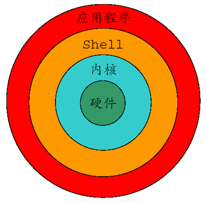
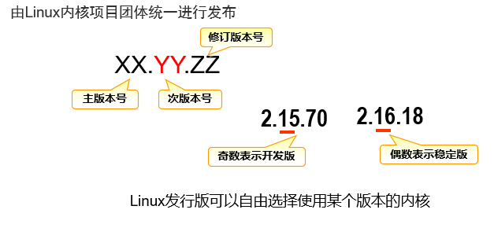
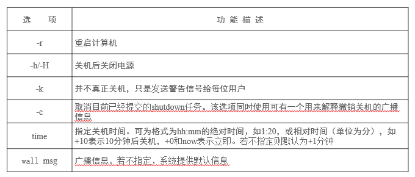
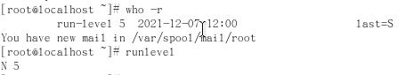
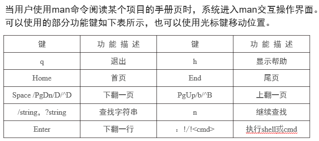

[TOC]

# 1 认识Linux

1. 特点：

   - 免费使用、自由传播
   - 类Unix操作系统
   - 基于POSIX和UNIX
   - 继承了Unix以网络为核心的设计思想

2. 诞生与发展：

   - **UNIX** **操作系统**、**MINIX** **操作系统**、**GNU** **计划**、**POSIX** **标准**、**Internet** **网络**
   - 基于POSIX和UNIX的多用户、多任务、支持多线程和多CPU的操作系统。
   - UNIX：世界上第一个完善的网络操作系统

3. 组成：

   

   - Linux内核：
     - 是操作系统的核心
     - 主要模块分为**存储管理**、**CPU和进程管理**、**文件系统**、**设备管理和驱动**、**网络通信**、**系统的初始化**和**系统调用**等几个部分。
   - Shell
     - 系统的**用户界面**，提供了**用户**与**内核**进行交互操作的一种接口。
     - 是一个**命令解释器**。
     - 可以作为编程语言。
   - 文件系统
     - 文件存放在磁盘等存储设备上的组织方法。
     -  **Linux系统能支持多种目前流行的文件系统**，如ext3、ext4、XFS、FAT、VFAT、NTFS和ISO9660等**。** 
   - 应用程序
     - 有一套称为**应用程序**的程序集，它包括**文本编辑器**、**编程语言**、**X Window**、**办公软件**和**Internet工具**等。

4. Linux版本

   - 内核版本：
     - 内核版本号由形如 x1.x2.x3这三组数字组成，例如：3.10.0-327、4.4.3-1、5.3.6-1等等。
   - 发行版本：
     - 基于Linux内核的图形界面，同时配上很多功能强大的应用软件。
     - 

5. 获取途径：

   - Red Hat Linux：http://www.redhat.com
   - Fedora Linux： http://www.fedoraproject.org
   - CentOS Linux: http://www.CentOS.org
   - Debian Linux： http://www.debian.org
   - Ubuntu Linux： http://www.Ubuntu.com
   - SuSE Linux： http://www.SuSE.com
   - 红旗Linux：  http://www.redflag-linux.com
   - 中软麒麟：   http://www.cs2c.com.cn
   - 深度操作系统：  https://www.deepin.org
   - 华为云镜像：  http://mirrors.huaweicloud.com
   - 阿里云镜像：  http://mirrors.aliyun.com

6. 基本命令

   1. **halt命令**：关闭或重启系统，执行过程中，终止所有应用和系统进程，将所有数据写入存储介质，最后关闭系统。

   2. **reboot命令**：工作过程与halt几乎一样，但其在关闭系统时会重新启动它。

   3. **poweroff命令**：等价于halt -p，关闭系统时同时关掉电源。

   4. **shutdown命令**：

      - 安全地关闭系统，并在真正执行系统关闭与命令发出之间可以指定一个时间延迟，以供用户做好准备并从容退出。
      - mshutdown [-krhfFc] time [wall mesg]
      - 
      - 若不带任何选项（比如，-h、-H、-r）执行shutdown，默认切换到运行级1，即单用户模式，而不是关闭系统。
      - 例子：
        -  shutdown -r now  #立刻重新启动
        -  shutdown -h now  #立刻关机
        -  shutdown -k now 'Hey Lets go now.' #发出警告信息，但不真关机
        -  shutdown -h 10:42 "系统将在10:42关闭, 请届时退出" #10:42分关机
        -  shutdown -r +20 '20分钟后将重启系统，请提前退出'  #20分钟后重启系统
        -  shutdown -c  #撤销已下达的shutdown命令
        - shutdown now  #切换至单用户模式

   5. 系统的运行级别：

      | 运行级别 | 描述                                                         |
      | -------- | ------------------------------------------------------------ |
      | 0        | 关闭系统                                                     |
      | 1、s、S  | 单用户模式或系统维护模式                                     |
      | 2        | 多用户模式，没有NFS功能，没有图形界面                        |
      | 3        | 完全多用户模式，没有图形界面（无图形界面系统的默认运行级）   |
      | 4        | 没有使用，用户可自定义                                       |
      | 5        | 完全多用户模式，且支持X-Windows（桌面和工作站系统默认运行级） |
      | 6        | 重新启动                                                     |
      | Q、q     | 重新加载配置文件                                             |

      查询：who -r 或runlevel

      

   6. 运行级别切换：

      - 系统内运行着一个叫init的进程，此init在引入systemd软件包之后叫systemd，它负责系统的初始化和运行级别的切换。

      - 命令： init LEVEL 或 telinit LEVEL（LEVEL为数字，7个运行级别中的一个）

      - 例子：

        ​	#init 0 #关机

        ​	 init 6 #重新启动

        ​     telinit 1 #切换到单用户

   7. **在线帮助与资源**（使用说明文档）

      1. man
      
         1. 在/usr/share/man/man?目录下
         2. 
      
      2. textinfo
      
         1. 可使用info和pinfo命令阅读textinfo文档
      
         2. 示例:
      
             $ info bash  #对bash进行帮助
      
             $ info bash "Shell Builtin Commands"  #对bash的内部命令进行帮助
      
             $ info bash "Shell Builtin Commands" "Bourne Shell Builtins" #对bsell内部命令进行帮助
      
      3. yelp
      
      4. 其他

# 2 Shell命令

1. 特殊键：

   | 特   殊 键    | 意    义                                                     |
   | ------------- | ------------------------------------------------------------ |
   | Ctrl+D        | 结束当前程序输入或结束当前程序，或从系统中注销               |
   | Ctrl+C        | 终止当前程序的执行                                           |
   | Ctrl+\        | 终止当前程序的执行（系统内部处理时不同于Ctrl+C），可能产生内存映像文件 |
   | Ctrl+Z        | 挂起当前程序执行                                             |
   | Ctrl+S/Ctrl+Q | 暂停/继续屏幕的输出滚动，必须配合使用                        |
   | ScrolLock     | 暂停/继续屏幕的输出滚动，开关键                              |
   | Ctrl+Alt+Del  | 默认动作为重启系统                                           |
   | Alt+F#        | 字符终端切换，如Alt+F2将终端切换至F2                         |
   | Ctrl+Alt+F#   | 从图形界面切换终端到字符终端，如Ctrl+Alt+F1从图形界面切换至F1 |

2. **文件类型**

   1. 普通文件：用于存放数据的文件
   2. 目录文件：
      1. 用于存储一组相关的文件项信息或文件说明信息，其中包括文件名及其属性的信息。
      2. 具有目录属性，只能用目录管理命令来访问和管理。
   3. 设备文件：
      1. UNIX/Linux系统把每一个I/O设备都看成一个文件，与普通文件一样处理
      2. 分类：
         1. 块设备文件b：以块方式存取的设备，如硬盘、磁盘、磁带等
         2. 字符设备文件c：以字符方式存取的设备，如字符打印机、显示器等。
         3. 符号链接l：用于通过此文件的内容指向它所链接的文件或资源。
         4. 管道设备文件p：
            1. 用于进程之间通信的先进先出（FIFO）“临时文件”。
            2. 两类管道设备文件：
               - 无名管道：创建无名管道的进程结束后，无名管道自动消失。
               - 命名管道：以文件形式的存在，通信结束后，若不主动删除它，它不会自动消失。
      3. 两类文件链接：
         - 硬链接（-）：不同名字，共用一个文件体，具有相同的i节点号。
         - 符号链接（l）：是不同的文件，各有自己的i节点，但可以通过符号链接文件的内容访问被链接文件。（快捷方式）
   4. 

