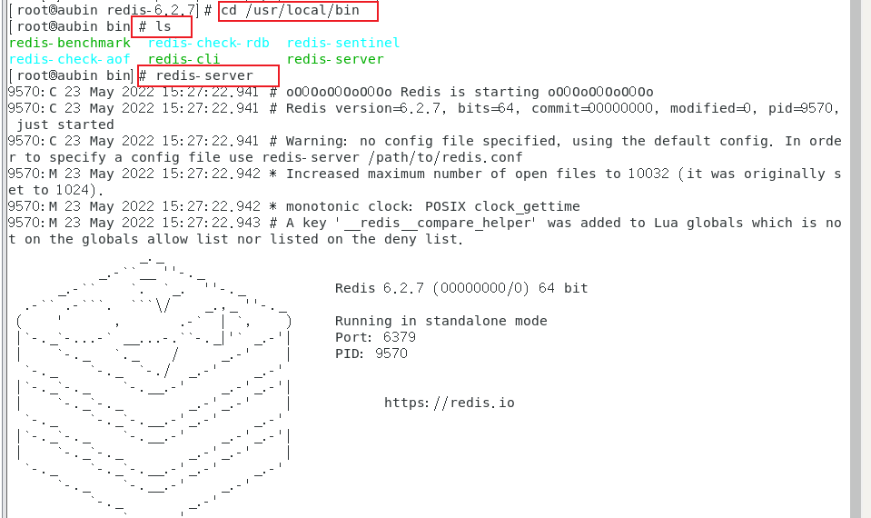
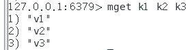
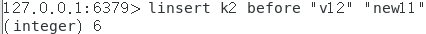
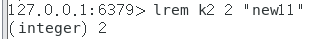

[TOC]

# Redis的概述与安装

## NoSql数据库

1. 技术分类：

   

2. Redis是一种NoSql数据库

3. 好处：

   1. 解决CPU和内存压力

      

   2. 解决IO压力

4. NoSQL（NoSQL = Not Only sQL )，意即“不仅仅是SQL”，泛指非关系型的数据库。

5. NoSQL不依赖业务逻辑方式存储，而以简单的 key-value模式存储。因此大大的增加了数据库的扩展能力。

6. 特点：

   1. 不遵循Sql标准
   2. 不支持ACID
   3. 远超于Sql的性能

7. 适用场景

   1. 对数据高并发的读写
   2. 海量数据的读写
   3. 对数据高可扩展性的

8. 不适用的支持

   1. 需要事务的支持
   2. 基于sql的结构化查询存储，处理复杂的关系，需要即席查询
   3. 用不着sql和用了sql也不行的情况下，考虑用NoSql

9. NoSql数据库

   1. Memcache
      1. 不支持持久化
      2. 支持类型单一
      3. 一般作为缓存数据库辅助持久化的数据库
   2. Redis
      1. 覆盖了Memcache的绝大部分功能
      2. 支持持久化
      3. 支持多种数据类型
      4. 一般作为缓存数据库辅助持久化的数据库
   3. MongoDB
      1. 文档型数据库
      2. 对value提供了丰富的查询功能
      3. 支持二进制数据及大型对象

## Redis安装

1. 将redis-6.2.7.tar.gz上传到Linux

2. 解压：

3. 下载gcc：

   

   测试安装：

   

4. 进入解压后的安装包，编译文件：

   

5. 开始安装：

   

6. 运行：

   1. 前台运行：

      

   2. 后台运行：

      1. 复制redis.conf到/etc下：

         

      2. 编辑/etc下的redis.conf文件：`vi redis.conf `，将daemonize no改成yes（/用于搜索）

      3. 进入/usr/local/bin，启动：

         

   3. 关闭：

      1. 
      2. `redis-cli shutdown`

## 相关知识介绍

1. 默认端口：6379

2. 默认数据库0-15，密码都一样

   

3. 单线程+多路IO复用：

   

# 常用五大数据类型

## Key操作

1. 查看当前库所有key：

   1. `keys *`

   2. 示例：

      

2. 判断某个key是否存在：

   1. `exists key`

   2. 示例：

      

   3. 存在返回1，不存在返回0

3. 查看key的类型：

   1. `type key`

   2. 示例：

      

4. 删除指定的key数据：

   1. `del key`或`unlink key`

   2. 示例：

      

   3. 区别：

      1. del直接删除
      2. unlink选择非阻塞删除，即仅将keys从keyspace元数据中删除，在后续异步操作中才真正删除

5. 给key设置过期时间：

   1. `expire key 10`

   2. 单位是秒，示例：

      

6. 查看还有多少秒过期：

   1. `ttl key`

   2. 示例：

      

   3. 返回值：

      - 数字：还有多少秒过期
      - -1：永不过期
      - -2：已过期

7. 切换数据库：select

8. 查看当前数据库的 key的数量：dbsize

9. 清空当前库：flushdb

10. 通杀全部车：flushall

## Redis字符串（String）

### 概述

1. 是二进制安全的，即可以包含任何数据
2. 是Redis中最基本的数据类型， 一个Redis中字符串value最多可以是512M

### 常用命令

1. 查询对应的键值：

   - `get <key>`

   - 示例：

     

2. 将给定的<value>追加到原值的末尾：

   - `append <key>`

   - 示例：

     

3. 获取值的长度：

   - `strlen <key>`

   - 示例：

     

4. 当key不存在时，设置key的值：

   - `setnx <key> <value>`

   - 示例：

     

5. 将类型为数字的值加减：

   - `incr <key>`

     - 将key中存储的数字值增1

     - 示例：

       

   - `decr <key>`

     - 将key中存储的数字值减1

     - 示例：

       

   - `incrby/decrby <key> <步长>`

     - 自定义步长，默认值为1

     - 示例：

       

6.  同时设置一个或多个key-value值：

   - `mset <key1> <value1> <key2> <value2>……`

   - 示例：

     

7. 同时获取一个或多个value值：

   - `mget <key1> <key2>……`

   - 示例：

     

8. 通知设置一个或多个key-value

   - 条件：当且仅当所有给的key都不存在

   - 示例：

     

   - 原子性，有一个失败都失败

9. 获取值的范围

   - `getrange <key> <起始位置> <结束位置>`

   - 示例：

     

10. 覆写<key>所存储的字符串值，从<起始位置>开始

    - `setrange <key> <起始位置> <value>`

    - 示例：

      

11. 设置键值的同时设置过期时间

    - `setex <key> <过期时间> <value>`

    - 单位是秒，示例：

      

12. 设置新值的同时获取旧值

    - `getset <key> <value>`

    - 示例：

      

### 数据结构

1. 是简单的动态字符串，是可以修改的字符串
2. 内部结构实现类似ArrayList
3. 采用预分配冗余空间的方式减少内存的频繁分配
4. 字符串的最大长度是512M

## Redis列表（List）

### 概述

1. 是简单的字符串列表，按照插入的顺序进行排序
2. 可以添加一个元素到列表的头部或尾部
3. 底层是**双向链表**

### 常用命令

1. 从左边/右边插入一个或多个值

   - `lpush/rpush <key> <value1> <value2> …`

   - 从左边插入：

     

   - 示例：

     

2. 从左边/右边取出一个值：

   - `lpop/rpop <key>`

   - 示例：

     

3. 从<key1>右边取出一个值插入<key2>左边：

   - `rpoplpush <key1><key2>`

   - 示例：

     

4. 按照索引下标获取元素（从左到右）

   - ​	`lrange mylist 0 -1`

   - 0左边第一个，-1右边第一个

   - 示例：

     

5. 按照索引下标获取元素（从左到右）

   - `lindex <key><index>`

   - 示例：

     

6. 获取列表长度

   - `llen <key>`

   - 示例：

     

7. 在<value>的前面/后面插入<newvalue>

   - `linsert <key> before/after <value><newvalue>`

   - 示例：

     

8. 从左边删除n个value(从左到右)

   - `lrem <key><n><value>`

   - 示例：

     

9. 将列表key下标为index的值替换成value

   - `lset<key><index><value>`

   - 示例：

     

### 数据结构

1. 是快速链表quickList

2. 在列表元素较少时会使用一块连续的内存存储，这个结构是ziplist，也即是压缩列表

3. 它将所有的元素紧挨着一起存储，分配的是一块连续的内存。

4. 当数据量比较多的时候才会改成quicklist。

5. Redis将链表和ziplist结合起来组成了quicklist。也就是将多个ziplist使用双向指针串起来使用。

6. 既满足了快速的插入删除性能，又不会出现太大的空间冗余。

   

## Redis集合（Set）

### 概述

1. set可以自动排重
2. Redis的Set是string类型的无序集合。
3. 底层其实是一个value为null的hash表，所以添加，删除，查找的复杂度都是**O(1)**。

### 常用命令

1. 将一个或多个元素加入集合 key 中

   1. `sadd <key><value1><value2> ....`

   2. 示例：

      

2. 取出该集合的所有值

   1. `smembers <key>`

   2. 示例：

      

3. 判断集合<key>是否为含有该<value>值

   1. `sismember <key><value>`

   2. 存在返回1，反之返回0

   3. 示例：

      

4. 返回该集合的元素个数

   1. `scard<key>`

   2. 示例：

      

5. 删除集合中的某个元素

   1. `srem <key><value1><value2> .... `

   2. 示例：

      

6. 随机从该集合中吐出一个值 **(集合中就没有该元素了)**

   1. `spop <key>`

   2. 示例：

      

7. 随机从该集合中取出n个值**（集合中还存在）**

   1. `srandmember <key><n>`

   2. 示例：

      

8. 把集合中一个值从移动到另一个集合

   1. `smove <source><destination>value`

   2. 示例：

      

9. 返回两个集合的交集元素

   1. `sinter <key1><key2>`

   2. 示例：

      

10. 返回两个集合的并集元素

    1. `sunion <key1><key2>`

    2. 示例：

       

11. 返回两个集合的**差集**元素（key1中的，不包含key2中的）

    1. `sdiff <key1><key2>`

    2. 示例：

       

### 数据结构

1. 是dict字典，字典是用哈希表实现的。
2. Java中HashSet的内部实现使用的是HashMap，只不过所有的value都指向同一个对象。
3. Redis的set结构也是一样，它的内部也使用hash结构，所有的value都指向同一个内部值。

## Redis哈希（Hash）

## Redis有序集合（Zset）
