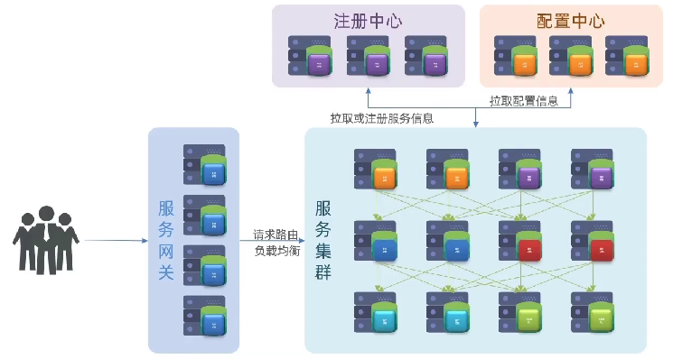
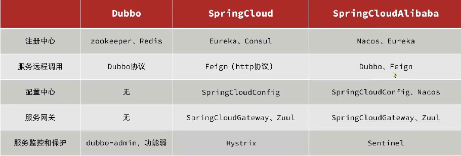
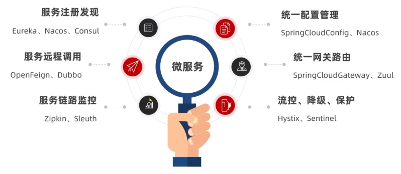
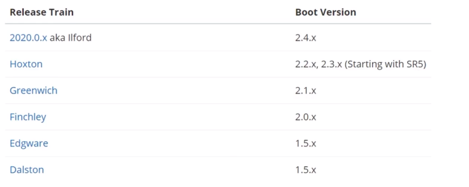

[TOC]

# 认识微服务

## 服务架构演变

1. 单体架构

   - 将业务的所有功能集中在一个项目中开发，打成一个包部署。
   - 优点：架构简单，部署成本低缺点
   - 缺点：耦合度高

2. 分布式架构

   - 根据业务功能对系统进行拆分，每个业务模块作为独立项目开发，称为一个服务。
   - 优点：降低服务耦合，有利于服务升级拓展
   - 服务治理：
     - 服务的**拆分粒度**
     - 服务**集群地址**的维护
     - 服务之间**远程调用**的实现
     - 服务**健康状态**的感知

3. **微服务**

   - 一种经过良好架构设计的**分布式架构方案**
   - 特征：
     - 单一职责
     - 面向服务：微服务对外暴露业务接口
     - 自治：团队独立、技术独立、数据独立、部署独立
     - 隔离性强：服务调用做好隔离、容错、降级，避免出现级联问题

4. 微服务结构

   

5. 微服务技术对比：

   

## SpringCloud

1. 官网：https://spring.io/projects/spring-cloud

2. 集成的各种微服务功能组件：

   

3. Springcloud和Springboot的兼容性对比：

   

# 分布式服务架构案例

## 服务拆分

1. 注意事项：
   - 不同微服务，不要重复开发相同业务
   - 微服务数据独立，不要访问其它微服务的数据库
   - 微服务可以将自己的业务暴露为接口，供其它微服务调用
2. 

## 服务间调用

# eureka注册中心

# Ribbon负载均衡原理

# nacos注册中心