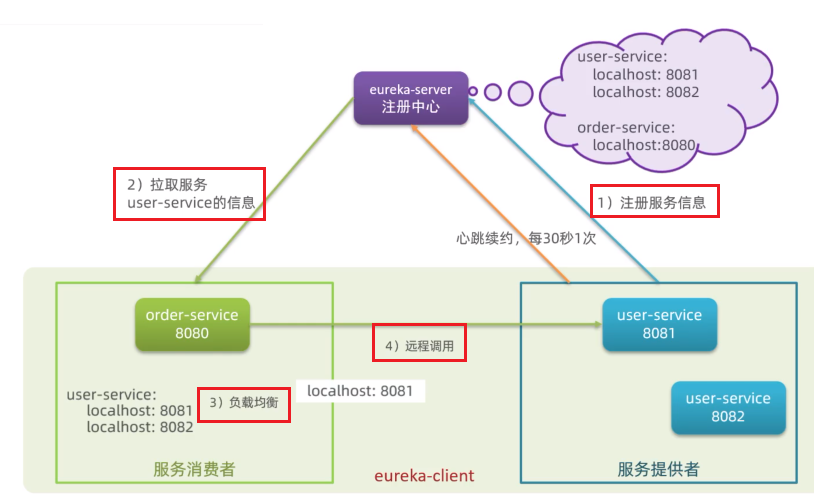

[TOC]

# 认识微服务

## 服务架构演变

1. 单体架构

   - 将业务的所有功能集中在一个项目中开发，打成一个包部署。
   - 优点：架构简单，部署成本低缺点
   - 缺点：耦合度高

2. 分布式架构

   - 根据业务功能对系统进行拆分，每个业务模块作为独立项目开发，称为一个服务。
   - 优点：降低服务耦合，有利于服务升级拓展
   - 服务治理：
     - 服务的**拆分粒度**
     - 服务**集群地址**的维护
     - 服务之间**远程调用**的实现
     - 服务**健康状态**的感知

3. **微服务**

   - 一种经过良好架构设计的**分布式架构方案**
   - 特征：
     - 单一职责
     - 面向服务：微服务对外暴露业务接口
     - 自治：团队独立、技术独立、数据独立、部署独立
     - 隔离性强：服务调用做好隔离、容错、降级，避免出现级联问题

4. 微服务结构

   

5. 微服务技术对比：

   

## SpringCloud

1. 官网：https://spring.io/projects/spring-cloud

2. 集成的各种微服务功能组件：

   

3. Springcloud和Springboot的兼容性对比：

   

# 分布式服务架构案例

## 服务拆分

1. 注意事项：
   - 不同微服务，不要重复开发相同业务
   - 微服务数据独立，不要访问其它微服务的数据库
   - 微服务可以将自己的业务暴露为接口，供其它微服务调用
2. 总结
   - 微服务需要根据业务模块拆分，做到**单一职责**，不要重复开发相同业务
   - 微服务可以**将业务暴露为接口**，供其它微服务使用
   - 不同微服务都应该有自己**独立的数据库**

## 服务间调用

### `RestTemplate`实现远程调用

1. 在order-service中注册`RestTemplate`

   配置类（主程序类）中注入：

   ```java
   @MapperScan("cn.itcast.order.mapper")
   @SpringBootApplication
   public class OrderApplication {
   
       public static void main(String[] args) {
           SpringApplication.run(OrderApplication.class, args);
       }
   
       /**
        * 创建RestTemplate并注入Spring容器中
        * @return
        */
       @Bean
       public RestTemplate restTemplate(){
           return new RestTemplate();
       }
   }
   ```

2. 通过`RestTemplate`发起的http请求实现服务远程调用：

   ```java
   @Service
   public class OrderService {
   
       @Autowired
       private OrderMapper orderMapper;
   
       @Autowired
       private RestTemplate restTemplate;
   
       public Order queryOrderById(Long orderId) {
           // 1.查询订单
           Order order = orderMapper.findById(orderId);
           
   //        2. 利用RestTemplate发送http请求，查询用户
   //           参数：url路径，返回值类型
           String url="http://localhost:8081/user/"+order.getUserId();
           User user = restTemplate.getForObject(url, User.class);
   //        3.封装user到Order
           order.setUser(user);
           
           // 4.返回
           return order;
       }
   }
   ```

   - 利用`RestTemplate`的`getForObject`方法发送http请求
   - `getForObject`参数：
     1. url路径
     2. 返回值类型（自动将json数据转换成指定的类型）

### 提供者和服务者

- 服务提供者：一次业务中，被其它微服务调用的服务。(提供接口给其它微服务)
- 服务消费者：一次业务中，调用其它微服务的服务。(调用其它微服务提供的接口)


- 服务A调用服务B，服务B调用服务C，服务B既是提供者、又是消费者（看相对谁而言）

# Eureka注册中心

## 远程调用的问题

1. 服务消费者该如何获取服务提供者的地址信息?
   - 服务提供者启动时向**eureka注册**自己的信息
   - eureka保存这些信息
   - 消费者根据服务名称向eureka拉取提供者信息
2. 如果有多个服务提供者，消费者该如何选择?
   - 服务消费者利用**负载均衡**算法，从服务列表中挑选一个
3. 消费者如何得知服务提供者的健康状态?
   - 服务提供者会每隔30秒向EurekaServer发送**心跳请求**，报告健康状态
   - eureka会更新记录服务列表信息，心跳不正常会被剔除
   - 消费者就可以拉取到最新的信息

## Eureka原理



1. 服务提供者：注册服务信息（注册后每30s向Eureka发一次心跳、确保状态）
2. 服务消费者向Eureka-server拉取服务
3. 负载均衡
4. 调用服务

### 搭建`EurekaServer`

### 服务注册

### 服务发现

# Ribbon负载均衡原理

# nacos注册中心