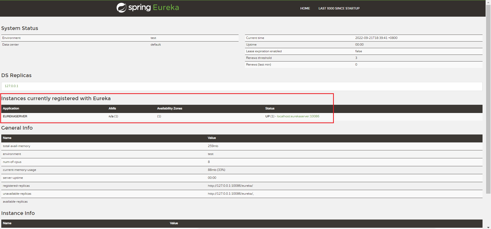
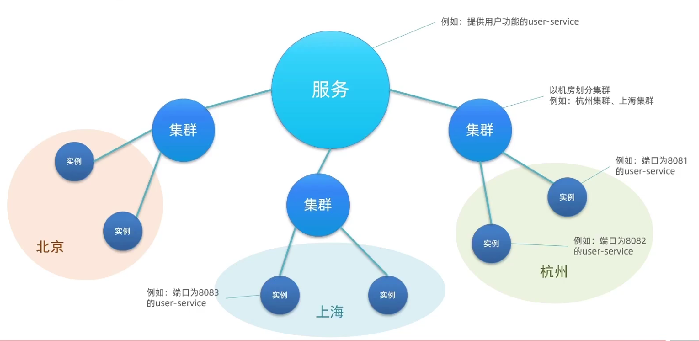
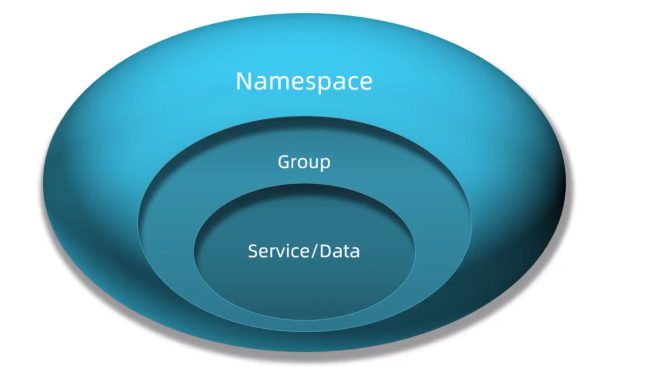
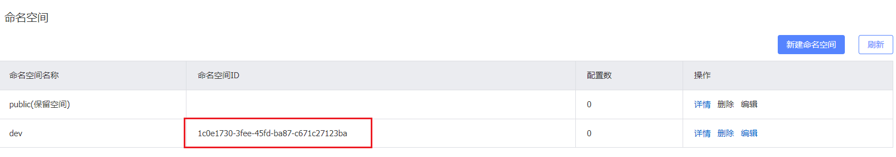

[TOC]

# 认识微服务

## 服务架构演变

1. 单体架构

   - 将业务的所有功能集中在一个项目中开发，打成一个包部署。
   - 优点：架构简单，部署成本低缺点
   - 缺点：耦合度高

2. 分布式架构

   - 根据业务功能对系统进行拆分，每个业务模块作为独立项目开发，称为一个服务。
   - 优点：降低服务耦合，有利于服务升级拓展
   - 服务治理：
     - 服务的**拆分粒度**
     - 服务**集群地址**的维护
     - 服务之间**远程调用**的实现
     - 服务**健康状态**的感知

3. **微服务**

   - 一种经过良好架构设计的**分布式架构方案**
   - 特征：
     - 单一职责
     - 面向服务：微服务对外暴露业务接口
     - 自治：团队独立、技术独立、数据独立、部署独立
     - 隔离性强：服务调用做好隔离、容错、降级，避免出现级联问题

4. 微服务结构

   

5. 微服务技术对比：

   

## SpringCloud

1. 官网：https://spring.io/projects/spring-cloud

2. 集成的各种微服务功能组件：

   

3. Springcloud和Springboot的兼容性对比：

   

# 分布式服务架构案例

## 服务拆分

1. 注意事项：
   - 不同微服务，不要重复开发相同业务
   - 微服务数据独立，不要访问其它微服务的数据库
   - 微服务可以将自己的业务暴露为接口，供其它微服务调用
2. 总结
   - 微服务需要根据业务模块拆分，做到**单一职责**，不要重复开发相同业务
   - 微服务可以**将业务暴露为接口**，供其它微服务使用
   - 不同微服务都应该有自己**独立的数据库**

## 服务间调用

### `RestTemplate`实现远程调用

1. 在order-service中注册`RestTemplate`

   配置类（主程序类）中注入：

   ```java
   @MapperScan("cn.itcast.order.mapper")
   @SpringBootApplication
   public class OrderApplication {
   
       public static void main(String[] args) {
           SpringApplication.run(OrderApplication.class, args);
       }
   
       /**
        * 创建RestTemplate并注入Spring容器中
        * @return
        */
       @Bean
       public RestTemplate restTemplate(){
           return new RestTemplate();
       }
   }
   ```

2. 通过`RestTemplate`发起的http请求实现服务远程调用：

   ```java
   @Service
   public class OrderService {
   
       @Autowired
       private OrderMapper orderMapper;
   
       @Autowired
       private RestTemplate restTemplate;
   
       public Order queryOrderById(Long orderId) {
           // 1.查询订单
           Order order = orderMapper.findById(orderId);
           
   //        2. 利用RestTemplate发送http请求，查询用户
   //           参数：url路径，返回值类型
           String url="http://localhost:8081/user/"+order.getUserId();
           User user = restTemplate.getForObject(url, User.class);
   //        3.封装user到Order
           order.setUser(user);
           
           // 4.返回
           return order;
       }
   }
   ```

   - 利用`RestTemplate`的`getForObject`方法发送http请求
   - `getForObject`参数：
     1. url路径
     2. 返回值类型（自动将json数据转换成指定的类型）

### 提供者和服务者

- 服务提供者：一次业务中，被其它微服务调用的服务。(提供接口给其它微服务)
- 服务消费者：一次业务中，调用其它微服务的服务。(调用其它微服务提供的接口)


- 服务A调用服务B，服务B调用服务C，服务B既是提供者、又是消费者（看相对谁而言）

# Eureka注册中心

## 远程调用的问题

1. 服务消费者该如何获取服务提供者的地址信息?
   - 服务提供者启动时向**eureka注册**自己的信息
   - eureka保存这些信息
   - 消费者根据服务名称向eureka拉取提供者信息
2. 如果有多个服务提供者，消费者该如何选择?
   - 服务消费者利用**负载均衡**算法，从服务列表中挑选一个
3. 消费者如何得知服务提供者的健康状态?
   - 服务提供者会每隔30秒向EurekaServer发送**心跳请求**，报告健康状态
   - eureka会更新记录服务列表信息，心跳不正常会被剔除
   - 消费者就可以拉取到最新的信息

## Eureka原理


1. 服务提供者：注册服务信息（注册后每30s向Eureka发一次心跳、确保状态）
2. 服务消费者向Eureka-server拉取服务
3. 负载均衡
4. 调用服务

#### 总结

在Eureka架构中，微服务角色有两类：

- **EurekaServer**：服务端，注册中心
  - 记录服务信息
  - 心跳监控
- **EurekaClient**：客户端
  - **Provider**：服务提供者，例如案例中的user-service
    - 注册自己的信息到EurekaServer
    - 每隔30秒向EurekaServer发送心跳
  - **consumer**：服务消费者，例如案例中的order-service
    - 根据服务名称从EurekaServer拉取服务列表
    - 基于服务列表做负载均衡，选中一个微服务后发起远程调用

### 搭建`EurekaServer`注册中心

- 搭建EurekaServer，需要新建一个服务

- 步骤：

  1. 创建项目，引入`spring-cloud-starter-netflix-eureka-server`的依赖

     ```xml
     <!--        eureka服务器-->
             <dependency>
                 <groupId>org.springframework.cloud</groupId>
                 <artifactId>spring-cloud-starter-netflix-eureka-server</artifactId>
             </dependency>
     ```

  2. 编写启动类，添加@EnableEurekaServer注解

     ```java
     @EnableEurekaServer
     @SpringBootApplication
     public class EurekaApplication {
         public static void main(String[] args) {
             SpringApplication.run(EurekaApplication.class,args);
         }
     }
     ```

  3. 添加application.yml文件，编写下面的配置

     ```yml
     server:
       port: 10086 #服务端口
       
     spring:
       application:
         name: eurekaserver #服务的名称
     
     eureka:
       client:
         service-url: #eureka的地址信息
           defaultZone: http://127.0.0.1:10086/eureka
     ```

     yml文件编译错误记得改字符编码：

     

  4. 启动完成：

     

### 服务注册

- 将user-service、order-service都注册到eureka

- 步骤：

  1. 在user-service项目引入`spring-cloud-starter-netflix-eureka-client`的依赖

     ```xml
     <!--        eureka客户端依赖-->
             <dependency>
                 <groupId>org.springframework.cloud</groupId>
                 <artifactId>spring-cloud-starter-netflix-eureka-client</artifactId>
             </dependency>
     ```

  2. 在application.yml文件，编写下面的配置：

     ```yml
     spring:
       application:
         name: userservice
     
     eureka:
       client:
         service-url:
           defaultZone: http://127.0.0.1:10086/eureka
     ```

- 服务启动多个实例：

  

- 总结：

  - 引入eureka-client依赖
  - 在application.yml中配置eureka地址

### 服务发现

- 在order-service中完成服务拉取，然后通过负载均衡挑选一个服务，实现远程调用

- 步骤：

  1. 前提：引入依赖

  2. 修改OrderService的代码，修改访问的url路径，**用服务名代替ip、端口**：

     ```java
     String url="http://userservice/user/"+order.getUserId();
     ```

  3. 在order-service项目的启动类中的RestTemplate添加**负载均衡注解@LoadBalanced**：

     ```java
     /**
      * 创建RestTemplate并注入Spring容器中
      * @return
      */
     @Bean
     @LoadBalanced
     public RestTemplate restTemplate(){
         return new RestTemplate();
     }
     ```

# Ribbon负载均衡

## 负载均衡原理

1. 流程：

   

2. 原理：

   

## 负载均衡策略

- Ribbon的负载均衡规则是一个叫做`IRule`的接口来定义的，每一个子接口都是一种规则：

  

- 包括：

  

- 通过**定义IRule实现**修改负载均衡规则：

  1. 代码方式：

     - 在order-service中的`OrderApplication`类（或其他配置类）中，定义一个新的IRule：

       ```java
       @Bean
       public IRule randomRule(){
           return new RandomRule();
       }
       ```

     - 配置后全局生效，不能指定服务

  2. 配置方式：

     - 在order-service的application.yml文件中，添加新的配置修改规则：

       ```yml
       userservice:
         ribbon:
           NFLoadBalancerRuleClassName: com.netflix.loadbalancer.RandomRule #负载均衡规则
       ```

     - 可以只针对某个服务而言，如上配置只针对userservice配置


## 懒加载

- Ribbon默认是采用懒加载，即第一次访问时才会去创建LoadBalanceClient，请求时间会很长。

- **饥饿加载**则会在项目启动时创建，降低第一次访问的耗时.

- 开启饥饿加载配置：

  ```yml
  ribbon:
    eager-load:
      enabled: true #开启饥饿加载
      clients: #指定饥饿加载服务名称（支持多个）
        -userservice
  ```

# nacos注册中心

## 认识和安装Nacos

- Nacos是阿里巴巴的产品，现在是SprineCloud中的一个组件。

- 相比Eureka功能更加丰富，在国内受欢迎程度较高。

- Github地址：https://github.com/alibaba/nacos

- 启动：

  

## Nacos快速入门

- 服务注册到Nacos：

  1. 在cloud-demo父工程中添加spring-cloud-alilbaba的**管理依赖**：

     ```xml
     <!--            nacos的管理依赖-->
                 <dependency>
                     <groupId>com.alibaba.cloud</groupId>
                     <artifactId>spring-cloud-alibaba-dependencies</artifactId>
                     <version>2.2.5.RELEASE</version>
                     <type>pom</type>
                     <scope>import</scope>
                 </dependency>
     ```

     

  2. 注释掉order-service和user-service中原有的eureka依赖

  3. 添加nacos的**客户端依赖**：

     ```xml
         <!--        nacos客户端依赖包-->
         <dependency>
             <groupId>com.alibaba.cloud</groupId>
             <artifactId>spring-cloud-starter-alibaba-nacos-discovery</artifactId>
         </dependency>
     ```

  4. 修改user-service&order-service中的**application.yml文件**，注释eureka地址，添加nacos地址：

     ```yml
     spring:
       cloud:
         nacos:
           server-addr: localhost:8848 #nacos服务地址
     ```

## Nacos服务分级存储模型

1. 分级存储模型：

   - **服务-集群-实例**

     

   - 服务调用**尽可能选择本地集群**的服务，跨集群调用延迟较高

   - 本地集群不可访问时，再去访问其它集群

2. 配置实例的**服务集群属性**：

   1. 修改application.yml，添加如下内容：

      ```yml
      spring:
        cloud:
          nacos:
            discovery:
              cluster-name: HZ #集群名称：杭州
      ```

   2. 在Nacos控制台可以看到集群变化：

      

      

3. **根据集群负载均衡**

   1. 修改order-service中的application.yml，设置集群为HZ：

      ```yml
      spring:
        cloud:
          nacos:
            discovery:
              cluster-name: HZ #集群名称：杭州
      ```

   2. 在order-service中设置负载均衡的IRule为NacosRule

      - 这个规则优先会寻找与自己同集群的服务
      - 默认使用随机负载均衡挑选实例

      ```yml
      userservice:
        ribbon:
          NFLoadBalancerRuleClassName: com.alibaba.cloud.nacos.ribbon.NacosRule #负载均衡规则
      ```

4. **根据权重负载均衡**

   - Nacos提供了权重配置来控制访问频率

   - 实例的权重值在0~1之间，**权重越大则访问频率越高**，权重设置为0则完全不会被访问

   - 在Nacos控制台设置：

     

     

## Nacos环境隔离

### namespace

- Nacos中**服务存储**和**数据存储**的最外层都是一个名为namespace的东西，用来做最外层隔离：

  

- 创建namespace用来隔离不同环境：

  1. 新建一个命名空间：

     

  2. 创建后控制台可以看到命名空间的id：（创建时不填系统会自动生成）

     

  3. 修改order-service的application.yml，添加namespace：

     ```yml
     spring:
       cloud:
         nacos:
           discovery:
             namespace: 1c0e1730-3fee-45fd-ba87-c671c27123ba #dev环境
     ```

- **不同namespace下的服务不可见**


# Nacos和Eureka的对比

1. 服务提供者的**健康检测**：

   - nacos：

     - 临时实例（默认）：做心跳，没有反应直接踢
     - 非临时实例：不做心跳，nacos主动发送请求判断状态，不会从列表中踢出（标记为不健康）

   - 改变nacos的实例为非临时实例：

     ```yml
     spring:
       cloud:
         nacos:
           discovery:
             ephemeral: false #是否是临时实例
     ```

2. 消费者的**消息推送模式**：

   - eureka：30s拉取一次，服务列表更新没那么及时**（pull）**
   - nacos：有服务挂了会主动推送，变更消息给消费者**（pull+push）**

3. **集群模式**：

   - Nacos集群默认采用AP方式，当集群中存在非临时实例时，采用CP模式;
   - Eureka采用AP方式