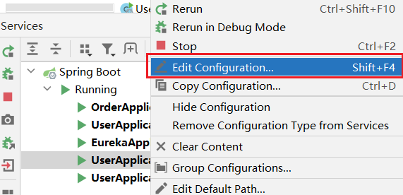

[TOC]

# Nacos配置管理

## 统一配置管理

- 在Nacos中添加配置文件

  1. 配置管理-配置列表：

     

  2. 新建配置-发布：

     

- 配置获取的过程：

  

- 步骤：

  1. 在Nacos中添加配置文件

  2. 引入Nacos的配置管理客户端依赖：

     ```xml
     <!--        nacos的配置管理依赖-->
             <dependency>
                 <groupId>com.alibaba.cloud</groupId>
                 <artifactId>spring-cloud-starter-alibaba-nacos-config</artifactId>
             </dependency>
         </dependencies>
     ```

  3. 在userservice中的resource目录添加一个bootstrap.ym|文件：

     ```yml
     spring:
       application:
         name: userservice
       profiles:
         active: dev #环境
       cloud:
         nacos:
           server-addr: localhost:8848 #nacos地址
           config:
             file-extension: yaml #文件后缀名
     ```

     - 这个文件是引导文件，优先级高于application.yml
     - 配置nacos地址、当前环境、服务名称、文件后缀名。这些决定了程序
       启动时去nacos读取哪个文件。

- demo：

  ```java
  @RestController
  @RequestMapping("/user")
  public class UserController {
  
      @Value("${pattern.dateformat}")
      private String dateformat;
  
      @GetMapping("now")
      public String now(){
          return LocalDateTime.now().format(DateTimeFormatter. ofPattern(dateformat));
      }
  ```

  读取成功：

  

## 配置热更新

- **配置自动刷新**：Nacos中的配置文件变更后，微服务无需重启就可以感知。

- 通过两种配置实现：

  1. 在`@Value`注入的变量**所在类**上添加注解`@RefreshScope`

     

  2. （建议）使用`@ConfigurationProperties`注解：

     1. 新建配置类用于属性加载：

        ```java
        @Data
        @Component
        @ConfigurationProperties(prefix = "pattern")
        public class PatternProperties {
            private String dateformat;
        }
        ```

     2. 注入配置类后直接使用：

        ```java
        @RestController
        @RequestMapping("/user")
        public class UserController {
            
            @Autowired
            private PatternProperties properties;
        
            @GetMapping("now")
            public String now(){
                return LocalDateTime.now().format(DateTimeFormatter. ofPattern(properties.getDateformat()));
            }
        }
        ```

- 不是所有的配置都适合放到配置中心，维护起来比较麻烦

- 建议将一些关键参数，需要运行时调整的参数放到nacos配置中心，一般都是自定义配置

## 配置共享

- 微服务启动时会从nacos读取多个配置文件:
  1. `[spring.application.name]-[spring.profiles.active].yaml`, 例如: `userservice-dev.yaml`
  2. `[spring.application.namel.yaml`, 例如: `userservice.yaml`
- 无论profile如何变化，`[spring.application.name].yaml`这个文件一定会加载, 因此**多环境共享配置可以写入这个文件**
- **`服务名-profile.yaml` >`服务名称.yaml` >本地配置**
- 在idea修改服务的配置：
  1. 
  2. 

## 搭建Nacos集群

- **Nacos生产环境下一定要部署为集群状态**

  

- nacos集群的部署：

  1. 搭建数据库，初始化数据库表结构

     - 新建一个数据库，命名为nacos，导入下面的SQL：

     ```sql
     CREATE TABLE `config_info` (
       `id` bigint(20) NOT NULL AUTO_INCREMENT COMMENT 'id',
       `data_id` varchar(255) NOT NULL COMMENT 'data_id',
       `group_id` varchar(255) DEFAULT NULL,
       `content` longtext NOT NULL COMMENT 'content',
       `md5` varchar(32) DEFAULT NULL COMMENT 'md5',
       `gmt_create` datetime NOT NULL DEFAULT CURRENT_TIMESTAMP COMMENT '创建时间',
       `gmt_modified` datetime NOT NULL DEFAULT CURRENT_TIMESTAMP COMMENT '修改时间',
       `src_user` text COMMENT 'source user',
       `src_ip` varchar(50) DEFAULT NULL COMMENT 'source ip',
       `app_name` varchar(128) DEFAULT NULL,
       `tenant_id` varchar(128) DEFAULT '' COMMENT '租户字段',
       `c_desc` varchar(256) DEFAULT NULL,
       `c_use` varchar(64) DEFAULT NULL,
       `effect` varchar(64) DEFAULT NULL,
       `type` varchar(64) DEFAULT NULL,
       `c_schema` text,
       PRIMARY KEY (`id`),
       UNIQUE KEY `uk_configinfo_datagrouptenant` (`data_id`,`group_id`,`tenant_id`)
     ) ENGINE=InnoDB DEFAULT CHARSET=utf8 COLLATE=utf8_bin COMMENT='config_info';
     
     /******************************************/
     /*   数据库全名 = nacos_config   */
     /*   表名称 = config_info_aggr   */
     /******************************************/
     CREATE TABLE `config_info_aggr` (
       `id` bigint(20) NOT NULL AUTO_INCREMENT COMMENT 'id',
       `data_id` varchar(255) NOT NULL COMMENT 'data_id',
       `group_id` varchar(255) NOT NULL COMMENT 'group_id',
       `datum_id` varchar(255) NOT NULL COMMENT 'datum_id',
       `content` longtext NOT NULL COMMENT '内容',
       `gmt_modified` datetime NOT NULL COMMENT '修改时间',
       `app_name` varchar(128) DEFAULT NULL,
       `tenant_id` varchar(128) DEFAULT '' COMMENT '租户字段',
       PRIMARY KEY (`id`),
       UNIQUE KEY `uk_configinfoaggr_datagrouptenantdatum` (`data_id`,`group_id`,`tenant_id`,`datum_id`)
     ) ENGINE=InnoDB DEFAULT CHARSET=utf8 COLLATE=utf8_bin COMMENT='增加租户字段';
     
     
     /******************************************/
     /*   数据库全名 = nacos_config   */
     /*   表名称 = config_info_beta   */
     /******************************************/
     CREATE TABLE `config_info_beta` (
       `id` bigint(20) NOT NULL AUTO_INCREMENT COMMENT 'id',
       `data_id` varchar(255) NOT NULL COMMENT 'data_id',
       `group_id` varchar(128) NOT NULL COMMENT 'group_id',
       `app_name` varchar(128) DEFAULT NULL COMMENT 'app_name',
       `content` longtext NOT NULL COMMENT 'content',
       `beta_ips` varchar(1024) DEFAULT NULL COMMENT 'betaIps',
       `md5` varchar(32) DEFAULT NULL COMMENT 'md5',
       `gmt_create` datetime NOT NULL DEFAULT CURRENT_TIMESTAMP COMMENT '创建时间',
       `gmt_modified` datetime NOT NULL DEFAULT CURRENT_TIMESTAMP COMMENT '修改时间',
       `src_user` text COMMENT 'source user',
       `src_ip` varchar(50) DEFAULT NULL COMMENT 'source ip',
       `tenant_id` varchar(128) DEFAULT '' COMMENT '租户字段',
       PRIMARY KEY (`id`),
       UNIQUE KEY `uk_configinfobeta_datagrouptenant` (`data_id`,`group_id`,`tenant_id`)
     ) ENGINE=InnoDB DEFAULT CHARSET=utf8 COLLATE=utf8_bin COMMENT='config_info_beta';
     
     /******************************************/
     /*   数据库全名 = nacos_config   */
     /*   表名称 = config_info_tag   */
     /******************************************/
     CREATE TABLE `config_info_tag` (
       `id` bigint(20) NOT NULL AUTO_INCREMENT COMMENT 'id',
       `data_id` varchar(255) NOT NULL COMMENT 'data_id',
       `group_id` varchar(128) NOT NULL COMMENT 'group_id',
       `tenant_id` varchar(128) DEFAULT '' COMMENT 'tenant_id',
       `tag_id` varchar(128) NOT NULL COMMENT 'tag_id',
       `app_name` varchar(128) DEFAULT NULL COMMENT 'app_name',
       `content` longtext NOT NULL COMMENT 'content',
       `md5` varchar(32) DEFAULT NULL COMMENT 'md5',
       `gmt_create` datetime NOT NULL DEFAULT CURRENT_TIMESTAMP COMMENT '创建时间',
       `gmt_modified` datetime NOT NULL DEFAULT CURRENT_TIMESTAMP COMMENT '修改时间',
       `src_user` text COMMENT 'source user',
       `src_ip` varchar(50) DEFAULT NULL COMMENT 'source ip',
       PRIMARY KEY (`id`),
       UNIQUE KEY `uk_configinfotag_datagrouptenanttag` (`data_id`,`group_id`,`tenant_id`,`tag_id`)
     ) ENGINE=InnoDB DEFAULT CHARSET=utf8 COLLATE=utf8_bin COMMENT='config_info_tag';
     
     /******************************************/
     /*   数据库全名 = nacos_config   */
     /*   表名称 = config_tags_relation   */
     /******************************************/
     CREATE TABLE `config_tags_relation` (
       `id` bigint(20) NOT NULL COMMENT 'id',
       `tag_name` varchar(128) NOT NULL COMMENT 'tag_name',
       `tag_type` varchar(64) DEFAULT NULL COMMENT 'tag_type',
       `data_id` varchar(255) NOT NULL COMMENT 'data_id',
       `group_id` varchar(128) NOT NULL COMMENT 'group_id',
       `tenant_id` varchar(128) DEFAULT '' COMMENT 'tenant_id',
       `nid` bigint(20) NOT NULL AUTO_INCREMENT,
       PRIMARY KEY (`nid`),
       UNIQUE KEY `uk_configtagrelation_configidtag` (`id`,`tag_name`,`tag_type`),
       KEY `idx_tenant_id` (`tenant_id`)
     ) ENGINE=InnoDB DEFAULT CHARSET=utf8 COLLATE=utf8_bin COMMENT='config_tag_relation';
     
     /******************************************/
     /*   数据库全名 = nacos_config   */
     /*   表名称 = group_capacity   */
     /******************************************/
     CREATE TABLE `group_capacity` (
       `id` bigint(20) unsigned NOT NULL AUTO_INCREMENT COMMENT '主键ID',
       `group_id` varchar(128) NOT NULL DEFAULT '' COMMENT 'Group ID，空字符表示整个集群',
       `quota` int(10) unsigned NOT NULL DEFAULT '0' COMMENT '配额，0表示使用默认值',
       `usage` int(10) unsigned NOT NULL DEFAULT '0' COMMENT '使用量',
       `max_size` int(10) unsigned NOT NULL DEFAULT '0' COMMENT '单个配置大小上限，单位为字节，0表示使用默认值',
       `max_aggr_count` int(10) unsigned NOT NULL DEFAULT '0' COMMENT '聚合子配置最大个数，，0表示使用默认值',
       `max_aggr_size` int(10) unsigned NOT NULL DEFAULT '0' COMMENT '单个聚合数据的子配置大小上限，单位为字节，0表示使用默认值',
       `max_history_count` int(10) unsigned NOT NULL DEFAULT '0' COMMENT '最大变更历史数量',
       `gmt_create` datetime NOT NULL DEFAULT CURRENT_TIMESTAMP COMMENT '创建时间',
       `gmt_modified` datetime NOT NULL DEFAULT CURRENT_TIMESTAMP COMMENT '修改时间',
       PRIMARY KEY (`id`),
       UNIQUE KEY `uk_group_id` (`group_id`)
     ) ENGINE=InnoDB DEFAULT CHARSET=utf8 COLLATE=utf8_bin COMMENT='集群、各Group容量信息表';
     
     /******************************************/
     /*   数据库全名 = nacos_config   */
     /*   表名称 = his_config_info   */
     /******************************************/
     CREATE TABLE `his_config_info` (
       `id` bigint(64) unsigned NOT NULL,
       `nid` bigint(20) unsigned NOT NULL AUTO_INCREMENT,
       `data_id` varchar(255) NOT NULL,
       `group_id` varchar(128) NOT NULL,
       `app_name` varchar(128) DEFAULT NULL COMMENT 'app_name',
       `content` longtext NOT NULL,
       `md5` varchar(32) DEFAULT NULL,
       `gmt_create` datetime NOT NULL DEFAULT CURRENT_TIMESTAMP,
       `gmt_modified` datetime NOT NULL DEFAULT CURRENT_TIMESTAMP,
       `src_user` text,
       `src_ip` varchar(50) DEFAULT NULL,
       `op_type` char(10) DEFAULT NULL,
       `tenant_id` varchar(128) DEFAULT '' COMMENT '租户字段',
       PRIMARY KEY (`nid`),
       KEY `idx_gmt_create` (`gmt_create`),
       KEY `idx_gmt_modified` (`gmt_modified`),
       KEY `idx_did` (`data_id`)
     ) ENGINE=InnoDB DEFAULT CHARSET=utf8 COLLATE=utf8_bin COMMENT='多租户改造';
     
     
     /******************************************/
     /*   数据库全名 = nacos_config   */
     /*   表名称 = tenant_capacity   */
     /******************************************/
     CREATE TABLE `tenant_capacity` (
       `id` bigint(20) unsigned NOT NULL AUTO_INCREMENT COMMENT '主键ID',
       `tenant_id` varchar(128) NOT NULL DEFAULT '' COMMENT 'Tenant ID',
       `quota` int(10) unsigned NOT NULL DEFAULT '0' COMMENT '配额，0表示使用默认值',
       `usage` int(10) unsigned NOT NULL DEFAULT '0' COMMENT '使用量',
       `max_size` int(10) unsigned NOT NULL DEFAULT '0' COMMENT '单个配置大小上限，单位为字节，0表示使用默认值',
       `max_aggr_count` int(10) unsigned NOT NULL DEFAULT '0' COMMENT '聚合子配置最大个数',
       `max_aggr_size` int(10) unsigned NOT NULL DEFAULT '0' COMMENT '单个聚合数据的子配置大小上限，单位为字节，0表示使用默认值',
       `max_history_count` int(10) unsigned NOT NULL DEFAULT '0' COMMENT '最大变更历史数量',
       `gmt_create` datetime NOT NULL DEFAULT CURRENT_TIMESTAMP COMMENT '创建时间',
       `gmt_modified` datetime NOT NULL DEFAULT CURRENT_TIMESTAMP COMMENT '修改时间',
       PRIMARY KEY (`id`),
       UNIQUE KEY `uk_tenant_id` (`tenant_id`)
     ) ENGINE=InnoDB DEFAULT CHARSET=utf8 COLLATE=utf8_bin COMMENT='租户容量信息表';
     
     
     CREATE TABLE `tenant_info` (
       `id` bigint(20) NOT NULL AUTO_INCREMENT COMMENT 'id',
       `kp` varchar(128) NOT NULL COMMENT 'kp',
       `tenant_id` varchar(128) default '' COMMENT 'tenant_id',
       `tenant_name` varchar(128) default '' COMMENT 'tenant_name',
       `tenant_desc` varchar(256) DEFAULT NULL COMMENT 'tenant_desc',
       `create_source` varchar(32) DEFAULT NULL COMMENT 'create_source',
       `gmt_create` bigint(20) NOT NULL COMMENT '创建时间',
       `gmt_modified` bigint(20) NOT NULL COMMENT '修改时间',
       PRIMARY KEY (`id`),
       UNIQUE KEY `uk_tenant_info_kptenantid` (`kp`,`tenant_id`),
       KEY `idx_tenant_id` (`tenant_id`)
     ) ENGINE=InnoDB DEFAULT CHARSET=utf8 COLLATE=utf8_bin COMMENT='tenant_info';
     
     CREATE TABLE `users` (
     	`username` varchar(50) NOT NULL PRIMARY KEY,
     	`password` varchar(500) NOT NULL,
     	`enabled` boolean NOT NULL
     );
     
     CREATE TABLE `roles` (
     	`username` varchar(50) NOT NULL,
     	`role` varchar(50) NOT NULL,
     	UNIQUE INDEX `idx_user_role` (`username` ASC, `role` ASC) USING BTREE
     );
     
     CREATE TABLE `permissions` (
         `role` varchar(50) NOT NULL,
         `resource` varchar(255) NOT NULL,
         `action` varchar(8) NOT NULL,
         UNIQUE INDEX `uk_role_permission` (`role`,`resource`,`action`) USING BTREE
     );
     
     INSERT INTO users (username, password, enabled) VALUES ('nacos', '$2a$10$EuWPZHzz32dJN7jexM34MOeYirDdFAZm2kuWj7VEOJhhZkDrxfvUu', TRUE);
     
     INSERT INTO roles (username, role) VALUES ('nacos', 'ROLE_ADMIN');
     ```

     

  2. 下载nacos安装包、配置nacos：

     1. 进入nacos的conf目录，修改配置文件`cluster.conf.example`，重命名为`cluster.conf`：

        

     2. 编辑`cluster.conf`，添加内容：

        ```
        127.0.0.1:8845
        127.0.0.1.8846
        127.0.0.1.8847
        ```

        

     3. 修改`application.properties`文件，添加数据库配置

        ```properties
        #*************** Config Module Related Configurations ***************#
        ### If use MySQL as datasource:
        spring.datasource.platform=mysql
        
        ### Count of DB:
        db.num=1
        
        ### Connect URL of DB:
        db.url.0=jdbc:mysql://127.0.0.1:3306/nacos?characterEncoding=utf8&connectTimeout=1000&socketTimeout=3000&autoReconnect=true&useUnicode=true&useSSL=false&serverTimezone=UTC
        db.user.0=root
        db.password.0=ning
        ```

        - 打开数据源
        - 配置数据库数量
        - 配置数据库连接信息

  3. 启动nacos集群 

     1. 将nacos文件夹复制三份，分别命名为：nacos1、nacos2、nacos3

     2. 分别修改三个文件夹中的application.properties

        nacos1:

        ```properties
        server.port=8845
        ```

        nacos2:

        ```properties
        server.port=8846
        ```

        nacos3:

        ```properties
        server.port=8847
        ```

     3. 分别启动三个nacos节点：

        ```
        startup.cmd
        ```

  4. nginx反向代理

# Feign远程调用

### Feign替代RestTemplate

- `RestTemplate`方式调用存在的问题

  - 以前利用`RestTemplate`发起远程调用的代码：

    ```java
    String urL = "http: //userservice/user/" + order. getuserId() ;
    User user = restTemplate. getForobject(urL,user. cLass) ;
    ```

  - 存在的问题：

    - 代码可读性差，编程体验不统一
    - 参数复杂URL难以维护

- Feign的介绍

  - Feign是一个**声明式的http客户端**
  - 官方地址: https://qithub.com/OpenFeign/feign
  - 作用：帮助我们优雅的实现http请求的发送，解决上面提到的问题。

- **使用Feign：**

  1. 引入依赖：

     ```xml
     <!--        feign客户端依赖-->
             <dependency>
                 <groupId>org.springframework.cloud</groupId>
                 <artifactId>spring-cloud-starter-openfeign</artifactId>
             </dependency>
     ```

  2. 在order-service的**启动类**添加注解开启Feign的功能：

     ```java
     @EnableFeignClients
     public class OrderApplication {}
     ```

  3. 编写Feign客户端：

     ```java
     @FeignClient("userservice")
     public interface UserClient {
     //    返回值是想返回的结果，参数对应需要传入的参数
         @GetMapping("/user/{id}")
         User findById(@PathVariable("id") Long id);
     }
     ```

     - 对比`resttemplate`：

       ```java
       String urL = "http: //userservice/user/" + order. getuserId() ;
       User user = restTemplate. getForobject(urL,user. cLass) ;
       ```

     - 调用Feign客户端实现：

       ```java
           @Autowired
           private UserClient userClient;
       
           public Order queryOrderById(Long orderId) {
       //        1.查询订单
               Order order = orderMapper.findById(orderId);
               
       //        2. 用Feign进行远程调用
               User user = userClient.findById(order.getUserId());
               
       //        3.封装user到Order
               order.setUser(user);
               // 4.返回
               return order;
           }
       ```

- feign集成了ribbon，会实现**负载均衡**：

  

## 自定义Feign配置

- Feign运行**自定义配置来覆盖默认配置**，可以修改的配置如下：

  

- **修改日志级别**：

  - 方式一：配置文件方式

    1. 全局生效：

       ```yaml
       feign:
         client:
           config:
             default: #这里用default就是全局配置
               loggerLevel: FULL #日志级别
       ```

    2. 局部生效：

       ```yaml
       feign:
         client:
           config:
             userservice: #这里写服务名称，则是针对某个微服务的配置
               loggerLevel: FULL #日志级别
       ```

  - 方式二：java代码方式

    1. 需要先声明一个Bean：

       ```java
       public class DefaultFeignConfiguration {
           @Bean
           public Logger.Level logLevel(){
               return Logger.Level.BASIC;
           }
       }
       ```

    2. **全局配置**：把它放到`@EnableFeignClients`这个注解中：

       ```java
       @EnableFeignClients(defaultConfiguration = DefaultFeignConfiguration.class)
       ```

    3. **局部配置**：把它放到`@FeignClient`这个注解中:

       ```java
       @FeignClient(value = "userservice",configuration = DefaultFeignConfiguration.class)
       ```

## Feign性能优化

- Feign**底层的客户端实现**:

  - `URLConnection`：默认实现，不支持连接池
  - `Apache HttpClient`：支持连接池
  - `OKHttp`：支持连接池

- 优化Feign的性能：

  - 日志级别，最好用basic或none
  - 使用连接池（`HttpClient`或`0KHttp`）代替默认的`URLConnection`

- Feign的性能优化 - **连接池配置**

  1. 添加`HttpClient`的支持：

     - 引入依赖：

       ```xml
       <!--        引入HttpClient依赖-->
               <dependency>
                   <groupId>io.github.openfeign</groupId>
                   <artifactId>feign-httpclient</artifactId>
               </dependency>
       ```

     - 配置连接池：

       ```yaml
       feign:
         httpclient:
           enabled: true #支持httpClient的开关
           max-connections: 200 #最大连接数
           max-connections-per-route: 50 #单个路径的最大连接数
       ```

## 最佳实践

# Gateway服务网关

