[TOC]

# Docker

## 初识Docker

### 项目部署的问题

- 大型项目组件较多，运行环境也较为复杂，部署时会碰到一些问题：
  - **依赖关系复杂**，容易出现兼容性问题
  - 开发、测试、生产环境有差异
- 系统环境差异分析：
  - Linux系统结构和应用的执行原理：
    - 内核与硬件交互，提供操作硬件的**指令**
    - 系统应用封装内核指令为**函数**，便于程序员调用
    - 用户程序基于系统**函数库**实现功能
  - Ubuntu和CentOS都是基于Linux内核，只是**系统应用不同，提供的函数库有差异**

### Docker的解决方案

- Docker是一个**快速交付和运行应用的技术**：
  - 可以将程序及其依赖、运行环境一起打包为一个镜像，可以迁移到任意Linux操作系统
  - 运行时利用沙箱机制形成隔离容器，各个应用互不干扰
  - 运行时利用沙箱机制形成隔离容器，各个应用互不干扰
- Docker如何解决**依赖的兼容问题**的?
  - Docker允许开发中将应用、依赖、函数库、配置**一起打包**，形成可移植镜像
  - Docker应用运行在容器中，使用沙箱机制，相互**隔离**
- Docker如何解决**不同系统环境的问题**?
  - Docker将用户程序与所需要调用的系统（比如Ubuntu）函数库一起打包
  - Docker运行到不同操作系统时，**直接基于打包的库函数，借助于操作系统的Linux内核来运行**

### Docker与虚拟机

- **虚拟机**（virtual machine）是在操作系统中模拟硬件设备，然后运行另一个操作系统

- **docker**是一个系统进程

  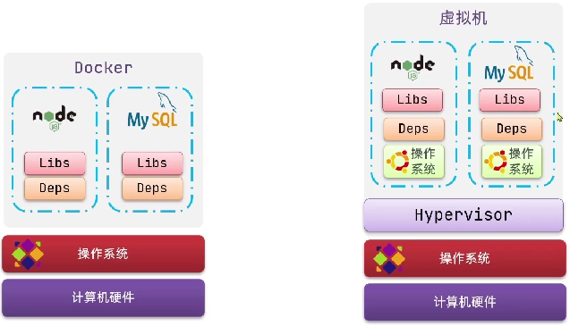

- 区别：

  - docker体积小、启动速度快、性能好
  - 虚拟机体积大、启动速度慢、性能一般

  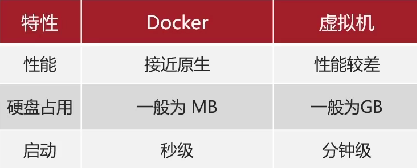

### 镜像和容器

- **镜像（Image)** ：

  -  Docker将应用程序及其所需的依赖、函数库、环境、配置等文件打包在一起，称为镜像。

- **容器(Container)**：

  - 镜像中的应用程序运行后形成的进程就是容器，只是Docker会给容器做隔离，对外不可见。

- Docker和DockerHub：

  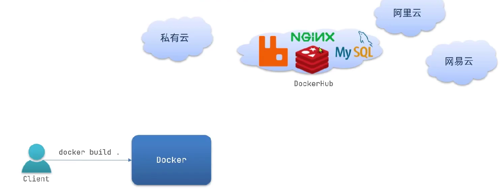

  - **DockerHub：** DockerHub是一个Docker镜像的**托管平台**。这样的平台称为Docker Registry。
  - 国内也有类似于DockerHub的公开服务，比如网易云镜像服务，阿里云镜像库等。

### docker架构

- Docker是一个**CS架构**的程序，由两部分组成：

  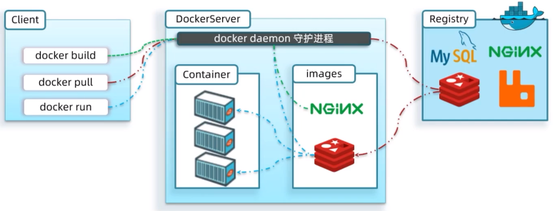

  - **服务端(server)：**Docker守护进程，负责处理Docker指令，管理镜像、容器等
  - **客户端(client)：**通过命令（本地）或RestAPI（远程）向Docker服务端发送指令。可以在本地或远程向服务端发送指令。

### 安装Docker

- 企业部署一般都是采用Linux操作系统，而其中又数CentOS发行版占比最多，因此我们在CentOS下安装Docker。

- Docker分为**CE**和**EE**两大版本。CE即社区版（免费），EE即企业版（付费）。

- Docker CE支持64位版本CentOS 7，并且要求内核版本不低于3.10, CentOs 7满足最低内核的要求。

  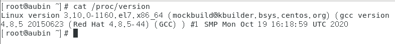

- **安装Docker**：

  1. 安装yum工具：

     ```sh
     yum install -y yum-utils \
                device-mapper-persistent-data \
                lvm2 --skip-broken
     ```

  2. 更新本地镜像源：

     ```sh
     # 设置docker镜像源
     yum-config-manager \
         --add-repo \
         https://mirrors.aliyun.com/docker-ce/linux/centos/docker-ce.repo
         
     sed -i 's/download.docker.com/mirrors.aliyun.com\/docker-ce/g' /etc/yum.repos.d/docker-ce.repo
     
     yum makecache fast
     ```

  3. 输入命令，安装Docker社区免费版本docker-ce：

     ```sh
     yum install -y docker-ce
     ```

- **启动Docker**：

  1. Docker应用需要用到各种端口，逐一去修改防火墙设置比较麻烦，可以直接关闭：

     ```sh
     # 关闭
     systemctl stop firewalld
     # 禁止开机启动防火墙
     systemctl disable firewalld
     ```

  2. 启动docker：

     ```sh
     systemctl start docker  # 启动docker服务
     
     systemctl stop docker  # 停止docker服务
     
     systemctl restart docker  # 重启docker服务
     ```

  3. 查看docker版本：

     ```sh
     docker -v
     ```

  4. 查看启动状态：

     ```sh
     stemctl status docker
     ```

- **配置镜像**：

  - docker官方镜像仓库网速较差，我们需要设置国内镜像服务

  - 参考阿里云的镜像加速文档：https://cr.console.aliyun.com/cn-hangzhou/instances/mirrors

  - 步骤（文档中可查看）：

    - 通过修改daemon配置文件/etc/docker/daemon.json来使用加速器

      ```sh
      sudo mkdir -p /etc/docker
      sudo tee /etc/docker/daemon.json <<-'EOF'
      {
        "registry-mirrors": ["https://79h900ac.mirror.aliyuncs.com"]
      }
      EOF
      sudo systemctl daemon-reload
      sudo systemctl restart docker
      ```

## Docker的基本操作

### 镜像操作

镜像名称一般分两部分组成：

- [repository]:tag

- 例：

  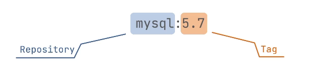

- 在没有指定taa时，默认是latest,，代表最新版本的镜像

#### 相关命令

- 查看帮助：

  - `docker --help`

    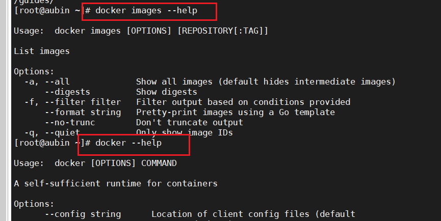

- **常用命令：**

  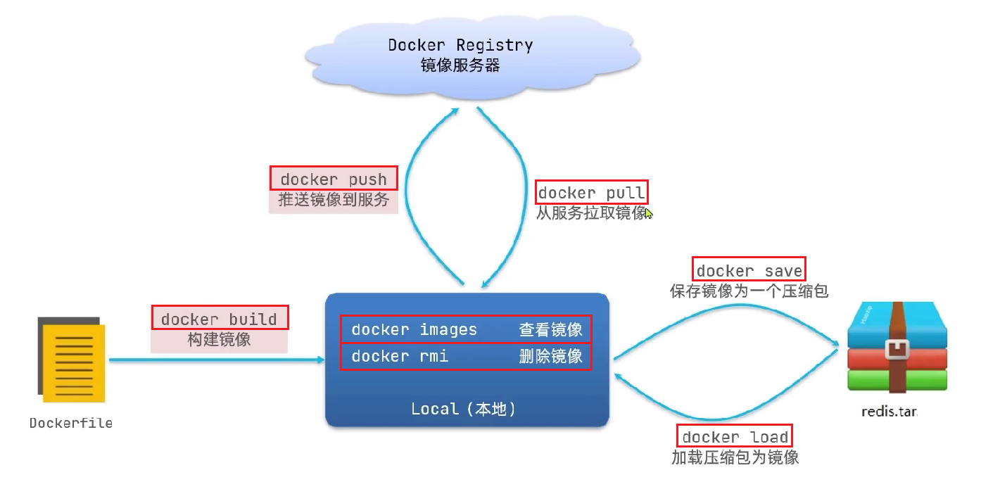

  - docker images：查看镜像
  - docker rmi：删除镜像
  - docker pull：从服务拉取镜像
  - docker push：推送镜像到服务
  - docker save：保存镜像为一个压缩包
  - docker load：加载压缩包为镜像

#### demo - 从DockerHub中拉取一个nginx镜像并查看

1. 去镜像仓库搜索nginx镜像，比如DockerHub（https://hub.docker.com/）：

   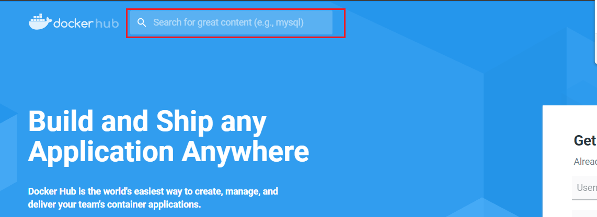

2. 搜索镜像，拉取自己需要的镜像，通过命令：`docker pull nginx`

   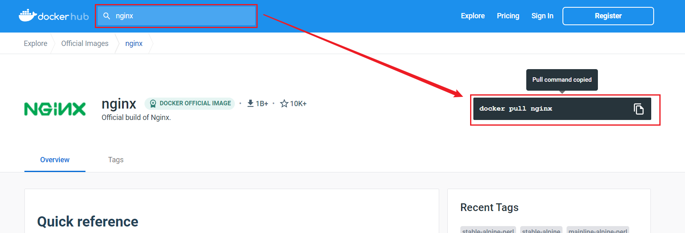

   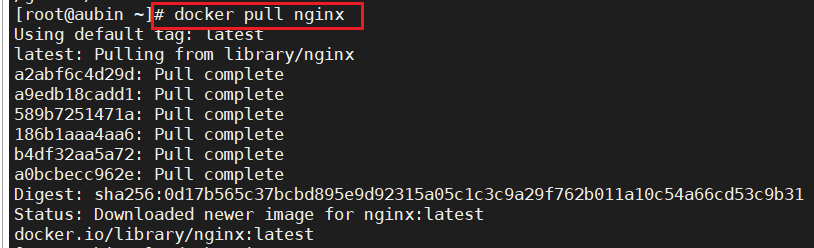

3. 查看拉取到的镜像，通过命令：`docker images`

   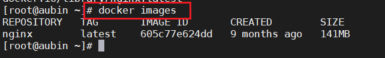

#### demo - 利用docker save将nginx镜像导出磁盘，然后再通过load加载回来

1. 利用`docker xx --help`命令查看`docker save`和`docker load`的语法

   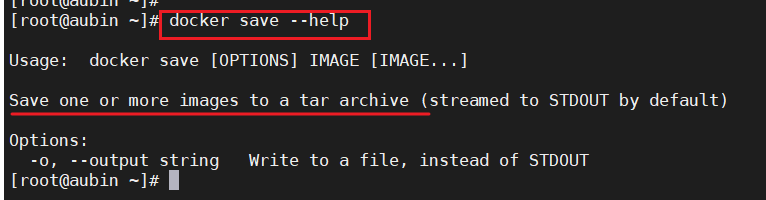

2. 使用`docker save`导出镜像到磁盘

   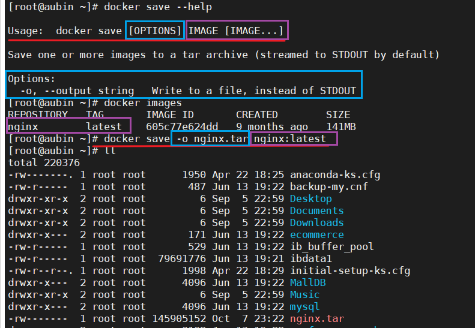

3. 删除镜像，加载镜像

   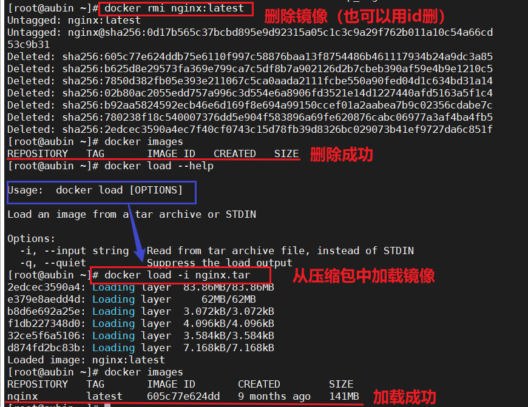

#### demo - 去DockerHub搜索并拉取一个Redis镜像

1. 去DockerHub搜索Redis镜像：

   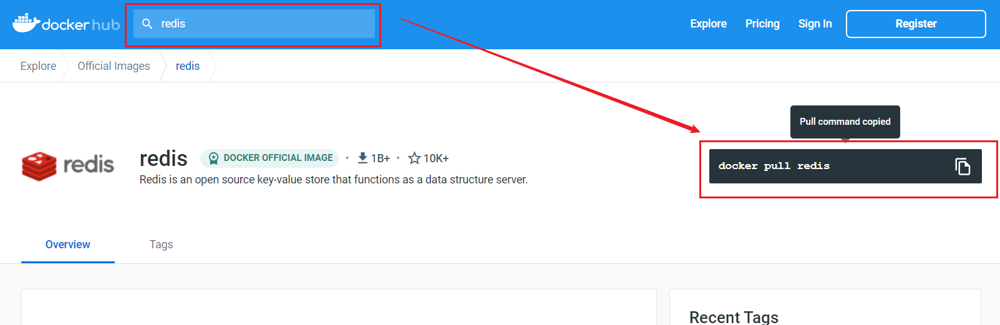

2. 查看Redis镜像的名称和版本

   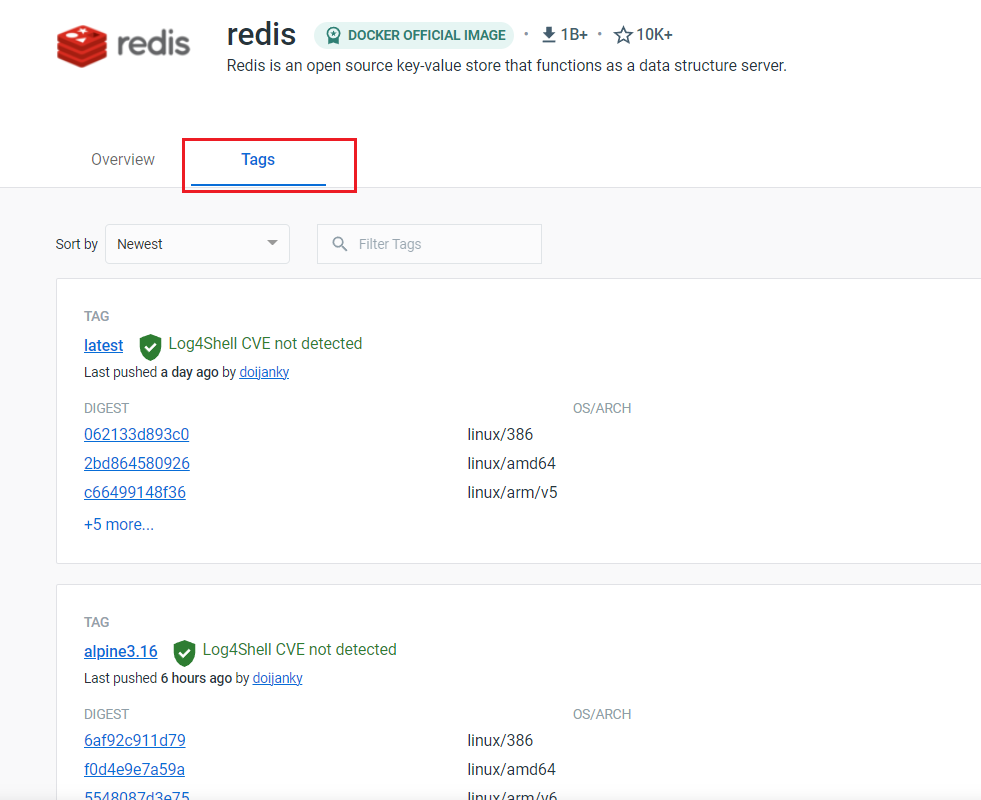

3. 利用docker pull命令拉取镜像

   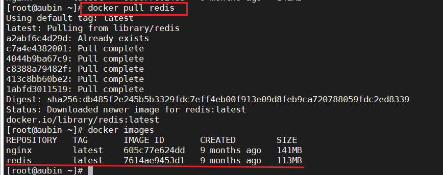

4. 利用docker save命令将redis:latest打包为一个redis.tar包

   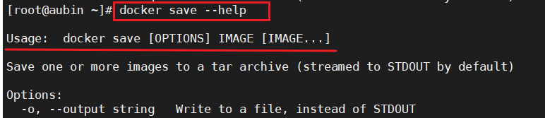

   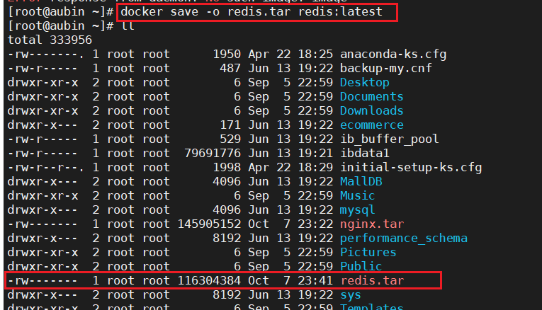

5. 利用docker rmi删除本地的redis:latest

   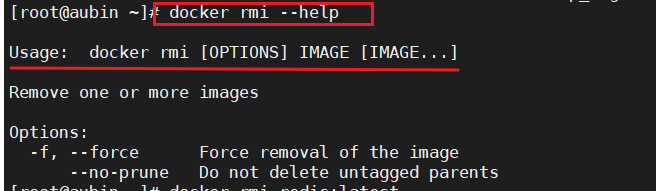

   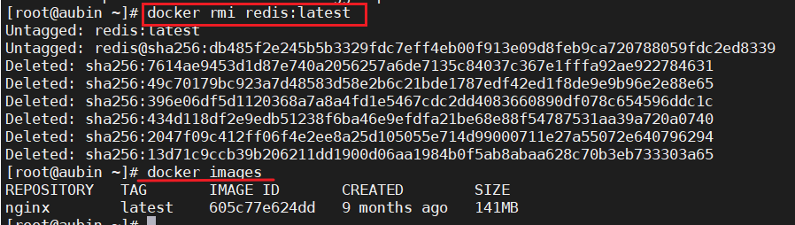

6. 利用docker load重新加载redis.tar文件

   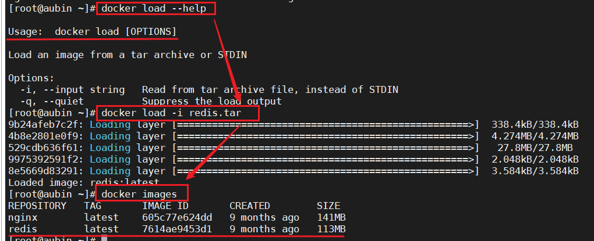

### 容器操作

#### 相关命令

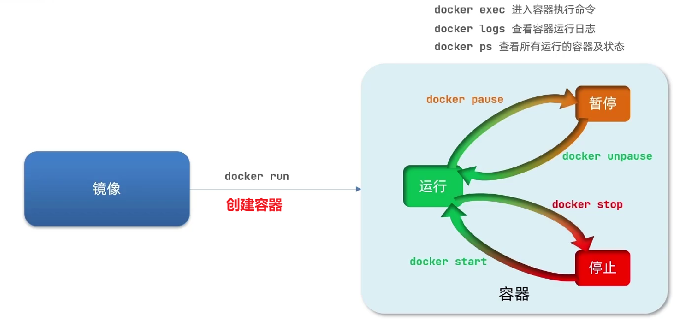

- docker run：创建容器
- docker exec：进入容器执行命令
- docker logs：查看容器运行日志
- docker ps：查看所有运行的容器及状态
- docker pause：运行 --> 暂停
- docker unpause：暂停 --> 运行
- docker start：运行 --> 停止
- docker stop：停止 --> 运行

#### demo - 创建运行一个Nginx容器

1. 去docker hub查看Nginx的容器运行命令：

   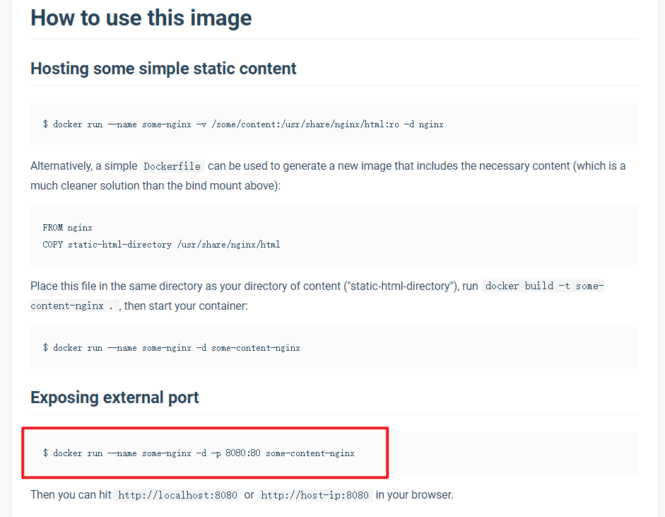

   - 命令解读

     ```sh
     docker run --name some-nginx -d -p 8080:80 some-content-nginx
     ```

     - docker run：创建并运行一个容器

     - --name：给容器起一个名字，比如叫做mn

     - -p：将宿主机端口与容器端口映射，冒号**左侧是宿主机端口，右侧是容器端口**

       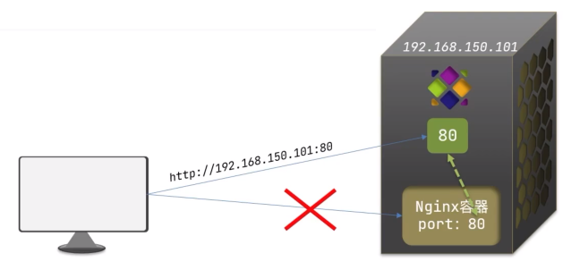

     - -d：后台运行容器

     - nginx：镜像名称，例如nginx

2. 执行命令：

   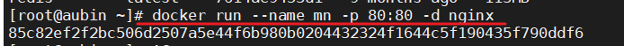

3. 查看：

   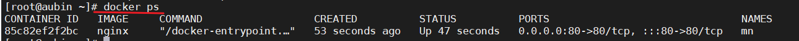

4. 测试，浏览器输入http://192.168.50.119:80

   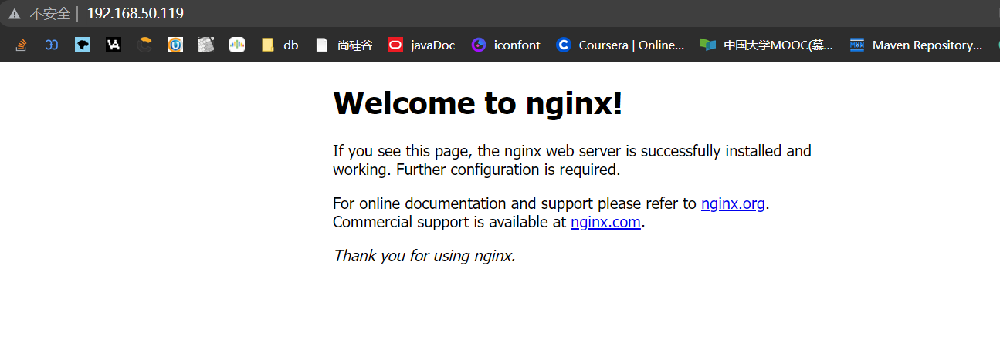

5. 查看日志：

   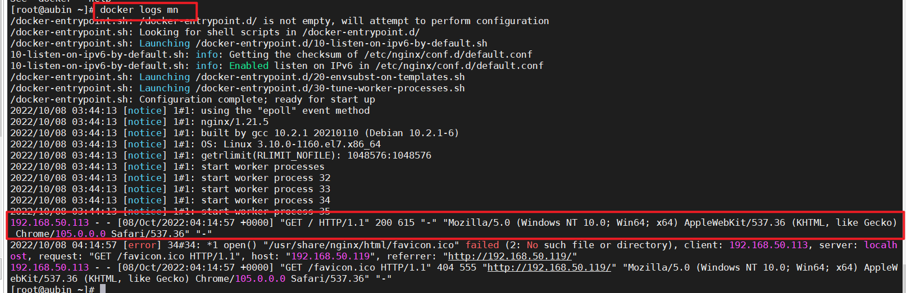

   - 查看日志的使用：

     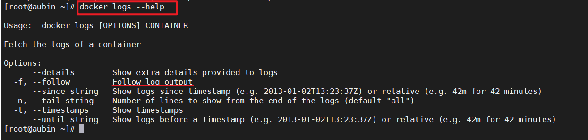

     - -f：持续跟踪

       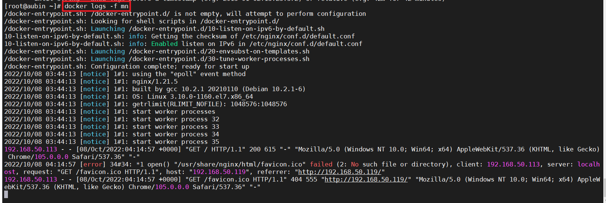

     - 测试，日志成功跟踪：

       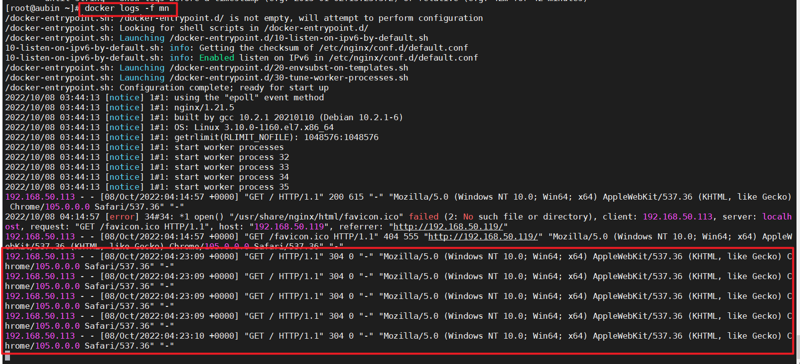

#### demo - 进入Nginx容器，修改HTML文件内容，添加“传智教育欢迎您”

1. 进入容器

   - 进入我们刚刚创建的nginx容器

   - 命令为：

     ```sh
     docker exec -it mn bash
     ```

   - 命令解读：

     - docker exec：进入容器内部，执行一个命令
     - -it：给当前进入的容器创建一个标准输入、输出终端，允许我们与容器交互
     - mn：要进入的容器的名称
     - bash：进入容器后执行的命令，bash是一个linux终端交互命令

   - exec命令可以进入容器修改文件，但是在容器内修改文件**是不推荐的**

2. 进入nginx的HTML所在目录`/usr/share/nginx/html`

   ```sh
   cd /usr/share/nginx/html
   ```

3. 修改index.html的内容

   ```sh
   sed -i 's#Welcome to nginx#传智教育欢迎您#g' index.html
   sed -i 's#<head>#<head><meta charset="utf-8">#g' index.html
   ```

4. 修改成功：

   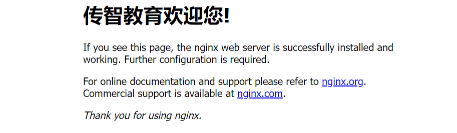

5. 退出容器：

   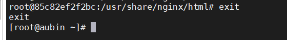

6. 停止容器：

   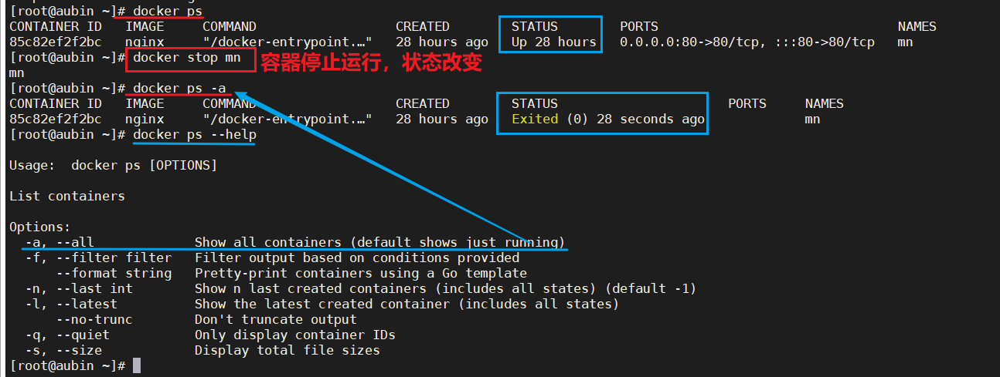

7. 删除容器：

   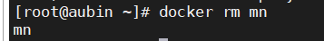

   - 注：不能删除运行中的容器，除非添加 -f 参数

#### demo - 创建并运行一个redis容器，并且支持数据持久化

1. 到DockerHub搜索Redis镜像

2. 查看Redis镜像文档中的帮助信息

   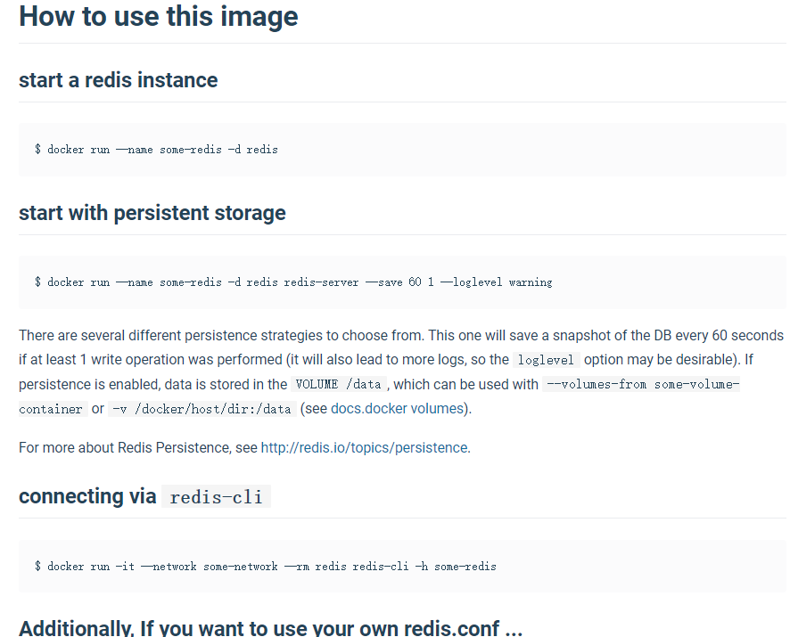

3. 利用docker run命令运行一个Redis容器

### 数据卷（容器数据管理)

## Dockerfile自定义镜像

## Docker-Compose

## Docker镜像服务