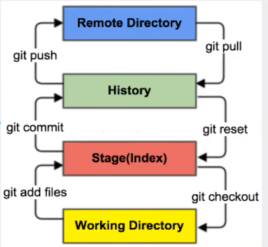
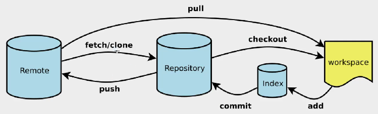

[TOC]

# 配置

## 系统级别

1. 命令：

   ```sh
   git config --system --list
   ```

2. 配置文件：

   - Git安装目录下的`gitconfig`
   - `Git\etc\gitconfig`

## 用户级别

1. 命令：

   ```sh
   git config --global --list
   ```

   - 这里可以直接编辑配置文件

2. 配置文件：

   - 只适用于当前登录用户的配置
   - `C:\Users\用户名\ .gitconfig`

3. 设置用户名和email地址：

   ```sh
   git config --g1obal user.name "kuangshen"#名称
   git config --globa1 user.emai1 247367430qq.com#邮箱
   ```

# 工作原理

## 工作区域

1. Git本地有三个工作区域：

   - **工作目录(Working Directory )**
   - **暂存区(Stage/Index)**
   - **资源库(Repository或Git Directory)**

2. Git远程也有一个工作区域：

   - **远程的git仓库(Remote Directory)**

3. 文件在这四个区域之间的转换关系如下：

   

   - **workspace：**工作区，就是你平时存放项目代码的地方，可以是你项目的目录，也可以是一个空目录
   - **lndex / Stage：**暂存区，用于临时存放你的改动，事实上它只是一个文件，保存即将提交到文件列表信息
   - **Repository：**仓库区（或本地仓库），就是安全存放数据的位置，这里面有你提交到所有版本的数据。其中HEAD指向最新放入仓库的版本
   - **Remote：**远程仓库，托管代码的服务器，可以简单的认为是你项目组中的一台电脑用于远程数据交换

## 工作流程

1. 一般工作流程：
   1. 在工作目录中添加、修改文件
   2. 将需要进行版本管理的文件放入暂存区域，`git add .`
   3. 将暂存区域的文件提交到git仓库，`git commit`
2. 因此，git管理的文件有三种状态：
   - 已修改( modified ) 
   - 已暂存( staged ) 
   - 已提交(committed)

# Git项目搭建

## 创建工作目录

1. 常用命令：

   

2. 本地仓库搭建：

   1. **创建全新的仓库**

      - 需要用GIT管理的项目的根目录执行：

        ```sh
        #在当前目录新建一个Git代码库
        git init
        ```

      - 执行后项目目录会多出了一个.git目录，存放关于版本等的所有信息。

   2. ****

      **克隆远程仓库**

      - 将远程服务器上的仓库完全镜像一份至本地

        ```sh
        #克隆一个项目和它的整个代码历史(版本信息)
        s git clone [ur1]
        ```

      - 在gitee或者github上克隆

## 常用命令

### Git文件操作

1. 文件4种状态：

   - **Untracked：**
     - 未跟踪，此文件在文件夹中，但并没有加入到git库，不参与版本控制
     - `git add` --> staged
   - **Unmodify：**
     - 文件已经入库，未修改，即版本库中的文件快照内容与文件夹中完全一致
     - 如果它被修改 --> Modified
     - `git rm`(移出版本库) --> untracked
   - **Modified：**
     - 文件已修改，仅仅是修改，并没有进行其他的操作
     - `git add` --> staged
     - `git checkout`(丢弃修改) --> unmodify。即从库中取出文件，覆盖当前修改 
   - **Staged：**
     - 暂存状态
     - `git commit` --> unmodify。将修收同步到库中，这时库中的文件和本地文件又变为一致
     - `git reset HEAD filename` --> Modified。取消暂存

2. 查看文件状态：

   ```sh
   #查看指定文件状态
   git status [filename]
   
   #查看所有文件状态
   git status
   
   # 添加所有文件到暂存区
   git add .
   
   # 提交暂存区中的内容到本地仓库 -m 提交信息
   git commit -m "注释"
   ```

### 忽略文件

1. 有些时候我们不想把某些文件纳入版本控制中，比如数据库文件，临时文件，设计文件等

2. 在主目录下建立"`.gitignore`"文件，此文件有如下规则∶

   - 忽略文件中的空行或以井号（#）开始的行将会被忽略。
   - 可以使用Linux通配符。例如r星号(* )代表任意多个字符，问号( ?)代表一个字符，方括号([abc])代表可选字符范围，大括号({string1,string2,…})代表可选的字符串等。
   - 如果名称的最前面有一个感叹号(!)，表示例外规则，将不被忽略。
   - 如果名称的最前面是一个路径分隔符(/ )，表示要忽略的文件在此目录下，而子目录中的文件不忽略。
   - 如果名称的最后面是一个路径分隔符(/)，表示要忽略的是此目录下该名称的子目录，而非文件（默认文件或目录都忽略)。

   ```bash
   #为注释
   .txt					#忽略所有.txt结尾的文件,这样的话上传就不会被选中!
   ! lib.txt			   #但7ib.txt除外
   /temp				#仅忽略项目根目录下的TODo文件,不包括其它目录temp
   build/			     #忽略build/目录下的所有文件
   doc/* .txt		   #会忽略doc/notes.txt但不包括doc / server/arch.txt
   ```

# 使用码云

1. 注册登录码云，完善个人信息

2. 设置本机绑定SSH公钥，实现免密码登录（https://gitee.com/help/articles/4181#article-header0）

   ```sh
   #进入C:\Users\Administrator\.ssh目求
   #生成公钥
   ssh-keygen
   ```

3. 将公钥信息public key添加到码云账户中即可

# IDEA集成Git

1. 新建项目，绑定git：将远程的git文件目录拷贝到项目中即可
2. 修改文件，使用IDEA操作git
   1. 添加到暂存区
   2. commit提交
   3. push到远程仓库

# Git分支

1. 常用命令：

   ```sh
   #列出所有本地分支
   git branch
   
   #列出所有远程分支
   git branch -r
   
   #新建一个分支，但依然停留在当前分支
   git branch [branch-name]
   
   #新建一个分支，并切换到该分支
   git checkout -b [branch]
   
   #合并指定分支到当前分支
   git merge [branch]
   
   #删除分支
   git branch -d [branch-name]
   
   #删除远程分支
   git push origin --delete [branch-name]
   git branch -dr [remote/branch]
   ```

2. 合并分支时冲突：修改冲突文件后重新提交

3. master主分支非常稳定，用来发布新版本，一般情况下不允许在上面工作

4. 工作一般情况下在新建的dev后，dev分支代码稳定后可以合并到主分支master上

https://blog.csdn.net/Vanllen_moon/article/details/120627566

https://www.jianshu.com/p/40a8a53085c0

