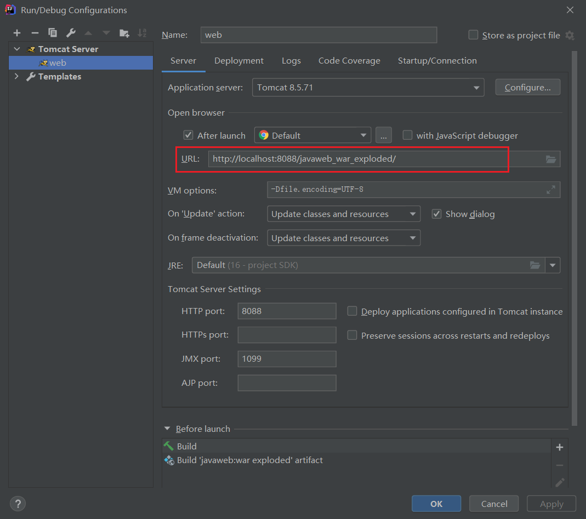
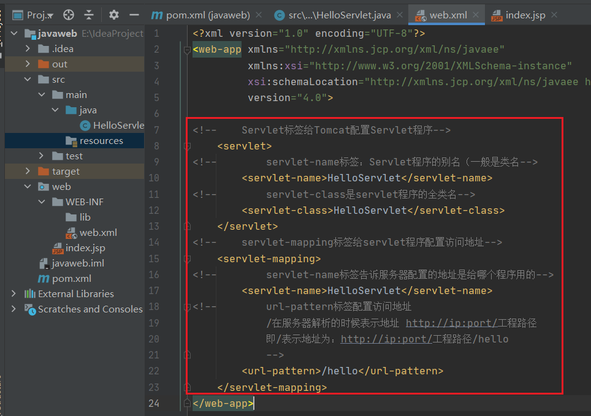
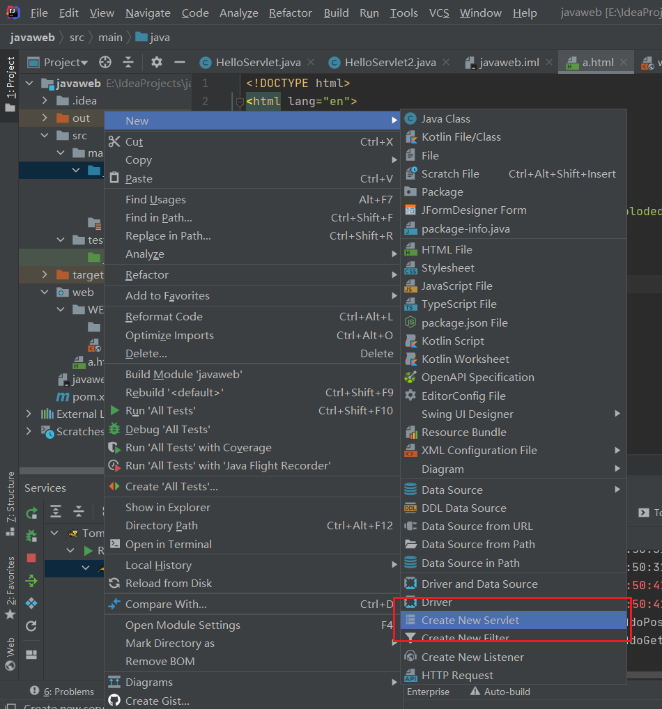
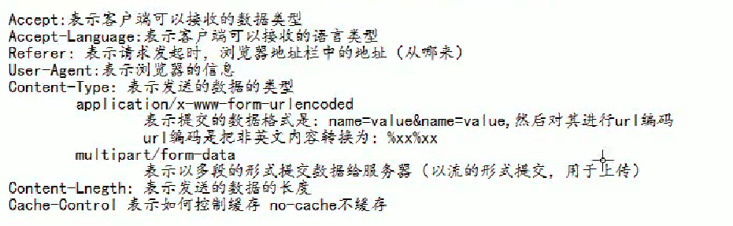
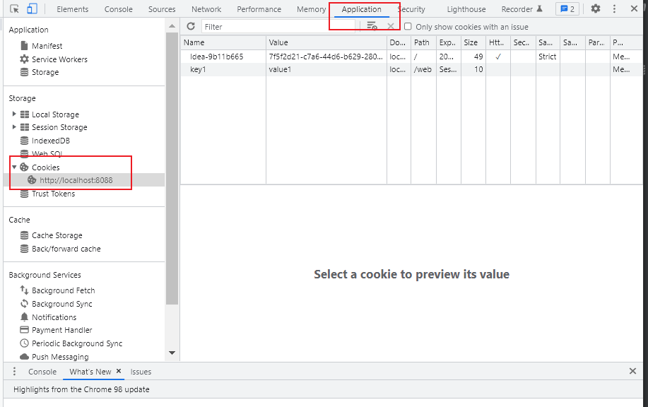
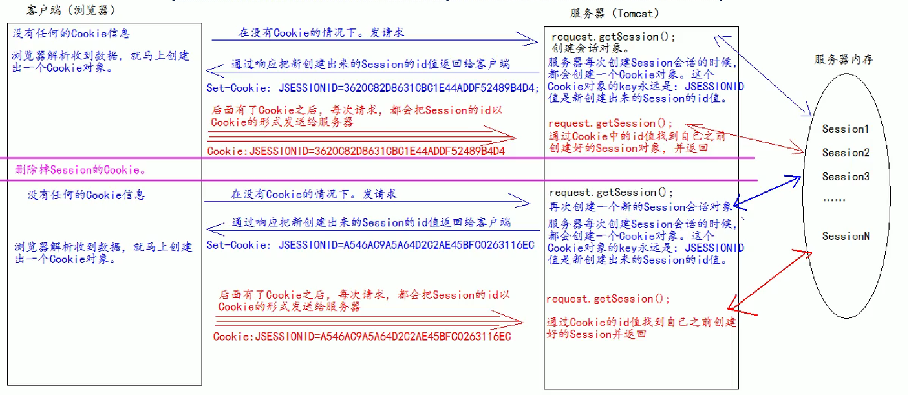
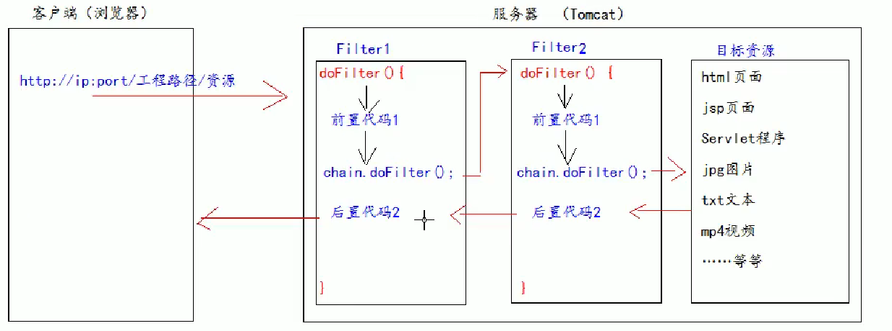

[TOC]


# Tomcat

## Tomcat介绍

### 版本


### 目录介绍

- bin：存放可执行程序
- conf：存放配置文件
- lib：存放jar包
- logs：Tomcat运行时输出的日记信息
- temp：Tomcat运行时产生的临时文件
- webapps：存放部署的web工程（一个文件夹一个工程）
- work：工作时的目录，用来存放Tomcat运行时jsp翻译为Servlet的源码，和Session钝化（序列化）的目录。

### 启动Tomcat服务器

1. 找到Tomcat目录下的bin目录下的startup.bat，双击启动。
2. 进入命令行，cd进入bin目录下，输入命令catalina run 

- 在浏览器输入网址测试是否启动成功：

  1. http://localhost:8080
  2. http://127.0.0.1:8080
  3. http://192.168.43.146:8080（http://真实ip:8080）

- 常见启动失败情况

  双击startup.bat文件时黑屏一闪而过 -> 没有配置好JAVA_HOME环境变量

### 停止Tomcat服务器

1. 点击tomcat服务器窗口的x关闭按钮
2. 把Tomcat服务器窗口置为当前窗口,然后按快捷键ctrl+C
3. 找到Tomcat的 bin目录下的shutdown.bat双击，就可以停止Tomcat服务器

### 修改Tomcat的端口号

- 说明：

  - mysql的默认端口是3306
  - Tomcat的默认端口是8080

- 修改方式：

  进去Tomcat目录下的conf目录，找到server.xml配置文件，找到Connection标签，修改port（范围：1~65535）

- 修改完需要重启服务器

- http协议默认的端口号是80（默认省略）

## 部署web工程

- 方式：

  1. 直接将web工程的目录拷贝到Tomcat的webapps目录下。

     访问web工程：网址后面加文件名访问

  2. 在conf目录\Catalina\localhost\下，创建如下配置文件：

     ```xml
     <context path=" / abc" dolBase="E: book"/>
     ```

     - Concexc表示一个工程上下文
     - path表示工程的访问路径: / abc
     - docBase表示工程目录位置

- 区别：

  

## ROOT工程

- 在浏览器地址栏中输入访问地址如下：htp:/p:por/
  即没有工程名时，默认访问的是ROOT工程。
- 当我们在浏览器地址栏中输入的访问地址如下：htp://p:por/工程名1 
  即没有资源名时， 默认访问index.html页面。

## Idea中的web工程

### 整合Idea

- File | Settings | Build, Execution, Deployment | Application Servers
- 创建web工程：https://blog.csdn.net/weixin_50180191/article/details/116521420
- 500导包失败异常：https://www.html.cn/qa/css3/15276.html

### 动态web工程目录

- 新建模块后右击Add Frameworks Support，勾选Web Application


- src：自己编写的Java源代码
- web目录：存放web工程的资源文件
  - WEB-INF：受服务器保护的目录，浏览器无法直接访问
    - lib：存放第三方jar包（需配置）
    - web.xml：整个动态web工程的配置部署描述文件，可以在这配置很多web工程的组件（如Servlet程序、Filter过滤器、Listener监听器、Session超时…）

### 在idea部署web模块

1. 建议修改Tomcat名称区分

   

2. 添加需要部署的web工程，确认你的Tomcat实例中有你要部暑运行的web工程模块

   

3. 启动tomcat运行实例时默认打开访问的地址，可修改

   

4. 正常方式和debug方式启动Tomcat实例

   

5. 停止运行

   

6. 重启

   

   

   类别：

   - 重新更新web工程中的资源到Tomcat运行实例中
   - 更新web工程中的Class字节码和资源文件到Tomcat运行实例中
   - 重新部署web模块，但是不重启Tomcat实例
   - 重启Tomcat实例，并更新web模块内容

# Servlet

## Servlet介绍

- 是Java EE规范之一。规范就是接口
- 是Java web三大组件之一。分别是Servlet程序、Filter过滤器、Listener监听器。
- 是运行在服务器上的一个Java小程序。**可以接收客户端发送的请求，并响应数据给客户端。**

## 实现Servlet

1. 编写类去实现Servlet接口

2. 实现Servlet方法，处理请求，并响应数据

3. 到web.xml中去配置Servlet程序的访问地址

   

   ```xml
   <web-app>
   
       <!--    Servlet标签给Tomcat配置Servlet程序-->
       <servlet>
   	<!--        servlet-name标签：Servlet程序的别名（一般是类名-->
           <servlet-name>HelloServlet</servlet-name>
   	<!--        servlet-class是servlet程序的全类名-->
           <servlet-class>HelloServlet</servlet-class>
       </servlet>
       
   	<!--    servlet-mapping标签给servlet程序配置访问地址-->
       <servlet-mapping>
   <!--        servlet-name标签告诉服务器配置的地址是给哪个程序用的-->
           <servlet-name>HelloServlet</servlet-name>
   <!--        url-pattern标签配置访问地址
               /在服务器解析的时候表示地址 http://ip:port/工程路径
               即/表示地址为：http://ip:port/工程路径/hello(不以/开头会报错“Incalid <url>-pattern ** in servlet mapping”)
               -->
           <url-pattern>/hello</url-pattern>
       </servlet-mapping>
       
   </web-app>
   ```

## 访问路径解读


## Servlet的生命周期

1. 执行Servlet构造器方法（第一次访问时调用一次）
2. 执行init初始化方法（第一次访问时调用一次）
3. 执行service方法（访问的时候都执行）
4. destroy方法

## 通过HttpServlet实现Servlet程序

1. 使用继承HttpServlet类的方式实现Servlet程序

   1. 编写一个类继承HttpServlet类
   2. 根据业务需求重写doGet和doPost方法
   3. 到web.xml中配置Servlet程序的访问地址

2. 使用Idea

   


## Servlet类的继承体系

​     **Servlet接口**                ：只定义Servlet程序的访问规范

​         ↑ 实现

**GenericServlet类**          ：实现Servlet接口，做了很多空实现，并持有一个ServletConfig类的引用，做了一些其使用方法

​         ↑ 继承

 **HttpServlet类**               ：实现了service()方法，并实现请求的分发处理

​         ↑ 继承

**自定义的Servlet程序**

## ServletConfig类

Servlet程序的配置信息类，作用：

1. 可以获取Servlet程序的别名（Servlet-name的值）

2. 获取初始化参数 init-param

   需要在web.xml中配置

   ```xml
   <servlet>
   <!--        servlet-name标签：Servlet程序的别名（一般是类名-->
           <servlet-name>HelloServlet</servlet-name>
   <!--        servlet-class是servlet程序的全类名-->
           <servlet-class>HelloServlet</servlet-class>
   
           <!--        配置初始化参数：参数名，参数值（可以配置多组）-->
           <init-param>
               <param-name>username</param-name>
               <param-value>root</param-value>
           </init-param>
           <init-param>
               <param-name>url</param-name>
               <param-value>jdbc:mysql://localhost/test</param-value>
           </init-param>
   
       </servlet>
   ```

3. 获取**ServletContext对象**

4. 举例：（继承Servlet类里面实现的init方法中，也可以在其他地方使用 `ServletConfig servletConfig=getServletConfig()`）

   ```java
   public void init(ServletConfig servletConfig) throws ServletException {
           System.out.println("2.init初始化方法");
   //        1. 可以获取Servlet程序的别名（Servlet-name的值）
           System.out.println("HelloServlet程序的别名是："+servletConfig.getServletName());
   //        2. 获取初始化参数 init-param
           System.out.println("初始化参数username的值为："+servletConfig.getInitParameter("username"));
           System.out.println("初始化参数url的值为："+servletConfig.getInitParameter("url"));
   //        3. 获取ServletContext对象
           System.out.println(servletConfig.getServletContext());
       }
   ```

说明：Servlet程序和ServletConfig对象都是由Tomcat创建，供我们使用。

区别：

- Servlet：第一次访问时创建
- ServletConfig：每个Servlet程序创建时就创建一次

## ServletContext类

- 是一个接口，表示Servlet上下文对象

- **一个web工程，只有一个ServletContext实例**

- 是一个域对象

  - 域对象，是可以像Map一样存取数据的对象。域指存取数据的操作范围

  - 区别：

    ​                       存数据                    取数据                                   **Map**                    put()                       get()                     remove()

​                          **域对象**           setAttribute()       getAttribute()       removeAttribute()

- 在web工程部署启动的时候创建，在web工程停止的时候销毁

- 作用：

  1. 获取web.xml中配置的上下文参数context-param（属于整个web工程 ）

     ```xml
     <!--    配置上下文参数（属于整个web工程），可以配置多组-->
         <context-param>
             <param-name>username</param-name>
             <param-value>context</param-value>
         </context-param>
     ```

     

  2. 获取当前工程路径：格式：/工程路径 `getContextPath()`

  3. 获取工程部署后在服务器硬盘上的绝对路径（是Idea整合Tomcat后，Tomcat被拷贝的一些副本内容） `getRealPath()`

     例子：

     ```java
     public class ContextServlet extends HttpServlet {
         protected void doPost(HttpServletRequest request, HttpServletResponse response) throws ServletException, IOException {
     
         }
     
         protected void doGet(HttpServletRequest request, HttpServletResponse response) throws ServletException, IOException {
     //        1. 获取web.xml中配置的上下文参数context-param
             ServletContext context = getServletConfig().getServletContext();
             System.out.println("context-param参数username的值是："+(context.getInitParameter("username")));
     //        2. 获取当前工程路径：格式：/工程路径
             System.out.println("当前工程路径："+context.getContextPath());
     //        3. 获取工程部署后在服务器硬盘上的绝对路径
     //        / 被服务器解析的地址为：http://ip:port/工程名  (/即映射到了web目录下)
             System.out.println("工程部署的路径是："+context.getRealPath("/"));
         }
     }
     ```

  4. 像Map一样存取数据

     ```java
         protected void doGet(HttpServletRequest request, HttpServletResponse response) throws ServletException, IOException {
     //        4.像Map一样存取数据
     //        ServletContext context = getServletConfig().getServletContext();
             ServletContext context = getServletContext();
             context.setAttribute("key1","value1");
             System.out.println("context1中获取与数据key1的值是："+context.getAttribute("key1"));
         }
     ```

## Http协议

1. 指客户端和服务器之间通信时发送数据需要遵循的规则

2. HTTP协议中的数据叫报文

3. 客户端给服务器发送数据：请求

   - get请求

     1. 请求行
        1. 请求的方式  GET
        2. 请求的资源路径[＋？＋请求参数]
        3. 请求的协议的版本号  HTTP/1.1
     2. 请求头
        1. key：value（不同的键值对表示不同的涵义）

     

   - post请求（同get）

     

   - 常用的请求头

     - Accept:表示客户端可以接收的数据类型
     - Accpet-Languege:表示客户端可以接收的语言类型
     - User-Agent:表示客户端浏览器的信息
     - Host:表示请求时的服务器ip和端口号
       I

   服务器给客户端回传数据：响应

### 区分GET请求和POST请求

1. get
   1. form标签中method=get
   2. a标签
   3. link标签引入css
   4. script标签引入js
   5. img标签引入图片
   6. iframe标签引入html页面
   7. 浏览器地址栏输入地址回车
2. post
   1. form标签中method=post

### 响应的http协议格式

1. 响应行

   1. 响应的协议和版本号
   2. 响应的状态码
   3. 响应状态描述符

2. 响应头

   1. ket:value	不同的响应头表示不同的含义

      空行

3. 响应体：回传给客户端的数据

4. 实例：

   

5. 常用 的响应码

   1. 200	表示请求成功
   2. 302    表示请求重定向
   3. 404    表示服务器收到了请求，但是数据不存在（地址错误）
   4. 500    表示服务器收到了请求，但是服务器内部错误（代码错误）

6. MIME类型说明

   1. 是HTTP协议中的数据类型

   2. 常用：

      

## HttpServletRequest类 

- 作用：
  - 请求进入Tomcat，Tomcat就把请求过来的HTTP协议信息封装到Request对象中。HttpServletRequest对象能获取到所有请求的信息。
- 常用方法：
  - `getRequestURI()`：获取请求的资源路径
  - `getRequestURL()`：获取请求的统一资源定位符（绝对路径）
  - `getRemoteHost()`：获取客户端的IP地址
  - `getHeader()`：获取请求头
  - `getParameter()`：获取请求的参数
  - `getParameterValues()`：获取请求的参数（多个值时使用）
  - `getMethod()`：获取请求的方式 get或post
  - `setAttribute(key,value)`：设置域数据
  - `getAttribute(key)`：获取域数据
  - `getRequestDispatcher()`：获取请求转发对象
- 如何获取请求：
  - 通过getParameter()和getParameterValues()
  - 请求的转发：
    - 指服务器收到请求后从一个资源跳转到另一个资源的操作
    - 特点：
      1. 浏览器地址没有变化
      2. 是同一次请求
      3. 共享Request域中的数据
      4. 可以转发到WEB-INF目录下
      5. 只能访问同一工程下的资源

## Base标签

- 原因：使用请求转发时候地址是servlet的路径，导致 参照的地址不同
- 设置当前页面中所有相对路径工作时，参照哪个路径进行跳转
- / 的不同含义：
  - 浏览器解析时：http://ip:port/
  - 服务器解析时：http://ip:port/工作路径
  - 特殊：在服务器中的`response.sendRediect("/")`：把斜杠发送给浏览器解析，得到http://ip:port/

## HttpServletResponse类

1. 作用：

   ​	请求进入Tomcat，Tomcat就会创建一个Response对象传递给Servlet程序使用。

2. 区别：

   ​	HttpServletRequest表示请求过来的信息，HttpServletResponse表示所有响应的信息。可以通过HttpServletResponse来设置需要返回给客户端的信息。

3. 两个流（只能使用一个）：

   1. 字节流：`getOutputStream()`  常用于下载（传递二进制数据）
   2. 字符流：`getWriter()`  常用于回传字符串（常用）

## 回传给客户端

- `resp.getWriter()`
- 解决乱码
  - `rsp.setCharacterEncoding()`
  - 通过响应头设置浏览器的字符集：
    1. 通过响应头设置浏览器的字符集：`resp.setHeader("Content-Type","text/html;charset=UTF-8")`
    2. 同时设置（要在获取流对象前设置）：`resp.setContentType("text/html;charset=UTF-8")`

## 请求重定向

1. 指客户端给服务器发请求，然后服务器给客户端一些地址让服务器去新地址访问。（当旧地址被废弃后）
2. 服务器的旧地址需要指引新地址给客户端解析，使其能再次发起新地址的请求：
   1. 响应码 302 `resp.setStatus(302)`
   2. 响应头 Location（新地址）`resp.setHeader("Location","http://…")`
3. 特点：
   1. 浏览器地址栏会发生变化
   2. 两次请求
   3. 不共享Request域中的数据
   4. 不能访问WEB-INF下的资源
   5. 可以访问工程外的资源
4. 第二种方法：`resp.sendRedirect("http://localhost:8080")

## JavaEE三层架构

1. web层（视图展现层）
   - 获取请求的参数，封装成Bean对象
   - 调用Service层处理业务
   - 响应数据给客户端（请求转发、重定向）
   - 涉及：Servlet、webwork、Strtus1.x、Strtus2.x、SpringMVC
   - **包1：controller**
2. Service层（业务层）
   - 处理业务逻辑
   - 调用持久层保存到数据库
   - 涉及：Spring框架
   - **包2：service、service.impl**
3. dao层（持久层）
   - 跟数据库交互（CRUD）
   - 涉及：Jdbc、DbUtils、JdbcTemplate、Mybatis、Hiberante
   - **包3：dao、dao.impl**

**包4：domain/bean (实体bean对象）**

**包5：测试包junit**

**包6：工具类utils**

## 项目搭建流程

1. 创建数据库

2. 编写数据库表对应的JavaBean对象

3. 编写Jdbc工具类

4. 编写dao持久层

5. 编写Basedao

   ```java
   public abstract class BaseDao {
   //    使用DbUtil操作数据库
       private QueryRunner queryRunner=new QueryRunner();
       /**
        * update方法执行增删改
        * 执行失败返回-1
        */
       public int update(String sql,Object...args){
           Connection connection= JdbcUtils.getConnection();
           try {
               return queryRunner.update(connection,sql,args)
           } catch (SQLException throwables) {
               throwables.printStackTrace();
           }finally {
               JdbcUtils.close(connection);
           }
           return -1;
       }
   
       /**
        * 查询返回一个JavaBean的sql语句
        * @param type 返回的对象类型
        * @param sql 执行的SQL语句
        * @param args sql对应的参数值
        * @param <T> 返回的类型的泛型
        * @return
        */
       public <T> Object queryForOne(Class<T> type,String sql,Object...args){
           Connection connection=JdbcUtils.getConnection();
           try {
               return queryRunner.query(connection,sql,new BeanHandler<T>(type),args);
           } catch (SQLException throwables) {
               throwables.printStackTrace();
           }finally {
               JdbcUtils.close(connection);
           }
           return null;
       }
   
       /**
        * 查询返回多个JavaBean的sql语句
        * @param type 返回的对象类型
        * @param sql 执行的SQL语句
        * @param args sql对应的参数值
        * @param <T> 返回的类型的泛型
        * @return
        */
       public <T> List<T> queryForList(Class<T> type,String sql,Object...args){
           Connection connection=JdbcUtils.getConnection();
           try {
               return queryRunner.query(connection,sql,new BeanListHandler<T>(type),args);
           } catch (SQLException throwables) {
               throwables.printStackTrace();
           }finally {
               JdbcUtils.close(connection);
           }
           return null;
       }
   
       /**
        * 执行返回一行一列的SQL语句
        * @param sql 执行的SQL语句
        * @param args sql对应的参数值
        * @return
        */
       public Object queryForSingleValue(String sql,Object...args){
           Connection connection=JdbcUtils.getConnection();
           try {
               return queryRunner.query(connection,sql,new ScalarHandler(),args);
           } catch (SQLException throwables) {
               throwables.printStackTrace();
           }finally {
               JdbcUtils.close(connection);
           }
           return null;
       }
   }
   
   ```

6. 编写UserDao和测试

7. 编写UserService和测试（业务层，一个业务一个方法）

## IDEA中Debug

1. 调试工具栏

   

2. 变量窗口：查看当前方法范围内所有有效的变量

3. 方法调用栈窗口：

   1. 可以查看当前线程有哪些方法调用信息
   2. 下面的调用上一行的方法

   

4. 其他

   

# Jsp

## 简介

1. 全称是Java server pages，Java的服务器页面
2. 主要作用是代替Servlet程序回传html的数据（更简单、成本更低）
3. 本质：
   - 是Servlet程序
   - 第一次访问Jsp文件时，Tomcat会将其翻译成一个Java源文件（里面间接继承了HttpServlet），并将其编译成.class字节码程序
   - Servlet的源代码其实也是通过输出流把html页面数据回传给客户端

## page指令

```jsp
<%@ page contentType="text/html;charset=UTF-8" language="java" %>
```

1. 属性值：

   1. `contentType` 表示jsp返回的数据类型

   2. `language` 表示jsp翻译后是什么语言，即setContentType()的参数值

   3. `pageEncoding` 表示jsp页面本身的字符集

   4. `import` 用于导包、导类

      

   5. `autoFlush` 设置当out输出流缓冲区满了后是否自动刷新缓冲区，默认true

   6. `buffer` 设置out缓冲区的大小，默认8kb

      （out缓冲区满了后不能自动刷新会报错）

      

   7. `errorPage` 设置当jsp页面运行出错时，自动跳转到错误页面路径

   8. `isErrorPage`  设置当前jsp页面是否为错误信息页面，默认是false（是true时可以获取异常信息）

   9. `session` 设置当访问jsp页面时是否创建HttpSession对象，默认是true

   10. `extends` 设置jsp翻译出来的java类默认继承谁

   ## 常用脚本

   ### 声明脚本

   1. 格式：`<%! 声明java代码 %>`
   2. 作用：
      1. 声明static静态代码块
      2. 声明类方法
      3. 声明内部类

   ### 表达式脚本

   1. 格式：`<%=表达式 %>`
   2. 作用：在jsp页面上输出数据（整型、浮点型、字符型、对象）
   3. 特点：
      1. 会被翻译成out.print()输出到页面
      2. 所有表达式脚本都会被翻译到_jspService()方法中
      3. _jspService()方法中的对象可以直接调用
      4. 表达式不能以分号结束

   ### 代码脚本

   1. 格式`<% java语句 %>`

   2. 作用：

      可以直接根据需求编写Java语句（if、for、_jspService()方法中的代码）

   3. 特点：

      1. 翻译后都在_jspService()方法中
      2. _jspService()方法中的对象可以直接调用
      3. 多个脚本块可以组合实现一个完整的功能
      4. 可以结合表达式脚本使用

   ## 九大内置对象

   1. 是指Tomcat在翻译jsp页面成为Servlet源代码后，内部提供的九大对象

   2. 分类：

      1. 四个域对象：可以像map一样存取数据的对象。四个域对象功能一样，但是对数据的存取范围不一样。（优先顺序：从上至下）
         - **pageContext（HttpSession类）：**
           - jsp的上下文对象    
           - （当前jsp页面范围内有效）
         - **request（PageContextImpl类）：**
           - 请求对象	
           - （一次请求内有效）
         - **session（ServletContext类）：**
           - 会话对象    
           - （一个会话范围内有效，即打开浏览器访问服务器到关闭浏览器）
         - **application（HttpServletRequest类）：**
           - ServletContext对象     
           - （整个web工程内，即直到web工程停止）

      - response：响应对象
      - config：ServletConfig对象
      - out：jsp输出流对象
      - page：指向当前jsp的对象
      - exception：异常对象

## out输出和response的区别

当页面中所有代码执行完后：

1. 执行out.flush()操作，把out缓冲区中的数据追加到response缓冲区末尾

2. 执行response的刷新操作，把全部数据写给客户端

   

   ​                缓冲区                                      out.flush()                         客户端

   **out缓冲区  response缓冲区** -----------------------------------> **response缓冲区数据**

   ​                                                                                                      **out缓冲区数据**

3. 因为底层源码使用out输出，一般情况下同一使用out输出，避免输出顺序乱。

4. write和print的区别：

   - `out.write()`：可输出字符串，其他可能乱码
   - **`out.print()`**：可输出任何数据（最终都会转换成字符串后调用的write输出）

## 常用标签

### 静态包含

1. `<%@ include file="" %>`
2. 特点：
   1. 底层是直接把被包含的jsp页面的代码拷贝到包含的位置执行输出
   2. 不会翻译被包含的jsp页面

### 动态包含

1. `<jsp:include page=""></jsp:include>`

2. 特点：

   1. 底层是使用代码去调用被包含的jsp页面执行输出

   2. 会把被包含的jsp页面翻译成java代码

   3. 可以传递参数

      ```jsp
      <jsp:include page="">
      	<jsp:param name="" value=""/>
      	<jsp:param name="" value=""/>
      </jsp:include>
      ```

   在被包含的页面获取参数值：

   ```jsp
   <%=request.getParameter("")%>
   ```

### 标签-转发

1. `<jsp:forward page=""><jsp:forward>`

## Listener监听器

1. javaweb的三大组件之一（Servlet程序、Filter过滤器、Listener监听器）
2. 是Java EE规范，就是接口
3. 作用：监听某种事物的变化，然后通过回调函数，反馈给客户（程序）去做响应处理

### ServletContextListener监听器

1. 可以监听ServletContext对象的创建和销毁

2. Servlet Context对象：web工程启动时创建，web工程停止时销毁

3. 两个方法：

   ```java
   //在ServletContext对象创建之后马上使用，做初始化
   public void contextInitialized(ServletContextEvent sce);
   
   //在ServletContext对象销毁之后调用
   public void contextDestroyed(ServletContextEvent sce);
   ```

4. 使用ServletContextListener监听器监听ServletContext对象：

   1. 编写一个类去实现ServletContextListener接口

   2. 实现其两个回调方法

   3. 到web.xml中配置监听器

      ```
      <listener>
      	<listener-class>路径</listener-class>
      </listener>
      ```

## EL表达式

1. 全称：Expression Language，是表达式语言

2. 作用：替代jsp页面中的表达式脚本在jsp页面中进行数据的输出

3. 优势：比jsp的表达式脚本更简洁

4. 格式：`${表达式}`（在输出null值是是空串）

5. 搜索域数据的顺序：

   ​	按四个域从小到大的顺序进行搜索输出：pageContext, request, session, application

6. 可以输出Bean的普通属性（输出属性的值：.），数组属性，List集合属性，map集合属性（找对应的get方法）

7. 可以运算：

   1. 关系运算

   2. 逻辑运算

   3. 算数运算

   4. 三元运算

   5. empty运算（判断一个数据是否为空：值为null、空串、数组长度为0、集合个数为0）

      ```jsp
      <% request.setAttribute("key",value);%>
      ${ empty key}
      ```

8. 十一个隐含对象：

   ​     	变量                                      类型                                      作用

   pageContext                   PageContextImpl             获取jsp中的九大内置对象

   

     pageScope                   Map<String,Object>          获取pageContext中的数据

​      requestScope                 Map<String,Object>          获取Request域中的数据

​      SessionScope                  Map<String,Object>          获取Session域中的对象

​    applicationScope              Map<String,Object>         获取SevletContext域中的数据


​            param                         Map<String,String>           获取请求参数的值

​      paramValues                   Map<String,String[]>          获取请求参数的值（多个值）


​           header                         Map<String,String>          获取请求头的信息

​     headerValues                   Map<String,String[]>        获取请求头的信息（多个值）


​           cookie                          Map<String,Cookie>          获取当前请求的Cookie信息

​        initParam                       Map<String,String>    		获取在web.xml中配置的<context-param>上下文参数

## EL获取四个特定域中的属性

​	    pageScope                    pageContext域

​      requestScope        	         Request域

​      SessionScope               	  Session域

​    applicationScope             SevletContext域

### PageContext

1. `request.getScheme()`：获取请求的协议

   ```jsp
   ${pageContext.request.scheme}
   ```

2. `request.getServerName()`：获取请求的服务器IP或域名

3. `request.getServerPort()`：获取请求的服务器端口号

4. `request.getContextPath()`：获取当前工程路径

5. `request.getMethod()`：获取请求的 方法（get或post）

6. `request.getRemoteHost()`：获取客户端的ip地址

7. `session.getId()`：获取会话的唯一标识

## JSTL标签库

1. JSP Standard Tag Library，jsp标准标签库

2. 目的：替换代码脚本，使整个jsp页面变得更加简洁

3. 由五个不同功能的标签库组成：

   ​			功能范围											 url													前缀

   ​	     **核心标签库**                 http://java.sun.com/jsp/jstl/core				 			c

   ​			格式化					  http://java.sun.com/jsp/jstl/fmt				 			fmt

   ​			  函数						http://java.sun.com/jsp/jstl/functions					fn

   ​		    数据库					  http://java.sun.com/jsp/jstl/sql								sql

   ​		 	 XML  					  http://java.sun.com/jsp/jstl/xml							   x

4. 使用：

   1. 先导入jstl标签库的jar包

      ```xml
      <!-- https://mvnrepository.com/artifact/org.apache.taglibs/taglibs-standard-impl -->
              <dependency>
                  <groupId>org.apache.taglibs</groupId>
                  <artifactId>taglibs-standard-impl</artifactId>
                  <version>1.2.5</version>
                  <scope>runtime</scope>
              </dependency>
              <!-- https://mvnrepository.com/artifact/org.apache.taglibs/taglibs-standard-spec -->
              <dependency>
                  <groupId>org.apache.taglibs</groupId>
                  <artifactId>taglibs-standard-spec</artifactId>
                  <version>1.2.5</version>
              </dependency>
      
      ```

   2. 在jsp标签库中使用taglib指令引入标签库

      ```jsp
      <%@ taglib prefix="c" uri="http://java.sun.com/jsp/jstl/core" %>
      ```

   ### core核心库的使用

   1. `<c:set/>`

      - 往域中保存数据
      - 域对象.setAttribute(key,value)
      - `<c:set scope="page" var="abc" value="abcvalue">`
      - scope设置保存到哪个域（page是

   2. `<c:if test="${12==12}">满足EL表达式的条件就输出</c:if>`

      - 用来做if判断
      - test里面用EL表达式表示

   3. 多路判断

      ```jsp
      <c:choose>
              <c:when test=""></c:when>
              <c:otherwise></c:otherwise>
      </c:choose>
      ```

      - otherwise表示剩下的情况
      - 注释要用jsp注释
      - when标签的父标签一定要是choose标签

   4. 遍历

      1. 属性介绍：

         - items属性表示遍历的数据源

         - var属性表示循环的变量

         - begin属性设置开始索引

         - end属性设置结束索引

         - step属性表示遍历的步长值

         - varStatus属性表示当前遍历到的数据的状态

           - status实现的接口的方法有：

             `Object getCurrent();`：获取当前遍历的数据

             `int getIndex();`：获取遍历的索引

             `int getCount();`：遍历的个数

             `boolean isFirst();`：当前遍历的数据是否为第一个

             `boolean isLast();`：当前遍历的数据是否为最后一个

             `Integer getBegin();`

             `Integer getEnd();`

             `Integer getStep();`

      2. 遍历1-10：（  for(int i=1,i<=10;i++){}  ）

         - ```jsp
           <c:forEach begin="1" end="10" var="i">
               ${i}
           </c:forEach>
           ```

         - begin属性设置开始索引，end属性设置结束索引

         - var属性表示循环的变量

      3. 遍历Object数组：（  `for(Object item : array){} ` ）

         - ```jsp
           <c:forEach items="${requestScope.array}" var="item">
                   ${item}
           </c:forEach>
           ```

         - items属性表示遍历的数据源

         - var属性表示遍历到的数据

      4. 遍历Map集合：（  `for(Map.Entry<String,Object> entry : map.entrySet){} ` ）

         - ```jsp
           <c:forEach items="${requestScope.map}" var="entry">
                   ${entry}
           </c:forEach>
           ```

      5. 遍历List集合

         - ```jsp
           <c:forEach items="${requestScope.students}" var="student">
               ${student.id}
               ${student.name}
           </c:forEach>
           ```

## 文件的上传和下载

### 文件上传

1. form标签，mothod=post请求

2. form标签的encType属性值必须为multipart/form-data值（表示提交的数据以多段的形式进行拼接，然后以二进制流的形式发送给服务器）

3. 在form标签中使用input type=file添加上传的文件

4. 编写服务器代码接收，处理上传的数据

   ```java
   ServletInputStream inputSream=req.getInputStream();
   byte[] buffer = new byte[1024000];
   int read=inputStream.read(buffer);
   System.out.println(new String(buffer,0,read));
   ```

5. 解析数据（直接使用封装好的jar包）

   1. 导包：
      - commons-fileupload
      - commons-io
   2. jar包中常用的类：
      1. ServletFileload类，解析上传的数据
      2. FileItem类，表示每一个表单项
      3. `boolean ServletFileUpload.isMultipartContent(HttpServletRequest request);`判断当前上传的数据是否为多段格式
      4. `List<fileItem> parseRequest(HttpServletRequest request) `解析上传的数据
      5. `boolean FileItem.isFormField()`  true为普通类型的表单项，false为上传的文件类型
      6. `String FileItem.getFieldName()` 获取表单的name属性值
      7. `String FileItem.getString()` 获取当前表单项的值
      8. `String FileItem.getName()` 获取上传的文件名
      9. `String FileItem.write()` 将上传的文件写到参数 file所指向的磁盘位置：

### 文件下载

# 实战演练

1. 页面Jsp动态化 

   1. 行头添加page指令
   2. 改后缀

2. 动态的base标签值

   ```jsp
   <%
   String basePath = request.getScheme()+"://"
   					+request.getServerName()+":"
   					+request.getServerPort()+request.getContextPath()+"/";
   %>
   <base href="<%=basePath%>">
   ```

3. BeanUtils的使用

   1. 可以一次性将所有的请求参数注入到JavaBean中

   2. 是第三方工具类，需要导包：

      1. commons-beanutils-1.8.0.jar
      2. commons-logging-1.1.1.jar 

   3. 实例：(注意抛异常)

      ```java
      //实例1
      BeanUtils.populate(user,req.getParameterMap());
      //实例2 封装了webutil工具类
      WebUtils.copyPataToBean(req,user);
      ```


# Cookie

是服务器通知客户端保存键值对的一种技术，客户端有了Cookie后，每次请求都发给服务器

每个cookie的大小不能超过4k

## **创建cookie：**

```java
//        创建cookie对象
        Cookie cookie=new Cookie("key1","value1");
//        通知客户端保存Cookie
        response.addCookie(cookie);
```

## 服务器**获取cookie**

1. 会返回一个cookie数组：`Cookie[] cookies=request.getCookies();`
2. 封装到工具类中：

```java
public class CookieUtils {
    public static Cookie findCookie(String name,Cookie[] cookies){
        if (name==null || cookies==null || cookies.length==0){
            return null;
        }
        for (Cookie cookie : cookies) {
            if (name.equals(cookie.getName())){
                return cookie;
            }
        }
        return null;
    }
}
```

## Cookie值的**修改**

1. 方法一

   1. 创建一个要修改的同名的Cookie对象

   2. 在构造器中同时赋予新的Cookie值

      `Cookie cookie=new Cookie("key1","newValue1");`

   3. 调用response.addCookie(Cookie);

2. 方法二

   1. 先查找到需要修改的Cookie对象
   2. 调用setValue()方法赋予新的Cookie值
   3. 调用response.addCookie()通知客户端保存修改

## 浏览器**查看cookie**



## Cookie的**生命控制**

1. 指如何管理cookie什么时候被销毁
2. setMaxAge()
   1. 正数：在指定的秒数后过期
   2. 负数：当浏览器关闭时，cookie就会销毁（默认值是-1）
   3. 零：马上删除cookie

## Cookie有效路径path设置

1. path属性可以有效过滤发给服务器的cookie

2. 是通过请求的地址进行有效的过滤

   ```java
           Cookie cookie=new Cookie("cookiePath1N","cookiePath1V");
   //        getContextPath()获取工程路径
   //        不满足/abc的cookie会被过滤
           cookie.setPath(request.getContextPath()+"/abc");
           response.addCookie(cookie);
           response.getWriter().write("创建了一个带有path路径的Cookie");
   ```


# Session会话

是一个接口，是会话，用来维护一个客户端和服务器之间关联的一种技术

每个客户端都有自己的一个Session会话。Session会话中，经常用来保存用户登录之后的信息

## **Session的创建和获取**：

1. `request.getSession()`：

   1. 第一次调用时，创建Session
   2. 之后调用时，获取前面创建的Session会话对象

2. `isNew()`：判断Session是不是新创建的

   1. true表示刚创建
   2. false表示获取之前创建

3. 每个会话都有唯一的身份证号，即Id值

   1. `getId()`：获取Session会话的Id值

4. 示例：

   ```java
   //        创建和获取Session会话对象
           HttpSession session = request.getSession();
   //        判断当前session会话，是否是新创建出来的
           boolean isNew=session.isNew();
   //        获取Session会话的唯一标识id值
           String id = session.getId();
           response.getWriter().write("Session的id是"+id+"<br/>");
           response.getWriter().write("这个Session会话是否是新创建的："+isNew);
   ```

   

## Session域数据的存取：

1. `request.getSession().setAttribute("key","value")`
2. `request.getSession().getAttribute("key")`

## Session生命周期控制

1. Session的超时指客户端两次请求的最大间隔时长，超过指定时长，Session就会被销毁
2. `public void setMaxInactiveInterval(int interval)`：设置Session的超时时间(以s为单位)，值为负数表示永不超时（极少使用）
3. `public int getMaxInactiveInterval()`：获取Session的超时时间（默认为1800s，Tomcat的配置文件web.xml中有配置）
4. `public void invalidate()`：让当前Session会话马上超时无效

## 浏览器和Session之间的关联

Session技术的底层是基于cookie技术实现的



# Filter过滤器

是javaweb的三大组件之一，是Java EE的规范，即接口，用于拦截请求，过滤响应

示例：实现Filter接口，doFilter中实现过滤方法：

```java
//    用于拦截请求，可以做权限检查
    @Override
    public void doFilter(ServletRequest servletRequest, ServletResponse servletResponse, FilterChain filterChain) throws IOException, ServletException {
        HttpServletRequest httpServletRequest= (HttpServletRequest) servletRequest;
        HttpSession session = httpServletRequest.getSession();
        Object user=session.getAttribute("user");
//        等于null表示还没登录
        if (user==null){
            httpServletRequest.getRequestDispatcher("/login.jsp").forward(servletRequest,servletResponse);
        }else {
//            授予程序继续访问的权限
           filterChain.doFilter(servletRequest,servletResponse);
        }
    }
```

在web.xml中配置：

```xml
<!--用于配置一个filter过滤器-->
    <filter>
<!--        给filter起一个别名-->
        <filter-name>AdminFilter</filter-name>
<!--        配置filter的全类名-->
        <filter-class>AdminFilter</filter-class>
    </filter>
<!--    配置filter过滤器的拦截路径-->
    <filter-mapping>
<!--        表示当前的拦截路径给哪个filter使用-->
        <filter-name>AdminFilter</filter-name>
<!--        配置拦截路径
            /表示请求地址为：http://ip:port/工程路径/  映射到IDEA的web目录
            /admin/* 表示请求地址为：http://ip:port/工程路径/admin/*
-->
        <url-pattern>/admin/*</url-pattern>
    </filter-mapping>
```

总结：

1. 实现了filter的类中在doFilter方法中实现权限控制，授予权限访问则`filterChain.doFilter(servletRequest,servletResponse);`
2. web.xml中配置filter，url-pattern中配置权限访问地址

## Filter的生命周期

filter的生命周期包含几个方法：

1. 构造器方法

2. init初始化方法

   以上在web工程启动的时候执行

   

3. doFilter过滤方法

   以上拦截到请求的时候执行

   

4. destroy销毁

   停止web工程的时候就会执行（停止web工程时会销毁Filter过滤器）

## FilterConfig类

1. 是Filter过滤器的配置文件类，里面包含了Filter配置文件的配置信息。创建Filter的同时会创建一个FilterConfig类。

2. 作用是获取Filter过滤器的配置内容：

   1. 获取Filter的名称（filter-name）

   2. 获取web.xml中配置的init-param初始化参数

   3. 获取ServletContext对象

   4. 示例：

      ```java
      public void init(FilterConfig filterConfig) throws ServletException {
      //        1. 获取Filter的名称（filter-name）
              System.out.println("Filter的名称为："+filterConfig.getFilterName());
      //        2. 获取web.xml中配置的init-param初始化参数
              System.out.println("初始化参数username的值为："+filterConfig.getInitParameter("username"));
      //        3. 获取ServletContext对象
              System.out.println("ServletContext对象为："+filterConfig.getServletContext());
          }
      ```

      其中web.xml中配置的init-param配置为：

      ```xml
          <filter>
              <filter-name>AdminFilter</filter-name>
              <filter-class>AdminFilter</filter-class>
      
      <!-- 可配置多组 -->        
              <init-param>
                  <param-name>username</param-name>
                  <param-value>root</param-value>
              </init-param>
          </filter>
      ```

## FilterChain过滤器链

​	即多个过滤器如何一起工作。

## filterChain.doFilter()方法

作用：

1. 执行下一个Filter过滤器
2. 执行目标资源

多个Filter过滤器执行的时候，执行的顺序按照web.xml中从上到下配置的顺序决定。（注解配置方式是按照类名的字母顺序决定）



特点：

1. 所有Filter和目标资源默认都执行在同一个线程中
2. 多个Filter共同执行的时候使用同一个Request对象

## Filter的拦截路径

1. 精确匹配：`<url-pattern>/login.jsp</url-pattern>`
2. 目录匹配：`<url-pattern>/admin/*</url-pattern>`
3. 后缀名匹配：`<url-pattern>*.jsp</url-pattern>`

# JSON

1. 是一种轻量级（与xml相比）的数据交换格式（客户端与服务器之间业务数据的传输格式）。
2. 易读性高，同时易于机器解析和生成。
3. 采用完全独立于语言的文本格式，支持多种语言。

## JSON在Js中使用

### JSON定义

1. 由键值对组成，由花括号包围，每个键由引号引起来，键值之间用冒号分隔，多组键值对之间用逗号分隔

2. 示例：

   ```js
       <script>
           <!--        json的定义-->
           var jsonObj={
               "key1":12,
               "key2":true,
               "key3":"key3value"
           }
       </script>
   ```

3. 注意：

   json本身是一个对象，键可以理解为对象的属性，可以直接使用.访问

### JSON的两种常用方法

1. json有两种存在形式：

   1. 对象的形式，即json对象
   2. 字符串的形式，即json字符串

2. 两种形式相互转换：

   1. `JSON.stringify()`：json对象->json字符串

   2. `JSON.parse()`：json字符串->json对象

      （JSON要大写）

3. 一般使用场景：

   1. 操作json中的数据时，使用json对象的格式
   2. 要在客户端和服务器之间进行数据交换数据时，使用json字符串

## JSON在java中使用

需要先导包：

```xml
    <!-- https://mvnrepository.com/artifact/com.google.code.gson/gson -->
    <dependency>
        <groupId>com.google.code.gson</groupId>
        <artifactId>gson</artifactId>
        <version>2.8.5</version>
    </dependency>
```

### javaBean和json的互转

```java

        Person person=new Person(1,"javaBean和json的互转");
//        创建Gson对象实例
        Gson gson=new Gson();
//        调用Gson对象实例的toJson方法将java对象转化为json字符串
        String toJson = gson.toJson(person);
        System.out.println(toJson);
//        调用Gson对象的fromJson方法将json字符串转化为java对象
//        参数一：json字符串   参数二：目标Java对象类型
        Person person1 = gson.fromJson(toJson, Person.class);
```

### List和json的互转

```java
        List<Person> personList=new ArrayList<Person>();
        personList.add(new Person(1,"国哥"));
        personList.add(new Person(2,"康师傅"));
//        将List转换为json字符串
        Gson gson=new Gson();
        String toJson = gson.toJson(personList);
        System.out.println(toJson);
//        将json字符串转换为List
        Object o = gson.fromJson(toJson, new PersonListType().getType());
```

将json字符串转换为List需要创建一个类：

```java
public class PersonListType extends TypeToken<ArrayList<Person>> {
}
```

### map和json的互转

```java

        Map<Integer,Person> personMap=new HashMap<Integer, Person>();
        personMap.put(1,new Person(1,"国哥好帅"));
        personMap.put(2,new Person(2,"康师傅也好帅"));
        Gson gson=new Gson();
//        把Map集合转换为json字符串
        String toJson = gson.toJson(personMap);
        System.out.println(toJson);
//        把json字符串转换为Map集合（也需要创建一个类，或创建匿名内部类，如下）
        Object o = gson.fromJson(toJson, new TypeToken<Map<Integer,Person>>(){}.getType());
```

# AJAX请求

1. 是一种创建交互式网页应用的网页开发技术
2. 是一种浏览器通过js异步发起请求，局部更新页面的技术

## 原生Ajax请求的示例

js中编写步骤：

1. 创建XMLRequest
2. 调用open方法设置请求参数
3. 在send方法前绑定onreadystatechange事件，处理请求完成后的操作
4. 调用send方法发送请求

```js

        //    1.创建XMLRequest
            var xmlHttpRequest = new XMLHttpRequest();
        //    2.调用open方法设置请求参数
            xmlHttpRequest.open("GET","http://localhost:8088/web/ajaxServlet?action=jsAjax",true)
        //    3.在send方法前绑定onreadystatechange事件，处理请求完成后的操作
            xmlHttpRequest.onreadystatechange=function (){
                if (xmlHttpRequest.readyState==4 && xmlHttpRequest.status==200){
                    //把响应的数据显示在页面中
                    document.getElementById("div1").innerHTML=xmlHttpRequest.responseText;
                //    加工数据
                    var jsonObj=JSON.parse(xmlHttpRequest.responseText);
                    document.getElementById("div1").innerHTML="编号："+jsonObj.id+"，姓名："+jsonObj.name;
                }
            }
        //    4.调用send方法发送请求
            xmlHttpRequest.send();
```

Servlet中编写步骤：

```java
//        响应
        Person person=new Person(1,"person1");
//        转换为json格式的字符串
        Gson gson = new Gson();
        String s = gson.toJson(person);
        response.getWriter().write(s);
```

## JQuery中的Ajax请求

$.ajax方法

url	  				表示请求的地址
type					表示请求的类型GET或 POST请求
data					表示发送给服务器的数据
								格式有两种:
									—: name=value&name=value   二: {key: value}
success			  请求响应，响应的回调函数
dataType			响应的数据类型，常用的有text（纯文本）、xml（xml数据）、json（json对象）

 
