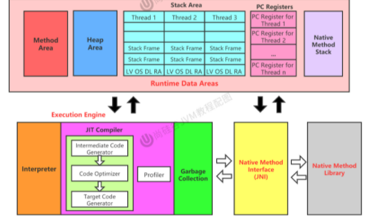

[TOC]

# 前言

1. 字节码
   1. 任何能在jvm平台上执行的字节码格式都是一样的
   2. 统称为jvm字节码

## 虚拟机

1. 一台执行java字节码的虚拟计算机，用来执行一系列虚拟计算机指令
2. 特点：
   - 一次编译，到处运行
   - 自动内存管理
   - 自动垃圾回收
3. 位置：
   - jvm是运行在操作系统上的，与硬件没有直接交互
   - 

## 整体结构

1. 详细图：

   

2. 执行引擎：

   

## jvm的架构模型

1.  jvm编译器输入的指令流有两种：
   - 基于栈的指令集架构
     - 架构和实现更简单，适合资源受限的系统
     - 使用零地址指令分配
     - 不需要硬件支持，跨平台更好
   - 基于寄存器的指令集架构
     - 典型的应用：x86的二进制指令集
     - 性能优秀，执行更高效
     - 完全依赖硬件，可移植性差
     - 

 