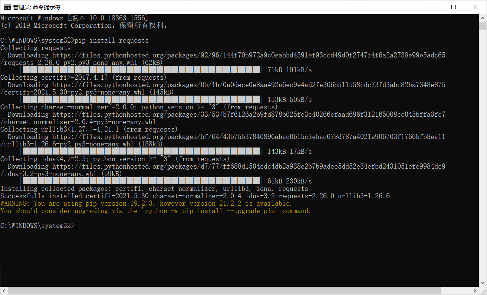

[TOC]

# Requests库的安装

步骤

1. 管理员身份进入cmd

2. 输入命令`pip install requests`

   

3. 测试安装

   

# Requests库的get()方法

1. `r = requests.get(url)`
   - 构造一个向服务器请求资源的Request对象
   - 返回一个包含服务器资源的**Response对象** r
   - Response对象包含从服务器返回的所有资源
2. `requests.get(url, params=None,** kwargs)`
   - url：拟获取页面的url链接
   - params：url中的额外参数，字典或字节流格式，可选
   - **kwargs：12个控制访问的参数
3. Response对象的属性
   - `r.status_code`：HTTP请求的返回状态，200表示连接成功，404表示失败
   - `r.text`：HTTP响应内容的字符串形式，即，url对应的页面内容
   - `r.encoding`：从HTTP header中猜测的响应内容编码方式
   - `r.apparent_encoding`：从内容中分析出的响应内容编码方式(备选编码方式)
   - `r.content`：HTTP响应内容的二进制形式（图片资源以二进制存储）
4. 两种编码方式
   1. `r.encoding`：从HTTP header中猜测的响应内容编码方式
      - 如果header中不存在charset，则认为编码为 ISO-8859-1
   2. `r.apparent_encoding`：从内容中分析出的响应内容编码方式（备选编码方式)
      - 根据网页内容分析出的编码方式

# 爬取网页的通用代码框架

## Requests库的异常

- `requests.ConnectionError`：网络连接错误异常，如DNS查询失败、拒绝连接等
- `requests.HTTPError`：HTTP错误异常
- `requests.URLRequired`：URL缺失异常
- `requests.TooManyRedirects`：超过最大重定向次数，产生重定向异常
- `requests.ConnectTimeout`：连接远程服务器超时异常
- `requests.Timeout`：请求URL超时，产生超时异常

- `r.raise_for_status)`：如果不是200，产生异常**requests.HTTPError**

## 爬取网页的**通用代码框架**：

```python
import requests
def getHTMLText(url):
    try:
        r=requests.get(url,timeout=30)
        r.raise_for_status()#如果状态不是200，引发HTTPError异常
        r.encoding=r.apparent_encoding
        return r.text
    except:
        return "产生异常"
if __name__=="__main__":
    url="http://www.baidu.com"
    print(getHTMLText(url))
```

# HTTP协议及Requests库方法

1. HTTP协议：
   - Hypertext Transfer Protocol，超文本传输协议。
   - HTTP是一个基于“**请求与响应**”模式的、**无状态**（第一次请求和第二次请求之间没有相关的关联）的**应用层协议**（工作在TCP协议之上）。
   - HTTP协议采用URL作为定位网络资源的标识。
   - URL格式 `http://host[:port]lpath]`
     - host：合法的Internet主机域名或P地址
     - port：端口号，缺省端口为80
     - path：请求资源的路径
   - URL是通过HTTP协议存取资源的Internet路径，一个URL对应一个数据资源。
2. HTTP协议对资源的操作
   - `GET`：请求获取URL位置的资源
   - `HEAD`：请求获取URL位置资源的响应消息报告，即获得该资源的头部信息
   - `POST`：请求向URL位置的资源后附加新的数据
   - `PUT`：请求向URL位置存储一个资源，覆盖原URL位置的资源
   - `PATCH`：请求局部更新URL位置的资源，即改变该处资源的部分内容
   - `DELETE`：请求删除URL位置存储的资源
   - `PATCH`和`PUT`的区别：
     - 假设URL位置有一组数据UserInfo，包括UserID、UserName等20个字段。
     - 需求:用户修改了UserName,其他不变。
     - 采用PATCH,仅向URL提交UserName的局部更新请求。**(节省网络带宽)**
     - 采用PUT,必须将所有20个字段一并提交到URL,未提交字段被删除。

# Requests库主要方法解析

1. Requests库的7个主要方法
   1. `requests.request()`：构造一个请求，支撑以下各方法的基础方法

      - `requests.request(method, url,**kwargs)`

      - method:请求方式，对应get/put/post等7种

        ```python
        r=requests.request('GET', url,**kwargs)
        r =requests.request('HEAD', url，**kwargs)
        r = requests.request('POST', url,**kwargs)
        r = requests.request('PUT', url,**kwargs)
        r = requests.request('PATCH',url,**kwargs)
        r=requests.request('delete', url,**kwargs)
        r=requests.request('OPTIONS', url,**kwargs)
        ```

      - url:拟获取页面的url链接

      - **kwargs:控制访问的参数,共13个

   2. `requests.get()`：获取HTML网页的主要方法，对应于HTTP的GET

      - `requests.get(url, params=None,**kwargs)`
      - url:拟获取页面的url链接
      - params: url中的额外参数，字典或字节流格式,可选
      - **kwargs:12个控制访问的参数

   3. `requests.head()`：获取HTML网页头信息的方法，对应于HTTP的HEAD

      - `requests.head(url,**kwargs)`
      - url:拟获取页面的url链接
      - *kwargs: 13个控制访问的参数

   4. `requests.post()`：向HTML网页提交POST请求的方法，对应于HTTP的POST

      - `requests.post(url, data=None, json=None,**kwargs)`
      - url:拟更新页面的url链接
        data:字典、字节序列或文件，Request的内容
      - json: JSON格式的数据,Request的内容
      - **kwargs: 11个控制访问的参数

   5. `requests.put()`：向HTML网页提交PUT请求的方法，对应于HTTP的PUT

      - `requests.put(url, data=None， **kwargs)`
      - url:拟更新页面的url链接
      - data:字典、字节序列或文件,Request的内容
      - **kwargs: 12个控制访问的参数

   6. `requests.patch()`：向HTML网页提交局部修改请求，对应于HTTP的PATCH

      - `requests.patch(url, data=None,**kwargs)`
      - url:拟更新页面的url链接
      - data:字典、字节序列或文件,Request的内容
      - **kwargs: 12个控制访问的参数

   7. `requests.delete()`：向HTML页面提交删除请求，对应于HTTP的DELETE

      - `requests.delete(url, **kwargs)`
      - url:拟删除页面的url链接
      - **kwargs : 13个控制访问的参数

# 小结


