# 案例

地址：https://blog.csdn.net/weixin_42608414/article/details/105369944

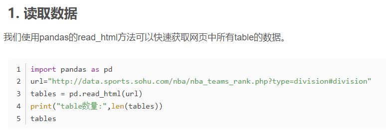

1. 下载pandas库：

   - 使用 pip 安装 pandas:  `pip install pandas`

   - 先下载pip：

     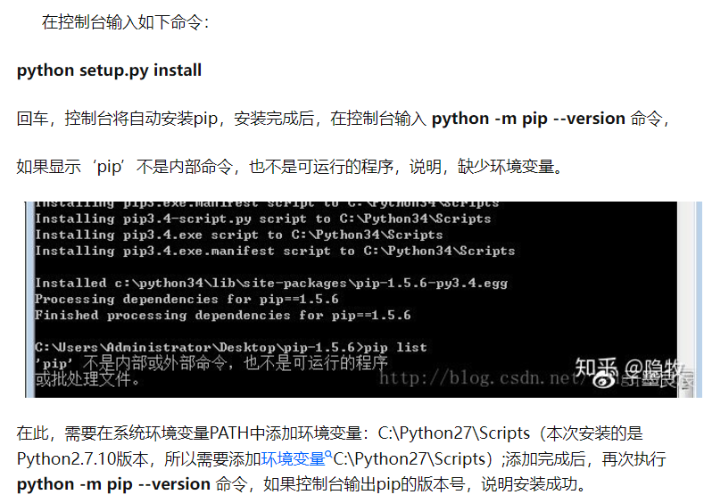

     完成使用pip下载pandas：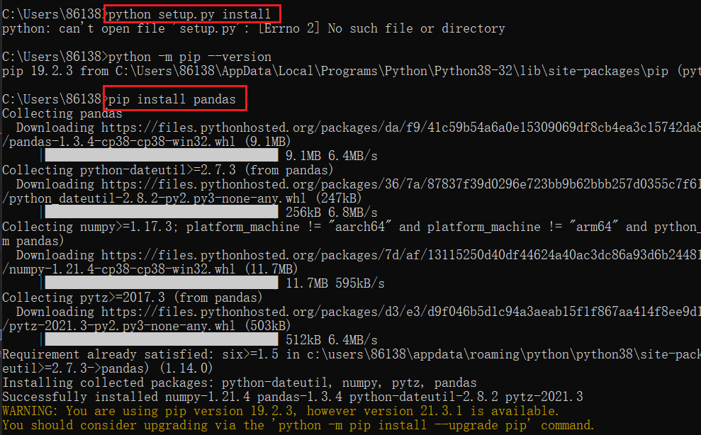

2. 报错： lxml not found, please install it

   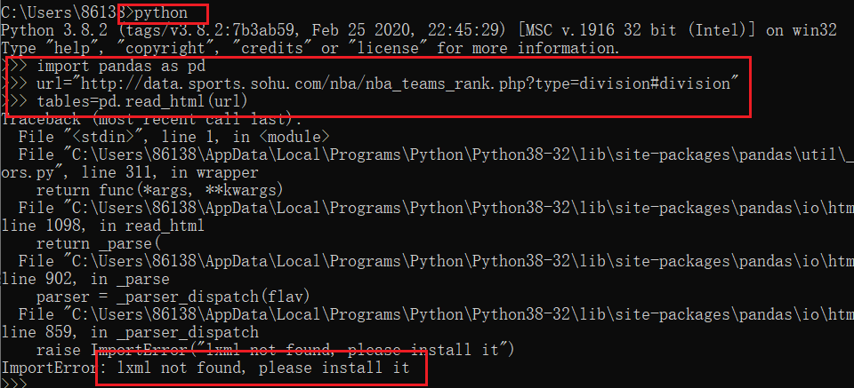

   下载lxml：

   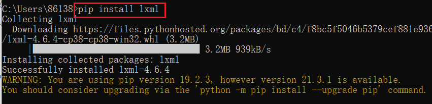

3. 获取成功：

   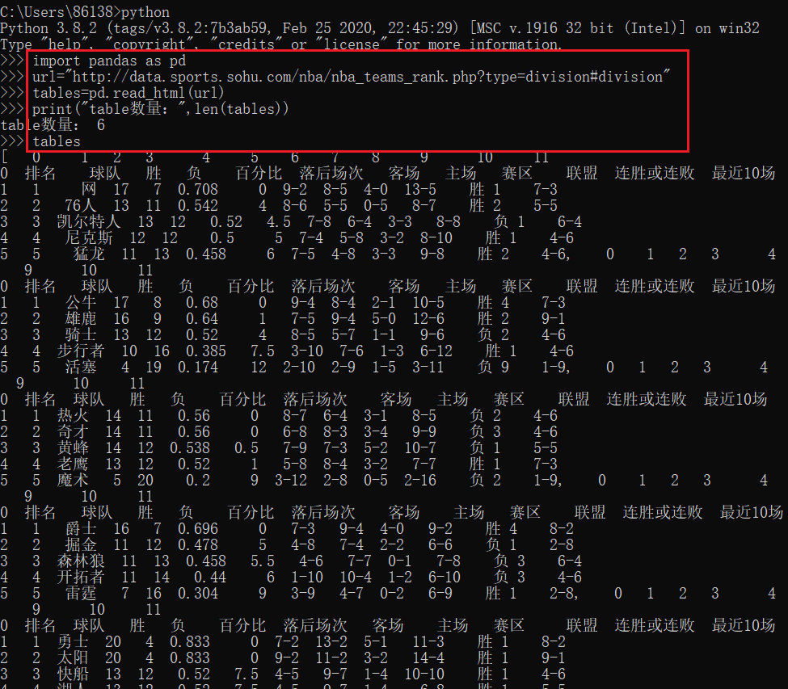

4. 调整格式：

   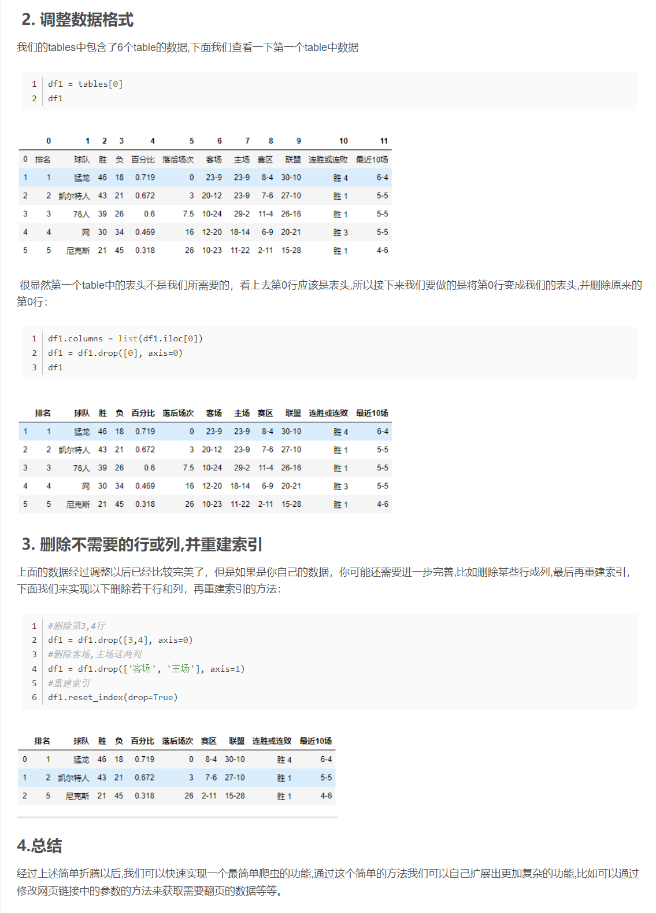

# 测试

1. 报错： html5lib not found, please install it

   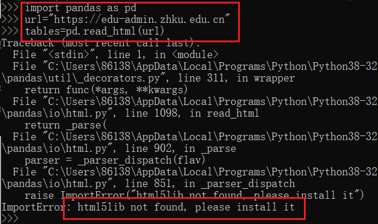

2. 安装 html5lib：

   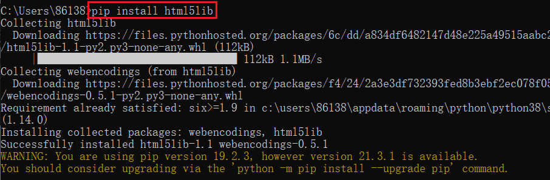

3. 报错：BeautifulSoup4 (bs4) not found, please install it

4. 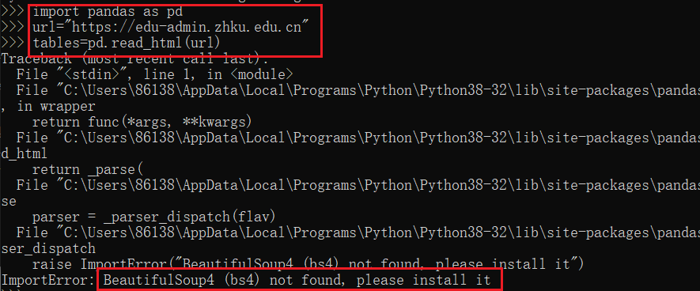

5. 安装bs4：

   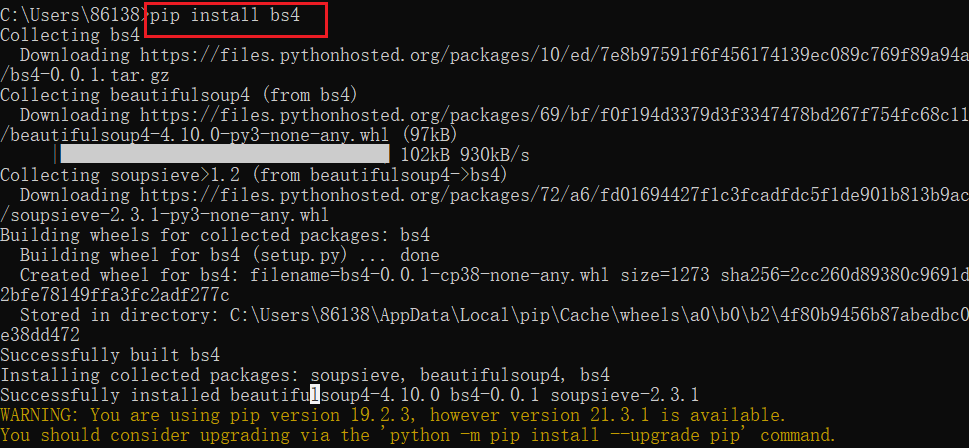

   