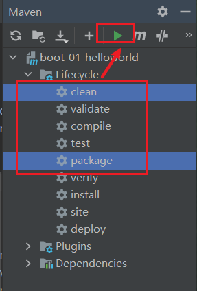
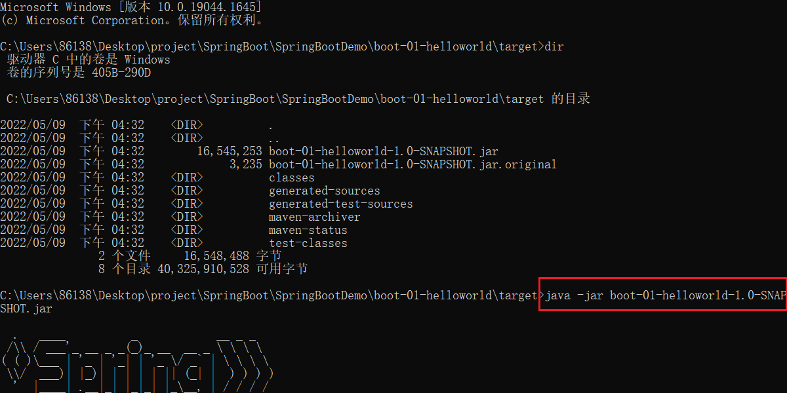
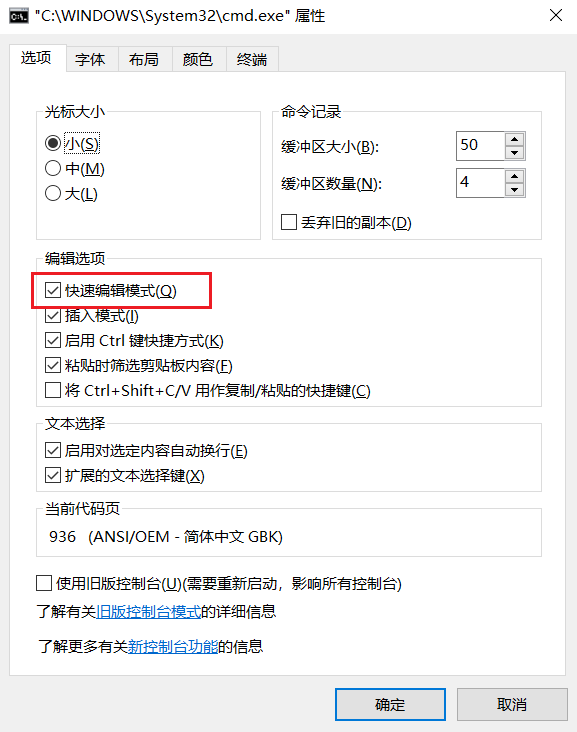
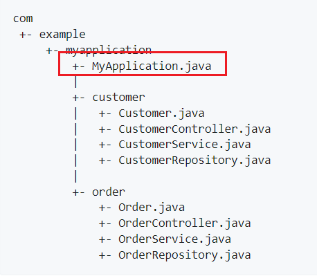
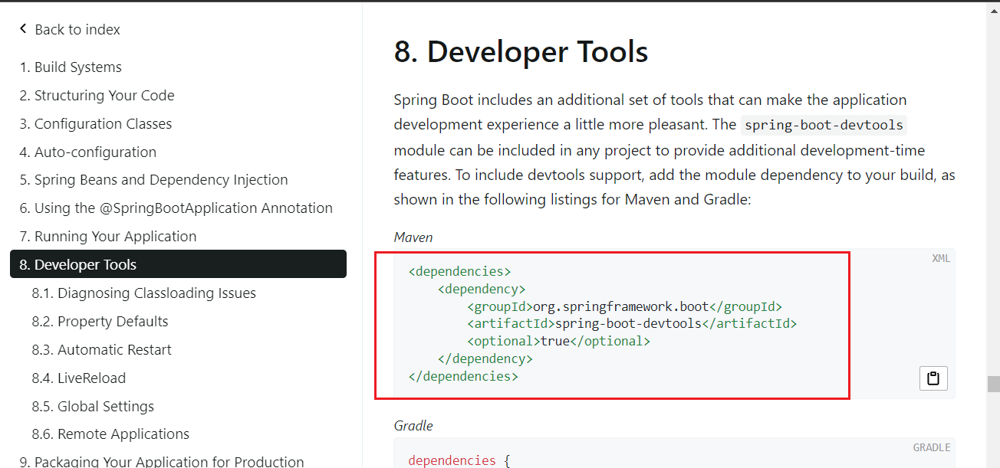
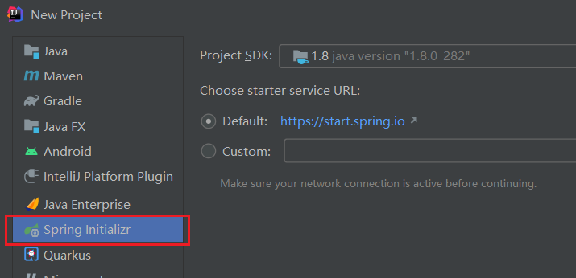
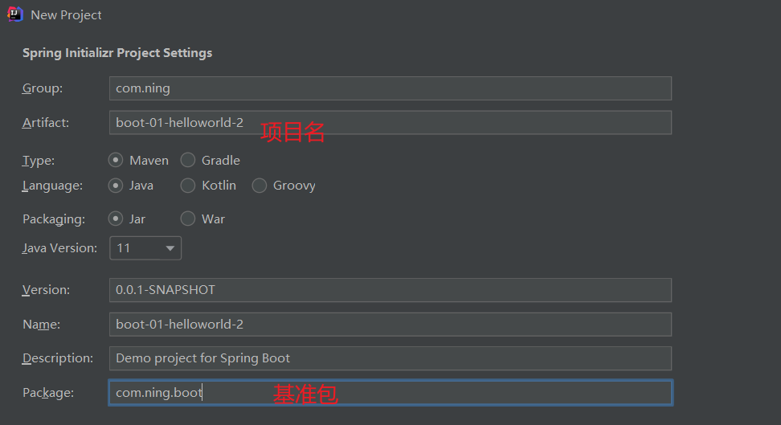
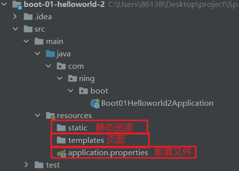

[TOC]

# SpringBoot基础入门

1.  作用：能快速创建生产级别的Spring应用
2. 优点：
   1. 创建独立的spring应用
   2. 内嵌web服务器
   3. 自动started依赖，简化构建配置
   4. 自动配置Spring以及第三方功能
   5. 提供生产级别的监控，健康检查及外部化配置
3. 背景：
   1. 微服务：
      1. 微服务是一种架构风格
      2. —个应用拆分为一组小型服务
      3. 每个服务运行在自己的进程内，也就是可独立部署和升级
      4. 服务之间使用轻量级HTTP交互
      5. 服务围绕业务功能拆分
      6. 可以由全自动部署机制独立部署
      7. 去中心化，服务自治。服务可以使用同的语言、不同的存储技术
   2. 分布式
      1. 产生的问题：
         1. 远程调用
         2. 服务发现
         3. 负载均衡
         4. 服务容错
         5. 配置管理
         6. 服务监控
         7. 链路追踪
         8. 日志管理
         9. 任务调度
      2. 解决：Springboot＋Springcloud 

## 入门案例

1. 修改maven的配置文件：

   ```xml
   <mirrors>
         <mirror>
           <id>nexus-aliyun</id>
           <mirrorOf>central</mirrorOf>
           <name>Nexus aliyun</name>
           <url>http://maven.aliyun.com/nexus/content/groups/public</url>
         </mirror>
     </mirrors>
    
     <profiles>
            <profile>
                 <id>jdk-1.8</id>
                 <activation>
                   <activeByDefault>true</activeByDefault>
                   <jdk>1.8</jdk>
                 </activation>
                 <properties>
                   <maven.compiler.source>1.8</maven.compiler.source>
                   <maven.compiler.target>1.8</maven.compiler.target>
                   <maven.compiler.compilerVersion>1.8</maven.compiler.compilerVersion>
                 </properties>
            </profile>
     </profiles>
   ```

2. 导入约束：

   ```xml
   <parent>
       <groupId>org.springframework.boot</groupId>
       <artifactId>spring-boot-starter-parent</artifactId>
       <version>2.3.4.RELEASE</version>
   </parent>
   
   <dependencies>
       <dependency>
           <groupId>org.springframework.boot</groupId>
           <artifactId>spring-boot-starter-web</artifactId>
       </dependency>
   </dependencies>
   ```

3. 编写主程序类：

   `@SpringBootApplication`注解：是一个Springboot应用

   ```java
   /**
    * 主程序类
    */
   @SpringBootApplication
   public class MainApplication {
       public static void main(String[] args) {
           SpringApplication.run(MainApplication.class,args);
       }
   }
   ```

4. 编写一个Controller类：

   ```java
   //@Controller
   //@ResponseBody
   @RestController
   public class HelloController {
   
   
       @RequestMapping("/hello")
       public String handle01(){
           return "Hello,Spring Boot 2!";
       }
   }
   ```

   1. `@ResponseBody`注解：返回一个字符串，而不是解析成一个页面，可以放在方法前和类前
   2. `@RestController`注解：@`Controller`+`@ResponseBody`

5. 测试：直接允许main方法

6. 编写一个Spring Boot的配置文件**（简化配置）**

   1. 修改配置的唯一文件
   2. 参考：https://docs.spring.io/spring-boot/docs/current/reference/html/application-properties.html#appendix.application-properties.server
   3. 示例：

7. 引入插件：

   ```xml
   <build>
       <plugins>
           <plugin>
               <groupId>org.springframework.boot</groupId>
               <artifactId>spring-boot-maven-plugin</artifactId>
               <version>2.3.4.RELEASE</version>
           </plugin>
       </plugins>
   </build>
   ```

   把项目打包成jar包就可以在目标服务器部署了

   

   

   要把这个去掉：

   

## 自动配置原理

### 依赖管理

1. 父项目：

   1. 作用：用于做依赖管理

      ```xml
      <parent>  		       <groupId>org.springframework.boot</groupId>
          <artifactId>spring-boot-starter-parent</artifactId>
          <version>2.3.4.RELEASE</version>
      </parent>
      ```

   2. 夫项目中几乎声明了所有开发中常用的依赖的版本号，无需关注版本号，自动版本仲裁机制

   3. 修改版本：

      1. 查看spring-boot-dependencies里面规定当前依赖的版本用的key

      2. 在当前项目里面重写配置：

         ```xml
         <properties>
             <mysql.version>5.1.43</mysql.version>
         </properties>
         ```

2. start场景启动器：

   1. spring-boot-starter-* ： *指某种场景

   2. 只要引入starter，这个场景的所有常规需要的依赖我们都自动引入SpringBoot所有支持的场景

   3. *-spring-boot-starter： 第三方为我们提供的简化开发的场景启动器

   4. 所有场景启动器都依赖：

      ```xml
      <dependency>
        <groupId>org.springframework.boot</groupId>
        <artifactId>spring-boot-starter</artifactId>
        <version>2.3.4.RELEASE</version>
        <scope>compile</scope>
      </dependency>
      ```

### 自动配置

springboot自动配置了很多东西：

1. 自动配好Tomcat：

   1. 引入Tomcat依赖：

      ```xml
      <dependency>
            <groupId>org.springframework.boot</groupId>
            <artifactId>spring-boot-starter-tomcat</artifactId>
            <version>2.3.4.RELEASE</version>
            <scope>compile</scope>
          </dependency>
      ```

   2. 自动配置Tomcat

2. 自动配好SpringMVC

   1. 引入SpringMVC全套组件
   2. 自动配好SpringMVC常用组件（功能）

3. 自动配好Web常见功能，如：字符编码问题

4. 默认的包结构

   1. 主程序所在包及其下面的所有子包里面的组件都会被默认扫描进来，无需以前的包扫描配置

      

   2. 改变扫描路径，在主程序中添加注解：`@SpringBootApplication(scanBasePackages=**"com.atguigu"**)`或`@ComponentScan`

   3. 分析：

      ```xml
      @SpringBootApplication
      等同于
      @SpringBootConfiguration
      @EnableAutoConfiguration
      @ComponentScan("com.atguigu.boot")
      ```

5. 各种配置拥有默认值

   1. 默认配置最终都是映射到某个类上
   2. 配置文件的值最终会绑定每个类上，这个类会在容器中创建对象

6. 按需加载所有自动配置项

   1. 非常多的starter，引入了哪些场景这个场景的自动配置才会开启
   2. SpringBoot所有的自动配置功能都在 spring-boot-autoconfigure 包里面

## 容器功能

### 组件添加

1. `@Configuration`：告诉SpringBoot这是一个配置类

2. 配置类里面使用@Bean标注在方法上给容器注册组件，默认也是单实例的

   ```java
   /**
    * 配置类
    */
   @Configuration//告诉SpringBoot这是一个配置类
   public class MyConfig {
       @Bean//给容器添加组件，以方法名作为组件的id。返回类型是组件类型，返回值是组件在容器中的实例
       public User user01(){
           return new User("zhangsan",18);
       }
   
       @Bean
       public Pet tomcatPet(){
           return new Pet("tomcat");
       }
   }
   ```

3. 配置类本身也是组件

4. `@Configuration`注解的`proxyBeanMethods`属性：

   ```java
   @Configuration(proxyBeanMethods = true)
   public class MyConfig {
       @Bean
       public User user01(){
           return new User("zhangsan",18);
       }
   }
   ```

   1. 这个属性决定这个bean是否代理
   2. 值：
      1. true（默认值）：代理，Full模式
      2. false：不代理，Lite模式（轻量级，调用的时候不需要到容器中检查）
   3. 即`proxyBeanMethods=true`时，springboot会检查这个组件是否在容器中
   4. 作用：保持组件单实例

### @Import()注解

1. 作用：给容器中自动创建出某种类型的组件
2. 格式：`@Import({User.class, DBHelper.class})`
2. 位置：类前
2. 默认组件的名字就是全类名

### @Conditional注解

1. 作用：条件装配，满足Conditional指定的的条件时进行组件的注入
2. 示例：
   1. `@ConditionalOnBean(name = "tom")`
   2. 有名为tom的组件时候生效
3. 位置：
   1. 类前
   2. 方法前

### @ImportResource注解

1. 用于配置绑定
2. 示例：`@ImportResource("classpath:beans.xml"`
3. 将beans.xml配置文件中的组件引入

### 配置绑定

1. 将properties中的配置绑定到JavaBean中

2. 原生 ：

   ```java
   public class getProperties {
        public static void main(String[] args) throws FileNotFoundException, IOException {
            Properties pps = new Properties();
            pps.load(new FileInputStream("a.properties"));
            Enumeration enum1 = pps.propertyNames();//得到配置文件的名字
            while(enum1.hasMoreElements()) {
                String strKey = (String) enum1.nextElement();
                String strValue = pps.getProperty(strKey);
                System.out.println(strKey + "=" + strValue);
                //封装到JavaBean。
            }
        }
    }
   ```

#### 方式一：@ConfigurationProperties+@Component

1. 在**JavaBean类**前编写`@ConfigurationProperties`注解，绑定配置文件中的值：

   1. prefix属性指定跟配置文件中的哪个属性绑定

   ```java
   @ConfigurationProperties(prefix = "mycar")
   ```

2. 同时需要给JavaBean添加`@Component`注解

3. 测试：

   ```java
   @Autowired
   Car car;
   
   @RequestMapping("/car")
   public Car car(){
       return car;
   }
   ```

#### 方式二：@EnableConfigurationProperties

1. 在**配置类**前编写@EnableConfigurationProperties注解
2. 不需要给JavaBean添加`@Component`注解
3. 示例：`@EnableConfigurationProperties(Car.class)`
4. 作用：
   1. 开启Car配置绑定功能
   2. 把Car组件自动注册到容器中

### 【源码分析】自动配置

分析：@SpringBootApplication=@SpringBootConfiguration**+**@EnableAutoConfiguration+@ComponentScan("com.ning.boot")

### 实践-如何编写web应用

1. 引入场景依赖：https://docs.spring.io/spring-boot/docs/current/reference/html/using-spring-boot.html#using-boot-starter
2. 查看自动配置了哪些：
   1. 自己分析，引入场景对应的自动配置一般都生效了
   2. 配置文件中添加debug=true开启自动配置报告。
      1. Negative（不生效）
      2. Positive（生效）
3. 是否需要修改：
   1. 参照文档修改配置项：https://docs.spring.io/spring-boot/docs/current/reference/html/appendix-application-properties.html#common-application-properties
   2. 自己分析。xxxxProperties绑定了配置文件的哪些
   3. 自定义加入或者替换组件：@Bean、@Component
   4. 自定义器：XXXXXCustomizer

## 开发小技巧

### Lombok

1. 导入坐标：

   ```xml
   <dependency>
   <groupId>org.projectlombok</groupId>
   <artifactId>lombok</artifactId>
   </dependency>
   ```

2. 安装插件，重启idea

3. 使用：

   1. getter和setter：`@Data`
   2. 有参构造器：`@AllArgsConstructor`
   3. 无参构造器：`@NoArgsConstructor`
   4. toString()：`@ToString`
   5. 日志：`@Slf4j`

### dev-tools

1. 导入坐标：

   ```xml
   <dependencies>    <dependency>        <groupId>org.springframework.boot</groupId>        <artifactId>spring-boot-devtools</artifactId>        <optional>true</optional>    </dependency> </dependencies>
   ```

   

2. 作用：热更新

3. 使用：Ctrl+f9

### Spring Initailizr（项目初始化向导）

1. 创建新项目时：

   

2. 自定义：（java8）

   

3. 勾选需要使用的场景：

   

4. 会自动把项目创建好：

   

# SpringBoot核心功能

## 配置文件

### properties文件

同以前的properties用法

### yaml

1. 简介：

   1. YAML是~YAML Ain't Markup Language" (YAML 不是一种标记语言) 的递归缩写。
   2. 在开发的这种语言时，YAML的意思其实是: "Yet Another Markup Language" (仍是一种标记语言) 。

2. 基本用法：

   1. `key: value`;  kv之间有空格
   2. 大小写敏感
   3. 使用缩进表示层级关系
   4. 缩进不允许使用tab,只允许空格
   5. 缩进的空格数不重要，只要相同层级的元素左对齐即可
   6. '#'表示注释
   7. 字符串无需加引号，如果要加，“与"表示字符串内容会被转义/不转义

3. 数据类型的表示：

   1. 字面量（不可再分的值）：

      ```yaml
      k: v
      ```

   2. 对象（键值对的集合）：

      ```yaml
      #行内写法
      k: {k1:v1,k2:v2,k3:v3}
      
      k:
       k1: v1
       k2: v2
       k3: v3
      ```

   3. 数组：

      ```yaml
      #行内写法
      k: [v1,v2,v3]
      
      k:
       - v1
       - v2
       - v3
      ```

4. 示例：

   ```java
   @Data
   public class Person {
   	
   	private String userName;
   	private Boolean boss;
   	private Date birth;
   	private Integer age;
   	private Pet pet;
   	private String[] interests;
   	private List<String> animal;
   	private Map<String, Object> score;
   	private Set<Double> salarys;
   	private Map<String, List<Pet>> allPets;
   }
   
   @Data
   public class Pet {
   	private String name;
   	private Double weight;
   }
   ```

5. yaml写法：

   ```yaml
   # yaml表示以上对象
   person:
     userName: zhangsan
     boss: false
     birth: 2019/12/12 20:12:33
     age: 18
     pet: 
       name: tomcat
       weight: 23.4
     interests: [篮球,游泳]
     animal: 
       - jerry
       - mario
     score:
       english: 
         first: 30
         second: 40
         third: 50
       math: [131,140,148]
       chinese: {first: 128,second: 136}
     salarys: [3999,4999.98,5999.99]
     allPets:
       sick:
         - {name: tom}
         - {name: jerry,weight: 47}
       health: [{name: mario,weight: 47}]
   ```

6. 注意：

   1. 单引号会将`\n`作为字符串输出
   2. 双引号会将`\n`作为换行输出

7. 设置配置提示，并且设置成打包时不包括：

   ```xml
   <dependency>
       <groupId>org.springframework.boot</groupId>
       <artifactId>spring-boot-configuration-processor</artifactId>
       <optional>true</optional>
   </dependency>
   
   <project>
       <build>
           <plugins>
               <plugin>          <groupId>org.springframework.boot</groupId>
                   <artifactId>spring-boot-maven-plugin</artifactId>
                   <configuration>
                       <excludes>
                           <exclude>
                               <groupId>org.springframework.boot</groupId>
                               <artifactId>spring-boot-configuration-processor</artifactId>
                           </exclude>
                       </excludes>
                   </configuration>
               </plugin>
           </plugins>
       </build>
   </project>
   ```

## 