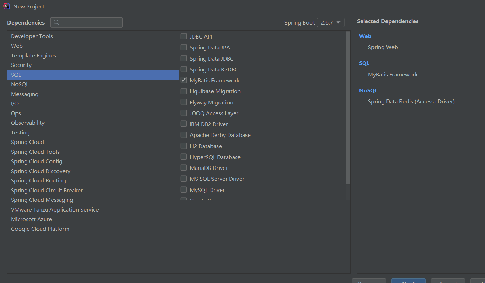

[TOC]

# SpringBoot基础入门

1.  作用：能快速创建生产级别的Spring应用
2. 优点：
   1. 创建独立的spring应用
   2. 内嵌web服务器
   3. 自动started依赖，简化构建配置
   4. 自动配置Spring以及第三方功能
   5. 提供生产级别的监控，健康检查及外部化配置
3. 背景：
   1. 微服务：
      1. 微服务是一种架构风格
      2. —个应用拆分为一组小型服务
      3. 每个服务运行在自己的进程内，也就是可独立部署和升级
      4. 服务之间使用轻量级HTTP交互
      5. 服务围绕业务功能拆分
      6. 可以由全自动部署机制独立部署
      7. 去中心化，服务自治。服务可以使用同的语言、不同的存储技术
   2. 分布式
      1. 产生的问题：
         1. 远程调用
         2. 服务发现
         3. 负载均衡
         4. 服务容错
         5. 配置管理
         6. 服务监控
         7. 链路追踪
         8. 日志管理
         9. 任务调度
      2. 解决：Springboot＋Springcloud 

## 入门案例

1. 修改maven的配置文件：

   

   在maven安装路径下的conf/settings.xml中：

   修改内容：使用阿里云镜像加快镜像的下载，使用jdk1.8进行项目的编译

   ```xml
   <mirrors>
         <mirror>
           <id>nexus-aliyun</id>
           <mirrorOf>central</mirrorOf>
           <name>Nexus aliyun</name>
           <url>http://maven.aliyun.com/nexus/content/groups/public</url>
         </mirror>
     </mirrors>
    
     <profiles>
            <profile>
                 <id>jdk-1.8</id>
                 <activation>
                   <activeByDefault>true</activeByDefault>
                   <jdk>1.8</jdk>
                 </activation>
                 <properties>
                   <maven.compiler.source>1.8</maven.compiler.source>
                   <maven.compiler.target>1.8</maven.compiler.target>
                   <maven.compiler.compilerVersion>1.8</maven.compiler.compilerVersion>
                 </properties>
            </profile>
     </profiles>
   ```

2. 导入约束：

   ```xml
   <parent>
       <groupId>org.springframework.boot</groupId>
       <artifactId>spring-boot-starter-parent</artifactId>
       <version>2.3.4.RELEASE</version>
   </parent>
   
   <dependencies>
       <dependency>
           <groupId>org.springframework.boot</groupId>
           <artifactId>spring-boot-starter-web</artifactId>
       </dependency>
   </dependencies>
   ```

3. 编写**主程序类**：

   `@SpringBootApplication`注解：是一个Springboot应用

   ```java
   /**
    * 主程序类
    */
   @SpringBootApplication
   public class MainApplication {
       public static void main(String[] args) {
           SpringApplication.run(MainApplication.class,args);
       }
   }
   ```

4. 编写一个Controller类：

   ```java
   //@Controller 
   //@ResponseBody
   @RestController
   public class HelloController {
   
   
       @RequestMapping("/hello")
       public String handle01(){
           return "Hello,Spring Boot 2!";
       }
   }
   ```

   1. `@ResponseBody`注解：返回一个字符串，而不是解析成一个页面，可以放在方法前和类前
   2. `@RestController`注解：@`Controller`+`@ResponseBody`

5. 测试：直接运行main方法

6. 编写一个Spring Boot的配置文件**（简化配置）**

   1. 修改配置的唯一文件
   2. 参考：https://docs.spring.io/spring-boot/docs/current/reference/html/application-properties.html#appendix.application-properties.server
   3. 示例：

7. 可以直接将项目打包成一个可运行的jar包（fat jars）

   1. 引入插件：
   
   ```xml
   <build>
       <plugins>
           <plugin>
               <groupId>org.springframework.boot</groupId>
               <artifactId>spring-boot-maven-plugin</artifactId>
               <version>2.3.4.RELEASE</version>
           </plugin>
       </plugins>
   </build>
   ```

   2. 把项目打包成jar包就可以在目标服务器部署了

   

   

   要把这个去掉（可能会卡住）：
   
   

## 自动配置原理

### 依赖管理

1. 父项目（每个都有）：

   1. 作用：用于做依赖管理

      ```xml
      <parent>  		       
          <groupId>org.springframework.boot</groupId>
          <artifactId>spring-boot-starter-parent</artifactId>
          <version>2.3.4.RELEASE</version>
      </parent>
      ```

   2. 父项目中几乎声明了所有开发中常用的依赖的版本号，无需关注版本号，自动版本仲裁机制

   3. 修改版本：

      1. 查看spring-boot-dependencies里面规定当前依赖的版本用的key

      2. 在当前项目里面重写配置：

         ```xml
         <properties>
             <mysql.version>5.1.43</mysql.version>
         </properties>
         ```

2. start场景启动器：

   1. spring-boot-starter-* ： *指某种场景

   2. 只要引入starter，这个场景的所有常规需要的依赖我们都自动引入SpringBoot所有支持的场景

   3. *-spring-boot-starter： 第三方为我们提供的简化开发的场景启动器

   4. 所有场景启动器都依赖：

      ```xml
      <dependency>
        <groupId>org.springframework.boot</groupId>
        <artifactId>spring-boot-starter</artifactId>
        <version>2.3.4.RELEASE</version>
        <scope>compile</scope>
      </dependency>
      ```

### 自动配置

springboot自动配置了很多东西：

1. 自动配好Tomcat：

   1. 引入Tomcat依赖：

      ```xml
      <dependency>
            <groupId>org.springframework.boot</groupId>
            <artifactId>spring-boot-starter-tomcat</artifactId>
            <version>2.3.4.RELEASE</version>
            <scope>compile</scope>
          </dependency>
      ```

   2. 自动配置Tomcat

2. 自动配好SpringMVC

   1. 引入SpringMVC全套组件

   2. 自动配好SpringMVC常用组件（功能）

      ```java
      //        返回了IOC容器
              ConfigurableApplicationContext run = SpringApplication.run(MainApplication.class, args);
      //        查看容器里面的组件
              String[] names = run.getBeanDefinitionNames();
              for (String name : names) {
                  System.out.println(name);
              }
      ```

3. 自动配好Web常见功能，如：字符编码问题

4. 默认的包结构

   1. 主程序所在包及其下面的所有子包里面的组件都会被默认扫描进来，无需以前的包扫描配置

      

   2. 改变扫描路径，在主程序中添加注解：`@SpringBootApplication(scanBasePackages=**"com.atguigu"**)`或`@ComponentScan`

   3. 分析：

      ```xml
      @SpringBootApplication
      等同于
      @SpringBootConfiguration
      @EnableAutoConfiguration
      @ComponentScan("com.atguigu.boot")
      ```

5. 各种配置拥有默认值

   1. 默认配置最终都是映射到某个类上
   2. 配置文件的值最终会绑定每个类上，这个类会在容器中创建对象

6. 按需加载所有自动配置项

   1. 非常多的starter，引入了哪些场景这个场景的自动配置才会开启
   2. SpringBoot所有的自动配置功能都在 spring-boot-autoconfigure 包里面

## 容器功能

### 组件添加

1. `@Configuration`：告诉SpringBoot这是一个配置类

2. 配置类里面使用@Bean标注在方法上给容器注册组件，默认也是单实例的

   ```java
   /**
    * 配置类
    */
   @Configuration//告诉SpringBoot这是一个配置类
   public class MyConfig {
       @Bean//给容器添加组件，以方法名作为组件的id。返回类型是组件类型，返回值是组件在容器中的实例
       public User user01(){
           return new User("zhangsan",18);
       }
   
       @Bean
       public Pet tomcatPet(){
           return new Pet("tomcat");
       }
   }
   ```

3. 配置类本身也是组件

4. `@Configuration`注解的`proxyBeanMethods`属性：

   ```java
   @Configuration(proxyBeanMethods = true)
   public class MyConfig {
       @Bean
       public User user01(){
           return new User("zhangsan",18);
       }
   }
   ```

   1. 这个属性决定这个bean是否代理
   2. 值：
      1. true（默认值）：代理，Full模式
      2. false：不代理，Lite模式（轻量级，调用的时候不需要到容器中检查）
   3. 即`proxyBeanMethods=true`时，springboot会检查这个组件是否在容器中
   4. 作用：保持组件单实例

### @Import()注解

1. 作用：给容器中自动创建出某种类型的组件
2. 格式：`@Import({User.class, DBHelper.class})`
2. 位置：类前
2. 默认组件的名字就是全类名

### @Conditional注解

1. 作用：条件装配，满足Conditional指定的的条件时进行组件的注入
2. 示例：
   1. `@ConditionalOnBean(name = "tom")`
   2. 有名为tom的组件时候生效
3. 位置：
   1. 类前
   2. 方法前

### @ImportResource注解

1. 用于配置绑定
2. 示例：`@ImportResource("classpath:beans.xml)"`
3. 将beans.xml配置文件中的组件引入

### 配置绑定

1. 将properties中的配置绑定到JavaBean中

2. 原生 ：

   ```java
   public class getProperties {
        public static void main(String[] args) throws FileNotFoundException, IOException {
            Properties pps = new Properties();
            pps.load(new FileInputStream("a.properties"));
            Enumeration enum1 = pps.propertyNames();//得到配置文件的名字
            while(enum1.hasMoreElements()) {
                String strKey = (String) enum1.nextElement();
                String strValue = pps.getProperty(strKey);
                System.out.println(strKey + "=" + strValue);
                //封装到JavaBean。
            }
        }
    }
   ```

#### 方式一：@ConfigurationProperties+@Component

1. 在**JavaBean类**前编写`@ConfigurationProperties`注解，绑定配置文件中的值：

   1. prefix属性指定跟配置文件中的哪个属性绑定

   ```java
   @ConfigurationProperties(prefix = "mycar")
   ```

2. 同时需要给JavaBean添加`@Component`注解

3. 测试：

   ```java
   @Autowired
   Car car;
   
   @RequestMapping("/car")
   public Car car(){
       return car;
   }
   ```

#### 方式二：@EnableConfigurationProperties

1. 在**配置类**前编写@EnableConfigurationProperties注解
2. 不需要给JavaBean添加`@Component`注解
3. 示例：`@EnableConfigurationProperties(Car.class)`
4. 作用：
   1. 开启Car配置绑定功能
   2. 把Car组件自动注册到容器中

### 【源码分析】自动配置

分析：@SpringBootApplication=@SpringBootConfiguration**+**@EnableAutoConfiguration+@ComponentScan("com.ning.boot")

### 实践-如何编写web应用

1. 引入场景依赖：https://docs.spring.io/spring-boot/docs/current/reference/html/using-spring-boot.html#using-boot-starter
2. 查看自动配置了哪些：
   1. 自己分析，引入场景对应的自动配置一般都生效了
   2. 配置文件中添加debug=true开启自动配置报告。
      1. Negative（不生效）
      2. Positive（生效）
3. 是否需要修改：
   1. 参照文档修改配置项：https://docs.spring.io/spring-boot/docs/current/reference/html/appendix-application-properties.html#common-application-properties
   2. 自己分析。xxxxProperties绑定了配置文件的哪些
   3. 自定义加入或者替换组件：@Bean、@Component
   4. 自定义器：XXXXXCustomizer

## 开发小技巧

### Lombok

1. 导入坐标：

   ```xml
   <dependency>
   <groupId>org.projectlombok</groupId>
   <artifactId>lombok</artifactId>
   </dependency>
   ```

2. 安装插件，重启idea

3. 使用：

   1. getter和setter：`@Data`
   2. 有参构造器：`@AllArgsConstructor`
   3. 无参构造器：`@NoArgsConstructor`
   4. toString()：`@ToString`
   5. 日志：`@Slf4j`

### dev-tools

1. 导入坐标：

   ```xml
   <dependencies>    <dependency>        <groupId>org.springframework.boot</groupId>        <artifactId>spring-boot-devtools</artifactId>        <optional>true</optional>    </dependency> </dependencies>
   ```

   

2. 作用：热更新

3. 使用：Ctrl+f9

### Spring Initailizr（项目初始化向导）

1. 创建新项目时：

   

2. 自定义：（java8）

   

3. 勾选需要使用的场景：

   

4. 会自动把项目创建好：

   

# SpringBoot核心功能

## 配置文件

### properties文件

同以前的properties用法

### yaml

1. 简介：

   1. YAML是~YAML Ain't Markup Language" (YAML 不是一种标记语言) 的递归缩写。
   2. 在开发的这种语言时，YAML的意思其实是: "Yet Another Markup Language" (仍是一种标记语言) 。

2. 基本用法：

   1. `key: value`;  kv之间有空格
   2. 大小写敏感
   3. 使用缩进表示层级关系
   4. 缩进不允许使用tab,只允许空格
   5. 缩进的空格数不重要，只要相同层级的元素左对齐即可
   6. '#'表示注释
   7. 字符串无需加引号，如果要加，“与"表示字符串内容会被转义/不转义

3. 数据类型的表示：

   1. 字面量（不可再分的值）：

      ```yaml
      k: v
      ```

   2. 对象（键值对的集合）：

      ```yaml
      #行内写法
      k: {k1:v1,k2:v2,k3:v3}
      
      k:
       k1: v1
       k2: v2
       k3: v3
      ```

   3. 数组：

      ```yaml
      #行内写法
      k: [v1,v2,v3]
      
      k:
       - v1
       - v2
       - v3
      ```

4. 示例：

   ```java
   @Data
   public class Person {
   	
   	private String userName;
   	private Boolean boss;
   	private Date birth;
   	private Integer age;
   	private Pet pet;
   	private String[] interests;
   	private List<String> animal;
   	private Map<String, Object> score;
   	private Set<Double> salarys;
   	private Map<String, List<Pet>> allPets;
   }
   
   @Data
   public class Pet {
   	private String name;
   	private Double weight;
   }
   ```

5. yaml写法：

   ```yaml
   # yaml表示以上对象
   person:
     userName: zhangsan
     boss: false
     birth: 2019/12/12 20:12:33
     age: 18
     pet: 
       name: tomcat
       weight: 23.4
     interests: [篮球,游泳]
     animal: 
       - jerry
       - mario
     score:
       english: 
         first: 30
         second: 40
         third: 50
       math: [131,140,148]
       chinese: {first: 128,second: 136}
     salarys: [3999,4999.98,5999.99]
     allPets:
       sick:
         - {name: tom}
         - {name: jerry,weight: 47}
       health: [{name: mario,weight: 47}]
   ```

6. 注意：

   1. 单引号会将`\n`作为字符串输出
   2. 双引号会将`\n`作为换行输出

7. 设置配置提示，并且设置成打包时不包括：

   ```xml
   <dependency>
       <groupId>org.springframework.boot</groupId>
       <artifactId>spring-boot-configuration-processor</artifactId>
       <optional>true</optional>
   </dependency>
   
   <project>
       <build>
           <plugins>
               <plugin>          
                   <groupId>org.springframework.boot</groupId>
                   <artifactId>spring-boot-maven-plugin</artifactId>
                   <configuration>
                       <excludes>
                           <exclude>
                               <groupId>org.springframework.boot</groupId>
                               <artifactId>spring-boot-configuration-processor</artifactId>
                           </exclude>
                       </excludes>
                   </configuration>
               </plugin>
           </plugins>
       </build>
   </project>
   ```

## web开发

### 简单功能分析

#### 静态资源访问

1. 静态资源目录： `/static` 、`/public` 、 `/resources` 、 `/META-INF/resources`

2. 访问 ： 当前项目根路径/ + 静态资源名

3. 查找顺序：META-INF/resources-> resources- > static- > public

4. 原理： 

   1. 静态映射/**
   2. 请求进来，先去找Controller看能不能处理。不能处理的所有请求又都交给静态资源处理器。静态资源也找不到则响应404页面

5. 改变默认的静态资源路径（已过时）：

   ```yaml
   spring:
     mvc:
       static-path-pattern: /res/**
     web:
       resources:
         static-locations:
           [ classpath:/haha/]
   ```

#### 欢迎页和自定义 `Favicon`

1. 静态资源路径下  index.html

   1.  可以配置静态资源路径
   2. 但是不可以配置静态资源的访问前缀。否则导致 index.html不能被默认访问

   ```yaml
   spring:
   #  mvc:
   #    static-path-pattern: /res/**   这个会导致welcome page功能失效
   
     resources:
       static-locations: [classpath:/haha/]
   ```

2. 自定义 `Favicon`：

   把图标favicon.ico 放在静态资源目录下即可。

### 注解

1. @PathVariable：

   1. 获取路径下的参数
   2. 可以将所有的参数封装到一个map集合中

   ```java
   @GetMapping("/car/{id}/owner/{username}")
   public Map<String,Object> getCar(@PathVariable("id") Integer id,
                                    @PathVariable("username") String name,
                                    @PathVariable Map<String,String> pv){
       Map<String,Object> map=new HashMap<>();
       map.put("id",id);
       map.put("name",name);
       map.put("pv",pv);
       return map;
   }
   ```

2. @RequestHeader：

   1. 获取请求头
   2. 可以将所有的请求头封装到一个map集合中

   ```java
   @RequestHeader("User-Agent") String userAgent,
   @RequestHeader Map<String,String> header)
   ```

3. @RequestParam：

   1. 获取请求参数

   ```java
   @RequestParam List<String> inters,
   @RequestParam Map<String,String> params
   ```

4. @CookieValue：

   1. 获取cookie值

   ```java
   @CookieValue("_ga") String _ga,
   @CookieValue("_ga") Cookie cookie
   ```

5. @RequestBody：

   1. 获取请求体
   2. 必须是post请求

   ```java
   @PostMapping("/save")
   public Map postMethod(@RequestBody String content){
       Map<String, Object> map = new HashMap<>();
       map.put("content",content);
       return map;
   }
   ```

6. @RequestAttribute

   1. 取出请求域中的值
   2. 另一种方式：通过原生的方式通过request对象获取

   ```java
   @GetMapping("/goto")
   public String goToPage(HttpServletRequest request){
       request.setAttribute("msg","成功了");
       request.setAttribute("code",400);
       return "forward:/success";//转发到 /success请求
   }
   
   @ResponseBody
   @GetMapping("/success")
   public Map success(@RequestAttribute String msg,
                      HttpServletRequest request){
   
       Map<String,Object> map=new HashMap<>();
       Object code = request.getAttribute("code");
       map.put("code",code);
       map.put("msg",msg);
       return map;
   }
   ```

7. @MatrixVariable（矩阵变量）

   1. 矩阵变量

      1. `/cars/{path}?xxx=xxx&aaa=ccc queryString`：查询字符串。使用@RequestParam获取
      2. `/cars/sell;low=34;brand=byd,audi,yd `：用 ;表示矩阵变量 

   2. 解决cookie禁用的问题：

      1. 分析：session.set(a,b)---> jsessionid ---> cookie ----> 每次发请求携带。
      2. 解决：url重写：/abc;jsesssionid=xxxx 把cookie的值使用矩阵变量的方式进行传递.

   3. SpringBoot默认禁用了矩阵变量的功能，需要手动开启：

      1. 分析：底层对于路径的处理都是使用UrlPathHelper进行解析的，里面的removeSemicolonContent（移除分号内容）属性用于支持矩阵变量

      ```java
      @Configuration(proxyBeanMethods = false)
      public class WebConfig implements WebMvcConfigurer {
          @Override
          public void configurePathMatch(PathMatchConfigurer configurer) {
              UrlPathHelper urlPathHelper = new UrlPathHelper();
              // 不移除；后面的内容。矩阵变量功能就可以生效
         urlPathHelper.setRemoveSemicolonContent(false);
              configurer.setUrlPathHelper(urlPathHelper);
          }
      }
      ```

## 视图解析与模板引擎

SpringBoot默认不支持 JSP，需要引入第三方模板引擎技术实现页面渲染。

### 模板引擎-Thymeleaf

1. 现代化、服务端Java模板引擎

2. 语法：

   1. 表达式：

      | 表达式名字 | 语法   | 用途                               |
      | ---------- | ------ | ---------------------------------- |
      | 变量取值   | ${...} | 获取请求域、session域、对象等值    |
      | 选择变量   | *{...} | 获取上下文对象值                   |
      | 消息       | #{...} | 获取国际化等值                     |
      | 链接       | @{...} | 生成链接                           |
      | 片段表达式 | ~{...} | jsp:include 作用，引入公共页面片段 |

      `th:href`使用`$`和`@`的区别：

      @会直接当成字符串处理
   
      

      但是如果加上前缀/：`th:href="@{/link}`时，如果有前置路径时默认会加上

      
   
   2. 字面量
   
      1. 文本值: **'one text'** **,** **'Another one!'** **,…**数字: **0** **,** **34** **,** **3.0** **,** **12.3** **,…**布尔值: **true** **,** **false**
      2. 空值: **null**
      3. 变量： one，two，.... 变量不能有空格
   
   3. 文本操作
   
      1. 字符串拼接: **+**
      2. 变量替换: **|The name is ${name}|** 
   
   4. 数学运算
   
      1. 运算符: + , - , * , / , %
   
   5. 布尔运算
   
      1. 运算符:  **and** **,** **or**
      2. 一元运算: **!** **,** **not** 

   6. 比较运算

      1. 比较: **>** **,** **<** **,** **>=** **,** **<=** **(** **gt** **,** **lt** **,** **ge** **,** **le** **)**等式: **==** **,** **!=** **(** **eq** **,** **ne** **)** 
   
   7. 条件运算
   
      1. If-then: **(if) ? (then)**
      2. If-then-else: **(if) ? (then) : (else)**
      3. Default: (value) **?: (defaultvalue)** 
   
   8. 特殊操作
   
      1. 无操作： _
   
3. 使用：

   1. 引入starter：

      ```java
      <dependency>
          <groupId>org.springframework.boot</groupId>
          <artifactId>spring-boot-starter-thymeleaf</artifactId>
      </dependency>
      ```

   2. 自动配置好了thymeleaf，策略：

      1. 所有thymeleaf的配置值都在 ThymeleafProperties

      2. 配置好了 **SpringTemplateEngine** （模板引擎）

      3. 配好了**ThymeleafViewResolver** （视图解析器）

         默认的配置：

         ```javA
         	public static final String DEFAULT_PREFIX = "classpath:/templates/";
         
         	public static final String DEFAULT_SUFFIX = ".html";  //xxx.html
         ```

   3. 我们只需要直接开发页面（需要引入名称空间`<html lang="en" xmlns:th="http://www.thymeleaf.org">`）

4. 抽取模板

   1. 格式：

      - 声明（该页面在`WEB-INF/templates/footer.html`下）

      ```html
      <div th:fragment="copy">
            &copy; 2011 The Good Thymes Virtual Grocery
      </div>
      ```

      - 插入

      ```html
       <div th:insert="~{footer :: copy}"></div>
      
       <div th:insert="footer :: copy"></div>
      ```

   2. 使用选择器的格式声明：

      ```html
      <div th:insert="footer :: (${user.isAdmin}? #{footer.admin} : #{footer.normaluser})"></div>
      ```

   3. 三种引入方式：

      ```html
      <footer th:fragment="copy">
        &copy; 2011 The Good Thymes Virtual Grocery
      </footer>
      ```

      1. 直接将模板插入内容区：

         ```html
          <div th:insert="footer :: copy"></div>
         
           <div>
             <footer>
               &copy; 2011 The Good Thymes Virtual Grocery
             </footer>
           </div>
         ```

      2. 将模板替换当前的标签：

         ```html
         <div th:replace="footer :: copy"></div>
         
         <footer>
             &copy; 2011 The Good Thymes Virtual Grocery
         </footer>
         ```

      3. 将模板的内容区插入内容区内：

         ```html
           <div th:include="footer :: copy"></div>
         
           <div>
             &copy; 2011 The Good Thymes Virtual Grocery
           </div>
         ```


## 拦截器

### 使用步骤

1. 编写一个拦截器实现`HandlerInterceptor`接口

   - 有三个实现方法：

     

     - `preHandle`：目标方法执行之前
     - `postHandle`：目标方法执行完成以后
     - `afterCompletion`：页面渲染以后

2. 拦截器注册到容器中（实现`WebMvcConfigurer`的`addInterceptors`方法）

3. 指定拦截规则【如果拦截所有，静态资源也会被拦截】

   ```java
   @Configuration
   public class AdminWebConfig implements WebMvcConfigurer {
       @Override
       public void addInterceptors(InterceptorRegistry registry) {
           registry.addInterceptor(new LoginInterceptor())
                   .addPathPatterns("/**")    //所有请求都被拦截，包括静态资源
                   .excludePathPatterns("/","/login","/css/**",
                           "/fonts/**","/images/**","/js/**");    //放行的请求
       }
   }
   ```

   - 拦截的请求路径：`.addPathPatterns()` 【包括静态资源】
   - 放行的请求路径：`.excludePathPatterns()`

## 文件上传

```java
    /**
     * MutipartFile 自动封装上传过来的文件
     * @param email
     * @param username
     * @param headerImg
     * @param photos
     * @return
     */
    @PostMapping("/upload")
    public String upload(@RequestParam("email") String email,
                         @RequestParam("username") String username,
                         @RequestPart("headerImg") MultipartFile headerImg,
                         @RequestPart("photos") MultipartFile[] photos) throws IOException {
        log.info("上传的信息：email={},username={},headerImg={},photos={}",
                email,username,headerImg.getSize(),photos.length);

        if (!headerImg.isEmpty()){
//            保存到文件服务器，OOS服务器
            String originalFilename = headerImg.getOriginalFilename();
            headerImg.transferTo(new File("D:\\cache\\"+originalFilename));
        }
        if (photos.length > 0) {
            for (MultipartFile photo : photos) {
                String originalFilename = photo.getOriginalFilename();
                photo.transferTo(new File("D:\\cache\\"+originalFilename));
            }
        }
        return "main";
    }
```

## 错误处理

1. 默认：
   - springboot默认提供`/error`处理错误的映射
   - 响应内容：
     - 机器客户端：json响应（包含错误、http状态、异常消息的详细内容）
     - 浏览器客户端：whitelabel错误视图，以html格式呈现
2. 错误页面的位置：
   - `resources/public/error/`
   - `resources/templates/errot/`

## Web原生组件注入

### 使用Servlet API

1. 在主程序类上加上注解`@ServletComponentScan(basePackages = "com.ning,admin")`，指定原生servelt组件的位置

2. 方式一，使用原生api的注解：

   - servlet：

   ```java
   @WebServlet(urlPatterns = "/my")
   public class MyServlet extends HttpServlet {
       @Override
       protected void doGet(HttpServletRequest req, HttpServletResponse resp) throws ServletException, IOException {
           resp.getWriter().write("66666");
       }
   }
   ```

   - Filter：

     ```java
     @WebFilter(urlPatterns = {"/css/*","/images/*"})
     @Slf4j
     public class MyFilter implements Filter {
         @Override
         public void init(FilterConfig filterConfig) throws ServletException {
             log.info("MyFilter初始化完成");
         }
     
         @Override
         public void doFilter(ServletRequest servletRequest, ServletResponse servletResponse, FilterChain filterChain) throws IOException, ServletException {
             log.info("MyFilter工作");
             filterChain.doFilter(servletRequest,servletResponse);
         }
     
         @Override
         public void destroy() {
             log.info("MyFilter销毁");
         }
     }
     ```

   - Listener：

     ```java
     @Slf4j
     @WebListener
     public class MyServletContextListener implements ServletContextListener {
         @Override
         public void contextInitialized(ServletContextEvent sce) {
             log.info("MyServletContextListener监听到项目初始化完成");
         }
     
         @Override
         public void contextDestroyed(ServletContextEvent sce) {
             log.info("MyServletContextListener监听到项目销毁");
         }
     }
     ```

3. 使用Spring提供的RegistrationBean

   ```java
   //保证对象的单例
   @Configuration
   public class MyRegistConfig {
       @Bean
       public ServletRegistrationBean myServlet(){
           MyServlet myServlet = new MyServlet();
           return new ServletRegistrationBean(myServlet,"/my","/my02");
       }
   
       @Bean
       public FilterRegistrationBean myFilter(){
           MyFilter myFilter = new MyFilter();
   //        return new FilterRegistrationBean(myFilter,myServlet());
           FilterRegistrationBean filterRegistrationBean = new FilterRegistrationBean(myFilter);
           filterRegistrationBean.setUrlPatterns(Arrays.asList("/my","/css/*"));
           return filterRegistrationBean;
       }
   
       @Bean
       public ServletListenerRegistrationBean myListener(){
           MyServletContextListener myServletContextListener = new MyServletContextListener();
           return new ServletListenerRegistrationBean(myServletContextListener);
       }
   }
   ```

   - **不会经过spring boot的拦截器**

## 自定义原理

### 定制化的常见方式

1. 编写自定义的配置类，往里面放组件

2. 使用配置文件

3. xxxxCustomizer

4. **web应用：**

   - 实现WebMvcConfigurer定制web功能：+@Bean给容器中扩展组件

   ```java
   @Configuration
   public class AdminWebConfig implements WebMvcConfigurer {
       @Override
       public void addInterceptors(InterceptorRegistry registry) {
           registry.addInterceptor(new LoginInterceptor())
                   .addPathPatterns("/**")//所有请求都被拦截，包括静态资源
                   .excludePathPatterns("/","/login","/css/**",
                           "/fonts/**","/images/**","/js/**");//放行的请求
       }
   }
   ```

   - 修改mvc更底层的组件：

   ```java
   //自己创建一个类，重写它的方法    
   @Bean
       public WebMvcRegistrations webMvcRegistrations(){
           return new WebMvcRegistrations(){
               @Override
               public RequestMappingHandlerMapping getRequestMappingHandlerMapping() {
                   return null;
               }
           };
       }
   ```

   - 禁用mvc（全面接管）：

     - 添加`@EnableWebMvc`注解
     - 静态资源、视图解析器、欢迎页……等全部失效，要自定义底层的行为

     ```java
         /**
          * 例：定义静态资源行为
          * @param registry
          */
     @EnableWebMvc
     @Configuration
     public class AdminWebConfig implements WebMvcConfigurer {
         /**
          * 定义静态资源行为
          * @param registry
          */
         @Override
         public void addResourceHandlers(ResourceHandlerRegistry registry) {
             /**
              * 访问 /aa/** 所有请求都去classpath:/static/ 下进行匹配
              */
     
             registry.addResourceHandler("/aa/**")
                     .addResourceLocations("classpath:/static/");
         }
     }
     ```

### 原理分析套路

**场景starter** - xxxxAutoConfiguration - **导入xxx组件 - 绑定xxxProperties** -- 绑定配置文件项

# 数据访问

## SQL

### 数据源的自动配置

1. 导入jdbc场景

   ```xml
       	<dependency>
               <groupId>org.springframework.boot</groupId>
               <artifactId>spring-boot-starter-data-jdbc</artifactId>
           </dependency>
   ```

   分析：

   

   没有数据库驱动（因为官方不知道我们要操作的是什么数据库），需要自己导入对应数据库的驱动：

   ```xml
   
   <dependency>
           <groupId>mysql</groupId>
           <artifactId>mysql-connector-java</artifactId>
   </dependency>
   ```

    版本仲裁默认最新版，手动修改：

   ```xml
   方式一：直接引入具体版本
   <dependency>
           <groupId>mysql</groupId>
           <artifactId>mysql-connector-java</artifactId>
           <version>5.1.49</version>
   </dependency>
   
   方式二： 重新声明仲裁版本
   <properties>
       <mysql.version>5.1.49</mysql.version>
   </properties>
   
   ```

2. 分析自动配置

   1. 自动配置的类：
      - `DataSourceAutoConfiguration`：数据源的自动配置
        - 修改数据源相关的配置：spring.datasource
        - **数据库连接池的配置，是容器中没有连接池才自动配置的 **
        - 底层默认配置好的数据源：**HikariDataSource**
      - `DataSourceTransactionManagerAutoConfiguration`：事务管理器的自动配置
      - `JdbcTemplateAutoConfiguration`：**JdbcTemplate的自动配置，可以来对数据库进行crud。**
        - **是用来操作数据库的小组件**
        - `@ConfigurationProperties(prefix = "spring.jdbc")`用来操作JdbcTemplate
        - 容器中已经有JdbcTemplate
      - `JndiDataSourceAutoConfiguration`：Jndi自动配置
      - `XADataSourceAutoConfiguration`：分布式事务相关配置

3. 修改配置项

   ```yaml
   spring:
     datasource:
       url: jdbc:mysql://localhost:3306/student?useSSL=false
       username: root
       password: ning
       driver-class-name: com.mysql.jdbc.Driver
   ```

4. 测试

   ```java
   @SpringBootTest
   @Slf4j
   class Boot05WebAdminApplicationTests {
       @Autowired
       JdbcTemplate jdbcTemplate;
   
       @Test
       void contextLoads() {
   //        jdbcTemplate.queryForList("select * from course;")
           Long aLong=jdbcTemplate.queryForObject("select count(*) from course",Long.class);
           log.info("记录总数：{}",aLong);
       }
   }
   ```

### 使用Druid数据源

1. druid官方地址：https://github.com/alibaba/druid/

2. 默认数据源是**HikariDataSource**，更改数据源可在配置类中自定义：

   ```java
   //    自定义数据源后，HikariDataSource的数据源就会失效
       @ConfigurationProperties("spring.datasource")
       @Bean
       public DataSource dataSource() throws SQLException {
           DruidDataSource druidDataSource = new DruidDataSource();
   //        加入监控功能
   //        druidDataSource.setFilters("stat");
           return druidDataSource;
       }
   ```

#### 监控配置

- 地址：https://github.com/alibaba/druid/wiki/配置_StatViewServlet配置

- 说明：

  

- 步骤：

  1. **配置内置监控页：**

     - 原生web.xml写法：

       ```xml
         <servlet>
             <servlet-name>DruidStatView</servlet-name>
             <servlet-class>com.alibaba.druid.support.http.StatViewServlet</servlet-class>
         </servlet>
         <servlet-mapping>
             <servlet-name>DruidStatView</servlet-name>
             <url-pattern>/druid/*</url-pattern>
         </servlet-mapping>
       ```

     - springboot，在配置类里面创建一个StatViewServlet：

       ```java
       /**
        * 配置druid的监控页功能
        * @return
        */
       @Bean
       public ServletRegistrationBean statViewServlet(){
           StatViewServlet statViewServlet = new StatViewServlet();
           ServletRegistrationBean<StatViewServlet> registrationBean = new ServletRegistrationBean<>(statViewServlet, "/druid/*");
           return registrationBean;
       }
       ```

     - 内置监控页面的首页是/druid/index.html

     - **添加账号密码**：

       ```java
       registrationBean.addInitParameter("loginUsername","admin");
       registrationBean.addInitParameter("loginPassword","123456");
       ```

  2. **打开Druid的监控统计功能：**

     - Druid内置提供一个StatFilter，用于统计监控信息。

     - spring中的配置：

       ```xml
         <bean id="dataSource" class="com.alibaba.druid.pool.DruidDataSource" init-method="init" destroy-method="close">
         	... ...
         	<property name="filters" value="stat" />
         </bean>
       ```

     - springboot，给DruidDataSource加上filters：

       ```java
       //        加入监控功能
               druidDataSource.setFilters("stat");
       ```

  3. **配置jdbc监控：**

     - WebStatFilter用于采集web-jdbc关联监控的数据。

     - 原生web.xml写法：

       ```xml
         <filter>
         	<filter-name>DruidWebStatFilter</filter-name>
         	<filter-class>com.alibaba.druid.support.http.WebStatFilter</filter-class>
         	<init-param>
         		<param-name>exclusions</param-name>
         		<param-value>*.js,*.gif,*.jpg,*.png,*.css,*.ico,/druid/*</param-value>
         	</init-param>
         </filter>
         <filter-mapping>
         	<filter-name>DruidWebStatFilter</filter-name>
         	<url-pattern>/*</url-pattern>
         </filter-mapping>
       ```

     - exclusions配置：

       ```xml
        	<init-param>
         		<param-name>exclusions</param-name>
         		<param-value>*.js,*.gif,*.jpg,*.png,*.css,*.ico,/druid/*</param-value>
         	</init-param>
       ```

     - springboot，在配置类里面创建WebStatFilter：

       ```java
           /**
            * webStatFilter用于采集web-jdbc关联监控的数据
            * @return
            */
           @Bean
           public FilterRegistrationBean webStatFilter(){
               WebStatFilter webStatFilter = new WebStatFilter();
               FilterRegistrationBean<WebStatFilter> filterRegistrationBean = new FilterRegistrationBean<>(webStatFilter);
       //        设置拦截的路径
               filterRegistrationBean.setUrlPatterns(Arrays.asList("/*"));
               filterRegistrationBean.addInitParameter("exclusions","*.js,*.gif,*.jpg,*.png,*.css,*.ico,/druid/*");
               return  filterRegistrationBean;
           }
       ```

  4. **配置防火墙：**

     - Druid提供了WallFilter，它是基于SQL语义分析来实现防御SQL注入攻击的。

     - spring中的配置：

       ```xml
         <bean id="dataSource" class="com.alibaba.druid.pool.DruidDataSource" init-method="init" destroy-method="close">
             ...
             <property name="filters" value="wall"/>
         </bean>
       ```

     - springboot，给DruidDataSource加上filters：

       ```java
       //        加入监控功能
               druidDataSource.setFilters("stat,wall");
       ```

  5. **Spring关联的监控**


## NoSQL