[TOC]


# 框架概述

1. 什么是框架？

   - 它是我们软件开发中的一套解决方案，不同的框架解决的是不同的问题。

   - 使用框架的好处:

     ​	框架封装了很多的细节，使开发者可以使用极简的方式实现功能。大大提高开发效率。

2. 三层架构：

   - 表现层：用于展示数据

   - 业务层：处理业务需求

   - 持久层：和数据库交互

     

3. 持久层技术解决方案：

   1. JDBC技术：
      - Connection
      - PreparedStatement
      - ResultSet
   2. Spring的JdbcTemplate：
      - Spring中对jdbc的简单封装
   3. Apache的DBUtils：
      - 也是对jdbc的简单封装

   以上都不是框架，jdbc是规范，另外两个都只是工具类。


# Mybatis

## Mybatis的概述

- mybatis是一个持久层框架，用java编写的。
- 封装了jdbc操作的很多细节，使开发者只需要关注sql语句本身，而无需关注注册驱动，创建连接等繁杂过程
- 使用了ORM思想实现了结果集的封装。
- ORM思想：
  - Object Relational Mapping 对象关系映射
  - 就是把数据库表和实体类及实体类的属性对应起来，让我们可以操作实体类就实现操作数据库表。
  - 实体类中的属性和数据库表的字段名称需要保持一致

## Mybatis的入门

### 步骤

1. 创建数据库

2. 创建maven工程

3. pom.xml中导入坐标

   ```java
   <project ……
       
   <!--    修改打包方式-->
       <packaging>jar</packaging>
   
       <dependencies>
   <!--    导入mybatis坐标-->
           <dependency>
               <groupId>org.mybatis</groupId>
               <artifactId>mybatis</artifactId>
               <version>3.4.5</version>
           </dependency>
   
   <!--        导入mysql坐标-->
           <dependency>
               <groupId>mysql</groupId>
               <artifactId>mysql-connector-java</artifactId>
               <version>8.0.23</version>
           </dependency>
   <!--        日志-->
           <dependency>
               <groupId>log4j</groupId>
               <artifactId>log4j</artifactId>
               <version>1.2.12</version>
           </dependency>
   <!--       单元测试 -->
           <dependency>
               <groupId>junit</groupId>
               <artifactId>junit</artifactId>
               <version>4.12</version>
               <scope>test</scope>
           </dependency>
   
       </dependencies>
   
   </project>
   ```

4. 创建实体类

   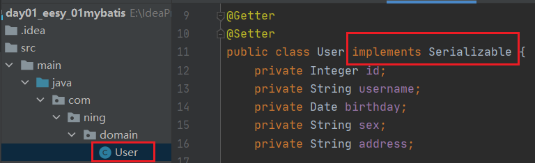

5. 创建用户的持久层接口

   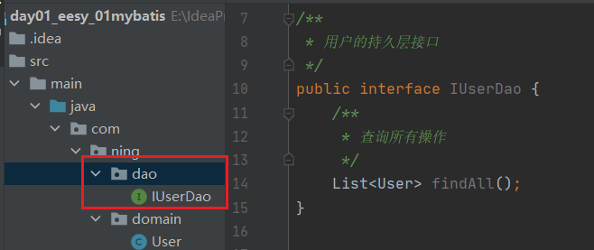

6. resources里面新建xml文件 SqlMapConfig.xml
   - 导约束，头部：

   ```xml
   <?xml version="1.0" encoding="UTF-8"?>
   <!DOCTYPE configuration  
     PUBLIC "-//mybatis.org//DTD Config 3.0//EN"  
     "http://mybatis.org/dtd/mybatis-3-config.dtd">
   ```

   - 创建Mybatis的主配置文件

   - 指定映射配置文件（每个dao独立的配置文件）的位置。即在resources下创建对应目录，在dao文件夹下创建映射配置文件IUserDao.xml**（mybatis的映射配置文件位置必须和dao接口的包结构相同）**

   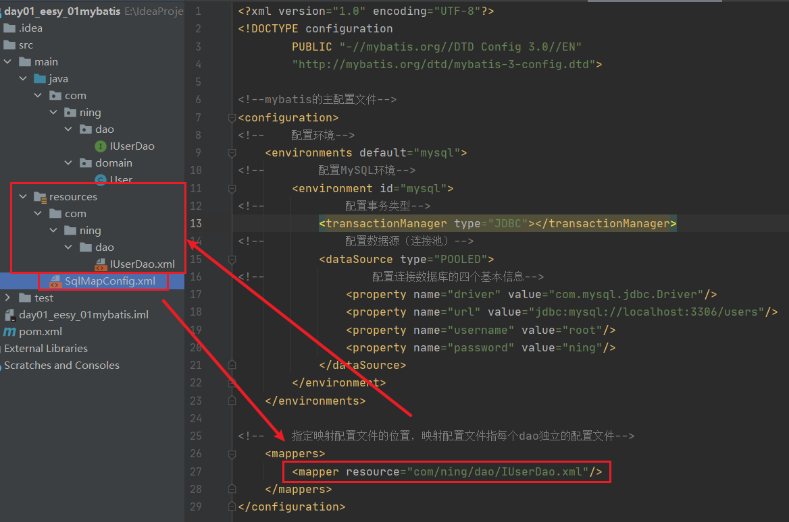

   ​	映射配置文件首部：

   ```xml
   <?xml version="1.0" encoding="UTF-8"?>
   <!DOCTYPE mapper
           PUBLIC "-//mybatis.org//DTD Mapper 3.0//EN"
           "http://mybatis.org/dtd/mybatis-3-mapper.dtd">
   ```

7. 注意（规范后可以不写dao的实现类）：
   1. Mybatis中它把持久层的操作接口名称和映射文件叫做Mapper。
   2. 映射配置文件的mapper标签namespace属性的取值必须是dao接口的全限定类名

   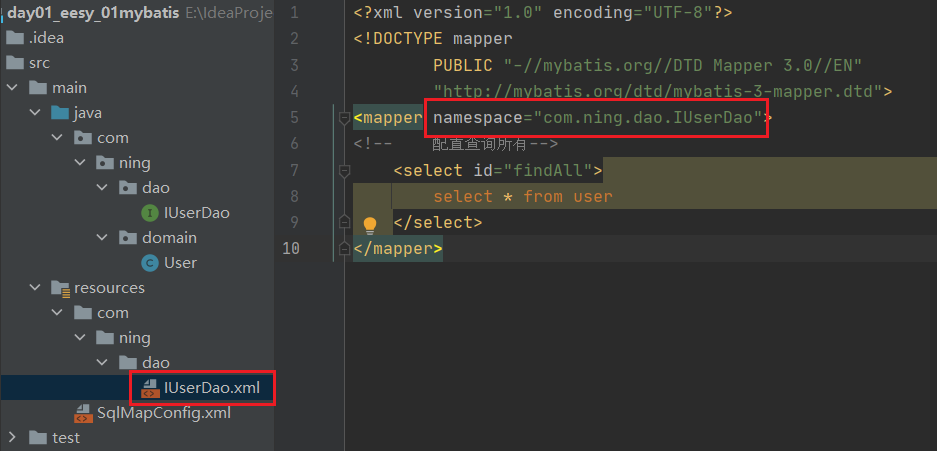

   3. 映射配置文件的操作配置(select) , id属性的取值必须是dao接口的方法名

   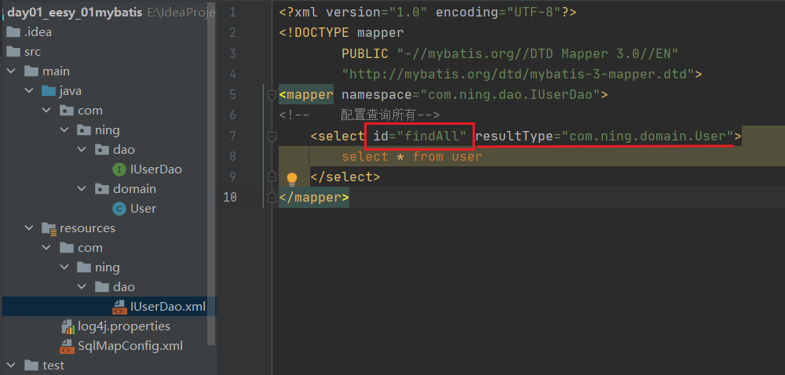

   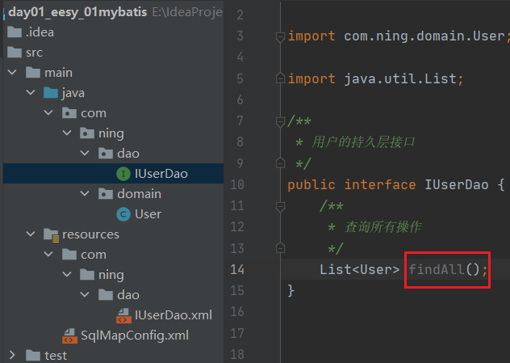

8. resources下创建log4j.properties

   ```xml
   # Set root category priority to INFO and its only appender to CONSOLE.
   #log4j.rootCategory=INFO, CONSOLE            debug   info   warn error fatal
   log4j.rootCategory=debug, CONSOLE, LOGFILE
   
   # Set the enterprise logger category to FATAL and its only appender to CONSOLE.
   log4j.logger.org.apache.axis.enterprise=FATAL, CONSOLE
   
   # CONSOLE is set to be a ConsoleAppender using a PatternLayout.
   log4j.appender.CONSOLE=org.apache.log4j.ConsoleAppender
   log4j.appender.CONSOLE.layout=org.apache.log4j.PatternLayout
   log4j.appender.CONSOLE.layout.ConversionPattern=%d{ISO8601} %-6r [%15.15t] %-5p %30.30c %x - %m\n
   
   # LOGFILE is set to be a File appender using a PatternLayout.
   log4j.appender.LOGFILE=org.apache.log4j.FileAppender
   log4j.appender.LOGFILE.File=d:\axis.log
   log4j.appender.LOGFILE.Append=true
   log4j.appender.LOGFILE.layout=org.apache.log4j.PatternLayout
   log4j.appender.LOGFILE.layout.ConversionPattern=%d{ISO8601} %-6r [%15.15t] %-5p %30.30c %x - %m\n
   ```


### 入门案例

1. test下创建测试类

   1. 读取配置文件
   2. 创建SqlSessionFactory工厂
   3. 使用工厂生产SqlSession对象
   4. 使用SqlSession创建Dao接口的代理对象
   5. 使用代理对象执行方法
   6. 释放资源

   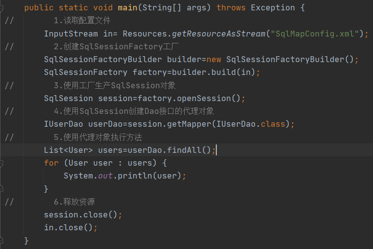

2. **设计模式分析**：

   1. 读取配置文件

      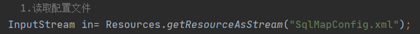

      1. 常用：
         - 使用类加载器：只能读取类路径的配置文件
         - 使用ServletContext对象的getRealPath()
      2. 不用：
         - 相对路径：移植性差
         - 绝对路径：web工程部署后文件可能找不到

   2. 创建工厂使用了**构建者模式**

      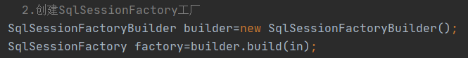

      - 构建者：builder
      - 把对象的创建细节隐藏，使使用者直接调用方法即可拿到对象

   3. 生产SqlSession使用了**工厂模式**

      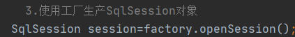

      - 降低了类之间的依赖关系

   4. 创建dao接口实现类使用了**代理模式**

      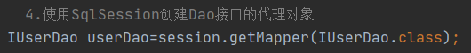

      - 不修改源码的基础上对已有方法增强


### 使用注解（常用，简洁）

1. 无需用到这部分文件，可以删掉

   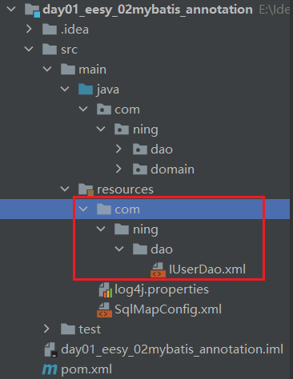

2. 如果是用注解来配置的话,此处应该使用class属性指定被注解的dao全限定类名

   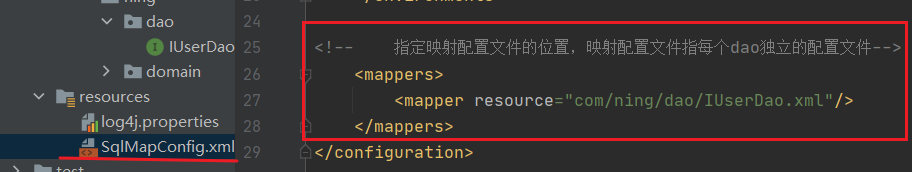

   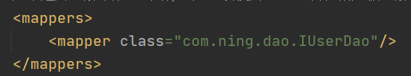

3. 在dao接口的方法上使用@Select注解，并且指定SQL语句


### 写实现类

（mybatis中也可以写实现类，但是没必要）

1. 实现类

   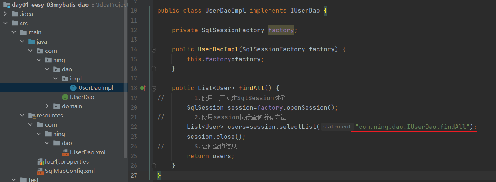

2. 测试类中不用写代理对象

   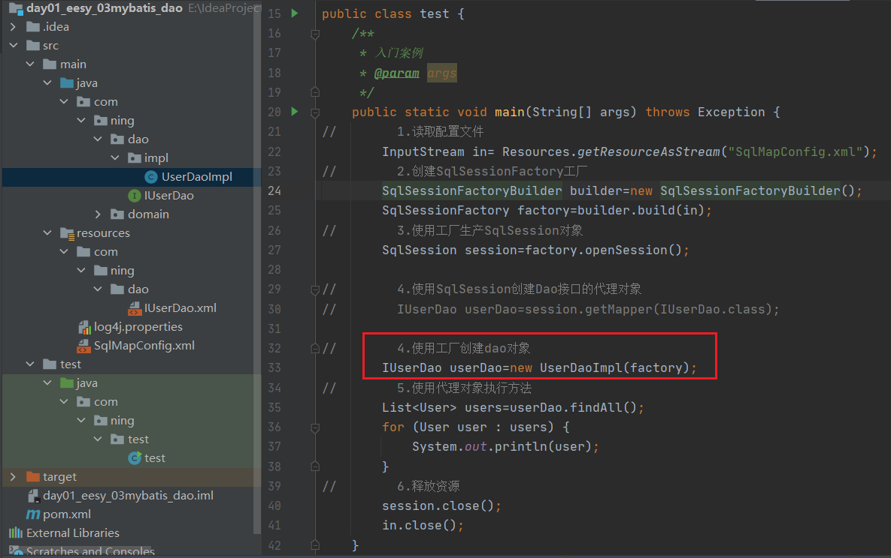

### 分析


# Sping

## Sping的体系结构


