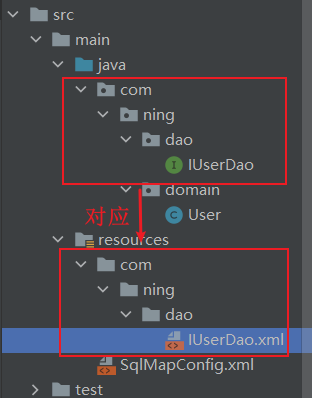
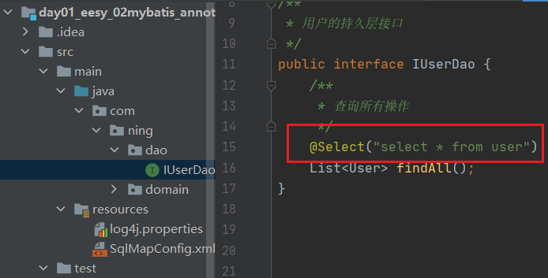
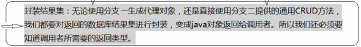
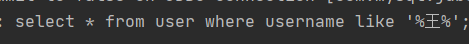
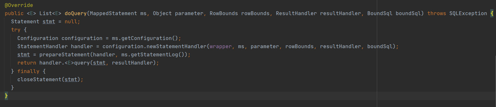

[TOC]


# 框架概述

1. 什么是框架？

   - 它是我们软件开发中的一套解决方案，不同的框架解决的是不同的问题。

   - 使用框架的好处:

     ​	框架封装了很多的细节，使开发者可以使用极简的方式实现功能。大大提高开发效率。

2. 三层架构：

   - 表现层：用于展示数据

   - 业务层：处理业务需求

   - 持久层：和数据库交互

     

3. 持久层技术解决方案：

   1. JDBC技术：
      - Connection
      - PreparedStatement
      - ResultSet
   2. Spring的JdbcTemplate：
      - Spring中对jdbc的简单封装
   3. Apache的DBUtils：
      - 也是对jdbc的简单封装

   以上都不是框架，jdbc是规范，另外两个都只是工具类。


# Mybatis

## Mybatis的概述

- mybatis是一个持久层框架，用java编写的。
- 封装了jdbc操作的很多细节，使开发者只需要关注sql语句本身，而无需关注注册驱动，创建连接等繁杂过程。
- 使用了ORM思想实现了结果集的封装。
- ORM思想：
  - Object Relational Mapping 对象关系映射
  - 就是把数据库表和实体类及实体类的属性对应起来，让我们可以操作实体类就实现操作数据库表。
  - **实体类中的属性和数据库表的字段名称需要保持一致**

## Mybatis的入门

### 配置步骤

1. 创建数据库

2. 创建maven工程

3. **pom.xml中导入坐标**

   ```xml
   <project ……
       
   <!--    修改打包方式-->
       <packaging>jar</packaging>
   
       <dependencies>
   <!--    导入mybatis坐标-->
           <dependency>
               <groupId>org.mybatis</groupId>
               <artifactId>mybatis</artifactId>
               <version>3.4.5</version>
           </dependency>
   
   <!--        导入mysql坐标-->
           <dependency>
               <groupId>mysql</groupId>
               <artifactId>mysql-connector-java</artifactId>
               <version>8.0.23</version>
           </dependency>
   <!--        日志-->
           <dependency>
               <groupId>log4j</groupId>
               <artifactId>log4j</artifactId>
               <version>1.2.12</version>
           </dependency>
   <!--       单元测试 -->
           <dependency>
               <groupId>junit</groupId>
               <artifactId>junit</artifactId>
               <version>4.12</version>
               <scope>test</scope>
           </dependency>
   
       </dependencies>
   
   </project>
   ```

   解决maven配置问题Cannot resolve plugin org.apache.maven.plugins:maven-clean-plugin:2.5：https://blog.csdn.net/lyg9966/article/details/105904175

4. 创建实体类

   

5. 创建用户的持久层接口

   

6. **resources里面创建Mybatis的主配置文件SqlMapConfig.xml**
   
   - 导约束，头部：
   
   ```xml
   <?xml version="1.0" encoding="UTF-8"?>
   <!DOCTYPE configuration  
     PUBLIC "-//mybatis.org//DTD Config 3.0//EN"  
     "http://mybatis.org/dtd/mybatis-3-config.dtd">
   ```
   
   ```xml
   <!--mybatis的主配置文件-->
   <configuration>
   <!--    配置环境-->
   <!--    default标签设置一个选择的默认值，该值在下面的environment中需要有定义-->
       <environments default="mysql">
   <!--        配置mysql的环境-->
           <environment id="mysql">
   <!--            配置事务的类型-->
               <transactionManager type="JDBC"></transactionManager>
   <!--            配置数据源（连接池），有三个值-->
               <dataSource type="POOLED">
   <!--                配置数据库的4个基本信息-->
                   <property name="driver" value="com.mysql.jdbc.Driver"/>
                   <property name="url" value="jdbc:mysql://localhost:3306/eesy_mybatis"/>
                   <property name="username" value="root"/>
                   <property name="password" value="ning"/>
               </dataSource>
           </environment>
       </environments>
   </configuration>
   ```
   
   - 指定映射配置文件（每个dao独立的配置文件）的位置。
   
     即在resources对应目录下创建映射配置文件IUserDao.xml
   
     ```xml
     <!--    指定映射配置文件位置（也是在configuration中的）-->
         <mappers>
             <mapper resource="com/ning/dao/IUserDao.xml"/>
         </mappers>
     ```
   
     **（mybatis的映射配置文件位置必须和dao接口的包结构相同）**
   
     
   
     ​	映射配置文件IUserDao.xml的首部：
   
     ```xml
     <?xml version="1.0" encoding="UTF-8"?>
     <!DOCTYPE mapper
             PUBLIC "-//mybatis.org//DTD Mapper 3.0//EN"
             "http://mybatis.org/dtd/mybatis-3-mapper.dtd">
     ```
   
     ```xml
     <!--namespace中是该dao的全限定类名-->
     <mapper namespace="com.ning.dao.IUserDao">
         
     <!--    配置查询所有-->
     <!--    id是IUserDao中方法的名称-->
         <select id="findAll">
             select * from user
         </select>
         
     </mapper>
     ```

### 配置的注意事项

（规范3、4、5后可以不写dao的实现类）

1. Mybatis中它把持久层的操作接口名称和映射文件叫做Mapper。

   即映射配置文件IUserDao也可以叫IUserMapper

2. 在idea中创建目录和创建包是不一样的

   1. 创建包时，com.ning.dao是三级结构
   2. 创建目录时，com.ning.dao是一级目录
   3. **即创建目录的时候要一级一级的创建**

3. mybatis的映射配置文件位置必须和dao接口的包结构相同

   

4. 映射配置文件的mapper标签namespace属性的取值必须是dao接口的全限定类名

   

5. 映射配置文件的操作配置(select) , id属性的取值必须是dao接口的方法名


### 入门案例

resources下创建log4j.properties

```xml
# Set root category priority to INFO and its only appender to CONSOLE.
#log4j.rootCategory=INFO, CONSOLE            debug   info   warn error fatal
log4j.rootCategory=debug, CONSOLE, LOGFILE

# Set the enterprise logger category to FATAL and its only appender to CONSOLE.
log4j.logger.org.apache.axis.enterprise=FATAL, CONSOLE

# CONSOLE is set to be a ConsoleAppender using a PatternLayout.
log4j.appender.CONSOLE=org.apache.log4j.ConsoleAppender
log4j.appender.CONSOLE.layout=org.apache.log4j.PatternLayout
log4j.appender.CONSOLE.layout.ConversionPattern=%d{ISO8601} %-6r [%15.15t] %-5p %30.30c %x - %m\n

# LOGFILE is set to be a File appender using a PatternLayout.
log4j.appender.LOGFILE=org.apache.log4j.FileAppender
log4j.appender.LOGFILE.File=d:\axis.log
log4j.appender.LOGFILE.Append=true
log4j.appender.LOGFILE.layout=org.apache.log4j.PatternLayout
log4j.appender.LOGFILE.layout.ConversionPattern=%d{ISO8601} %-6r [%15.15t] %-5p %30.30c %x - %m\n
```

test下创建测试类：


1. 读取配置文件(把主配置文件的信息加载进来)
2. 创建SqlSessionFactory工厂
3. 使用工厂生产SqlSession对象（因为没有实现类，这里是动态代理）
4. 使用SqlSession创建Dao接口的代理对象
5. 使用代理对象执行方法
6. 释放资源

总结：读配置文件 -> 创建SqlSessionFactory工厂 -> 生产工厂代理对象SqlSession -> 创建Dao接口的代理对象 -> 用代理对象执行方法 -> 释放资源

示例：

```java
//        1.读取配置文件(把主配置文件的信息加载进来)
        InputStream in= Resources.getResourceAsStream("SqlMapConfig.xml");
//        2.创建SqlSessionFactory工厂
        SqlSessionFactoryBuilder builder=new SqlSessionFactoryBuilder();
        SqlSessionFactory factory = builder.build(in);
//        3.使用工厂生产SqlSession对象（因为没有实现类，这里是动态代理）
        SqlSession session = factory.openSession();
//        4.使用SqlSession创建Dao接口的代理对象
        IUserDao userDao = session.getMapper(IUserDao.class);
//        5.使用代理对象执行方法
        List<User> users=userDao.findAll();
        for (User user : users) {
            System.out.println(user);
        }
//        6.释放资源
        session.close();
        in.close();
```

注：IUserDao.xml中要加上返回类型resultType（告知mybatis要封装成什么对象）

```xml
<!--namespace中是该dao的全限定类名-->
<mapper namespace="com.ning.dao.IUserDao">

<!--    配置查询所有-->
<!--    id是IUserDao中方法的名称-->
    <select id="findAll" resultType="com.ning.domain.User">
        select * from user
    </select>

</mapper>
```


### 使用注解（常用，简洁）

1. 无需用到xml文件，可以删掉

   

2. 如果是用注解来配置的话,此处应该使用class属性指定被注解的dao全限定类名

   

   

3. 在dao接口的方法上使用@Select注解，并且指定SQL语句


### 写实现类

（mybatis中也可以写实现类，但是没必要）

1. 实现类

   

2. 测试类中不用写代理对象

   

# **设计模式分析**

1. 读取配置文件

   

   1. 常用：
      - 使用类加载器：只能读取类路径的配置文件
      - 使用ServletContext对象的getRealPath()
   2. 不用：
      - 相对路径：移植性差
      - 绝对路径：web工程部署后文件可能找不到

2. 创建工厂使用了**构建者模式**

   

   - 构建者：builder
   - 把对象的创建细节隐藏，使使用者直接调用方法即可拿到对象

3. 生产SqlSession使用了**工厂模式**

   

   - 降低了类之间的依赖关系

4. 创建dao接口实现类使用了**代理模式**

   

   - 不修改源码的基础上对已有方法增强


# 自定义Mybatis的分析

## 1.查询所有的分析

使用代理dao的方式实现增删改查的步骤：

1. 创建代理对象
2. 在代理对象中调用selectList

配置文件具备的信息：

1. 连接数据库的信息 -> 可以创建Connection对象

   

2. 映射配置文件的位置信息

   

3. 在映射配置文件中有：

   执行的sql语句，可以获取PreparedStatement

   封装的实体类全限定类名

   

以上配置文件的解析用到的技术是dom4j。

获得以上信息后：

1. 根据配置文件的信息创建Connection对象

   1. 注册驱动，获取连接

2. 获取预处理对象PreparedStatement

   1. 需要sql语句（在映射配置文件中）
   2. `conn.preparedStatement(sql)`

3. 执行查询

   1. `ResultSet resultSet=preparedStatement.executeQuery()`

4. 遍历结果集

   ```java
   List<E> list = new ArrayList();
   while(resultSet.next()){
   	E element=(E)Class.forName(配置的全限定类名).newInstance()
           
   	进行封装，把每个rs的内容都添加到element中
   	把element加入list中
   	list.add(element);
   }
   ```

5. 返回list集合

   1. `return list;`

总结：我们需要提供的信息：

1. 连接信息

2. 映射信息

   包含：

   1. 执行的sql语句
   2. 封装结果的实体类全限定类名

   将以上包含的两个信息封装为一个对象Mapper

   


## 2.创建代理对象的分析


```java
//根据dao接口的字节码创建dao的代理对象
public <T> getMapper (class<T> daoInterfaceClass){
    //类加载器：使用的和被代理的对象是相同的类加载器
    //代理对象要实现的接口：和被代理对象实现相同的接口
    /**如何代理：即增强的方法，需要自己提供
    		此处是一个InvocationHandler接口，我们需要写一个实现类
    		然后在实现类中调用selectList方法
    */
	Proxy.newProxyInstance(类加载器,代理对象要实现的接口字节码数组,如何代理)
}
```

### 附：动态代理

https://www.jianshu.com/p/9bcac608c714

1. 代理模式

   1. 为其他对象提供一个代理以控制对某个对象的访问。
   2. 代理类本身不实现服务，而是通过调用被代理类中的方法来提供服务。

2. 静态代理

   1. 创建一个接口，然后创建被代理的类实现该接口并且实现该接口中的抽象方法。之后再创建一个代理类，同时使其也实现这个接口。在代理类中持有一个被代理对象的引用，而后在代理类方法中调用该对象的方法。

   2. 示例：

      ```java
      //创建一个接口
      public interface HelloInterface {
          void sayHello();
      }
      
      //被代理类
      public class Hello implements HelloInterface{
          @Override
          public void sayHello() {
              System.out.println("Hello类处理业务");
          }
      }
      
      //代理类
      public class HelloProxy implements HelloInterface{
          private HelloInterface hello=new Hello();
          @Override
          public void sayHello() {
              hello.sayHello();
          }
      }
      
      ```
      
   3. 被代理类被传递给了代理类HelloProxy，代理类在执行具体方法时通过所持用的被代理类完成调用。（即在代理类中可以完成“Hello类处理业务”）
   
   4. 优点：使用静态代理很容易就完成了对一个类的代理操作。
   
   5. 缺点：由于代理只能为一个类服务，如果需要代理的类很多，那么就需要编写大量的代理类，比较繁琐。
   
3. 动态代理

   1. 使用反射机制在运行时创建代理类

   2. 接口、被代理类不变，构建一个handler类来实现InvocationHandler接口。

      1. 每一个proxy代理实例都有一个关联的调用处理程序，InvocationHandler接口是proxy代理实例的**调用处理程序**实现的一个接口；
      2. 在代理实例调用方法时，方法调用被编码分派到调用处理程序的invoke方法；
      3. 每一个动态代理类的调用处理程序都必须实现InvocationHandler接口；

   3. 示例：

      ```java
      //构建一个handler类来实现InvocationHandler接口
      public class ProxyHandler implements InvocationHandler {
          private Object object;
          public ProxyHandler(Object object) {
              this.object = object;
          }
      
          @Override
          public Object invoke(Object proxy, Method method, Object[] args) throws Throwable {
              method.invoke(object,args);
              return null;
          }
      
          public static void main(String[] args) {
              HelloInterface hello = new Hello();
              InvocationHandler handler = new ProxyHandler(hello);
      //        通过Proxy类的静态方法newProxyInstance返回一个接口的代理实例。
      //        针对不同的代理类，传入相应的代理程序控制器InvocationHandler。
              HelloInterface proxyHello = (HelloInterface) Proxy.newProxyInstance(hello.getClass().getClassLoader(), hello.getClass().getInterfaces(), handler);
              proxyHello.sayHello();
          }
      }
      ```

   4. 具体步骤：

      1. 通过实现 InvocationHandler 接口创建自己的调用处理器；
      2. 通过为 Proxy 类指定 ClassLoader 对象和一组 interface 来创建动态代理类；
      3. 通过反射机制获得动态代理类的构造函数，其唯一参数类型是调用处理器接口类型
      4. 通过构造函数创建动态代理类实例，构造时调用处理器对象作为参数被传入。


# 自定义MyBatis的编程

听不懂

## 步骤：

1. SqlSessionFactoryBuilder接收SqlMapConfig.xml文件流，构建出SqlSessiionFactory对象

2. SqlSessionFactory读取SqlMapConfig.xml中连接数据库和mapper映射信息，用来生产真正操作数据库的SqlSession对象

3. SqlSession对象有两大作用：

   1. 生成接口代理对象

   2. 定义通用增删改查方法

      注：无论哪个分支，除了连接数据库信息外，还需要得到sql语句

4. 

5. 


## 附：反射回顾

1. **获取Class文件对象**

   1. 方式：

      1. 类名.class
      2. 类的对象.getClass()
      3. Class.forName("类的全限名")

   2.  每个类的Class对象都只有一个

   3. 示例：

      ```java
      //    获取类文件
          System.out.println("方法1："+Animal.class);
          Animal animal=new Animal();
          System.out.println("方法2："+animal.getClass());
          System.out.println("方法3："+Class.forName("reflect.Animal"));
      ```

2. Class类对象的常用方法

   1. ```java
      String getSimpleName(); 获得类名字符串：类名
      String getName();  获得类全名：包名+类名
      T newInstance() ;  创建Class对象关联类的对象
      ```

   2. 示例：

      ```java
      //    常用方法
          System.out.println(Animal.class.getSimpleName());
          System.out.println(Animal.class.getName());
          System.out.println(Animal.class.newInstance());
      ```

      

3. **获取构造器Constructor**

   1. 可以用于创建类的对象

   2. 方式：

      1. Class文件对象 . getDeclaredConstructor(Class... parameterTypes)
      2. Class文件对象 . getDeclaredConstructors()
      3.  还有getConstructor()和 getConstructors()，但是这两个只能获取public修饰的构造器

   3. 示例：

      ```java
      //    获取构造器
          Constructor constructor;
          constructor=Animal.class.getDeclaredConstructor(String.class,Integer.class);
          System.out.println("方法1："+constructor);
          Constructor<?>[] constructors;
          constructors=Animal.class.getDeclaredConstructors();
          System.out.println("方法2：");
          for (Constructor<?> constructor1 : constructors) {
              System.out.println(constructor1);
          }
      ```

4. Constructor对象常用方法：

   1. ```java
      1. T newInstance(Object... initargs)
       	根据指定的参数创建对象
      2. void setAccessible(true)
         设置是否取消权限检查，true取消权限检查，false表示不取消(暴力反射)。
          暴力反射，设置为可以直接访问私有类型的属性。
      ```

5. **获取类的对象Field**

   1. 每一个成员变量都是一个Field类的对象

   2. 可以通过Field对象给对应的成员变量赋值和取值

   3. 方式：

      1. Class文件对象 . getDeclaredField(String name)
      2. Class文件对象 . getDeclaredFields()

   4. 示例：

      ```java
      //    获取类的对象Field
          Field[] declaredFields = Animal.class.getDeclaredFields();
          for (Field declaredField : declaredFields) {
              //得到private java.lang.String reflect.Animal.name和private java.lang.Integer reflect.Animal.age
              System.out.println(declaredField);
          }
      ```

      

6. Field对象的常用方法

   1. ```java
      void  set(Object obj, Object value) 
      void setInt(Object obj, int i) 	
      void setLong(Object obj, long l)
      void setBoolean(Object obj, boolean z) 
      void setDouble(Object obj, double d) 
      
      Object get(Object obj)  
      int	getInt(Object obj) 
      long getLong(Object obj) 
      boolean getBoolean(Object ob)
      double getDouble(Object obj) 
      
      void setAccessible(true);暴力反射，设置为可以直接访问私有类型的属性。
      Class getType(); 获取属性的类型，返回Class对象。
      ```

   2. 示例：

      ```java
      //    创建一个对象
          Animal a = new Animal();
      //    给对象a的name赋值
          Field field=Animal.class.getDeclaredField("name");
          field.setAccessible(true);
          field.set(a,"小兔子");
      //    获取a的name属性
          System.out.println(field.get(a));
      ```

7. **获取方法对象Method**

   1. 操作Method对象来调用成员方法

   2. 每一个成员方法都是一个Method类的对象

   3. 方式：

      1. Class文件对象 . getDeclaredMethod(String name,Class...args)
      2. Class文件对象 .getDeclaredMethods()

   4. 示例：

      ```java
      //    获取方法对象Method
          Class c = Animal.class;
          Method[] declaredMethods = c.getDeclaredMethods();
          for (Method method : declaredMethods) {
              System.out.println(method);
          }
          System.out.println(c.getDeclaredMethod("run"));
          System.out.println(c.getDeclaredMethod("getRunTime", String.class));
      ```

8. **方法对象Method的常用方法**

   1. ```java
      *  Object invoke(Object obj, Object... args)
          * 调用指定对象obj的该方法
          * args：调用方法时传递的参数
      *  void setAccessible(true)
          设置是否取消权限检查，true取消权限检查，false表示不取消(暴力反射)
      ```

   2. 示例：

      ```java
          Method method=c.getDeclaredMethod("getRunTime", String.class);
          method.invoke(animal,"三");
      ```

# Mybatis的CRUD（基于代理dao的方式）

1. 步骤：

   1. dao接口新增方法

   2. 修改映射配置文件

      ```xml
      <mapper namespace="com.ning.dao.IUserDao">
      <!--    根据id查询用户-->
          <select id="findById" parameterType="Integer" resultType="com.ning.domain.User">
              select * from user where id=#{id};
          </select>
      </mapper>
      ```

   3. 分析：

      1. namespace：接口的全限定类名
      2. id：方法名
      3. parameterType：传入参数类型
      4. resultType：返回结果集类型

   4. 需要修改数据库的信息时：

      1. 处理事务时不能自动提交，会回滚

         

      2. 需要添加一个方法

         ```java
         //        6.实现保存功能
                 session.commit();
         ```

2. 模糊查询：

   1. 映射配置文件中有两种写法：

      1. 第一种：

         ```sql
         select * from user where username like #{username};
         ```

         sql语句为：

         

         使用Statement对象的字符串拼接sql

         

      2. **第二种**：（里面一定要是value）

         ```sql
         select * from user where username like '%${value}%';
         ```

         sql语句为：

         

         使用PreparedStatement的参数占位符

   2. 在传入的参数中设置模糊查询：

      ```java
      //        执行模糊查询方法
              List<User> users = userDao.findByName("%王%");
      ```

   3. 解决乱码问题：

      1. url后面加上`?characterEncoding=utf8`

      2. 在MySQL的etc/my.cnf配置文件中添加：

         ```
         [mysqld]
         character-set-server=utf8
         [client]
         default-character-set=utf8
         [mysql]
         default-character-set=utf8
         ```

3. 插入方法

   1. 获取自增的id值sql语句为：

      ```sql
      select last_insert_id();
      ```

   2. 需要修改映射配置文件：

      ```xml
      <insert id="saveUser" parameterType="com.ning.domain.User">
      --         配置插入数据后，获取数据的id
          <selectKey keyProperty="id" keyColumn="id" resultType="int" order="AFTER">
              select last_insert_id();
          </selectKey>
                  insert into user(username,address,sex,birthday)value(#{username},#{address},#{sex},#{birthday});
      </insert>
      ```

   3. 分析：

      1. keyProperty是指当前id
      2. keyColumn是指数据库id
      3. resultType是指返回的结果类型
      4. order是指该语句的执行次序

# parameterType（输入类型）

### 1.传递简单类型

### 2.传递pojo对象

1. OGNL表达式（Object Graphic Navigation Language）：
   1. 对象图导航语言
   2. 通过对象的取值方法获取数据
   3. 在写法上把get省略
      1. 类的写法：user.getUsername();
      2. OGNL表达式：user.username
   4. mybatis中已经提供了属性所属的类，所以前面不需要“对象.”
2. mybatis使用OGNL表达式解析对象字段的值，#{}或者${}中的值为pojo属性名称

### 3.传递pojo包装对象：

1. 开发中通过pojo传递查询条件，查询条件是综合的查询条件，不仅包括用户查询条件还包括其它的查询条件(比如将用户购买商品信息也作为查询条件),这时可以使用包装对象传递输入参数。

2. Pojo类中包含pojo。

3. 需求:根据用户名查询用户信息，查询条件放到QueryVo的user属性中

   ```xml
   <!--    根据queryVo的条件查询用户-->
       <select id="findUserByVo" parameterType="com.ning.domain.QueryVo" resultType="com.ning.domain.User">
           select * from user where username like #{user.username}
       </select>
   ```

# resultType（输出类型）

封装的实体类属性名需要和数据库的列名保持一致。

不一致解决方法：

1. 起别名：

   

2. 采用配置的方式：

   ```xml
   <!--    配置查询结果的列名和实体类的属性名的对应关系-->
   <!--    id是一个唯一标志，可以瞎写-->
   <!--    type表示是哪个实体类-->
       <resultMap id="userMap" type="com.ning.domain.User">
   <!--        主键字段的对应-->
           <id property="userId" column="id"></id>
   <!--        非主键字段的对应-->
           <result property="userName" column="username"></result>
       </resultMap>
   
   
   <!--    查询所有-->
       <select id="findAll" resultMap="userMap">
           select * from user;
       </select>
   ```

   注意：需要把下面的resultType改成resultMap

# Mybatis中基于传统dao的方式（编写dao实现类）

1. 编写实现类：  

   ```java
   //示例
   public class UserDaoImpl implements IUserDao {
       private SqlSessionFactory factory;
   
       public UserDaoImpl(SqlSessionFactory factory) {
           this.factory = factory;
       }
   
       public List<User> findAll() {
   //        1.根据factory获取Sqlsession对象
           SqlSession session=factory.openSession();
   //        2.调用SqlSession中的方法，实现查询列表
           List<User> users = session.selectList("com.ning.dao.IUserDao.findAll");//参数是能获取配置信息的key
   //        3.释放资源
           session.close();
           return users;
       }
   }
   ```

2. 分析：

   1. debug：

      

   2. 进入SqlSession：

      

   3. 找到SqlSession的实现类：

      

   4. 进入DefaultSqlSession，找到selectList接口：

      1. 右键show diagrams：

         

      2. 进入选中DefaultSqlSession：

         

      3. 找到selectList方法：

         

      4. 找到executor，进入其实现类CachingExecutor；

      5. 然后找到query方法：

         

      6.  然后通过queryFromDatabase找到最后的doQuery方法：

         

      7. 里面调用了handler的query方法：

         

      8. 去找handler的类RoutingStatementHandler：

         

      9. 找到delegate的类里面的query方法：

         

      10. 找到了preparedstatement：

          

      11. ……不写了，我累了

          

3. 编写测试类：

   ```java
       @Test
       public void testFindAll() throws Exception {
   //        5.执行查询所有方法
           List<User> users = userDao.findAll();
           for (User user : users) {
               System.out.println(user);
           }
       }
   ```

4. 看看图：

   

# Mybatis中的配置（主配置文件）

## properties标签

```xml
<!--    在configuration中配置-->
<!--    配置properties-->
    <properties>
        <property name="driver" value="com.mysql.jdbc.Driver"/>
        <property name="url" value="jdbc:mysql://localhost:3306/eesy_mybatis?characterEncoding=utf8"/>
        <property name="username" value="username"/>
        <property name="password" value="password"/>
    </properties>

<!--    除了上面这种方式外，还可以通过属性引用外部配置文件信息
		resource属性：指定配置文件位置，按照类路径的写法写，必须存在类路径下
		url：统一资源标识符，在应用中唯一定位一个资源
			写法：协议+主机+端口+URI
-->
    <properties resource="jdbcConfig.properties"></properties>

<!--    配置环境-->
    <environments default="mysql">
<!--        配置MySQL的环境-->
        <environment id="mysql">
<!--            配置事务-->
            <transactionManager type="JDBC"></transactionManager>
<!--            配置连接池-->
            <dataSource type="POOLED">
                <property name="driver" value="${driver}"/>
                <property name="url" value="${url}"/>
                <property name="username" value="${username}"/>
                <property name="password" value="${password}"/>
            </dataSource>
        </environment>
    </environments>
```

## typeAliases标签

```xml
<!--    使用typeAliases配置别名，只能配置domain中类的别名-->
    <typeAliases>
<!--        配置别名后就不再区分大小写-->
<!--        <typeAlias type="com.ning.domain.User" alias="user"></typeAlias>-->
        
<!--        用于指定要配置别名的包，指定后该包下的实体类都会注册别名，类名就是别名，不区分大小写-->
        <package name="com.ning.domain"/>
    </typeAliases>
```

除此之外mappers中也可以用package标签配置：

```xml
    <mappers>
<!--        <mapper resource="com/ning/dao/IUserDao.xml"></mapper>-->
<!--        用于指定dao接口所在的包，指定后不需要再写mapper、resource或class了-->
        <package name="com.ning.dao"/>
    </mappers>
```

# 连接池以及事务控制

1. 连接池：

   1. 用于存储连接的一个容器
   2. 容器：
      1. 是一个集合对象
      2. 该集合必须是线程安全的，不能两个线程拿到统一连接
      3. 该集合还必须实现队列的特性：先进先出

2. mybatis中的连接池配置方式：

   1. 主配置文件SqlMapConfig.xml中的dataSoutce标签，type属性表示了连接池方式

   2. type属性的值：

      1. **POOLED**：采用传统的javax.sql.DataSource规范中的连接池，mybatis中有针对规范的实现
      2. **UNPOOLED**：采用传统的获取连接的方式，虽然也实现javax.sql.DataSource接口，但是没有池的思想
      3. **JNDI**：采用服务器提供的JNDI技术实现，来获取DataSource对象，不同的服务器所能拿到DataSource是一样的
      4. 注意： 如果不是web或者maven的war工程，是不能使用JNDI的。
      5. 我们使用tomcat服务器采用连接池就是dbcp连接池

   3. 对比POOLED和UNPOOLED配置连接池

      1. POOLED**（常用）**：从池中获取一个连接来使用
      2. UNPOOLED：每次创建一个新的连接使用

      

## 连接池的使用及分析

MyBatis 内部分别定义了实现了java.sql.DataSource接口的UnpooledDataSource ，PooledDataSource类来表示UNPOOLED、POOLED 类型的数据源。

### 使用unpooled配置连接池的分析

1. 找到UnpooledDataSource类，crl+n找到该类

2. 分析：该类实现了DataSource，并且里面有个getConnection()方法：

   

   

3. 跟踪到doGetConnection()方法：

   里面包含了注册驱动、获取连接 和返回连接

   

### 使用pooled配置连接池的分析

1. 找到getConnection()方法：

   

2. 追踪到popConnection()方法：

   

3. 分析：

   

## 事务控制的分析

1. 什么是事务

   1. 事务是指是程序中一系列严密的逻辑操作，而且所有操作必须全部成功完成，否则在每个操作中所作的所有更改都会被撤消。
   2. mybatis中的事务是通过sqlsess ion对象的commit方法和rollback方法实现事务的提交和回滚

2. 事务的四大特性ACID

   1. 原子性(Atomicity)：事务中的全部操作在数据库中是不可分割的，要么全部完成，要么均不执行。
   2. 一致性(Consistency)：几个并行执行的事务，其执行结果必须与按某一顺序串行执行的结果相一致。
   3. 隔离性(Isolation)：事务的执行不受其他事务的干扰，事务执行的中间结果对其他事务必须是透明的。
   4. 持久性(Durability)：对于任意已提交事务，系统必须保证该事务对数据库的改变不被丢失，即使数据库出现故障。   

3. 不考虑隔离性会产生的3个问题

   1. 脏读：A事务中读取到了B事务中未提交的数据，造成数据错误
   2. 不可重复读：A事务中读取到了B事务中已提交的数据，在特定情景下会产生影响，比如生成统一的数据报表
   3. 虚读（幻读）：A事务中读取到了B事务中已提交的新插入的数据，影响同上

4. 解决方法：四种隔离级别

   1. 第一种隔离级别：Read uncommitted(读未提交)

      **解决了更新丢失，但还是可能会出现脏读**

   2. 第二种隔离级别：Read committed(读提交)

      **解决了更新丢失和脏读问题**

   3. 第三种隔离级别：Repeatable read(可重复读取)

      **解决了更新丢失、脏读、不可重复读**

   4. 第四种隔离级别：Serializable(可序化)

      **解决了更新丢失、脏读、不可重复读、幻读(虚读)**

      

5. mybatis中事务的自动提交：

   

   

# 基于xml配置的动态Sql语句使用

## mappers配置文件中的几个标签

### < if >

```xml
<!--    根据条件查询-->
    <select id="findUserByCondition" resultMap="userMap" resultType="user">
        select * from user where 1=1
        <if test="username != null">
            and username=#{username}
        </if>
        <if test="sex!=null">
            and sex=#{sex}
        </if>
    </select>
```

test中是判断条件

### < where >

使用where标签改进

```xml
    <select id="findUserByCondition" resultMap="userMap" resultType="user">
        select * from user
        <where>
            <if test="username != null">
                and username=#{username}
            </if>
            <if test="sex!=null">
                and sex=#{sex}
            </if>
        </where>
    </select>
```

### < foreach >

用于遍历集合，它的属性:

1. collection: 代表要遍历的集合元素，不用加#{}
2. open: 代表语句的开始部分
3. close: 代表结束部分
4. item: 代表遍历集合的每个元素，生成的变量名
5. sperator:代表分隔符

```xml
<!--    根据queryVo中的id集合实现查询用户列表-->
<!--    sql: select * from user where id in(?) -->
    <select id="findUserInId" resultMap="userMap" parameterType="queryVo">
        select * from user
        <where>
            <if test="ids!=null and ids.size()>0">
                <foreach collection="ids" open="and id in(" close=")" item="id" separator=",">
                    <!--    里面的名字要和item的名字一样-->
                    #{id}
                </foreach>
            </if>
        </where>
    </select>
```

### < sql >

方便复用，需要注意分号的添加

```xml
    <sql id="defaultUser">
        select * from user;
    </sql>

<!--    查询所有-->
    <select id="findAll" resultMap="userMap">
        <include refid="defaultUser"></include>
    </select>
```

# 多表操作

示例：用户和账户

1. 一个用户可以有多个账户
2. 一个账户只能属于一个用户(多个账户也可以属于同一个用户）

步骤:

1. 建立两张表:用户表，账户表
   1. 让用户表和账户表之间具备一对多的关系
   2. 需要使用外键在账户表中添加
2. 建立两个实体类:用户实体类和账户实体类
   1. 让用户和账户的实体类能体现出啦一对多的关系
3. 建立两个配置文件
   1. 用户的配置文件
   2. 账户的配置文件
4. 实现配置:
   1. 当我们查询用户时，可以同时得到用户下所包含的账户信
   2. 当我们查询账户时，可以同时得到账户的所属用户信息

## 一对一

- 案例：查询所有账户信息，关联查询下单用户信息。

- 注意：因为一个账户信息只能供某个用户使用，所以从查询账户信息出发关联查询用户信息为一对一查询。如果从用户信息出发查询用户下的账户信息则为一对多查询，因为一个用户可以有多个账户。

- 主表：user

- 从表：acccount（`FOREIGN KEY (UID) REFERENCES user(id)`）


 

1. 从表实体应该包含一个主表实体的对象引用，即在account实体类中添加一个user属性

2. 定义封装account和user的resultMap，即配置查询结果的列名和实体类的属性名的对应关系

   ```xml
       <resultMap id="accountUserMap" type="account">
           <id property="id" column="aid"></id>
           <result property="uid" column="uid"></result>
           <result property="money" column="money"></result>
   <!--        一对一的关系映射，配置封装user的内容-->
   <!--        column是指通过哪个字段获取的-->
   <!--        javaType用于提示封装到哪个对象-->
           <association property="user" column="uid" javaType="user">
               <id property="id" column="id"></id>
               <result column="username" property="username"></result>
               <result column="address" property="address"></result>
               <result column="sex" property="sex"></result>
               <result column="birthday" property="birthday"></result>
           </association>
       </resultMap>
   ```

## 一对多

1. 主表实体应该包含从表实体的集合引用，即user实体类中添加Account类型的集合

2. 定义User的resultMap：

   ```xml
       <resultMap id="userAccountMap" type="user">
           <id property="id" column="id"></id>
           <result column="username" property="username"></result>
           <result column="address" property="address"></result>
           <result column="sex" property="sex"></result>
           <result column="birthday" property="birthday"></result>
   <!--        配置user对象中accounts集合的映射-->
   <!--        ofType是指集合中元素的类型-->
           <collection property="accounts" ofType="account">
               <id property="id" column="id"></id>
               <result property="uid" column="uid"></result>
               <result property="money" column="money"></result>
           </collection>
       </resultMap>
   ```

## 多对多

- 示例：用户和角色

  - 一个用户可以有多个角色
  - 一个角色可以赋予多个用户

- 步骤:

  1、建立两张表：用户表,角色表

  - 让用户表和角色表具有多对多的关系。
  - 需要使用中间表，中间表中包含各自的主键，在中间表中是外键。

  2、建立两个实体类：用户实体类和角色实体类

  - 让用户和角色的实体类能体现出来多对多的关系
  - 各自包含对方一个集合引用

  3、建立两个配置文件

  - 用户的配置文件
  - 角色的配置文件

  4、实现配置:

  - 当我们查询用户时，可以同时得到用户所包含的角色信息
  - 当我们查询角色时，可以同时得到角色的所赋予用户信息

- 数据库那边需要使用中间表，做法跟一对多差不多，SQL语句：

  ```sql
  #查询用户时，可以同时得到用户所包含的角色信息
  select u.*,r.id as rid,r.`ROLE_NAME`,r.`ROLE_DESC` from role r
  left outer join user_role ur on r.id=ur.rid
  left outer join user u on u.id=ur.uid
  
  #查询角色时，可以同时得到角色的所赋予用户信息
  SELECT u.*,r.id AS rid,r.`ROLE_NAME`,r.`ROLE_DESC` FROM user u
  LEFT OUTER JOIN user_role ur ON u.id=ur.uid
  LEFT OUTER JOIN role r ON r.id=ur.rid
  ```

# JNDI

## 概述

1. Java Naming and Directory Interface，即Java命名和目录接口
2. 是标准的Java命名系统接口，目的是模仿Windows系统中的注册表
3. 


## JNDI搭建maven的war工程

1. 新建maven工程

   

2. 修改maven路径

   

3. 


