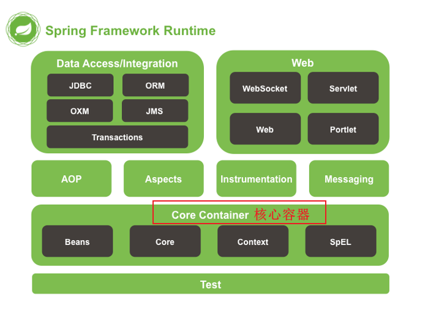
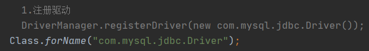
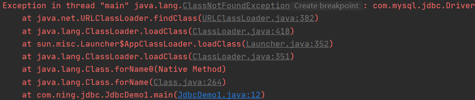
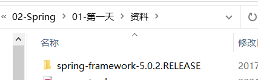
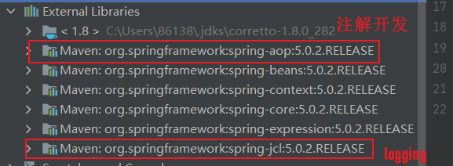
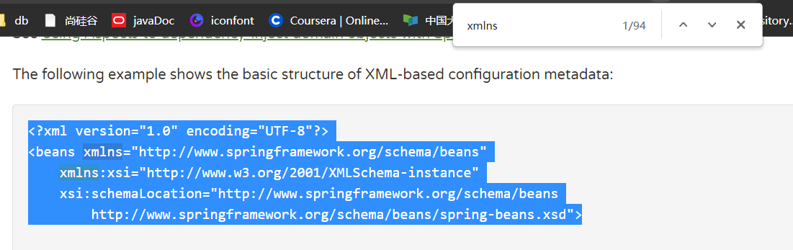
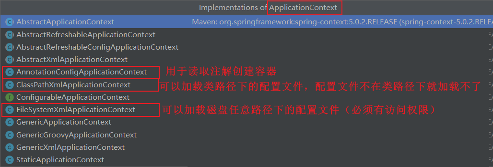
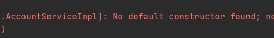

[TOC]

# Spring概述

Spring是分层的Java SE/EE应用**full-stack** 轻量级开源框架，**以IOC (Inverse 0f Control:反转控制）和AOP (Aspect Oriented Programming:面向切面编程〉为内核**，提供了展现层Spring.MVC和持久层Spring JDBC 以及业务层事务管理等众多的企业级应用技术，还能整合开源世界众多著名的第三方框架和类库。

1. 内核：

   1. IoC (Inverse 0f Control:反转控制）
   2. AOP (Aspect Oriented Programming:面向切面编程

2. 优势：

   1. 方便解耦，简化开发
   2. AOP编程的支持
   3. 声明式事务的支持
   4. 方便程序的测试
   5. 方便集成各种优秀框架
   6. 降低JavaEE API的使用难度
   7. Java源码是经典学习范例

3. 体系结构：

   操作都需要有核心容器IOC的支持

   

# 程序的耦合及解耦

## 分析程序的耦合

1. 没有引入依赖时，程序无法运行

   

2. 耦合：程序间的依赖关系

3. 包括：

   1. 类之间的依赖
   2. 方法间的依赖

4. 解耦：降低程序间的依赖关系

5. 实际开发应该做到：编译期不依赖，运行时才依赖

6. 案例：

   1. 改进后编译期就不会报错，因为里面就是一个字符串，没有依赖具体的类：

      

   2. 但是运行时会抛异常：

      

## 工厂模式解耦

### 思路：

1. 使用反射创建对象，避免使用new关键字

2. 通过读取配置文件来获取要创建的对象全限定类名

   得到

### 步骤：

1. 创建bean.properties配置文件：

   里面包含了需要创建的类的全限定类名

   ```properties
   accountService=com.ning.service.impl.AccountServiceImpl
   accountDao=com.ning.dao.impl.AccountDaoImpl
   ```

2. 创建一个用于创建Bean对象的工厂

   1. Bean对象：在计算机英语中，有可重用组件的含义
   2. JavaBean：用java语言编写的可重用组件
   3. 注意：**javabean > 实体类**

3. 通过读取配置文件中配置的内容，反射创建对象

4. 代码：

   ```java
   public class BeanFactory {
   //    定义一个Properties对象
       private static Properties props;
   //    定义一个Map（容器），用于存放我们要创建的对象
       private static Map<String,Object> beans;
   
   //    使用静态代码块为Properties对象赋值
       static {
           try{
   //        实例化对象
           props=new Properties();
   //        获取properties文件的流对象
           InputStream in=BeanFactory.class.getClassLoader().getResourceAsStream("bean.properties");
           props.load(in);
   
   //        实例化容器
           beans=new HashMap<String, Object>();
           Enumeration keys=props.keys();
   //        遍历枚举
           while (keys.hasMoreElements()){
   //            取出每个key
               String key=keys.nextElement().toString();
   //            根据key获取value
               String beanPath=props.getProperty(key);
   //            反射创建对象
               Object value=Class.forName(beanPath).newInstance();
               beans.put(key,value);
           }
   //      取出配置文件中所有的
           }catch(Exception e){
               throw new ExceptionInInitializerError("初始化异常");
           }
       }
   
       /**
        * 根据bean的名称获取bean对象(多例)
        * @param beanName
        * @return
        */
   //    public static Object getBean(String beanName){
   //        Object bean = null;
   //        try{
   //            String beanPath=props.getProperty(beanName);
   //            bean=Class.forName(beanPath).newInstance();//每次都会调用默认构造函数创建对象
   //        }catch (Exception e){
   //            e.printStackTrace();
   //        }
   //        return bean;
   //    }
       /**
        * 根据bean的名称获取bean对象(单例)
        * @param beanName
        * @return
        */
       public static Object getBean(String beanName){
           return beans.get(beanName);
       }
   ```

   使用了工厂模式和单例模式。

# IOC

## 概念

1. IOC：控制反转（Inversion Control）
2. 把创建对象的权力交给框架，是框架的重要特征。
3. 包括依赖注入和依赖查找
4. 作用：减低计算机的耦合（解除我们代码中的依赖关系）

# 使用spring的IOC解决程序耦合

## 准备Spring开发包：

1. 官网：https://spring.io/

2. 位置：

   

   1. docs :API 和开发规范. 
   2.  libs :jar 包和源码. 
   3.  schema :约束.

3. 下载地址：http://repo.springsource.org/libs-release-local/org/springframework/spring

## spring基于xml的IOC环境搭建与入门

1. 建立maven工厂，导入依赖：

   ```xml
       <packaging>jar</packaging>
       <dependencies>
           <dependency>
               <groupId>org.springframework</groupId>
               <artifactId>spring-context</artifactId>
               <version>5.0.2.RELEASE</version>
           </dependency>
       </dependencies>
   ```

   

2. 创建配置文件bean.xml

   1. 在spring-framework-5.0.2.RELEASE中进入core

   2. 通过关键字xmlns查找约束：

      

   3. 导约束到bean.xml中：

      ```xml
      <?xml version="1.0" encoding="UTF-8"?>
      <beans xmlns="http://www.springframework.org/schema/beans"
             xmlns:xsi="http://www.w3.org/2001/XMLSchema-instance"
             xsi:schemaLocation="http://www.springframework.org/schema/beans
              http://www.springframework.org/schema/beans/spring-beans.xsd"> 
      </beans>
      ```

   4. 在beans标签中编写bean：

      ```xml
      <!--    把对象的创建交给spring管理-->
          <bean id="accountService" class="com.ning.service.impl.AccountServiceImpl"></bean>
      
          <bean id="accountDao" class="com.ning.dao.impl.AccountDaoImpl"></bean>
      ```

   5. 获取Spring容器的IOC容器，并根据id获取对象：

      ```java
      //        1.获取核心容器对象
              ApplicationContext ac=new ClassPathXmlApplicationContext("bean.xml");
      //        2.根据id获取Bean对象
              IAccountService as= (IAccountService) ac.getBean("accountService");//方式1：强转
              IAccountDao adao=ac.getBean("accountDao",IAccountDao.class);//方式2：提供字节码文件
      ```

### ApplicationContext的三个实现类分析



1. ClassPathXmlApplicationContext（更常用）

   ```java
   ApplicationContext ac=new ClassPathXmlApplicationContext("bean.xml");
   ```

2. FileSystemXmlApplicationContext（不建议）

   ```java
   ApplicationContext ac=new FileSystemXmlApplicationContext("C:\\Users\\86138\\Desktop\\bean.xml");
   ```

3. AnnotationConfigApplicationContext：使用注解

### 核心容器的两个接口引发的问题

1. ApplicationContext（常用）：
   1. 在构建核心容器时，采用立即加载的方式。即一读取完配置文件就创建对象。
   2. 单例对象使用
2. BeanFactory：
   1. 在构建核心容器时，采用延迟加载的方式。即获取对象时才创建对象。 
   2. 多例对象适用

## spring对bean的管理细节

### 创建bean的三种方式

1. 使用默认构造函数创建：

   ```xml
   <bean id="accountService" class="com.ning.service.impl.AccountServiceImpl">
   ```

   1. 使用bean标签

   2. 配id和class属性，且没有其他属性和标签

   3. 注意：如果类中没有默认构造函数，则对象无法创建

      

2. 使用普通工厂中的方法创建对象（使用某个类中的方法创建对象，并存入spring容器）

   ```xml
   <bean id="instanceFactory" class="com.ning.factory.InstanceFactory"></bean>
       <bean id="accountService" factory-bean="instanceFactory" factory-method="getAccountService"></bean>
   ```

3. 

### bean对象的作用范围

### bean对象的生命周期

# 依赖注入（Dependency Injection）

# 作业

