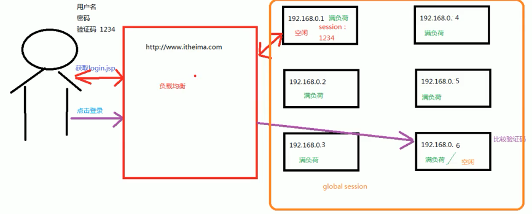
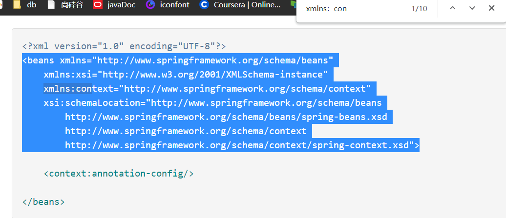
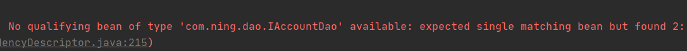
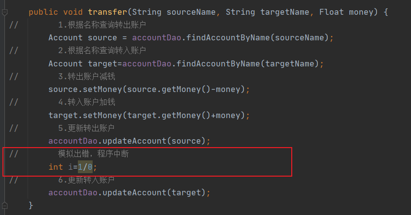
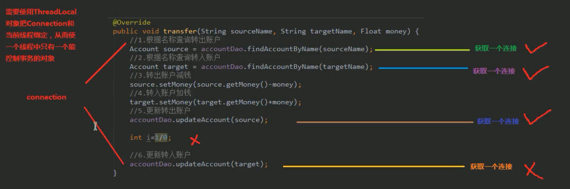
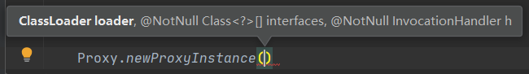
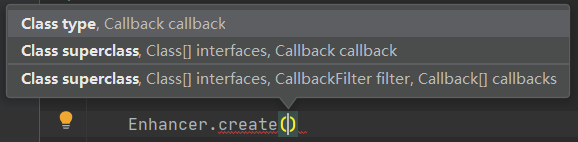
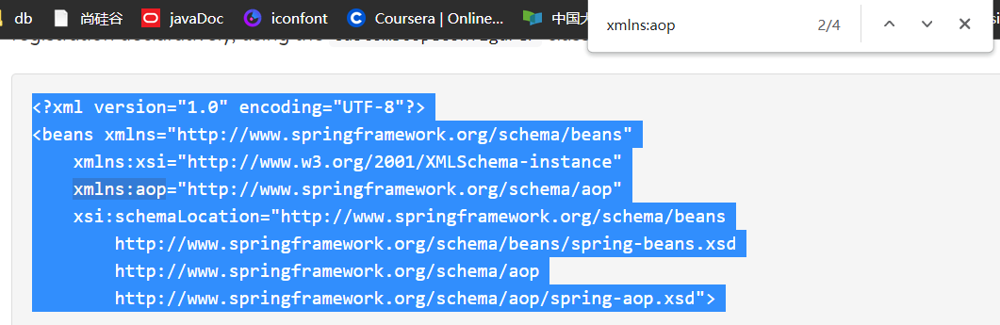
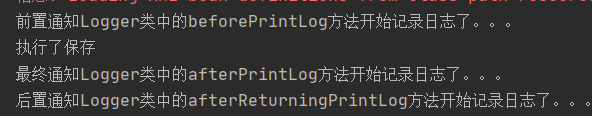
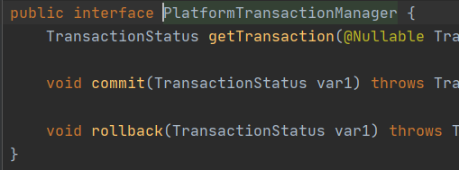

[TOC]

# Spring概述

Spring是分层的Java SE/EE应用**full-stack** 轻量级开源框架，**以IOC (Inverse 0f Control:反转控制）和AOP (Aspect Oriented Programming:面向切面编程〉为内核**，提供了展现层Spring.MVC和持久层Spring JDBC 以及业务层事务管理等众多的企业级应用技术，还能整合开源世界众多著名的第三方框架和类库。

1. 内核：

   1. IoC (Inverse 0f Control:反转控制）
   2. AOP (Aspect Oriented Programming:面向切面编程

2. 优势：

   1. 方便解耦，简化开发
   2. AOP编程的支持
   3. 声明式事务的支持
   4. 方便程序的测试
   5. 方便集成各种优秀框架
   6. 降低JavaEE API的使用难度
   7. Java源码是经典学习范例

3. 体系结构：

   操作都需要有核心容器IOC的支持

   

# 程序的耦合及解耦

## 分析程序的耦合

1. 没有引入依赖时，程序无法运行

   

2. 耦合：程序间的依赖关系

3. 包括：

   1. 类之间的依赖
   2. 方法间的依赖

4. 解耦：降低程序间的依赖关系

5. 实际开发应该做到：编译期不依赖，运行时才依赖

6. 案例：

   1. 改进后编译期就不会报错，因为里面就是一个字符串，没有依赖具体的类：

      

   2. 但是运行时会抛异常：

      

## 工厂模式解耦

### 思路：

1. 使用反射创建对象，避免使用new关键字

2. 通过读取配置文件来获取要创建的对象全限定类名

   得到

### 步骤

1. 创建bean.properties配置文件：

   里面包含了需要创建的类的全限定类名

   ```properties
   accountService=com.ning.service.impl.AccountServiceImpl
   accountDao=com.ning.dao.impl.AccountDaoImpl
   ```

2. 创建一个用于创建Bean对象的工厂

   1. Bean对象：在计算机英语中，有可重用组件的含义
   2. JavaBean：用java语言编写的可重用组件
   3. 注意：**javabean > 实体类**

3. 通过读取配置文件中配置的内容，反射创建对象

4. 代码：

   ```java
   public class BeanFactory {
   //    定义一个Properties对象
       private static Properties props;
   //    定义一个Map（容器），用于存放我们要创建的对象
       private static Map<String,Object> beans;
   
   //    使用静态代码块为Properties对象赋值
       static {
           try{
   //        实例化对象
           props=new Properties();
   //        获取properties文件的流对象
           InputStream in=BeanFactory.class.getClassLoader().getResourceAsStream("bean.properties");
           props.load(in);
   
   //        实例化容器
           beans=new HashMap<String, Object>();
           Enumeration keys=props.keys();
   //        遍历枚举
           while (keys.hasMoreElements()){
   //            取出每个key
               String key=keys.nextElement().toString();
   //            根据key获取value
               String beanPath=props.getProperty(key);
   //            反射创建对象
               Object value=Class.forName(beanPath).newInstance();
               beans.put(key,value);
           }
   //      取出配置文件中所有的
           }catch(Exception e){
               throw new ExceptionInInitializerError("初始化异常");
           }
       }
   
       /**
        * 根据bean的名称获取bean对象(多例)
        * @param beanName
        * @return
        */
   //    public static Object getBean(String beanName){
   //        Object bean = null;
   //        try{
   //            String beanPath=props.getProperty(beanName);
   //            bean=Class.forName(beanPath).newInstance();//每次都会调用默认构造函数创建对象
   //        }catch (Exception e){
   //            e.printStackTrace();
   //        }
   //        return bean;
   //    }
       /**
        * 根据bean的名称获取bean对象(单例)
        * @param beanName
        * @return
        */
       public static Object getBean(String beanName){
           return beans.get(beanName);
       }
   ```

   使用了工厂模式和单例模式。

# IOC

## 概念

1. IOC：控制反转（Inversion Control）
2. 把创建对象的权力交给框架，是框架的重要特征。
3. 包括依赖注入和依赖查找
4. 作用：减低计算机的耦合（解除我们代码中的依赖关系）

# 使用spring的IOC解决程序耦合

## 准备Spring开发包：

1. 官网：https://spring.io/

2. 位置：

   

   1. docs :API 和开发规范. 
   2.  libs :jar 包和源码. 
   3.  schema :约束.

3. 下载地址：http://repo.springsource.org/libs-release-local/org/springframework/spring

## spring基于xml的IOC环境搭建与入门

1. 建立maven工厂，导入依赖：

   ```xml
       <packaging>jar</packaging>
       <dependencies>
           <dependency>
               <groupId>org.springframework</groupId>
               <artifactId>spring-context</artifactId>
               <version>5.0.2.RELEASE</version>
           </dependency>
       </dependencies>
   ```

   

2. 创建配置文件bean.xml

   1. 在spring-framework-5.0.2.RELEASE中进入core

   2. 通过关键字xmlns查找约束：

      

   3. 导约束到bean.xml中：

      ```xml
      <?xml version="1.0" encoding="UTF-8"?>
      <beans xmlns="http://www.springframework.org/schema/beans"
             xmlns:xsi="http://www.w3.org/2001/XMLSchema-instance"
             xsi:schemaLocation="http://www.springframework.org/schema/beans
              http://www.springframework.org/schema/beans/spring-beans.xsd"> 
      </beans>
      ```

   4. 在beans标签中编写bean：

      ```xml
      <!--    把对象的创建交给spring管理-->
          <bean id="accountService" class="com.ning.service.impl.AccountServiceImpl"></bean>
      
          <bean id="accountDao" class="com.ning.dao.impl.AccountDaoImpl"></bean>
      ```

   5. 获取Spring容器的IOC容器，并根据id获取对象：

      ```java
      //        1.获取核心容器对象
              ApplicationContext ac=new ClassPathXmlApplicationContext("bean.xml");
      //        2.根据id获取Bean对象
              IAccountService as= (IAccountService) ac.getBean("accountService");//方式1：强转
              IAccountDao adao=ac.getBean("accountDao",IAccountDao.class);//方式2：提供字节码文件
      ```

### ApplicationContext的三个实现类分析


1. ClassPathXmlApplicationContext（更常用）

   ```java
   ApplicationContext ac=new ClassPathXmlApplicationContext("bean.xml");
   ```

2. FileSystemXmlApplicationContext（不建议）

   ```java
   ApplicationContext ac=new FileSystemXmlApplicationContext("C:\\Users\\86138\\Desktop\\bean.xml");
   ```

3. AnnotationConfigApplicationContext：使用注解

### 核心容器的两个接口引发的问题

1. ApplicationContext（常用）：
   1. 在构建核心容器时，采用立即加载的方式。即一读取完配置文件就创建对象。
   2. 单例对象使用
2. BeanFactory：
   1. 在构建核心容器时，采用延迟加载的方式。即获取对象时才创建对象。 
   2. 多例对象适用

## spring对bean的管理细节

### 创建bean的三种方式

1. 使用默认构造函数创建：

   ```xml
   <bean id="accountService" class="com.ning.service.impl.AccountServiceImpl">
   ```

   1. 使用bean标签

   2. 配id和class属性，且没有其他属性和标签

   3. 注意：如果类中没有默认构造函数，则对象无法创建

      

2. 使用普通工厂中的方法创建对象（使用某个类中的方法创建对象，并存入spring容器）

   ```xml
   <bean id="instanceFactory" class="com.ning.factory.InstanceFactory"></bean>
   <bean id="accountService" factory-bean="instanceFactory" factory-method="getAccountService"></bean>
   ```

3. 使用工厂中的静态方法创建对象（使用某个类中的静态方法创建对象，并存入spring容器）

   ```xml
   <bean id="accountService" class="com.ning.factory.StaticFactory" factory-method="getAccountService"></bean>
   ```

### bean对象的作用范围

bean标签的scope属性

1. 用于指定bean的作用范围

2. 取值：

   1. **singleton：单例（默认值）**

   2. **prototype：多例**

   3. request：作用于web应用的请求范围

   4. session：作用于web应用的会话范围

   5. global-session：作用于集群环境的会话范围（全局会话范围），当不是集群环境时，它就是session

      

3. 使用：直接追加scope标签

   ```xml
   <bean id="accountService" class="com.ning.service.impl.AccountServiceImpl" scope="singleton"></bean>
   ```

### bean对象的生命周期

1. 单例对象
   1. 出生：容器创建时
   2. 活着：只要容器还在，对象就一直活着
   3. 死亡：容器销毁，对象消亡
   4. 总结：单例对象的生命周期和容器相同
2. 多例对象
   1. 出生：当使用对象时spring创建
   2. 活着：对象在使用过程中一直活着
   3. 死亡：当对象长时间不用，且没有别的对象引用时，由java的垃圾回收器回收 

# 依赖注入（Dependency Injection）

1. IOC的作用：降低程序间的耦合（依赖关系）
2. 依赖关系：在当前类需要用到其他类的对象，由spring提供，我们只需要在配置文件中说明
3. 依赖关系的管理：由spring维护
4. **依赖注入：**
   1. 对依赖关系的维护
   2. 能注入的数据：
      1. 基本类型和Spring
      2. 其他bean类型（在配置文件中或注解配置过的bean）
      3. 复杂类型/集合类型
   3. **注入方式：**
      1. 使用构造函数提供
      2. 使用set方法提供
      3. 使用注解提供

## 依赖注入的三种方式

### 1. 构造函数注入

1. 使用的标签：constructor-arg

2. 标签出现的位置：bean标签的内部

3. 标签中的属性：

   1. **type**：用于指定要注入的数据类型，该数据类型也是构造函数中某个或某些参数的类型

      （当有两个一样的数据类型时，type不能独立完成注入）

   2. **index**：用于指定要注入的数据给构造函数中指定索引位置的参数赋值，索引的位置从0开始

   3. **name**：用于指定给构造函数中指定名称的参数赋值

   4. **value：**用于提供基本类型和String类型的数据

   5. **ref：**用于指定其他的bean类型数据，指在spring的Ioc核心容器中出现过的bean对象

4. 优势：在获取bean对象时，注入数据是必须的操作，否则对象无法创建成功。

5. 弊端：改变了bean对象的实例化方法，使我们在创建对象时，用不到的数据也必须提供。

6. 代码：

   ```xml
   <bean id="accountService" class="com.ning.service.impl.AccountServiceImpl">
           <constructor-arg name="name" value="test"></constructor-arg>
           <constructor-arg name="age" value="18"></constructor-arg>
           <constructor-arg name="birthday" ref="now"></constructor-arg>
   </bean>
   
   <!--        配置一个日期对象-->
   <bean id="now" class="java.util.Date"></bean>
   ```

### 2. set方法注入（常用）

1. 使用的标签：property

2. 标签出现的位置：bean标签的内部

3. 标签中的属性：

   1. **name：**用于指定注入时所调用的set方法名称（根据set方法名）
   2. **value：**用于提供基本类型和String类型的数据
   3. **ref：**用于指定其他的bean类型数据，指在spring的Ioc核心容器中出现过的bean对象

4. 代码：

   ```xml
   <bean id="accountService2" class="com.ning.service.impl.AccountServiceImpl2">
           <property name="name" value="TEST"></property>
           <property name="age" value="20"></property>
           <property name="birthday" ref="now"></property>
   </bean>
   
   <!--        配置一个日期对象-->
   <bean id="now" class="java.util.Date"></bean>
   ```

5. 优势：创建对象时没有明确的限制，可以直接使用默认构造函数

6. 弊端：如果有某个成员必须有值，则获取对象时有可能set方法没有执行。

### 3. 复杂类型的注入（集合类型的注入）

1. 用于给List结构集合注入的标签有：

   1. list
   2. array
   3. set

2. 用于给Map结构集合注入的标签有：

   1. map
   2. props

3. 总结：结构相同，标签可以互换

4. 代码：

   ```xml
   <bean id="accountService3" class="com.ning.service.impl.AccountServiceImpl3">
           <property name="myStrs">
                   <array>
                           <value>AAA</value>
                           <value>BBB</value>
                           <value>CCC</value>
                   </array>
           </property>
           <property name="myList">
                   <list>
                           <value>AAA</value>
                           <value>BBB</value>
                           <value>CCC</value>
                   </list>
           </property>
           <property name="mySet">
                   <set>
                           <value>AAA</value>
                           <value>BBB</value>
                           <value>CCC</value>
                   </set>
           </property>
           <property name="myMap">
                   <map>
                           <entry key="testA" value="aaa"></entry>
                           <entry key="testB">
                                   <value>BBB</value>
                           </entry>
                   </map>
           </property>
           <property name="myProps">
                   <props>
                           <prop key="testC">ccc</prop>
                           <prop key="testD">ddd</prop>
                   </props>
           </property>
   </bean>
   ```

# ioc的常用注解

## xml配置回顾：

```xml
<bean id="accountService"     class="com.ning.service.impl.AccountServiceImpl"
scope="" init-method="" destroy-method="">
     <property name="" value="" | ref=""</property>
</bean>
```

## xml配置文件（使用注解）

1. 需要在xml配置文件中告知spring在创建容器时要扫描的包（配置所需要是标签不是在beans的约束中，而是一个名为**context的名称空间**和约束中）

2. 进入文档，core，导入约束：

   

3. 在context名称空间中使用`context:component-scan`标签：

   ```xml
   <?xml version="1.0" encoding="UTF-8"?>
   <beans xmlns="http://www.springframework.org/schema/beans"
          xmlns:xsi="http://www.w3.org/2001/XMLSchema-instance"
          xmlns:context="http://www.springframework.org/schema/context"
          xsi:schemaLocation="http://www.springframework.org/schema/beans
           http://www.springframework.org/schema/beans/spring-beans.xsd
           http://www.springframework.org/schema/context
           http://www.springframework.org/schema/context/spring-context.xsd">
       <context:component-scan base-package="com.ning"></context:component-scan>
   </beans>
   ```

## 注解的分类

### 用于创建对象

1. 作用：和在xml配置文件中编写一个<bean>标签实现的功能是一样的

2. `@Component`

3. 用于把当前类对象存入spring容器中

4. 属性：

   1. value：用于指定bean的id，默认值是当前类名（首字母小写）

   2. 位置：在类名前（只有一个属性可以把value=省略）

      ```java
      @Component(value = "accountService")
      ```

5. 与`@Component`作用和属性一样的注解

   1. `Controller`：一般用在**表现层**
   2. `Service`：一般用在**业务层**
   3. `Repository`：一般用在**持久层**

   以上三个注解是spring为我们提供明确的三层使用注解，使我们的三层对象更加清晰。

### 用于注入数据

1. 作用：和在xml配置文件中<bean>标签中写一个<property>标签的作用是一样的

2. `@Autowired`

   1. 自动按照类型注入。

      1. 只要容器中有唯一的一个bean对象类型和要注入的变量类型匹配，就可以注入成功。
      2. 如果Ioc容器有多个类型匹配时，先圈定数据类型，然后根据变量名称找匹配的id名，如果有匹配则注入成功。
      3. 如果ioc容器中没有任何bean的类型和要注入的变量类型匹配，则报错。

      

   2. 常用位置：

      1. 变量前
      2. 方法前

   3. 在使用注解注入时，set方法不是必须的。

3. `@Qualifier`

   1. 在按照类中注入的基础之上再按照名称注入。
   2. 它在给类成员注入时不能单独使用（要搭配@Autowired一起用），但是在给方法参数注入时可以
   3. 属性：
      1. value：用于指定注入bean的id
   4. 可以在方法传参括号里面写

4. `@resource`

   1. 直接按照bean的id注入，可以单独使用
   2. 属性：
      1. name：用于指定bean的id

5. 以上三个注解都只能注入其他bean类型的数据，而基本类型和String类型无法使用上述注解实现

6. 集合类型的注入只能通过xml实现 

7. `@Value`

   1. 用于输入基本类型和String类型的数据
   2. 属性：
      1. value：用于指定数据的值，可以使用spring中的SpEL（spring的el表达式）
         1. SpEL的写法：$(表达式)

### 用于改变作用范围

1. 作用：和在xml配置文件中<bean>标签中使用scope属性实现的功能是一样的
2. `@Scope`
   1. 用于指定bean的作用范围
   2. 属性：
      1. value：指定范围的取值
      2. 常用取值：
         1. singleton（默认）
         2. prototype

### 和生命周期相关

1. 作用：和在xml配置文件中<bean>标签中使用init-method属性和destroy-method属性的作用是一样的

2. `@PreDestory`：用于指定销毁方法

   ```java
   @PreDestroy
   public void destroy(){
       System.out.println("销毁方法执行了");
   }
   ```

3. `@PostConstruct`：用于指定初始化方法

   ```java
   @PostConstruct
   public void init(){
       System.out.println("初始化方法执行了");
   }
   ```

# IOC案例

1. 基于xml开发：注意获取数据库对象需要设置成多例，否则会出现线程问题

2. 基于注解开发：记得要声明

   ```xml
   <!--    告知spring在创建容器时要扫描的包-->
   <context:component-scan base-package="com.ning"></context:component-scan>
   ```

# Spring的新注解

1. 在config包下创建一个配置类SpringConfiguration，作用与bean.xml一样

2. `@configuration`

   1. 作用：指定当前类是一个配置类
   2. 位置：类前
   3. 当配置类作为AnnotationConfigApplicationContext对象创建的参数时，该注释可以不写**（传参和注解至少写一个，不然就用@Import）**

3. `@ComponentScan`

   1. 作用：用于通过注解指定spring在创建容器时要扫描的包
   2. 位置：类前
   3. 属性：
      1. value（basePackage）：用于指定容器创建时要扫描的包
   4. 与`<context:component-scan base-package="com.ning"></context:component-scan>`作用一样

4. `@Bean`

   1. 作用：用于把当前方法的返回值作为bean对象存入spring的ioc容器中
   2. 位置：方法前
   3. 属性：
      1. name：用于指定bean的id（默认值：当前方法名）
      2. 当使用注解配置方法时，如果方法有参数，spring会去容器中查找有没有可用的bean对象。（查找的方式和Autowired注解的作用是一样的）

5. `@Import`

   1. 作用：用于导入其他的配置类
   2. 位置：类前
   3. 属性：
      1. value：用于指定其他配置类的字节码
   4. 当我们使用了@Import注解之后，有@Import注解的类是父配置类，而导入的都是子配置类

6. `@PropertySource`

   1. 作用：用于指定properties文件的位置

   2. 位置：父配置类前

   3. 属性：

      1. value：指定文件的名称和路径

      2. 关键字：classpath表示类路径下（有包可以在前面加包）

         ```java
         @PropertySource("classpath:jdbcConfig.properties")
         ```

# spring整合junit

1. 当测试方法执行时，没有Ioc容器，就算写了@AutoWired注解也无法注入

2. 配置：

   1. 导入坐标

      ```xml
      <dependency>
          <groupId>org.springframework</groupId>
          <artifactId>spring-test</artifactId>
          <version>5.0.2.RELEASE</version>
      </dependency>
      ```

   2. 使用Junit提供的注解把原有的main方法替换成spring提供`@Runwith`

      ```java
      //在测试类名前编写
      @RunWith(SpringJUnit4ClassRunner.class)
      ```

   3. 告知spring的运行器，spring和ioc创建是基于xml还是注解，并且说明位置 `@ContextConfiguration`

      1. location：指定xml的位置，加上classpath关键字表示在类路径下
      2. classes：指定直接类所在位置

3. 当使用spring5.x版本的时候，要求junit的jar包必须是4.12及以上

4. 演示

   1. 使用xml配置：

      ```java
      @RunWith(SpringJUnit4ClassRunner.class)
      @ContextConfiguration(locations ="classpath:bean.xml" )
      public class AccountServiceTest{
          @Autowired
          private IAccountService as;
          
          @Test
          public void testFindAll() {
      //        3.执行方法
              List<Account> accounts=as.findAllAccount();
              for (Account account : accounts) {
                  System.out.println(account);
              }
          }
      }
      ```

   2. 使用注解配置：

      ```java
      @RunWith(SpringJUnit4ClassRunner.class)
      @ContextConfiguration(classes = SpringConfiguration.class)
      public class AccountServiceTest{
          @Autowired
          IAccountService as=null;
      
          @Test
          public void testFindAll() {
      //        3.执行方法
              List<Account> accounts=as.findAllAccount();
              for (Account account : accounts) {
                  System.out.println(account);
              }
          }
      }
      ```

# 分析事务的问题

1. 场景：

   

2. 分问题析：数据无法达到一致性

3. 解决：使连接只获取一次

   

   需要使用**ThreadLocal对象**把Connection和当前线程绑定，从而使一个线程中只有一个能控制事务的对象。

4. 调整：

   1. 事务控制应该都是在业务层，即service层

   2. 编写**ConnectionUtils类**：连接的工具类，用于从数据源中获取一个连接，并且实现和线程的绑定

      1. 新增成员变量ThreadLocal和DataSource，DataSource由Spring注入（需要新增set方法）

         ```java
         private ThreadLocal<Connection> t1 = new ThreadLocal<Connection>();
         
         private DataSource dataSource;
         
         public void setDataSource(DataSource dataSource) {
             this.dataSource = dataSource;
         }
         ```

      2. 编写getThreadConnection方法：

         ```java
         /**
          * 获取当前线程上的连接
          *
          * @return
          */
         public Connection getThreadConnection() {
             try {
         //      1.先从ThreadLocal上获取
                 Connection conn = t1.get();
         //      2.判断当前线程上是否有连接
                 if (conn == null) {
         //          3.从数据源中获取一个连接，并且存入ThreadLocal中
                     conn = dataSource.getConnection();
                     t1.set(conn);
                 }
         //          返回当前线程上的连接
                 return conn;
         
             } catch (Exception e) {
                 throw new RuntimeException(e);
             }
         }
         ```

   3. 编写**TransactionManager类**：和事务管理相关的工具类，包含了开启事务、提交事务、回滚事务和释放连接

      ```java
      public class TransactionManager {
          private ConnectionUtils connectionUtils;
      
          public void setConnectionUtils(ConnectionUtils connectionUtils) {
              this.connectionUtils = connectionUtils;
          }
      
          /**
           * 开启事务
           */
          public void beginTransaction(){
              try {
      //            事务提交：把手动提交改为自动提交
                  connectionUtils.getThreadConnection().setAutoCommit(false);
              } catch (SQLException e) {
                  e.printStackTrace();
              }
          }
      
          /**
           * 提交事务
           */
          public void commit(){
              try {
                  connectionUtils.getThreadConnection().commit();
              } catch (SQLException e) {
                  e.printStackTrace();
              }
          }
      
          /**
           * 回滚事务
           */
          public void rollback(){
              try {
                  connectionUtils.getThreadConnection().rollback();
              } catch (SQLException e) {
                  e.printStackTrace();
              }
          }
      
          /**
           * 释放连接
           */
          public void release(){
              try {
      //            还回连接池中
                  connectionUtils.getThreadConnection().close();
                  connectionUtils.removeConnection();//解绑
              } catch (SQLException e) {
                  e.printStackTrace();
              }
          }
      }
      ```

      并且需要在ConnectionUtils类中新增removeConnection()方法：

      ```java
      /**
       * 把连接和线程解绑
       */
      public void removeConnection(){
          t1.remove();
      }
      ```

   4. 数据库连接不在连接池中取出，不需要注入数据源

   5. dao的实现类中新增ConnectionUtils成员变量，并提供set方法，执行方法query()中的第一个参数应为`connectionUtils.getThreadConnection()`

   6. 修改service层：

      1. 新增TransactionManager类型的成员变量，并且生成set方法让spring帮我们注入

   7. 注入新增类的约束等：

      ```xml
      <!--    配置Connection工具类ConnectionUtils-->
          <bean id="connectionUtils" class="com.ning.utils.ConnectionUtils">
              <!--注入数据源-->
              <property name="dataSource" ref="dataSource"></property>
          </bean>
      
      <!--    配置事务管理器-->
          <bean id="txManager" class="com.ning.utils.TransactionManager">
              <property name="connectionUtils" ref="connectionUtils"></property>
          </bean>
      ```

# 动态代理回顾

1. 特点；字节码随用随创建，随用随加载
2. 作用：不修改源码的基础上对方法增强
3. 分类：
   1. 基于接口的动态代理
   2. 基于子类的动态代理

## 基于接口的动态代理

1. 涉及的类：`Proxy`

2. 提供者：JDK

3. 创建代理对象方法：

   1. 使用Proxy类中的`newProxyInstance()`方法

4. 创建代理类条件：

   1. 被代理类最少实现一个接口，如果没有则无法使用

5. `newProxyInstance()`参数：

   

   1. ClassLoader：
      1. 用于加载代理对象字节码
      2. 和被代理对象使用相同的类加载器
      3. 固定写法
   2. Class[]：
      1. 用于让代理对象和被代理对象有相同的方法
      2. 固定写法
   3. InvocationHandler
      1. 用于提供增强的代码
      2. 写如何代理，一般写一个该接口的实现类，通常情况下写匿名内部类
      3. 非必须
      4. 此接口的实现类都是谁用谁写

```java
IProducer proxyProducer=(IProducer)Proxy.newProxyInstance(producer.getClass().getClassLoader(),
        producer.getClass().getInterfaces(),
        new InvocationHandler() {
            /**
             * invoke()作用：执行被代理对象的任何接口方法都会经过该方法
             * @param proxy 代理对象的引用
             * @param method 当前执行的方法
             * @param args 当前执行方法所需的参数
             * @return 和被代理对象方法有相同的返回值
             * @throws Throwable
             */
            public Object invoke(Object proxy, Method method, Object[] args) throws Throwable {
                  //提供增强的代码
                Object returnValue=null;
                  //1.获取方法执行的参数
                Float money= (Float) args[0];
                  //2.判断当前方法是不是销售
                if ("saleProduct".equals(method.getName())) {
                    return returnValue=method.invoke(producer,money*0.8f);
                }
                return returnValue;
            }
        });
proxyProducer.saleProduct(10000f);
```

## 基于子类的动态代理

1. 导依赖：

   ```xml
   <dependency>
       <groupId>cglib</groupId>
       <artifactId>cglib</artifactId>
       <version>2.1_3</version>
   </dependency>
   ```

2. 涉及的类：`Enhancer`

3. 提供者：第三方cglib库

4. 创建代理对象方法：

   1. 使用Enhancer类中的`create()`方法

5. 创建代理类条件：

   1. 被代理类不能是最终类

6. `create()`方法参数：

   

   1. Class：
      1. 用于指定被代理对象的字节码
   2. Callback：
      1. 用于提供增强的代码
      2. 写如何代理，一般写一个该接口的实现类，通常情况下写匿名内部类
      3. 非必须
      4. 此接口的实现类都是谁用谁写
      5. 一般写该接口的子接口实现类：`MethodInterceptor`

```java
final Producer producer = new Producer();
Producer cglibProducer= (Producer) Enhancer.create(producer.getClass(), new MethodInterceptor() {
    /**
     * 执行被代理对象的任何方法都会经过该方法
     * @param o
     * @param method
     * @param objects
     * 以上三个参数和基于接口的动态代理中的invoke方法的参数是一样的
     * @param methodProxy 当前执行方法的代理对象
     * @return
     * @throws Throwable
     */
    public Object intercept(Object o, Method method, Object[] objects, MethodProxy methodProxy) throws Throwable
                  //提供增强的代码
        Object returnValue=null;
                  //1.获取方法执行的参数
        Float money= (Float) objects[0];
                  //2.判断当前方法是不是销售
        if ("saleProduct".equals(method.getName())) {
            return returnValue=method.invoke(producer,money*0.8f);
        }
        return returnValue;
    }
});
cglibProducer.saleProduct(12000f);
```

## 使用动态代理实现事务控制

1. 创建BeanFactory类，用于创建代理对象

2. 创建getAccountService()方法用于获取代理对象：

   1. 在里面编写事务控制

   ```java
   public IAccountService getAccountService() {
       return (IAccountService) Proxy.newProxyInstance(accountService.getClass().getClassLoader(),
               accountService.getClass().getInterfaces(),
               new InvocationHandler() {
                   /**
                    * 添加事务的支持
                    * @param proxy
                    * @param method
                    * @param args
                    * @return
                    * @throws Throwable
                    */
                   public Object invoke(Object proxy, Method method, Object[] args) throws Throwable {
                       Object rtValue=null;
                       try {
                   //        1.开启事务
                           txManager.beginTransaction();
                   //        2.执行操作
                           rtValue=method.invoke(accountService,args);
                   //        3.提交事务
                           txManager.commit();
                   //        4.返回结果
                           return rtValue;
                       } catch (Exception e) {
                   //        5.回滚操作
                           txManager.rollback();
                           throw new RuntimeException(e);
                       } finally {
                   //        6.释放连接
                           txManager.release();
                       }
                   }
               });
   }
   ```

3. 需要增加注解@Quelifier指定对象id：

   ```java
       @Autowired
       @Qualifier("proxyAccountService")
       private IAccountService as;
   ```

4. 导入约束：

   ```xml
   <!--    配置代理的service对象-->
       <bean id="proxyAccountService" factory-bean="beanFactory" factory-method="getAccountService"></bean>
   
   <!--    配置beanfactory-->
       <bean id="beanFactory" class="com.ning.factory.BeanFactory">
   <!--        注入service-->
           <property name="accountService" ref="accountService"></property>
   <!--        注入事务管理器-->
           <property name="txManager" ref="txManager"></property>
       </bean>
   ```

# AOP概念

1. 全称：Aspect Oriented Programming，即面向切面编程
2. 作用：在程序运行期间，不修改源码对已有方法进行增强
3. 优势：
   1. 减少重复代码
   2. 提高开发效率
   3. 维护方便
4. 实现方式：动态代理

## spring中的AOP

### 相关术语

1. Joinpoint（连接点）：在spring中就是方法

2. Pointcut（切入点）：没有被增强的连接点（连接点）

3. Advice（通知）：前置通知，后置通知，异常通知，最终通知，环绕通知

   

4. Introduction(引介)：引介是一种特殊的通知在不修改类代码的前提下, Introduction 可以在运行期为类动态地添加一些方 法或 Field。

5. Target(目标对象): 代理的目标对象。 

6. Weaving(织入): 是指把增强应用到目标对象来创建新的代理对象的过程。 spring 采用动态代理织入，而 AspectJ 采用编译期织入和类装载期织入。 

7. Proxy（代理）: 一个类被 AOP 织入增强后，就产生一个结果代理类。

8.  Aspect(切面): 是切入点和通知（引介）的结合。

## 基于xml的AOP配置

### 使用步骤

1. 导入aop的约束：

   

   ```xml
   <?xml version="1.0" encoding="UTF-8"?>
   <beans xmlns="http://www.springframework.org/schema/beans"
          xmlns:xsi="http://www.w3.org/2001/XMLSchema-instance"
          xmlns:aop="http://www.springframework.org/schema/aop"
          xsi:schemaLocation="http://www.springframework.org/schema/beans
           http://www.springframework.org/schema/beans/spring-beans.xsd
           http://www.springframework.org/schema/aop
           http://www.springframework.org/schema/aop/spring-aop.xsd">
   </beans>
   ```

2. 把通知Bean也交给spring管理：

   ```xml
   <bean id="logger" class="com.ning.utils.Logger"></bean>
   ```

3. 使用aop:config标签表明开始aop的配置：

   ```xml
   <aop:config>   
   </aop:config>
   ```

4. 使用aop:aspect标签表明配置切面：

   1. id属性：给切面提供一个唯一标识
   2. ref属性：指定通知类bean的id

   ```xml
   <aop:config>
       <aop:aspect id="logAdvice" ref="logger"></aop:aspect>
   </aop:config>
   ```

5. 在aop:aspect标签内部使用对应标签来配置通知的类型

   1. `aop:before`标签：表示配置前置通知

      1. method属性：用于指定哪个方法是前置通知

      2. pointcut属性：用于指定切入点表达式，该表达式指的是对业务层中哪些方法增强

         - 切入点表达式的写法：

           - 关键字：execution（表达式）

           - 表达式：访问修饰符 返回值 包名.包名.包名...类名.方法名（参数列表）

           - 标准的表达式写法：

             `public void com.ning.service.impl.AccountServiceImpl.saveAccount()`

      ```xml
          <aop:config>
      <!--        配置切面-->
              <aop:aspect id="logAdvice" ref="logger">
                  <!--            配置通知的类型并且建立通知方法和切入点方法的关联-->
                  <!--            示例：让printlog方法在切入点方法执行之前执行，所以是前置通知-->
                  <aop:before method="printLog" pointcut="execution(public void com.ning.service.impl.AccountServiceImpl.saveAccount())"></aop:before>
              </aop:aspect>
          </aop:config>
      ```

### 切入点表达式的写法

1. 表达式：

   访问修饰符 返回值 包名.包名.包名...类名.方法名（参数列表）

2. 标准的表达式写法：

   `public void com.ning.service.impl.AccountServiceImpl.saveAccount()`

   1. 访问修饰符可以省略
   2. 返回值可以使用通配符，表示任意返回值
   3. 包名可以使用通配符，表示任意返回值
      1. **（有几级包就要写几个*）**
      2. 包名可以使用..表示当前包及其子包
   4. 类名和方法名都可以使用*实现通配
   5. 参数列表：
      1. 基本类型直接写名称：`int`
      2. 引用类型写包名.类名的方式：`java.lang.String`
      3. 可以使用通配符表示任意类型，写了*必须是**有参**的
      4. 表示**有无参数均可**：`..`，有参数可以是任意类型

3. （一般不用）全通配写法：`* *..*.*(..)`

4. （通常）写法：

   1. 切到业务层实现类下的所有方法
   2. 示例：`* com.ning.service.impl.*.*(..)`

5. 配置切入点表达式：

   1. 属性
      1. `id`属性：指定表达式的唯一标识
      2. `expression`属性：指定表达式内容
   2. 位置
      1. `aop:aspec`标签内部：只能当前切面使用
      2. `aop:aspec`标签前面：所有切面都能使用（**不能在`aop:aspec`标签后面**）

   ```xml
   <!--配置aop-->
   <aop:config>
   <!--    配置切面-->
       <aop:aspect id="logAdvice" ref="logger">
   <!--        配置切入点表达式-->
           <aop:pointcut id="pt1" expression="execution(* com.ning.service.impl.*.*(..))"/>
               <!--        配置前置通知-->
           <aop:before method="beforePrintLog" pointcut-ref="pt1"></aop:before>
   
   
       </aop:aspect>
   </aop:config>
   ```

6. 附：用于解析切入点表达式的包

   ```xml
   <dependency>
       <groupId>org.aspectj</groupId>
       <artifactId>aspectjweaver</artifactId>
       <version>1.8.7</version>
   </dependency>
   ```

### 常用通知类型

1. 前置通知：

   1. 在切入点方法执行之前执行

   2. 配置：

      ```xml
      <!--配置aop-->
      <aop:config>
      <!--    配置切面-->
          <aop:aspect id="logAdvice" ref="logger">
      <!--        配置前置通知-->
              <aop:before method="beforePrintLog" pointcut="execution(* *..*.*(..))"></aop:before>
          </aop:aspect>
      </aop:config>
      ```

2. 后置通知：

   1. 在切入点方法正常执行之后执行

   2. 配置：

      ```xml
      <!--配置aop-->
      <aop:config>
      <!--    配置切面-->
          <aop:aspect id="logAdvice" ref="logger">
      <!--        配置后置通知-->
              <aop:after-returning method="afterReturningPrintLog" pointcut="execution(* *..*.*(..))"></aop:after-returning>
          </aop:aspect>
      </aop:config>
      ```

3. 异常通知：

   1. 在切入点方法执行产生异常之后执行

   2. 配置：

      ```xml
      <!--配置aop-->
      <aop:config>
      <!--    配置切面-->
          <aop:aspect id="logAdvice" ref="logger">
      <!--        配置异常通知-->
              <aop:after-throwing method="afterThrowingPrintLog" pointcut="execution(* *..*.*(..))"></aop:after-throwing>
          </aop:aspect>
      </aop:config>
      ```

   **注意：后置通知和异常通知只能执行一次（即要么回滚要么提交）**

4. 最终通知：

   1. 无论切入点方法是否正常执行，都会执行最终通知

   2. 配置：

      ```xml
      <!--配置aop-->
      <aop:config>
      <!--    配置切面-->
          <aop:aspect id="logAdvice" ref="logger">
      <!--        配置最终通知-->
              <aop:after method="afterPrintLog" pointcut="execution(* *..*.*(..))"></aop:after>
          </aop:aspect>
      </aop:config>
      ```

5. 环绕通知：

   1. 问题：配置了环绕通知后，切入点方法没有执行，而通知方法执行了
   2. 分析：通过对比动态代理中的环绕通知代码，发现动态代理的环绕通知有明确的切入点方法调用，我们没有
   3. **解决：**
      1. 明确调用切入点方法：spring提供的接口`ProceedingJoinPoint`接口的`proceed()`方法
      2. 该接口可以作为环绕通知的方法参数，在程序执行时，spring会为我们提供该接口的实现类
   4. 环绕通知是spring为我们提供的一种可以在代码中手动控制增强方法何时执行的方式

   ```java
   /**
    * 环绕通知
    */
   public Object aroundPrintLog(ProceedingJoinPoint pjp){
       Object rtValue=null;
       try {
           Object[] args = pjp.getArgs();//得到方法执行所需的参数
           System.out.println("Logger类中的aroundPrintLog方法开始记录日志了。。。前置");//在切入点方法前
           rtValue=pjp.proceed(args);//明确调用业务层方法（切入点方法）
           System.out.println("Logger类中的aroundPrintLog方法开始记录日志了。。。后置");//在切入点方法后
           return rtValue;
       } catch (Throwable throwable) {
           System.out.println("Logger类中的aroundPrintLog方法开始记录日志了。。。异常");//在catch里面
           throw new RuntimeException(throwable);
       } finally {
           System.out.println("Logger类中的aroundPrintLog方法开始记录日志了。。。最终");//在finally里面
       }
   }
   ```

## 基于注解的AOP配置

1. 导约束：

   ```xml
   <?xml version="1.0" encoding="UTF-8"?>
   <beans xmlns="http://www.springframework.org/schema/beans"
          xmlns:xsi="http://www.w3.org/2001/XMLSchema-instance"
          xmlns:aop="http://www.springframework.org/schema/aop"
          xmlns:context="http://www.springframework.org/schema/context"
          xsi:schemaLocation="http://www.springframework.org/schema/beans
           http://www.springframework.org/schema/beans/spring-beans.xsd
           http://www.springframework.org/schema/aop
           http://www.springframework.org/schema/aop/spring-aop.xsd
           http://www.springframework.org/schema/context
           http://www.springframework.org/schema/context/spring-context.xsd">
   ```

2. xml文件中的其他配置：

   ```xml
   <!--    配置spring创建容器时要扫描的包-->
       <context:component-scan base-package="com.ning"></context:component-scan>
   
   <!--    配置spring开启注解aop的支持-->
   <!--    写上就支持，不写就不支持-->
       <aop:aspectj-autoproxy></aop:aspectj-autoproxy>
   ```

3. `@Aspect`：表示当前类是切面类

4. `@Before()`：前置通知

5. `@AfterReturning`：后置通知

6. `@AfterThrowing`：异常通知

7. `@After()`：最终通知

8. `@Around()`：环绕通知

9. 配置切入点表达式：

   ```java
   @Pointcut("execution(* com.ning.service.impl.*.*(..))")
   private void pt1(){}
   ```

10. 注：配置会出现顺序问题：

    

    **但是使用环绕通知不会。**

# JdbcTemplate

1. 作用：用于与数据库交互，实现对表的crud操作

2. 导包：

   ```xml
   <dependency>
       <groupId>org.springframework</groupId>
       <artifactId>spring-jdbc</artifactId>
       <version>5.0.2.RELEASE</version>
   </dependency>
   
   <dependency>
       <groupId>org.springframework</groupId>
       <artifactId>spring-tx</artifactId>
       <version>5.0.2.RELEASE</version>
   </dependency>
   ```

3. bean.xml中配置：

   ```xml
   <!--    配置数据源-->
       <bean id="dataSource" class="org.springframework.jdbc.datasource.DriverManagerDataSource">
           <property name="driverClassName" value="com.mysql.jdbc.Driver"></property>
           <property name="url" value="jdbc:mysql://localhost:3306/eesy"></property>
           <property name="username" value="root"></property>
           <property name="password" value="ning"></property>
       </bean>
   
   <!--    配置jdbcTemplate-->
       <bean id="jdbcTemplate" class="org.springframework.jdbc.core.JdbcTemplate">
           <property name="dataSource" ref="dataSource"></property>
       </bean>
   ```

## JdbcTemplate的CRUD

先获取容器和JdbcTemplate对象：

```java
//        1.获取容器
        ApplicationContext ac=new ClassPathXmlApplicationContext("bean.xml");
//        2.获取对象
        JdbcTemplate jt=ac.getBean("jdbcTemplate",JdbcTemplate.class);
```

1. 保存：

   ```java
   jt.update("insert into account (name,money) values (?,?);","eee",333f);
   ```

2. 更新：

   ```java
   jt.update("update account set name=?,money=? where id=?","test",4567,7);
   ```

3. 删除：

   ```java
   jt.update("delete from account where id=?",8);
   ```

4. 查询

   1. 查询一个：

      ```java
      List<Account> accounts=jt.query("select * from account where id=?",new AccountRowMapper(),1);
      
      System.out.println(accounts.isEmpty()?"没有内容":accounts.get(0));
      ```

   2. 查询所有：

      1. 方式一：

         ```java
         List<Account> accounts=jt.query("select * from account where money>?",new AccountRowMapper(),1000f);
         
         for (Account account : accounts) {
             System.out.println(account);
         }
         ```

         需要新建一个类定义Account的封装策略：

         ```java
         class AccountRowMapper implements RowMapper<Account>{
             /**
              * 把结果集中的数据封装到Account中，然后由Spring把每个Account加到集合中
              * @param resultSet
              * @param i
              * @return
              * @throws SQLException
              */
             public Account mapRow(ResultSet resultSet, int i) throws SQLException {
                 Account account = new Account();
                 account.setId(resultSet.getInt("id"));
                 account.setName(resultSet.getString("name"));
                 account.setMoney(resultSet.getFloat("money"));
                 return account;
             }
         }
         ```

      2. 方式二：

         ```java
         List<Account> accounts=jt.query("select * from account where money>?",new BeanPropertyRowMapper<Account>(Account.class),1000f);
         
         for (Account account : accounts) {
             System.out.println(account);
         }
         ```

   3. 查询返回一行一列（使用聚合函数，但不加group by子句）

      ```java
      Long count = jt.queryForObject("select count(*) from account where money > ?", Long.class, 1000f);
      
      System.out.println(count);
      ```

## 在持久层使用JdbcTemplate

1. （使用注解开发时建议用）直接编写在持久层实现类中：

   ```java
   private JdbcTemplate jdbcTemplate;
   
   public void setJdbcTemplate(JdbcTemplate jdbcTemplate) {
       this.jdbcTemplate = jdbcTemplate;
   }
   ```

2. （使用xml开发时建议用）实现类继承`JdbcDaoSupport`类，该类中会提供JdbcTemplate，相当于：

   ```java
   public class JdbcDaoSupport1 {
       private JdbcTemplate jdbcTemplate;
   
       public void setJdbcTemplate(JdbcTemplate jdbcTemplate) {
           this.jdbcTemplate = jdbcTemplate;
       }
   
       public JdbcTemplate getJdbcTemplate() {
           return jdbcTemplate;
       }
   
       public void setDataSource(DataSource dataSource){
           if (jdbcTemplate==null){
               jdbcTemplate=createJdbcTemplate(dataSource);
           }
       }
   
       private JdbcTemplate createJdbcTemplate(DataSource dataSource) {
           return new JdbcTemplate(dataSource);
       }
   }
   ```

# Spring的事务控制

## 事务控制的一组API

导包：

```xml
<dependency>
    <groupId>org.springframework</groupId>
    <artifactId>spring-tx</artifactId>
    <version>5.0.2.RELEASE</version>
</dependency>
```

1. `PlatformTransactionManager`接口
   1. 里面有commit()和rollback()方法：
   2. 
