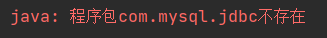

[TOC]

# Spring概述

Spring是分层的Java SE/EE应用**full-stack** 轻量级开源框架，**以IOC (Inverse 0f Control:反转控制）和AOP (Aspect Oriented Programming:面向切面编程〉为内核**，提供了展现层Spring.MVC和持久层Spring JDBC 以及业务层事务管理等众多的企业级应用技术，还能整合开源世界众多著名的第三方框架和类库。

1. 内核：

   1. IoC (Inverse 0f Control:反转控制）
   2. AOP (Aspect Oriented Programming:面向切面编程

2. 优势：

   1. 方便解耦，简化开发
   2. AOP编程的支持
   3. 声明式事务的支持
   4. 方便程序的测试
   5. 方便集成各种优秀框架
   6. 降低JavaEE API的使用难度
   7. Java源码是经典学习范例

3. 体系结构：

   操作都需要有核心容器IOC的支持

   

# 程序的耦合及解耦

## 分析程序的耦合

1. 没有引入依赖时，程序无法运行

   

2. 耦合：程序间的依赖关系

3. 包括：

   1. 类之间的依赖
   2. 方法间的依赖

4. 解耦：降低程序间的依赖关系

5. 实际开发应该做到：编译期不依赖，运行时才依赖

6. 案例：

   1. 改进后编译期就不会报错，因为里面就是一个字符串，没有依赖具体的类：

      

   2. 但是运行时会抛异常：

      

## 工厂模式解耦

### 思路：

1. 使用反射创建对象，避免使用new关键字

2. 通过读取配置文件来获取要创建的对象全限定类名

   得到

### 步骤

1. 创建bean.properties配置文件：

   里面包含了需要创建的类的全限定类名

   ```properties
   accountService=com.ning.service.impl.AccountServiceImpl
   accountDao=com.ning.dao.impl.AccountDaoImpl
   ```

2. 创建一个用于创建Bean对象的工厂

   1. Bean对象：在计算机英语中，有可重用组件的含义
   2. JavaBean：用java语言编写的可重用组件
   3. 注意：**javabean > 实体类**

3. 通过读取配置文件中配置的内容，反射创建对象

4. 代码：

   ```java
   public class BeanFactory {
   //    定义一个Properties对象
       private static Properties props;
   //    定义一个Map（容器），用于存放我们要创建的对象
       private static Map<String,Object> beans;
   
   //    使用静态代码块为Properties对象赋值
       static {
           try{
   //        实例化对象
           props=new Properties();
   //        获取properties文件的流对象
           InputStream in=BeanFactory.class.getClassLoader().getResourceAsStream("bean.properties");
           props.load(in);
   
   //        实例化容器
           beans=new HashMap<String, Object>();
           Enumeration keys=props.keys();
   //        遍历枚举
           while (keys.hasMoreElements()){
   //            取出每个key
               String key=keys.nextElement().toString();
   //            根据key获取value
               String beanPath=props.getProperty(key);
   //            反射创建对象
               Object value=Class.forName(beanPath).newInstance();
               beans.put(key,value);
           }
   //      取出配置文件中所有的
           }catch(Exception e){
               throw new ExceptionInInitializerError("初始化异常");
           }
       }
   
       /**
        * 根据bean的名称获取bean对象(多例)
        * @param beanName
        * @return
        */
   //    public static Object getBean(String beanName){
   //        Object bean = null;
   //        try{
   //            String beanPath=props.getProperty(beanName);
   //            bean=Class.forName(beanPath).newInstance();//每次都会调用默认构造函数创建对象
   //        }catch (Exception e){
   //            e.printStackTrace();
   //        }
   //        return bean;
   //    }
       /**
        * 根据bean的名称获取bean对象(单例)
        * @param beanName
        * @return
        */
       public static Object getBean(String beanName){
           return beans.get(beanName);
       }
   ```

   使用了工厂模式和单例模式。

# IOC

## 概念

1. IOC：控制反转（Inversion Control）
2. 把创建对象的权力交给框架，是框架的重要特征。
3. 包括依赖注入和依赖查找
4. 作用：减低计算机的耦合（解除我们代码中的依赖关系）

# 使用spring的IOC解决程序耦合

## 准备Spring开发包：

1. 官网：https://spring.io/

2. 位置：

   

   1. docs :API 和开发规范. 
   2.  libs :jar 包和源码. 
   3.  schema :约束.

3. 下载地址：http://repo.springsource.org/libs-release-local/org/springframework/spring

## spring基于xml的IOC环境搭建与入门

1. 建立maven工厂，导入依赖：

   ```xml
       <packaging>jar</packaging>
       <dependencies>
           <dependency>
               <groupId>org.springframework</groupId>
               <artifactId>spring-context</artifactId>
               <version>5.0.2.RELEASE</version>
           </dependency>
       </dependencies>
   ```

   

2. 创建配置文件bean.xml

   1. 在spring-framework-5.0.2.RELEASE中进入core

   2. 通过关键字xmlns查找约束：

      

   3. 导约束到bean.xml中：

      ```xml
      <?xml version="1.0" encoding="UTF-8"?>
      <beans xmlns="http://www.springframework.org/schema/beans"
             xmlns:xsi="http://www.w3.org/2001/XMLSchema-instance"
             xsi:schemaLocation="http://www.springframework.org/schema/beans
              http://www.springframework.org/schema/beans/spring-beans.xsd"> 
      </beans>
      ```

   4. 在beans标签中编写bean：

      ```xml
      <!--    把对象的创建交给spring管理-->
          <bean id="accountService" class="com.ning.service.impl.AccountServiceImpl"></bean>
      
          <bean id="accountDao" class="com.ning.dao.impl.AccountDaoImpl"></bean>
      ```

   5. 获取Spring容器的IOC容器，并根据id获取对象：

      ```java
      //        1.获取核心容器对象
              ApplicationContext ac=new ClassPathXmlApplicationContext("bean.xml");
      //        2.根据id获取Bean对象
              IAccountService as= (IAccountService) ac.getBean("accountService");//方式1：强转
              IAccountDao adao=ac.getBean("accountDao",IAccountDao.class);//方式2：提供字节码文件
      ```

### ApplicationContext的三个实现类分析


1. ClassPathXmlApplicationContext（更常用）

   ```java
   ApplicationContext ac=new ClassPathXmlApplicationContext("bean.xml");
   ```

2. FileSystemXmlApplicationContext（不建议）

   ```java
   ApplicationContext ac=new FileSystemXmlApplicationContext("C:\\Users\\86138\\Desktop\\bean.xml");
   ```

3. AnnotationConfigApplicationContext：使用注解

### 核心容器的两个接口引发的问题

1. ApplicationContext（常用）：
   1. 在构建核心容器时，采用立即加载的方式。即一读取完配置文件就创建对象。
   2. 单例对象使用
2. BeanFactory：
   1. 在构建核心容器时，采用延迟加载的方式。即获取对象时才创建对象。 
   2. 多例对象适用

## spring对bean的管理细节

### 创建bean的三种方式

1. 使用默认构造函数创建：

   ```xml
   <bean id="accountService" class="com.ning.service.impl.AccountServiceImpl">
   ```

   1. 使用bean标签

   2. 配id和class属性，且没有其他属性和标签

   3. 注意：如果类中没有默认构造函数，则对象无法创建

      

2. 使用普通工厂中的方法创建对象（使用某个类中的方法创建对象，并存入spring容器）

   ```xml
   <bean id="instanceFactory" class="com.ning.factory.InstanceFactory"></bean>
   <bean id="accountService" factory-bean="instanceFactory" factory-method="getAccountService"></bean>
   ```

3. 使用工厂中的静态方法创建对象（使用某个类中的静态方法创建对象，并存入spring容器）

   ```xml
   <bean id="accountService" class="com.ning.factory.StaticFactory" factory-method="getAccountService"></bean>
   ```

### bean对象的作用范围

bean标签的scope属性

1. 用于指定bean的作用范围

2. 取值：

   1. **singleton：单例（默认值）**

   2. **prototype：多例**

   3. request：作用于web应用的请求范围

   4. session：作用于web应用的会话范围

   5. global-session：作用于集群环境的会话范围（全局会话范围），当不是集群环境时，它就是session

      

3. 使用：直接追加scope标签

   ```xml
   <bean id="accountService" class="com.ning.service.impl.AccountServiceImpl" scope="singleton"></bean>
   ```

### bean对象的生命周期

1. 单例对象
   1. 出生：容器创建时
   2. 活着：只要容器还在，对象就一直活着
   3. 死亡：容器销毁，对象消亡
   4. 总结：单例对象的生命周期和容器相同
2. 多例对象
   1. 出生：当使用对象时spring创建
   2. 活着：对象在使用过程中一直活着
   3. 死亡：当对象长时间不用，且没有别的对象引用时，由java的垃圾回收器回收 

# 依赖注入（Dependency Injection）

1. IOC的作用：降低程序间的耦合（依赖关系）
2. 依赖关系：在当前类需要用到其他类的对象，由spring提供，我们只需要在配置文件中说明
3. 依赖关系的管理：由spring维护
4. **依赖注入：**
   1. 对依赖关系的维护
   2. 能注入的数据：
      1. 基本类型和Spring
      2. 其他bean类型（在配置文件中或注解配置过的bean）
      3. 复杂类型/集合类型
   3. **注入方式：**
      1. 使用构造函数提供
      2. 使用set方法提供
      3. 使用注解提供

## 依赖注入的三种方式

### 1. 构造函数注入

1. 使用的标签：constructor-arg

2. 标签出现的位置：bean标签的内部

3. 标签中的属性：

   1. **type**：用于指定要注入的数据类型，该数据类型也是构造函数中某个或某些参数的类型

      （当有两个一样的数据类型时，type不能独立完成注入）

   2. **index**：用于指定要注入的数据给构造函数中指定索引位置的参数赋值，索引的位置从0开始

   3. **name**：用于指定给构造函数中指定名称的参数赋值

   4. **value：**用于提供基本类型和String类型的数据

   5. **ref：**用于指定其他的bean类型数据，指在spring的Ioc核心容器中出现过的bean对象

4. 优势：在获取bean对象时，注入数据是必须的操作，否则对象无法创建成功。

5. 弊端：改变了bean对象的实例化方法，使我们在创建对象时，用不到的数据也必须提供。

6. 代码：

   ```xml
   <bean id="accountService" class="com.ning.service.impl.AccountServiceImpl">
           <constructor-arg name="name" value="test"></constructor-arg>
           <constructor-arg name="age" value="18"></constructor-arg>
           <constructor-arg name="birthday" ref="now"></constructor-arg>
   </bean>
   
   <!--        配置一个日期对象-->
   <bean id="now" class="java.util.Date"></bean>
   ```

### 2. set方法注入（常用）

1. 使用的标签：property

2. 标签出现的位置：bean标签的内部

3. 标签中的属性：

   1. **name：**用于指定注入时所调用的set方法名称（根据set方法名）
   2. **value：**用于提供基本类型和String类型的数据
   3. **ref：**用于指定其他的bean类型数据，指在spring的Ioc核心容器中出现过的bean对象

4. 代码：

   ```xml
   <bean id="accountService2" class="com.ning.service.impl.AccountServiceImpl2">
           <property name="name" value="TEST"></property>
           <property name="age" value="20"></property>
           <property name="birthday" ref="now"></property>
   </bean>
   
   <!--        配置一个日期对象-->
   <bean id="now" class="java.util.Date"></bean>
   ```

5. 优势：创建对象时没有明确的限制，可以直接使用默认构造函数

6. 弊端：如果有某个成员必须有值，则获取对象时有可能set方法没有执行。

### 3. 复杂类型的注入（集合类型的注入）

1. 用于给List结构集合注入的标签有：

   1. list
   2. array
   3. set

2. 用于给Map结构集合注入的标签有：

   1. map
   2. props

3. 总结：结构相同，标签可以互换

4. 代码：

   ```xml
   <bean id="accountService3" class="com.ning.service.impl.AccountServiceImpl3">
           <property name="myStrs">
                   <array>
                           <value>AAA</value>
                           <value>BBB</value>
                           <value>CCC</value>
                   </array>
           </property>
           <property name="myList">
                   <list>
                           <value>AAA</value>
                           <value>BBB</value>
                           <value>CCC</value>
                   </list>
           </property>
           <property name="mySet">
                   <set>
                           <value>AAA</value>
                           <value>BBB</value>
                           <value>CCC</value>
                   </set>
           </property>
           <property name="myMap">
                   <map>
                           <entry key="testA" value="aaa"></entry>
                           <entry key="testB">
                                   <value>BBB</value>
                           </entry>
                   </map>
           </property>
           <property name="myProps">
                   <props>
                           <prop key="testC">ccc</prop>
                           <prop key="testD">ddd</prop>
                   </props>
           </property>
   </bean>
   ```

# ioc的常用注解

## xml配置回顾：

```xml
<bean id="accountService"     class="com.ning.service.impl.AccountServiceImpl"
scope="" init-method="" destroy-method="">
     <property name="" value="" | ref=""</property>
</bean>
```

## xml配置文件（使用注解）

1. 需要在xml配置文件中告知spring在创建容器时要扫描的包（配置所需要是标签不是在beans的约束中，而是一个名为**context的名称空间**和约束中）

2. 进入文档，core，导入约束：

   

3. 在context名称空间中使用`context:component-scan`标签：

   ```xml
   <?xml version="1.0" encoding="UTF-8"?>
   <beans xmlns="http://www.springframework.org/schema/beans"
          xmlns:xsi="http://www.w3.org/2001/XMLSchema-instance"
          xmlns:context="http://www.springframework.org/schema/context"
          xsi:schemaLocation="http://www.springframework.org/schema/beans
           http://www.springframework.org/schema/beans/spring-beans.xsd
           http://www.springframework.org/schema/context
           http://www.springframework.org/schema/context/spring-context.xsd">
       <context:component-scan base-package="com.ning"></context:component-scan>
   </beans>
   ```

## 注解的分类

### 用于创建对象

1. 作用：和在xml配置文件中编写一个<bean>标签实现的功能是一样的

2. `@Component`

3. 用于把当前类对象存入spring容器中

4. 属性：

   1. value：用于指定bean的id，默认值是当前类名（首字母小写）

   2. 位置：在类名前（只有一个属性可以把value=省略）

      ```java
      @Component(value = "accountService")
      ```

5. 与`@Component`作用和属性一样的注解

   1. `Controller`：一般用在**表现层**
   2. `Service`：一般用在**业务层**
   3. `Repository`：一般用在**持久层**

   以上三个注解是spring为我们提供明确的三层使用注解，使我们的三层对象更加清晰。

### 用于注入数据

1. 作用：和在xml配置文件中<bean>标签中写一个<property>标签的作用是一样的

2. `@Autowired`

   1. 自动按照类型注入。

      1. 只要容器中有唯一的一个bean对象类型和要注入的变量类型匹配，就可以注入成功。
      2. 如果Ioc容器有多个类型匹配时，先圈定数据类型，然后根据变量名称找匹配的id名，如果有匹配则注入成功。
      3. 如果ioc容器中没有任何bean的类型和要注入的变量类型匹配，则报错。

      

   2. 常用位置：

      1. 变量前
      2. 方法前

   3. 在使用注解注入时，set方法不是必须的。

3. `@Qualifier`

   1. 在按照类中注入的基础之上再按照名称注入。
   2. 它在给类成员注入时不能单独使用（要搭配@Autowired一起用），但是在给方法参数注入时可以
   3. 属性：
      1. value：用于指定注入bean的id

4. `@resource`

   1. 直接按照bean的id注入，可以单独使用
   2. 属性：
      1. name：用于指定bean的id

5. 以上三个注解都只能注入其他bean类型的数据，而基本类型和String类型无法使用上述注解实现

6. 集合类型的注入只能通过xml实现 

7. `@Value`

   1. 用于输入基本类型和String类型的数据
   2. 属性：
      1. value：用于指定数据的值，可以使用spring中的SpEL（spring的el表达式）
         1. SpEL的写法：$(表达式)

### 用于改变作用范围

1. 作用：和在xml配置文件中<bean>标签中使用scope属性实现的功能是一样的
2. `@Scope`
   1. 用于指定bean的作用范围
   2. 属性：
      1. value：指定范围的取值
      2. 常用取值：
         1. singleton（默认）
         2. prototype

### 和生命周期相关

1. 作用：和在xml配置文件中<bean>标签中使用init-method属性和destroy-method属性的作用是一样的

2. `@PreDestory`：用于指定销毁方法

   ```java
   @PreDestroy
   public void destroy(){
       System.out.println("销毁方法执行了");
   }
   ```

3. `@PostConstruct`：用于指定初始化方法

   ```java
   @PostConstruct
   public void init(){
       System.out.println("初始化方法执行了");
   }
   ```

# 基于XML的IOC案例

