[TOC]

# SpringMVC的基本概念

1. MVC：model view controller

2. 基于 Java的实现 **MVC设计模型**的请求驱动类型的轻量级web框架

3. 是表现层框架：

   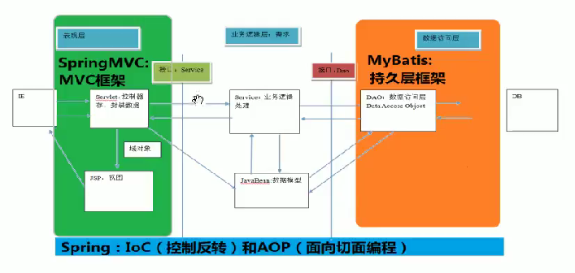

# 入门案例

1. 搭建开发环境

   1. 新建项目：**下图选错了，是maven-archetype-webapp**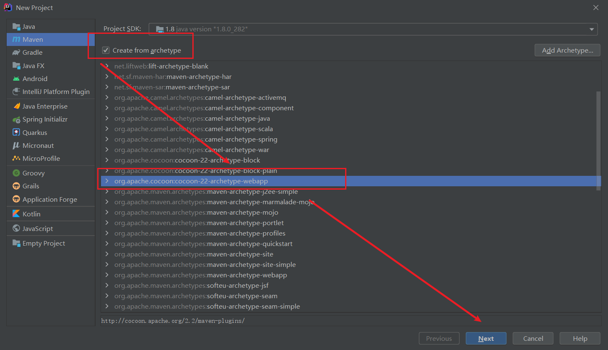

   2. 添加一个键值对，解决maven工程创建过慢：

      1. archetypeCatalog
      2. internal

      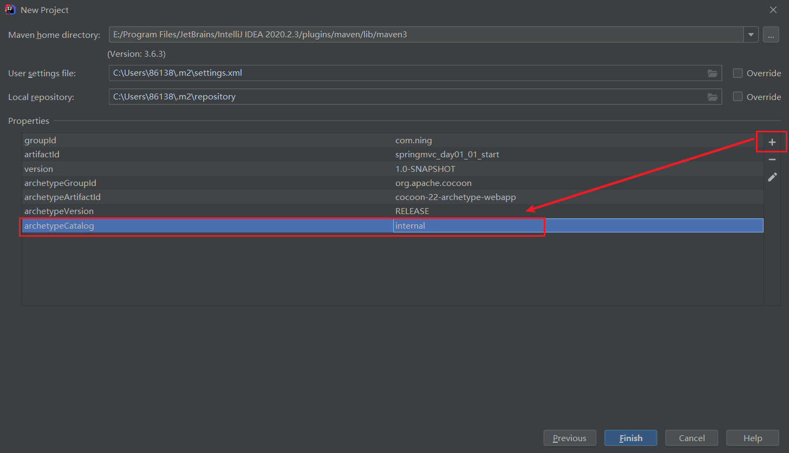

   3. 新增java和resources目录，导坐标：

      ```xml
      <properties>
      <!--    版本锁定-->		<spring.version>5.0.2.RELEASE</spring.version>
        </properties>
      
        <dependencies>
          <dependency>
            <groupId>org.springframework</groupId>
            <artifactId>spring-context</artifactId>
            <version>${spring.version}</version>
          </dependency>
      
          <dependency>
            <groupId>org.springframework</groupId>
            <artifactId>spring-web</artifactId>
            <version>${spring.version}</version>
          </dependency>
      
          <dependency>
            <groupId>org.springframework</groupId>
            <artifactId>spring-webmvc</artifactId>
            <version>${spring.version}</version>
          </dependency>
      
          <dependency>
            <groupId>javax.servlet</groupId>
            <artifactId>servlet-api</artifactId>
            <version>2.5</version>
            <scope>provided</scope>
          </dependency>
      
          <dependency>
            <groupId>javax.servlet.jsp</groupId>
            <artifactId>jsp-api</artifactId>
            <version>2.0</version>
            <scope>provided</scope>
          </dependency>
        </dependencies>
      ```

   4. 在web.xml中配置前端控制器：

      ```xml
      <web-app>
        <display-name>Archetype Created Web Application</display-name>
        
        <servlet>
          <servlet-name>dispatcherServlet</servlet-name>
          <servlet-class>org.springframework.web.servlet.DispatcherServlet</servlet-class>
        </servlet>
        <servlet-mapping>
          <servlet-name>dispatcherServlet</servlet-name>
          <url-pattern>/</url-pattern>
        </servlet-mapping>
      </web-app>
      ```

   5. 新建配置文件springmvc：

      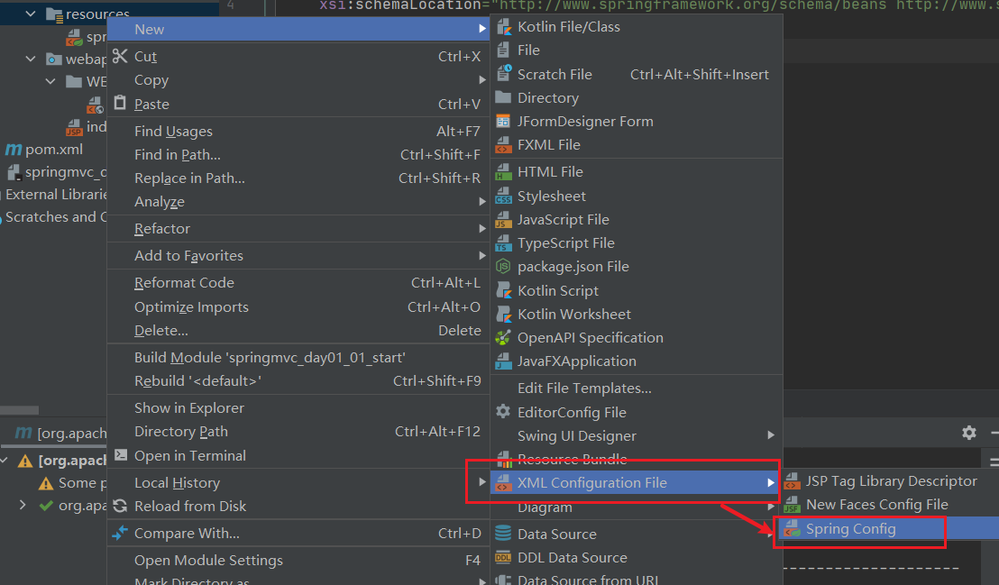

   6. 部署服务器，把项目构建进来（fix一下就好）：

      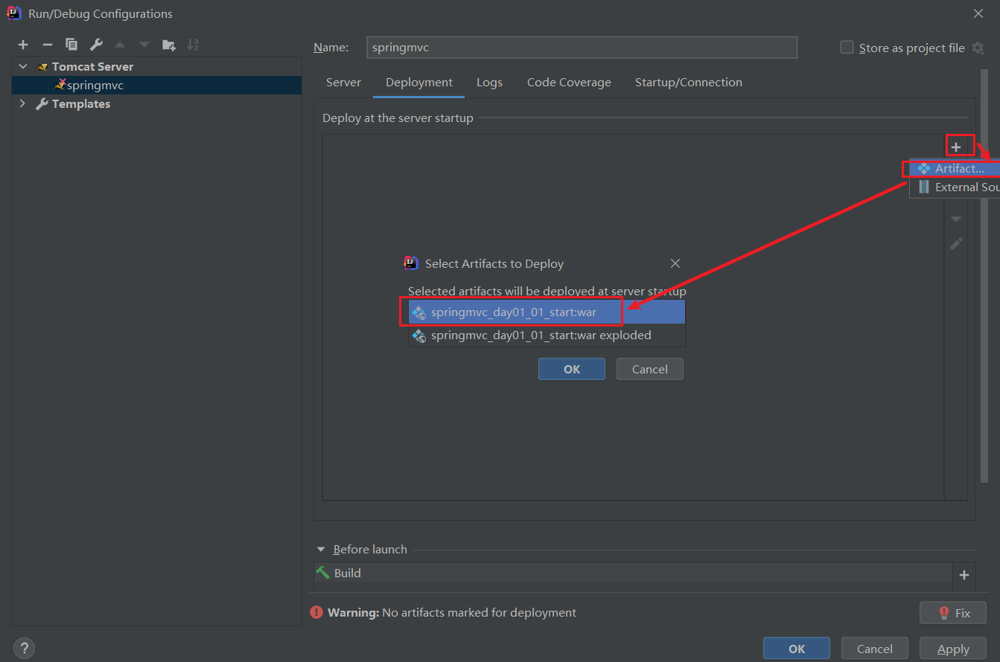

2. 编写入门程序

   1. 编写控制类：

      ```java
      /**
       * 控制器类
       */
      @Controller
      public class HelloController {
          @RequestMapping
          public String sayHello(){
              System.out.println("hello SpringMVC");
              return null;
          }
      }
      ```

      给请求方法添加`@RequestMapping`注释，path属性添加路径。

   2. 在web.xml中提供参数加载配置文件：

      ```xml
      <servlet>
        <servlet-name>dispatcherServlet</servlet-name>
        <servlet-class>org.springframework.web.servlet.DispatcherServlet</servlet-class>
      
        <!--  提供全局参数-->
        <init-param>
          <param-name>contextConfigLocation</param-name>
        <!--  帮助启动加载配置文件-->
          <param-value>classpath:springmvc.xml</param-value>
        </init-param>
        <load-on-startup>1</load-on-startup>
      </servlet>
      ```

   3. 配置视图解析器对象，帮关注跳转到指定的页面：

      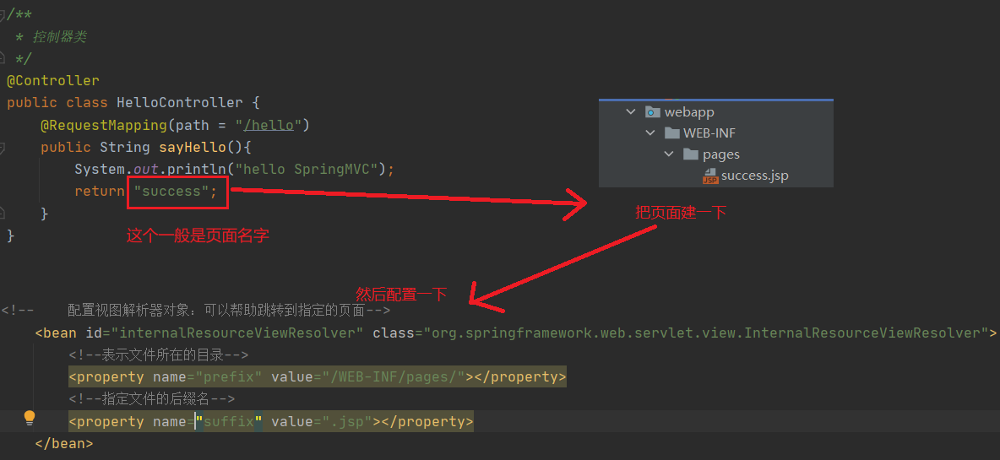

      导约束
      
      ```xml
      <?xml version="1.0" encoding="UTF-8"?>
      <beans xmlns="http://www.springframework.org/schema/beans"
                 xmlns:mvc="http://www.springframework.org/schema/mvc"
                 xmlns:context="http://www.springframework.org/schema/context"
                 xmlns:xsi="http://www.w3.org/2001/XMLSchema-instance"
                 xsi:schemaLocation="
              http://www.springframework.org/schema/beans
              http://www.springframework.org/schema/beans/spring-beans.xsd
              http://www.springframework.org/schema/mvc
              http://www.springframework.org/schema/mvc/spring-mvc.xsd
              http://www.springframework.org/schema/context
              http://www.springframework.org/schema/context/spring-context.xsd">
      
      <!--    开启注解的扫描-->
          <context:component-scan base-package="cn.ning"></context:component-scan>
      
      <!--    配置视图解析器对象：可以帮助跳转到指定的页面-->
          <bean id="internalResourceViewResolver" class="org.springframework.web.servlet.view.InternalResourceViewResolver">
              <!--表示文件所在的目录-->
              <property name="prefix" value="/WEB-INF/pages/"></property>
              <!--指定文件的后缀名-->
              <property name="suffix" value=".jsp"></property>
          </bean>
      
      <!--    开启SpringMVC注解的支持-->
          <mvc:annotation-driven></mvc:annotation-driven>
      </beans>
      ```

3. 总结：

   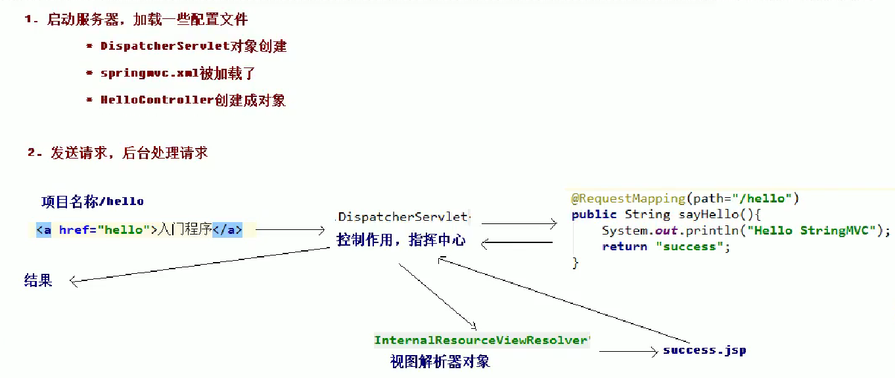

4. 详细总结：

   

   1. DispatcherServlet：

      1. 前端控制器
      2. 用户请求到达前端控制器，它就相当于 mvc 模式中的 c，dispatcherServlet 是整个流程控制的中心，由 它调用其它组件处理用户的请求，dispatcherServlet 的存在降低了组件之间的耦合性。

   2. HandlerMapping：

      1. 处理器映射器
      2. HandlerMapping 负责根据用户请求找到 Handler 即处理器，SpringMVC 提供了不同的映射器实现不同的 映射方式，例如：配置文件方式，实现接口方式，注解方式等。

   3. Handler：

      1. 处理器
      2. 它就是我们开发中要编写的具体业务控制器。由 DispatcherServlet 把用户请求转发到 Handler。由 Handler 对具体的用户请求进行处理。

   4. HandlAdapter：

      1. 处理器适配器
      2. 通过 HandlerAdapter 对处理器进行执行，这是适配器模式的应用，通过扩展适配器可以对更多类型的处理 器进行执行。

   5. View Resolver：

      1. 视图解析器
      2. View Resolver 负责将处理结果生成 View 视图，View Resolver 首先根据逻辑视图名解析成物理视图名 即具体的页面地址，再生成 View 视图对象，最后对 View 进行渲染将处理结果通过页面展示给用户。

   6. View：

      1. 视图

      2. SpringMVC 框架提供了很多的 View 视图类型的支持，包括：jstlView、freemarkerView、pdfView 等。我们最常用的视图就是 jsp。 

         一般情况下需要通过页面标签或页面模版技术将模型数据通过页面展示给用户，需要由程序员根据业务需求开 发具体的页面。

   7. `<mvc:annotation-driven>`说明:

      1. 在 SpringMVC 的各个组件中，处理器映射器、处理器适配器、视图解析器称为 SpringMVC 的三大组件。 

         使用自动加载RequestMappingHandlerMapping （处理映射器）RequestMappingHandlerAdapter （ 处 理 适 配 器 ），可 用 在 SpringMVC.xml 配 置 文 件 中 使 用 替代注解处理器和适配器的配置。

         ```xml
         <!--    开启SpringMVC注解的支持-->
             <mvc:annotation-driven></mvc:annotation-driven>
         ```

## RequestMapping注解

1. 作用：建立请求URL和处理请求方法之间的对应关系

2. 位置：

   1. 方法前

   2. 类前：一级目录

      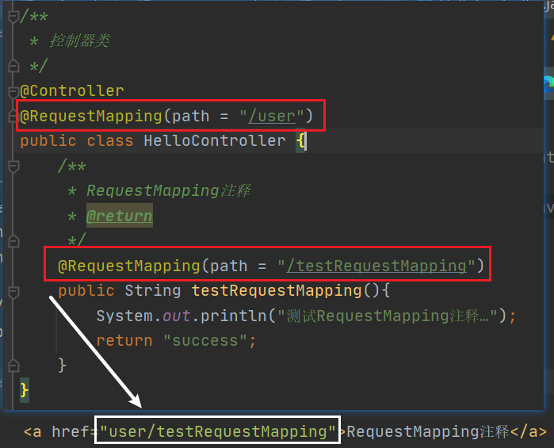

3. 属性：

   1. path属性（value属性）：指定请求的URL

   2. method属性：

      1. 指定请求方法类型

      2. 格式：`method = RequestMethod.GET`

      3. RequestMethod是一个枚举类：

         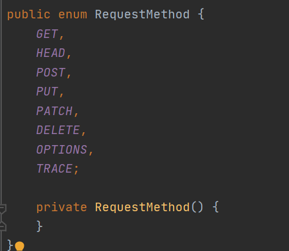

   3. params属性：指定限制请求参数的条件

      1. 格式：`params = {"username"}`

      2. 页面就必须传入参数username

         ```html
         <a href="user/testRequestMapping?username">RequestMapping注释</a>
         ```

      3. 限制传入参数值的写法：`params = {"username=root"}`

   4. headers属性：

      1. 指定限制请求消息头的条件
      2. 格式：`headers = "Accept"
      3. 必须有Accept请求头才能接收请求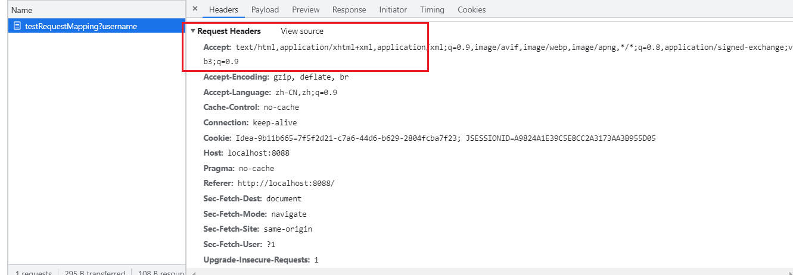

# 请求参数的绑定

1. 基本数据类型绑定：

   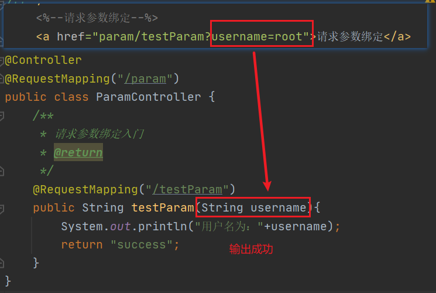

2. 实体类型绑定：

   1. 把数据封装到JavaBean的类中：

      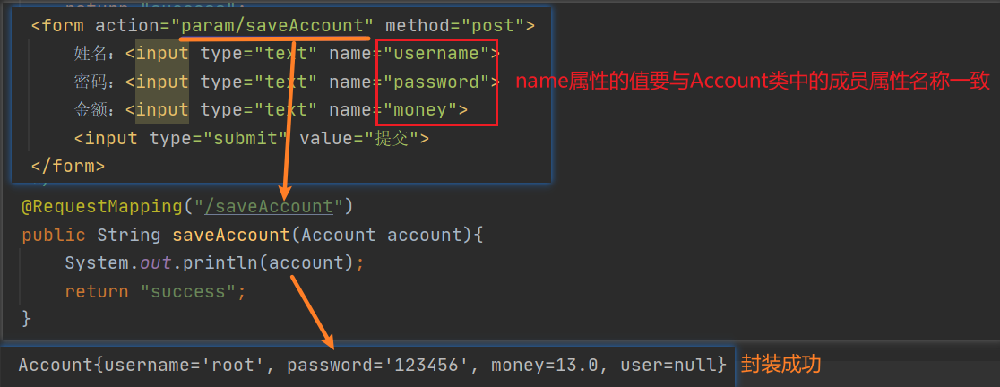

   2. 类中有类时：

      ```html
      用户姓名：<input type="text" name="user.uname">
      用户年龄：<input type="text" name="user.age">
      ```

3. 集合类型绑定：

   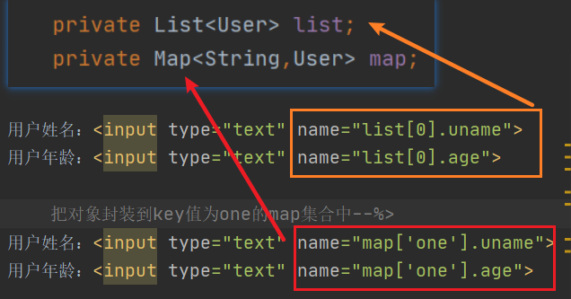

# 配置解决中文乱码的过滤器

在web.xml中配置filter：

```xml
<!--  配置解决中文乱码的过滤器-->
  <filter>
    <filter-name>characterEncodingFilter</filter-name>
    <filter-class>org.springframework.web.filter.CharacterEncodingFilter</filter-class>

<!--    初始化参数-->
    <init-param>
      <param-name>encoding</param-name>
      <param-value>UTF-8</param-value>
    </init-param>
  </filter>

  <filter-mapping>
    <filter-name>characterEncodingFilter</filter-name>
    <url-pattern>/*</url-pattern>
  </filter-mapping>
```

如果是Tomcat乱码就配置一下`-Dfile.encoding=UTF-8`

修改后重新加载一下工程

# 自定义类型转换器

### 步骤

1. 定义一个类，实现Converter接口，该接口有两个泛型

   1. 注意导包:

      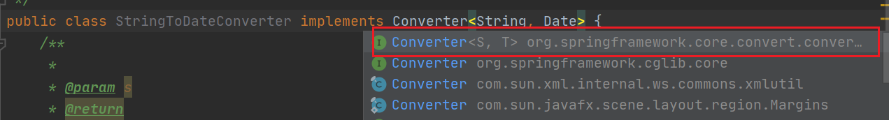

   2. 重写方法：

      ```java
          /**
           *
           * @param s 传入进来的字符串
           * @return
           */
          @Override
          public Date convert(String s) {
      //        判断
              if (s==null){
                  throw new RuntimeException("请您传入数据");
              }
              DateFormat df=new SimpleDateFormat("yyyy-MM-dd");
      //        把字符串转换成日期
              try {
                  return df.parse(s);
              } catch (ParseException e) {
                  throw new RuntimeException("数据类型转换出现错误");
              }
          }
      ```

2. 配置自定义类型转换器：

   mvc:annotation-driven默认不会配置自定义类型转换器，所以要自己加上

   ```xml
   <!--配置自定义类型转换器-->
   <bean id="conversionService" class="org.springframework.context.support.ConversionServiceFactoryBean">
       <property name="converters">
           <set>
               <bean class="cn.ning.utils.StringToDateConverter"></bean>
           </set>
       </property>
   </bean>
   
   <!--开启SpringMVC注解的支持-->
   <mvc:annotation-driven conversion-service="conversionService"></mvc:annotation-driven>
   ```

# 获取Servlet的原生API

方法：想获取谁就在参数那写谁

```java
@RequestMapping("/testServlet")
public String testServlet(HttpServletRequest request, HttpServletResponse response){
    System.out.println("执行了……");
    System.out.println(request);
    System.out.println(request.getSession());
    System.out.println(request.getSession().getServletContext());
    System.out.println(response);
    return "success";
}
```

# 常用注解

## @RequestParam

1. 作用：把请求中指定名称的参数给控制器中的形参赋值

2. 属性：

   1. value：请求参数中的名称
   2. required：请求参数中是否必须提供此参数，默认值为true

3. 位置：在参数前面

4. 示例：

   ```java
   public String testRequestParam(@RequestParam(value = "name") String username){
       System.out.println("执行了……"+username);
       return "success";
   }
   ```

## @RequestBody

1. 作用：获取请求体内容。

2. 直接使用得到是key=value&key=value.. .结构的数据。**get请求方式不适用。**

3. 示例：

   ```java
   public String testRequestBody(@RequestBody String body){
       System.out.println("执行了……"+body);
       return "success";
   }
   ```

## @PathVariable

1. 作用：用于绑定url中的占位符。

2. 示例：

   ```java
   @RequestMapping("/testPathVariable/{id}")
   public String testPathVariable(@PathVariable(name = "id") String id){
       System.out.println("执行了……"+id);
       return "success";
   }
   ```

   ```html
   <a href="anno/testPathVariable/10">RequestParam</a>
   ```

### restful编程风格

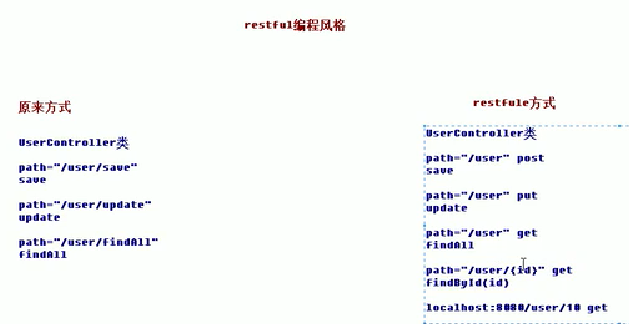

## @RequestHeader

1. 作用：获取请求头的值

2. 属性： 

   1. value：提供消息头名称 
   2. required：是否必须有此消息头

3. 示例：

   ```java
   public String testRequestHeader(@RequestHeader(value = "Accept") String header){
       System.out.println("执行了……"+header);
       return "success";
   }
   ```

## @CookieValue

1. 作用：把指定cookie名称的值传入控制器方法参数。

2. 属性： 

   1. value：指定 cookie 的名称。 
   2. required：是否必须有此 cookie。

3. 示例：

   ```java
   public String testCookieValue(@CookieValue(value = "JSESSIONID") String cookieValue){
       System.out.println("执行了……"+cookieValue);
       return "success";
   }
   ```

## @ModelAttribute

1. 作用：用于修饰方法和参数

2. 位置：

   1. 方法上：表示当前方法会在控制器的方法执行之前执行
   2. 参数上：获取指定的数据给参数赋值

3. 示例：

   1. 有返回值：

      ```java
          /**
           * ModelAttribute注解
           * @return
           */
          @RequestMapping("/testModelAttribute")
          public String testModelAttribute(User user){
              System.out.println("执行了……"+user);
              return "success";
          }
      
          /**
           * 这个方法会先执行
           * 方法一
           */
         @ModelAttribute
          public User showUser(String uname){
              System.out.println("showUser()方法执行了……");
      //        通过用户查询数据库（模拟）
              User user=new User();
              user.setUname(uname);
              user.setAge(20);
              user.setDate(new Date());
              return user;
          }
      ```

   2. 没有返回值时，存在map集合中：

      ```java
          /**
           * ModelAttribute注解
           * @return
           */
          @RequestMapping("/testModelAttribute")
          public String testModelAttribute(@ModelAttribute("abc") User user){
              System.out.println("执行了……"+user);
              return "success";
          }
      
          /**
           * 方法二
           * @param uname
           * @return
           */
          @ModelAttribute
          public void showUser(String uname, Map<String,User> map){
              System.out.println("showUser()方法执行了……");
      //        通过用户查询数据库（模拟）
              User user=new User();
              user.setUname(uname);
              user.setAge(20);
              user.setDate(new Date());
              map.put("abc",user);
          }
      ```

## @SessionAttribute

1. 作用：用于多次执行控制器方法间的参数共享。

2. 属性：

   1.  value：用于指定存入的属性名称 
   2. type：用于指定存入的数据类型

3. 位置：类上

   1. 存入request域对象中：

      ```java
          /**
           * SessionAttribute注解
           * @return
           */
          @RequestMapping("/testSessionAttribute")
          public String testSessionAttribute(Model model){
              System.out.println("执行了……");
      //        底层会存储到request域对象中
              model.addAttribute("msg","壮壮");
              return "success";
          }
      ```

      存入session域对象中，在类上写：

      ```java
      @SessionAttributes(value = {"msg"}) //把msg存入到session域中
      ```

   2. 从session域对象中取值：

      ```java
      @RequestMapping("/getSessionAttribute")
      public String getSessionAttribute(ModelMap model){
          System.out.println("执行了……");
          System.out.println(model.get("msg"));
          return "success";
      }
      ```

   3. 从session域对象中删除值：

      ```java
      @RequestMapping("/delSessionAttribute")
      public String delSessionAttribute(SessionStatus status){
          System.out.println("执行了……");
          status.setComplete();
          return "success";
      }
      ```

# 响应数据和结果视图

## 返回值类型

1. 返回字符串：

   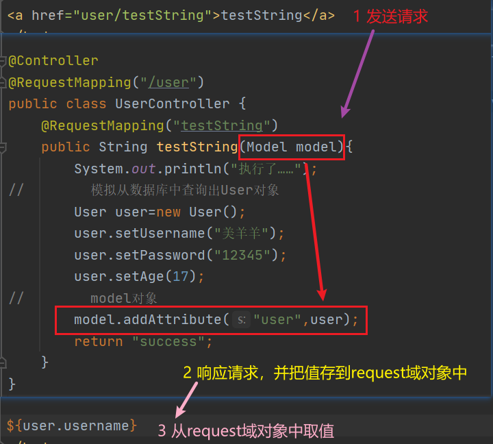

2. 返回void

   1. 默认值为请求路径名称：

      

   2. 有三种方式：

      ```java
          /**
           * 响应之返回值为void
           */
          @RequestMapping("testVoid")
          public void testVoid(HttpServletRequest request, HttpServletResponse response) throws ServletException, IOException {
              System.out.println("执行了……");
      //        方式一：请求转发
              request.getRequestDispatcher("/WEB-INF/pages/success.jsp").forward(request,response);
      
      //        方式二：请求重定向
              response.sendRedirect(request.getContextPath()+"/index.jsp");
      
      //        设置中文乱码
              response.setCharacterEncoding("UTF-8");
              response.setContentType("text/html;charset=UTF-8");
      //        方式三：直接在浏览器响应
              response.getWriter().print("你好");
              return;
          }
      ```

3. 返回ModelAndView对象

   把user对象存储导mv对象中，底层会把user对象存入导request对象中

   ```java
       @RequestMapping("testModelAndView")
       public ModelAndView testModelAndView(){
   //        创建ModelAndView对象
           ModelAndView mv=new ModelAndView();
   
           System.out.println("执行了……");
   //        模拟从数据库中查询出User对象
           User user=new User();
           user.setUsername("沸羊羊");
           user.setPassword("12345");
           user.setAge(18);
   
   //        1.把user对象存储导mv对象中，底层会把user对象存入导request对象中
           mv.addObject("user",user);
   
   //        2.跳转到哪个页面
           mv.setViewName("success");
   
           return mv;
       }
   ```

#### 使用关键字进行转发/重定向

```java
    /**
     * 使用关键字的方式进行转发或者重定向
     */
    @RequestMapping("testForwardOrRedirect")
    public String testForwardOrRedirect(){
        System.out.println("执行了……");
//        请求的转发
        return "forward:/WEB-INF/pages/success.jsp";

//        重定向
        return "redirect:/index.jsp";
    }
```

## 响应json数据

### 过滤静态资源

```xml
<!--    配置前端控制器哪些静态资源不拦截-->
<mvc:resources mapping="/js/**" location="/js/"></mvc:resources>
<mvc:resources mapping="/css/**" location="/css/"></mvc:resources>
<mvc:resources mapping="/images/**" location="/images/"></mvc:resources>
```

### 发送Ajax的请求

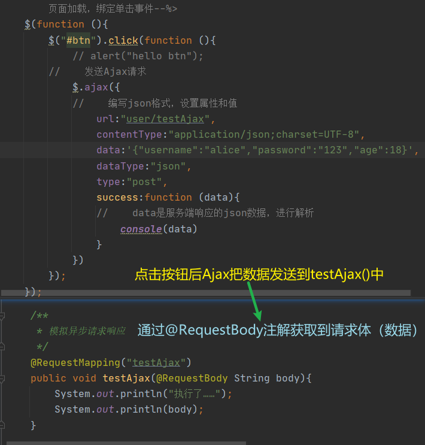

### 响应json格式数据

1. 导包，用于做数据的转换：

   com.fasterxml.jackson.core jackson-databind 2.9.0  com.fasterxml.jackson.core jackson-core 2.9.0  com.fasterxml.jackson.core jackson-annotations 2.9.0

   ```xml
   <dependency>
     <groupId>com.fasterxml.jackson.core</groupId>
     <artifactId>jackson-databind</artifactId>
     <version>2.9.0</version>
   </dependency>
   
   <dependency>
     <groupId>com.fasterxml.jackson.core</groupId>
     <artifactId>jackson-core</artifactId>
     <version>2.9.0</version>
   </dependency>
   
   <dependency>
     <groupId>com.fasterxml.jackson.core</groupId>
     <artifactId>jackson-annotations</artifactId>
     <version>2.9.0</version>
   </dependency>
   ```

2. 导包后底层就会把json字符串封装到user对象中，参数可以直接使用`@RequestBody User user`

3. 返回给客户端的数据需要转换成json数据，在返回值前使用`@ResponseBody `进行转换

4. 图解：

   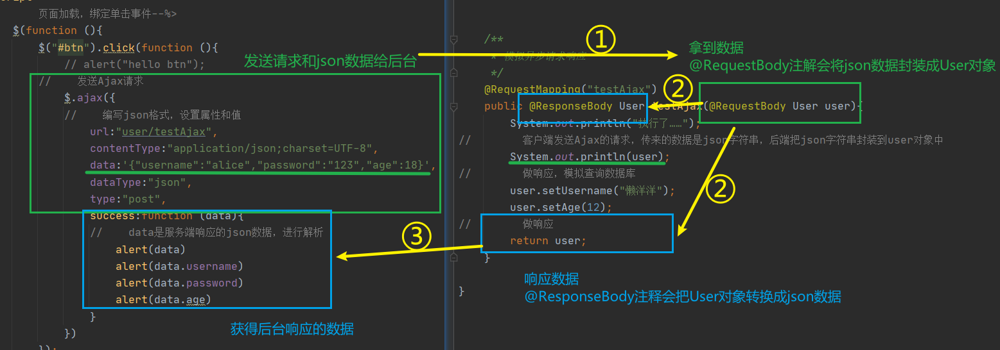

# 文件上传

## 文件上传的必要前提

1. form 表单的 enctype 取值必须是：`multipart/form-data`(默认值是:`application/x-www-form-urlencoded`) 
   1. enctype:是表单请求正文的类型
2. method 属性取值必须是 Post
3. 提供一个文件选择域<input type="file" />

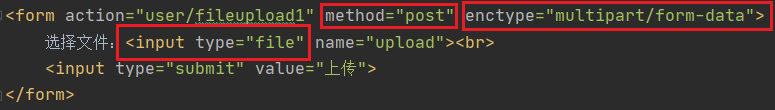

## 使用传统的方式上传（借助第三方组件）

1. 导包：

   commons-fileupload commons-fileupload 1.3.1  

   commons-io commons-io 2.4

   ```xml
   <dependency>
     <groupId>commons-fileupload</groupId>
     <artifactId>commons-fileupload</artifactId>
     <version>1.3.1</version>
   </dependency>
   <dependency>
     <groupId>commons-io</groupId>
     <artifactId>commons-io</artifactId>
     <version>2.4</version>
   </dependency>
   ```

2. 通过request对象获取：

   ```
   //        使用fileupload组件完成文件上传
   //        1.指定上传的位置
           String path = request.getSession().getServletContext().getRealPath("/uploads/");
   //        2.判断该路径是否存在
           File file=new File(path);
           if (!file.exists()) {
   //            创建该文件夹
               file.mkdirs();
           }
   //        3.准备解析request对象，获取上传的文件项
           DiskFileItemFactory factory=new DiskFileItemFactory();
   //        通过工厂创建文件项
           ServletFileUpload upload = new ServletFileUpload(factory);
   //        4.解析request
           List<FileItem> items = upload.parseRequest(request);
   //        5.遍历
           for (FileItem item : items) {
   //            判断当前的items对象是否是上传文件项
               if (item.isFormField()) {
   //                说明是普通表单项
   
               }else {
   //                说明是上传文件项
   //                需要获取上传文件的名称
                   String filename=item.getName();
   //                把文件的名称设置唯一值
                   String uuid = UUID.randomUUID().toString().replace("-", "");
                   filename=uuid+"_"+filename;
   //                完成文件上传
                   item.write(new File(path,filename));
   //                删除临时文件
                   item.delete();
               }
           }
   ```


## springmvc方式上传

### 原理

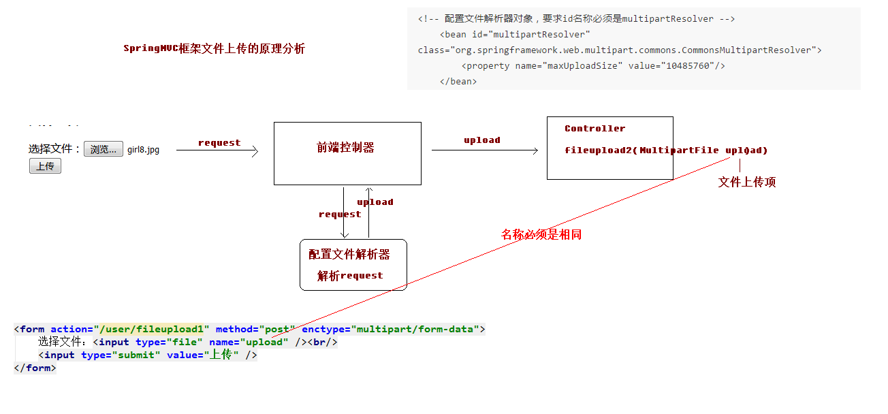

### 步骤

1. 在springmvc中配置文件解析器：

   ```xml
   <!--    配置文件解析器,id值必须为multipartResolver-->
       <bean id="multipartResolver" class="org.springframework.web.multipart.commons.CommonsMultipartResolver">
   <!--        配置最大文件大小为10M，即10*1024*1024-->
           <property name="maxUploadSize" value="10485760"></property>
       </bean>
   ```

2. 示例：

   ```java
       /**
        * springmvc文件上传
        *
        * @return
        */
       @RequestMapping("/fileupload2")
       public String fileupload2(HttpServletRequest request, MultipartFile upload) throws Exception {
           System.out.println("springmvc文件上传……");
   
   //        使用fileupload组件完成文件上传
   //        1.指定上传的位置
           String path = request.getSession().getServletContext().getRealPath("/uploads/");
   //        2.判断该路径是否存在
           File file = new File(path);
           if (!file.exists()) {
   //            创建该文件夹
               file.mkdirs();
           }
   
   //        说明是上传文件项
   //        需要获取上传文件的名称
           String filename = upload.getOriginalFilename();
   //        把文件的名称设置唯一值
           String uuid = UUID.randomUUID().toString().replace("-", "");
           filename = uuid + "_" + filename;
   //        完成文件上传
           upload.transferTo(new File(path,filename));
           return"success";
   }
   ```

3. 注意：参数名必须和name属性名一致

   ```html
   <form action="user/fileupload2" method="post" enctype="multipart/form-data">
       选择文件：<input type="file" name="upload"><br>
       <input type="submit" value="上传">
   </form>
   ```

### 跨服务器方式的文件上传

1. 导包：

   com.sun.jersey jersey-core 1.18.1  

   com.sun.jersey jersey-client 1.18.1

   ```xml
   <dependency>
     <groupId>com.sun.jersey</groupId>
     <artifactId>jersey-core</artifactId>
     <version>1.18.1</version>
   </dependency>
   <dependency>
     <groupId>com.sun.jersey</groupId>
     <artifactId>jersey-client</artifactId>
     <version>1.18.1</version>
   </dependency>
   ```

2. 示例：

   ```java
       /**
        * 跨服务器文件上传
        *
        * @return
        */
       @RequestMapping("/fileupload3")
       public String fileupload3(MultipartFile upload) throws Exception {
           System.out.println("跨服务器文件上传……");
   //        1.定义上传文件服务器的路径
           String path ="http://localhost:8080/uploads/";
   
   //        2.需要获取上传文件的名称
           String filename = upload.getOriginalFilename();
   //        把文件的名称设置唯一值
           String uuid = UUID.randomUUID().toString().replace("-", "");
           filename = uuid + "_" + filename;
   //        3.创建客户端的对象
           Client client = Client.create();
   //        4.和图片服务器进行连接
           WebResource webResource = client.resource(path + filename);
   //        5.上传文件
           webResource.put(upload.getBytes());
   //
           return"success";
       }
   ```

3. 405错误：Tomcat不允许写入图片，要在Tomcat的conf下的web.xml里面修改，在一个叫default的servlet里面加入readonly-false(以里面的debug-0为mox模型替换)

   ```xml
   </servlet>
   <!--使浏览器允许文件写入-->
   <init-param>
   	<param-name>readonly</param-name>
   	<param-value>false</param-value>
   </init-param>
   ```

# 异常处理

1. 分析：

   

2. 步骤：

   1. 自定义异常类：

      ```java
      public class SysException extends Exception{
      //    存储提示信息
          private String message;
      
          @Override
          public String getMessage() {
              return message;
          }
      
          public void setMessage(String message) {
              this.message = message;
          }
      
          public SysException(String message) {
              this.message = message;
          }
      }
      ```

   2. 抛出自定义异常：

      ```java
              try {
      //        模拟异常
                  int a=10/0;
              } catch (Exception e) {
                  e.printStackTrace();
      //            抛出自定义异常信息
                  throw new SysException("查询所有用户出现错误");
              }
      ```

   3. 配置异常处理器：

      ```xml
      <!--    配置异常处理器-->
          <bean id="sysExceptionResolver" class="com.ning.exception.SysExceptionResolver"></bean>
      ```

   4. 编写异常处理器：

      ```java
      /**
       * 异常处理器
       */
      public class SysExceptionResolver implements HandlerExceptionResolver {
      
          /**
           * 处理异常业务逻辑
           * @param httpServletRequest
           * @param httpServletResponse
           * @param o
           * @param e
           * @return
           */
          @Override
          public ModelAndView resolveException(HttpServletRequest httpServletRequest, HttpServletResponse httpServletResponse, Object o, Exception e) {
      //        获取异常对象
              SysException syse=null;
              if (e instanceof SysException){
                  syse= (SysException) e;
              }else {
                  syse=new SysException("系统正在维护……");
              }
      //        创建ModelAndView
              ModelAndView mv=new ModelAndView();
              mv.addObject("errorMsg",e.getMessage());
              mv.setViewName("error");
              return mv;
          }
      }
      ```

      ```html
      ${errorMsg}
      ```

# 拦截器

1. 说明：

   1. 拦截器只能拦截控制器中的方法
   2. 拦截器能做的过滤器都能做，过滤器能做的拦截器不一定都能做

2. 分析：

   

## 步骤

1. 编写拦截器类，需要实现HandlerInterceptor接口：

   ```java
   /**
    * 自定义拦截器
    */
   public class MyInterceptor1 implements HandlerInterceptor {
   }
   ```

2. 配置拦截器

   ```xml
   <!--    配置拦截器-->
       <mvc:interceptors>
   <!--        配置具体的拦截器-->
           <mvc:interceptor>
   <!--            要拦截的具体方法-->
               <mvc:mapping path="/user/*"/>
   <!--            不要拦截的方法（配置一个就行了）-->
   <!--            <mvc:exclude-mapping path=""/>-->
   
   <!--            配置拦截器对象-->
               <bean class="com.ning.controller.interceptor.MyInterceptor1"></bean>
           </mvc:interceptor>
       </mvc:interceptors>
   ```

## 拦截器的三个接口方法

1. `preHandle()`：

   1. 预处理：controller方法执行前
   2. 返回值：
      1. true：放行执行下一个拦截器，如果没有就执行controller中的方法。
      2. false：不放行
   3. 可以用来做逻辑判断

   ```java
   /**
    *预处理：controller方法执行前
    * @param request
    * @param response
    * @param handler
    * @return 返回值为true就放行执行下一个拦截器，如果没有就执行controller中的方法。返回值为false则不放行
    * @throws Exception
    */
   @Override
   public boolean preHandle(HttpServletRequest request, HttpServletResponse response, Object handler) throws Exception {
       System.out.println("MyInterceptor1执行了……");
       //跳转到其他页面
       request.getRequestDispatcher("/WEB-INF/pages/error.jsp").forward(request,response);
       return true;
   }
   ```

2. `postHandle()`：

   1. 后处理方法，controller方法执行后，success.jsp执行之前执行

   ```java
   /**
    * 后处理方法，controller方法执行后，success.jsp执行之前执行
    * @param request
    * @param response
    * @param handler
    * @param modelAndView
    * @throws Exception
    */
   @Override
   public void postHandle(HttpServletRequest request, HttpServletResponse response, Object handler, ModelAndView modelAndView) throws Exception {
       System.out.println("MyInterceptor1执行了……后置");
   }
   ```

3. `afterCompletion()`：

   1. success.jsp页面执行后，该方法会执行
   2. 可以用来释放资源

   ```java
   /**
    * success.jsp页面执行后，该方法会执行
    * @param request
    * @param response
    * @param handler
    * @param ex
    * @throws Exception
    */
   @Override
   public void afterCompletion(HttpServletRequest request, HttpServletResponse response, Object handler, Exception ex) throws Exception {
       System.out.println("MyInterceptor1执行了……最后");
   }
   ```

# 整合ssm

## 配置环境

1. 创建数据库：

   ```sql
   create database ssm;
   use ssm;
   create table account(
   id int primary key auto_increment,
   name varchar(20),
   money double
   );
   ```

2. 在properties标签中添加：

   ```xml
   <spring.version>5.0.2.RELEASE</spring.version>
   <slf4j.version>1.6.6</slf4j.version>
   <log4j.version>1.2.12</log4j.version>
   <mysql.version>5.1.6</mysql.version>
   <mybatis.version>3.4.5</mybatis.version>
   ```

3. 导入坐标：

   ```xml
   <!-- spring -->
   <dependency>
   <groupId>org.aspectj</groupId>
   <artifactId>aspectjweaver</artifactId>
   <version>1.6.8</version>
   </dependency>
   <dependency>
   <groupId>org.springframework</groupId>
   <artifactId>spring-aop</artifactId>
   <version>${spring.version}</version>
   </dependency>
   <dependency>
   <groupId>org.springframework</groupId>
   <artifactId>spring-context</artifactId>
   <version>${spring.version}</version>
   </dependency>
   <dependency>
   <groupId>org.springframework</groupId>
   <artifactId>spring-web</artifactId>
   <version>${spring.version}</version>
   </dependency>
   <dependency>
   <groupId>org.springframework</groupId>
   <artifactId>spring-webmvc</artifactId>
   <version>${spring.version}</version>
   </dependency>
   <dependency>
   <groupId>org.springframework</groupId>
   <artifactId>spring-test</artifactId>
   <version>${spring.version}</version>
   </dependency>
   <dependency>
   <groupId>org.springframework</groupId>
   <artifactId>spring-tx</artifactId>
   <version>${spring.version}</version>
   </dependency>
   <dependency>
   <groupId>org.springframework</groupId>
   <artifactId>spring-jdbc</artifactId>
   <version>${spring.version}</version>
   </dependency>
   <dependency>
   <groupId>junit</groupId>
   <artifactId>junit</artifactId>
   <version>4.12</version>
   <scope>compile</scope>
   </dependency>
   <dependency>
   <groupId>mysql</groupId>
   <artifactId>mysql-connector-java</artifactId>
   <version>${mysql.version}</version>
   </dependency>
   <dependency>
   <groupId>javax.servlet</groupId>
   <artifactId>servlet-api</artifactId>
   <version>2.5</version>
   <scope>provided</scope>
   </dependency>
   <dependency>
   <groupId>javax.servlet.jsp</groupId>
   <artifactId>jsp-api</artifactId>
   <version>2.0</version>
   <scope>provided</scope>
   </dependency>
   <dependency>
   <groupId>jstl</groupId>
   <artifactId>jstl</artifactId>
   <version>1.2</version>
   </dependency>
   <!-- log start -->
   <dependency>
   <groupId>log4j</groupId>
   <artifactId>log4j</artifactId>
   <version>${log4j.version}</version>
   </dependency>
   <dependency>
   <groupId>org.slf4j</groupId>
   <artifactId>slf4j-api</artifactId>
   <version>${slf4j.version}</version>
   </dependency>
   <dependency>
   <groupId>org.slf4j</groupId>
   <artifactId>slf4j-log4j12</artifactId>
   <version>${slf4j.version}</version>
   </dependency>
   <!-- log end -->
   <dependency>
   <groupId>org.mybatis</groupId>
   <artifactId>mybatis</artifactId>
   <version>${mybatis.version}</version>
   </dependency>
   8. 部署ssm_web的项目，只要把ssm_web项目加入到tomcat服务器中即可
   5. 编写实体类，在ssm_domain项目中编写
   <dependency>
   <groupId>org.mybatis</groupId>
   <artifactId>mybatis-spring</artifactId>
   <version>1.3.0</version>
   </dependency>
   <dependency>
   <groupId>c3p0</groupId>
   <artifactId>c3p0</artifactId>
   <version>0.9.1.2</version>
   <type>jar</type>
   <scope>compile</scope>
   </dependency>
   ```

4. 准备各层的接口和类：

   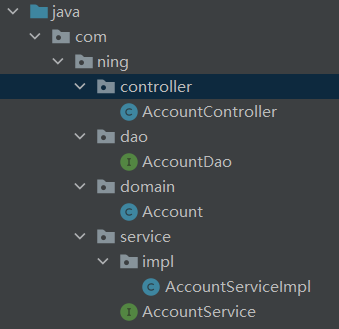

5. 搭建spring环境：

   1. 配置applicationContext.xml配置文件：

      ```xml
      <?xml version="1.0" encoding="UTF-8"?>
      <beans xmlns="http://www.springframework.org/schema/beans"
             xmlns:xsi="http://www.w3.org/2001/XMLSchema-instance"
             xmlns:context="http://www.springframework.org/schema/context"
             xmlns:aop="http://www.springframework.org/schema/aop"
             xmlns:tx="http://www.springframework.org/schema/tx"
             xsi:schemaLocation="http://www.springframework.org/schema/beans
          http://www.springframework.org/schema/beans/spring-beans.xsd
          http://www.springframework.org/schema/context
          http://www.springframework.org/schema/context/spring-context.xsd
          http://www.springframework.org/schema/aop
          http://www.springframework.org/schema/aop/spring-aop.xsd
          http://www.springframework.org/schema/tx
          http://www.springframework.org/schema/tx/spring-tx.xsd">
      
      <!--    开启注解的扫描：只处理service和dao层-->
          <context:component-scan base-package="com.ning">
      <!--        配置不需要扫描的注解-->
              <context:exclude-filter type="annotation" expression="org.springframework.stereotype.Controller"/>
          </context:component-scan>
      
      </beans>
      ```

   2. 编写测试，添加`log4j.properties`配置文件：

      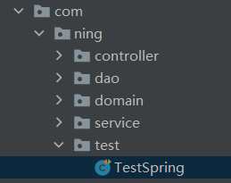

      ```java
          @Test
          public void run1(){
      //        加载配置文件
              ApplicationContext ac=new ClassPathXmlApplicationContext("classpath:applicationContext.xml");
      //        获取对象
              AccountService as = ac.getBean("accountService",AccountService.class);
      //        调用方法
              as.findAll();
          }
      ```

6. 搭建springmvc环境：

   1. 配置web.xml：

      ```xml
      <web-app>
        <display-name>Archetype Created Web Application</display-name>
      <!--  配置前端控制器-->
        <servlet>
          <servlet-name>dispatcherServlet</servlet-name>
          <servlet-class>org.springframework.web.servlet.DispatcherServlet</servlet-class>
      <!--  加载springmvc.xml配置文件-->
          <init-param>
            <param-name>contextConfigLocation</param-name>
            <param-value>classpath:springmvc.xml</param-value>
          </init-param>
      <!--  启动服务器，创建该servlet-->
          <load-on-startup>1</load-on-startup>
        </servlet>
      
        <servlet-mapping>
          <servlet-name>dispatcherServlet</servlet-name>
          <url-pattern>/</url-pattern>
        </servlet-mapping>
      
      <!--  解决中文乱码的过滤器-->
        <filter>
          <filter-name>characterEncodingFilter</filter-name>
          <filter-class>org.springframework.web.filter.CharacterEncodingFilter</filter-class>
          <init-param>
            <param-name>encoding</param-name>
            <param-value>UTF-8</param-value>
          </init-param>
        </filter>
        <filter-mapping>
          <filter-name>characterEncodingFilter</filter-name>
          <url-pattern>/*</url-pattern>
        </filter-mapping>
      </web-app>
      ```

   2. 编写springmxc.xml：

      ```xml
      <?xml version="1.0" encoding="UTF-8"?>
      <beans xmlns="http://www.springframework.org/schema/beans"
             xmlns:mvc="http://www.springframework.org/schema/mvc"
             xmlns:context="http://www.springframework.org/schema/context"
             xmlns:xsi="http://www.w3.org/2001/XMLSchema-instance"
             xsi:schemaLocation="
          http://www.springframework.org/schema/beans
          http://www.springframework.org/schema/beans/spring-beans.xsd
          http://www.springframework.org/schema/mvc
          http://www.springframework.org/schema/mvc/spring-mvc.xsd
          http://www.springframework.org/schema/context
          http://www.springframework.org/schema/context/spring-context.xsd">
      
      <!--    开启注解扫描，只扫描Controller注解-->
          <context:component-scan base-package="com.ning">
              <!--配置哪些注解不扫描-->
              <context:include-filter type="annotation" expression="org.springframework.stereotype.Controller"/>
          </context:component-scan>
      
      <!--    配置视图解析器对象-->
          <bean id="internalResourceViewResolver" class="org.springframework.web.servlet.view.InternalResourceViewResolver">
              <property name="prefix" value="/WEB-INF/pages/"></property>
              <property name="suffix" value=".jsp"></property>
          </bean>
      
      <!--    过滤静态资源-->
          <mvc:resources location="/css/" mapping="/css/**" />
          <mvc:resources location="/images/" mapping="/images/**" />
          <mvc:resources location="/js/" mapping="/js/**" />
          
      <!--    配置开启SpringMVC的注解支持-->
          <mvc:annotation-driven></mvc:annotation-driven>
      </beans>
      ```

   3. 分析：

      1. ServletContext域对象：应用域对象，只有一个

      

   4. 在web.xml中配置监听器：

      ```xml
      <!--  配置spring的监听器，默认只加载WEB-INF目录下的applicationContext.xml配置文件-->
        <listener>
          <listener-class>org.springframework.web.context.ContextLoaderListener</listener-class>
        </listener>
      <!--  设置配置文件的路径-->
        <context-param>
          <param-name>contextConfigLocation</param-name>
          <param-value>classpath:applicationContext.xml</param-value>
        </context-param>
      ```

7. 搭建Mybatis环境：

   1. 编写主配置文件SqlMapConfig.xml：

      ```xml
      <?xml version="1.0" encoding="UTF-8"?>
      <!DOCTYPE configuration
              PUBLIC "-//mybatis.org//DTD Config 3.0//EN"
              "http://mybatis.org/dtd/mybatis-3-config.dtd">
      <configuration>
      <!--    配置环境-->
          <environments default="mysql">
              <environment id="mysql">
                  <transactionManager type="jdbc"></transactionManager>
                  <dataSource type="POOLED">
                      <property name="driver" value="com.mysql.jdbc.Driver"/>
                      <property name="url" value="jdbc:mysql://localhost:3306/ssm"/>
                      <property name="username" value="root"/>
                      <property name="password" value="ning"/>
                  </dataSource>
              </environment>
          </environments>
      <!--    引入的配置文件-->
          <mappers>
      <!--        <mapper class="com.ning.dao.AccountDao"></mapper>-->
              <package name="com.ning"/>
          </mappers>
      </configuration>
      ```

   2. 给dao接口提供注解：

      ```java
      /**
       * 查询所有账户
       * @return
       */
      
      @Select("select * from account")
      public List<Account> findAll();
      
      /**
       * 保存账户信息
       * @param account
       */
      @Insert("insert into account(name,money) values (#{name},#{money})")
      public void saveAccount(Account account);
      ```

   3. 在spring的配置文件中整合：

      ```xml
      <!--    Spring整合mybatis-->
      <!--    配置连接池-->
          <bean id="dataSource" class="com.mchange.v2.c3p0.ComboPooledDataSource">
              <property name="driverClass" value="com.mysql.jdbc.Driver"></property>
              <property name="jdbcUrl" value="jdbc:mysql:///ssm"></property>
              <property name="user" value="root"></property>
              <property name="password" value="ning"></property>
          </bean>
      <!--    配置工厂对象-->
          <bean id="sqlSessionFactory" class="org.mybatis.spring.SqlSessionFactoryBean">
              <property name="dataSource" ref="dataSource"></property>
          </bean>
      <!--    配置dao接口所在的包-->
          <bean id="mapperScanner" class="org.mybatis.spring.mapper.MapperScannerConfigurer">
              <property name="basePackage" value="com.ning.dao"></property>
          </bean>
      ```

   4. 配置事务管理：

      1. 在spring配置文件中添加：

         ```xml
         <!--    配置Spring声明式事务管理-->
         <!--    配置事务管理器-->
         <bean id="transactionManager" class="org.springframework.jdbc.datasource.DataSourceTransactionManager">
             <property name="dataSource" ref="dataSource"></property>
         </bean>
         <!--    配置事务通知-->
             <tx:advice id="txAdvice" transaction-manager="transactionManager">
                 <tx:attributes>
                     <tx:method name="find" read-only="true"/>
                     <tx:method name="*" isolation="DEFAULT"></tx:method>
                 </tx:attributes>
             </tx:advice>
         <!--    配置AOP增强-->
             <aop:config>
                 <aop:advisor advice-ref="txAdvice" pointcut="execution(* com.ning.service.impl.*ServiceImpl.*(..))"></aop:advisor>
             </aop:config>
         ```

   

