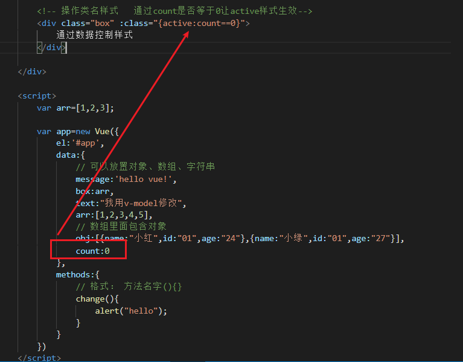
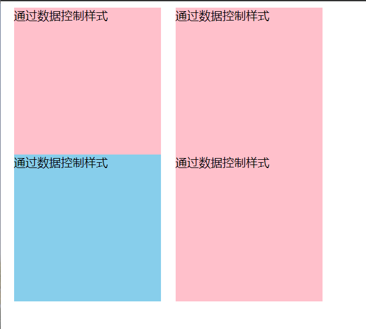

[TOC]


# 引入vue：

```js
<!-- 开发环境版本，包含了有帮助的命令行警告 -->
<script src="https://cdn.jsdelivr.net/npm/vue@2/dist/vue.js"></script>

<!-- 生产环境版本，优化了尺寸和速度 -->
<script src="https://cdn.jsdelivr.net/npm/vue@2"></script>
```

# html中新增div标签：

```html
<div id="app">
  {{ message }}
</div>
```

# js中进行数据渲染：

```js
var app = new Vue({
  el: '#app',
  data: {
    message: 'Hello Vue!'
  }
})
```

data里可以可以放置对象、数组、字符串

# 添加方法：

```html
        <!-- 点击事件触发方法 -->
        <!-- 格式：@click="方法名字()"-->
        <div @click="change()">
            {{box}}
        </div>
```

```js
        var app=new Vue({
            el:'#app',
            data:{
                // 可以放置对象、数组、字符串
                message:'hello vue!',
                box:arr
            },
            methods:{
                // 格式： 方法名字(){}
                change(){
                    alert("hello");
                }
            }
        })
```

# 使用v-model把值放在输入框中：

```html
<div>
    <!-- v-model会把值放在输入框中 -->
    <!-- text值会和输入框里面的值同步 -->
    <input type="text" v-model="text">
    <!-- 绑定text的文字 -->
    <div>{{text}}</div>
</div>
<script>
    var app=new Vue({
        el:'#app',
        data:{
            text:"我用v-model修改"
        }
    })
</script>
```

# v-for变量遍历

​		语法格式：v-for="(item,index) in arr"

- ​	item对应数组的值(可自命名)
- ​    index是数组下标(可自命名)
- ​    :key 固定值，key尽量保持唯一

​        遍历对象要加.

```html
<div>
    <!-- v-for变量 -->
	<div v-for="(item,index) in arr">{{item}}</div>
    <div v-for="(item,index) in obj" :key="index.id">
            值：{{item.name}}索引：{{index}}
    </div>
</div>
<script>
    var app=new Vue({
        data:{
            arr:[0,1,2,3,4,5],
            obj:[{name:"小红",id:"01",age:"24"},{name:"小绿",id:"01",age:"27"}]

        }
    })
</script>
```

# 操作类名样式

格式 `：class=“{样式名:条件语句}”`



# 案例：tab选项卡

1. 效果：

   点击即可更改颜色（样式）

   

2. 代码

   ```html
   <!DOCTYPE html>
   <html lang="en">
   <head>
       <title>tab选项卡</title>
       <script src="./vue.js"></script>
       <style>
           .box{
               width: 200px;
               height: 200px;
               background: pink;
               float: left;
               margin: 0 10px;
           }
           .active{
               background: skyblue !important;
           }
       </style>
   </head>
   <body>
       <div id="app">
           <div class="box" v-for="(item,index) in arr" :key="index" :class="{active:count==index}" @click="changeCount(index)">通过数据控制样式</div>
       </div>
   
       <script>
           var app=new Vue({
               el:"#app",
               data:{
                   arr:[0,1,2,3],
                   count:0
               },
               methods:{
                   // 用来修改count的值
                   changeCount(index){
                       console.log(index);
                       // 去修改data里面的值
                       this.count=index;
                   }
               }
           })
       </script> 
   </body>
   </html>
   ```

   