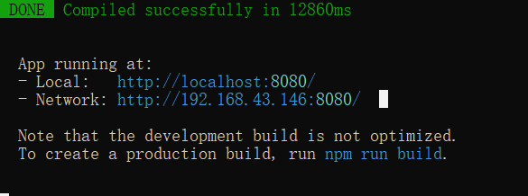

[TOC]

# 显示和隐藏

## v-if

1. 每次重新渲染
2. 格式： `v-if="条件语句"`
3. 整个元素移除，很消耗性能，频繁切换时不建议用
4. 注：跟v-for不要同时使用，v-for的优先级比它高

## v-show

1. 显示隐藏
2. 格式`v-show="条件语句"`
3. 将元素隐藏，频繁使用可以用v-show

# 生命周期函数

1. 每个 Vue 实例在被创建时都要经过一系列的初始化过程——例如，需要设置数据监听、编译模板、将实例挂载到 DOM 并在数据变化时更新 DOM 等。同时在这个过程中也会运行一些叫做**生命周期钩子**的函数，这给了用户在不同阶段添加自己的代码的机会。

2. 一个页面从开始到结束，会触发生命周期

3. 格式：

   ```js
   
               created(){
                   // 常用于请求数据
                   console.log("我的页面准备出生了，我要准备一些数据")
               },
               mounted(){
                   console.log("我的页面渲染了，可以操控dom节点")
               },
               // 计算属性，返回一个新的值
               // 当 this.bol 变化的时候 newBol也会变化
               // 由多个值影响一个值
               computed:{
                   newBol(){
                       return !this.bol
                   }
               }
   ```

# axios

1. 导入：`<script src="https://unpkg.com/axios/dist/axios.min.js"></script>`

2. 格式：

   /user中写url

   params中写参数

   ```js
   axios.get('/user', {
       params: {
         ID: 12345
       }
     })
     .then(function (response) {
       //// 成功请求
       console.log(response);
     })
     .catch(function (error) {
       //失败请求
       console.log(error);
     })
   ```

3. 示例：

   ```js
   created() {
                   // 常用于请求数据
                   axios.get('http://www.kangliuyong.com:10002/banner', {
                       params: {
                           appkey: 'U2FsdGVkX19WSQ59Cg+Fj9jNZPxRC5y0xB1iV06BeNA='
                       }
                   })
                   .then((response) =>{
                       // 成功请求
                       console.log(response);
                       this.imgArr=response.data.result
                   })
                   .catch((error) =>{
                       // 失败请求
                       console.log(error);
                   })
               },
   ```

# 安装node.js

1. 安装：

   

2. 测试安装：

   

3. 安装Vue脚手架工具vue-cli：npm install -g @vue/cli

4. 如果不行安装淘宝镜像：

   命令：npm install -g cnpm --registry=https://registry.npmmirror.com

   

5. 然后：cnpm install -g @vue/cli

6. 然后通过检测版本vue -V，查看是否安装成功


## 创建工程

1. 在文件夹下路径打开cmd，输入`vue create 项目名字`

2. 选择第三个自定义

3. 空格选择Babel、Router、Vuex、CSS Pre-processors

   

4. 选择2.x

   

5. 回车：

   

6. 选择less：

   

7. 回车：

   

8. 回车：

   

9. 完成：

   

# 打开项目

1. 目录下打开cmd，输入npm run server

2. 点击链接打开：

   