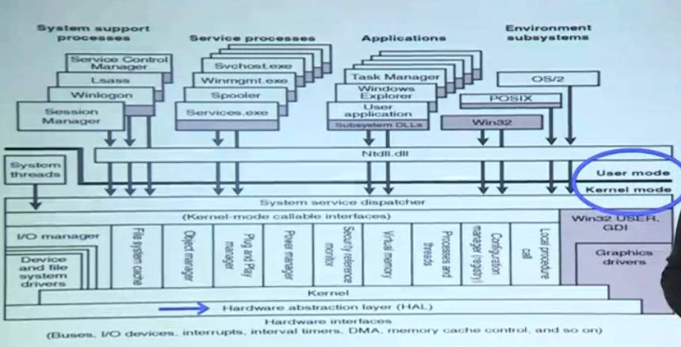
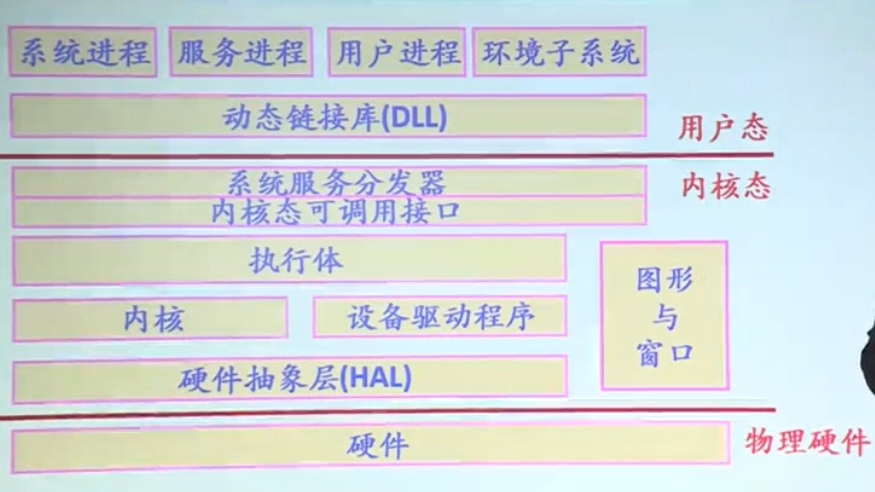
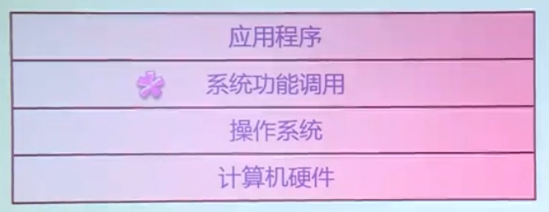
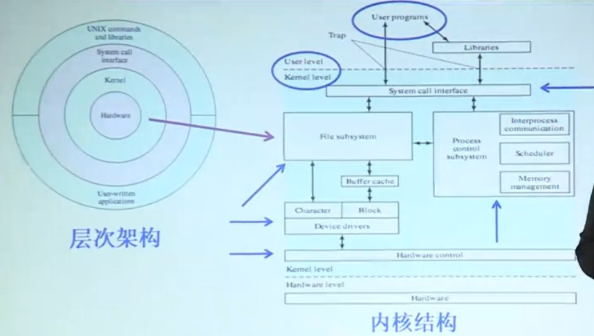
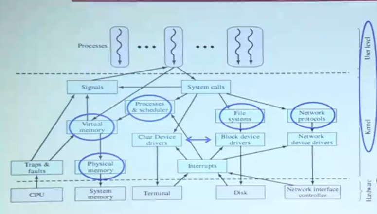
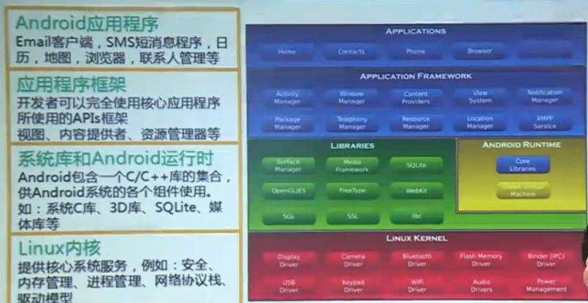

[TOC]

# 操作系统概述

## 操作系统做了什么？

在一个程序的执行过程中，操作系统负责了这个程序的**启动过程**，负责了这个程序**执行的过程**，同时在执行的过程中，不断地去为用户程序的执行提供各种各样的支持。

## 操作系统的定义和作用

1. 定义：**是计算机系统中的一个系统软件**（系统软件是一些程序模块的结合）

   1. 能以尽量**有效**（系统效率、资源利用率）、 **合理**（各种软硬件资源的管理是否公平合理）的方式组织和管理计算机的各种软硬件资源。 
   2. 合理地组织计算机的工作流程，控制程序的执行在程序执行的过程中向程序提供各种各样的服务功能。 
   3. 使得用户能够非常灵活、**方便地使用**（用户界面与编程接口）计算机，使整个的计算机系统能够高效率地运行。

2. 三个作用：

   1. 有效地管理资源->**有效**

      1. 管理：硬件资源和软件资源
      2. 管理方法：
         1. 跟踪记录资源的使用状况（数据结构）
         2. 确定资源分配策略（算法）：
            1. 静态分配策略
            2. 动态分配策略
         3. 实施资源的分配和回收
         4. 提高资源利用率
         5. 保护资源的使用
         6. 协调多个进程对资源请求的冲突
      3. 五大基本功能（资源管理角度）
         1. 进程/线程管理（CPU管理）
         2. 存储管理
         3. 文件管理
         4. 设备管理
         5. 用户接口

   2. 通过命令接口、编程接口向用户提供各种服务->**方便使用**

      ​	操作系统为用户提供了一组功能强大、方便易用的命令和系统调用。

   3. 对硬件机器的扩展

      1. ​	操作系统在应用程序与硬件之间建立了一个等价的扩展机器（虚机器）
      2. 对硬件抽象，提高可移植性；比底层硬件更容易编程

## 操作系统的主要特征

1. **并发**（concurrency）：指处理多个同时性活动的能力。
   - （区分）并行：指不同程序同时在多个硬件部件上执行。
2. **共享**（sharing）：操作系统与多个用户的程序共同使用计算机系统中的资源（共享有限的系统资源）。
   1. 资源使用的不同要求：
      1. 互斥共享（打印机）
      2. 同时共享（可重入代码、磁盘文件）
3. **虚拟**（virtual）：一个物理实体映射为若干个对应的逻辑实体——分时或分空间。
   1. 作用：提高资源的利用率。
   2. 体现的例子：
      1. CPU——每个进程的”虚处理机
      2. 存储器——每个进程都有独立的虚拟地址空间（代码+数据+堆栈）
      3. 显示设备——多窗口或虚拟终端
4. **随机**：操作系统必须随时对**以不可预测的次序**发生的事件进行响应并处理。

## 典型的操作系统的架构

1. Windows：

   ​	体系结构：

   

   

   

2. UNIX：

   ​	体系结构：

   

3. Linux：

   ​	体系结构：

   

4. Android：

   ​	体系结构：

# 操作系统的分类

操作系统的发展是随着**计算机硬件技术**、**应用需求的发展**、**软件新技术**的出现而发展的。

目标：充分利用硬件、提供更好的服务

大型机 -> 个人计算机 -> 网络 -> 移动计算 -> 云计算 -> 泛在计算（物联网） -> 机器人

### 传统操作系统的分类

#### 1.批处理操作系统

1. 工作方式：

   1. 用户将作业交给系统操作员（用户不能干预自己作业的执行）
   2. 系统操作员将许多作业组成一批作业，输入计算机系统，系统自动形成一个自动转接的连续的作业流
   3. 启动操作系统
   4. 系统自动、依次执行每个作业
   5. 由操作员将作业结果交给用户

2. 追求目标：

   ​	提高资源利用率，增加作业处理吞吐量（单位时间内处理越多越好）

3. 作业包括：

   1. 用户程序
   2. 数据
   3. 作业说明书（作业控制语言编写，类似现在的脚本）

4. 问题及解决：

   1. 问题：慢速输入输出，CPU处于等待状态
   2. 解决：卫星机：完成用户的输入输出，中间结果暂存在磁带或磁盘上

5. 处理方式：

   1. 单道批处理系统：一次处理一个，一个接一个
   2. 多道批处理系统：一次处理多个（支持多道程序设计，常用）

6. SPOOLING系统（技术）：

   1. 批处理系统的实现通常采用的技术
   2. 思想：利用磁盘作缓存，将输入、计算、输出分别组织成独立的任务流，使I/O和计算真正并行（假脱机技术）

#### 2.分时操作系统

1. 时间片（time slice）：操作系统将CPU的时间划分为若干个片段。

   1. 操作系统以时间片为单位，轮流为每个终端用户服务，每次服务一个时间片
   2. 利用人的错觉，让用户感觉不到计算机在为他人服务

2. 追求目标：

   ​	及时响应（依据响应时间）

#### 3.通用操作系统

1. 分时系统与批处理系统结合

2. 原则：分时优先，批处理在后（用户至上）

   ​	”前台“：需要频繁交互的作业

   ​	”后台“：时间性要求不强的作业

#### 4.实时操作系统

1. 指使计算机能**及时响应外部事件的请求**，在规定的**严格时间内**完成对该事件的处理，并控制所有的实时设备和实时任务协调一致地工作
2. 分类：
   1. 实时过程控制（工业控制、航空、军事控制等）
   2. 实时通信（信息）处理（银行、飞机订票、股票行情等）
3. 追求目标：
   1. 对外部请求在**严格时间范围内**做出响应
   2. 高可靠性

#### 5.个人计算机操作系统

1. 计算机在某一时间内为单用户服务
2. 功能：网络管理，通信，安全，资源共享和各种网络应用
3. 追求目标：相互通信，资源共享（网络出现后）

#### 6.分布式操作系统

1. 是一个统一的操作系统，允许若干个计算机可相互协作共同完成一项任务
2. 处理能力强、速度更快、可靠性增强、具有透明性

#### 7.嵌入式操作系统

​	对整个嵌入式系统以及它所操作、控制的各个部件装置等资源进行统一的协调、调度、指挥和控制

### TANENBAUM（另一种分类）

1. 大型机操作系统
2. 服务器操作系统
3. 多处理机操作系统
4. 个人计算机操作系统
5. 掌上计算机操作系统
6. 嵌入式操作系统
7. 传感器节点操作系统
8. 实时操作系统
9. 智能卡操作系统
   1. 智能卡：一种包含一块CPU芯片的卡片
   2. 特点：严格的运行能耗和存储空间限制
   3. 专用的操作系统

# 操作系统运行环境

## 中央处理器

1. 组成：运算器、控制器、一系列寄存器和高速缓存
2. 两类寄存器
   - **用户可见寄存器**：高级语言编译器通过优化算法分配并使用，以减少程序访问内存次数
   - **控制和状态寄存器**：
     - 控制处理器的操作，通常由操作系统代码使用
     - 在某种特权级别下可以访问、修改
     - 常用：
       - 程序计数器PC：记录要取出指令的地址
       - 指令寄存器IR：记录最近取出的指令
       - 程序状态字PSW：记录处理器的运行状态（条件码、模式、控制位等信息）
3. 处理器具有特权级别

## 处理器的状态（模式）

1. 操作系统需要的两种CPU状态：
   - 内核态：运行操作系统程序
   - 用户态：运行用户程序
   - 转换：
     - 内核态 ->用户态：中断/异常/陷入机制
     - 用户态 ->内核态：设置程序状态字PSW（访管指令：提供接口给用户调用操作系统的功能）
2. 特权指令和非特权指令：
   - 特权指令：只能由操作系统使用、用户不能使用的指令
   - 非特权指令：用户程序可以使用的指令

## 中断、异常机制

1. 概念：CPU对系统发生的某个事件作出的一种反应
2. 描述：CPU暂停正在执行的程序，保留现场后自动转去执行相应事件的处理程序，处理完成后返回断点，继续执行被打断的程序（改变了处理器的控制流）
3. 特点：
   - 随机发生
   - 自动处理
   - 可恢复的
4. 作用：
   - 中断：为了支持CPU和设备之间的并行操作
   - 异常：表示CPU执行指令时本身出现的问题
5. 例子：
   - 中断：I/O中断、时钟中断、硬件中断
   - 异常：系统调用、页故障/页错误、保护性异常、程序性异常（算术溢出）
6. 工作原理：
   - 硬件和软件相互配合
     - 硬件：响应（中断寄存器）
     - 软件：处理（中断处理程序：I/O操作正常结束、I/O操作出现错误）

