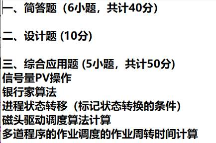
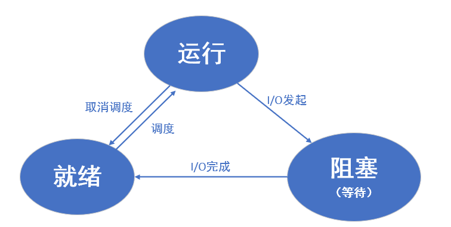
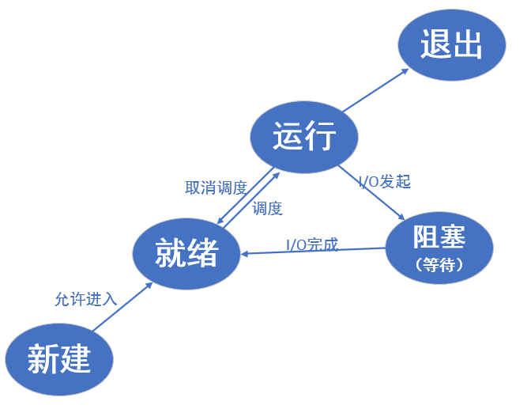
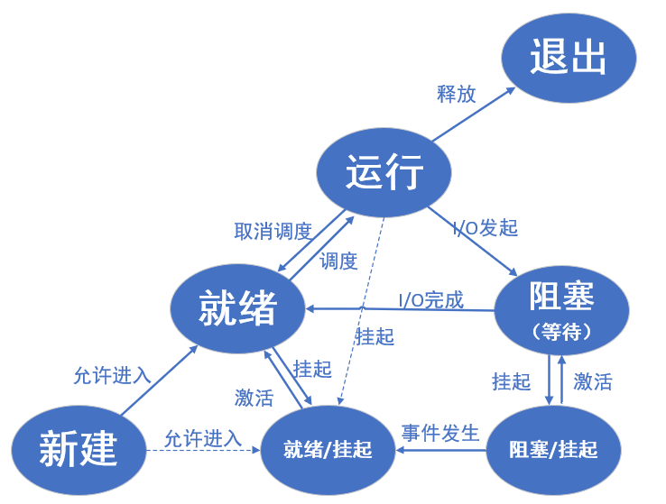

[TOC]

# 第二次课

## 1.  操作系统概念

定义：系统软件、统一管理软硬件资源、改善人机界面、合理组织计算机工作流程、控制程序执行。

特征：**并发、共享、**异步、虚拟

## 2.  操作系统主要目标

功能：进程管理、存储管理、设备管理、文件管理、进程同步与通信、信息维护。

 

## 3.  三种主要资源管理技术

https://www.cnblogs.com/sc3301395767/p/6323691.html

https://blog.csdn.net/yang__king/article/details/120811550

**1.**   **资源复用**

操作系统让众多进程共享物理资源。OS将资源的不同单位同时分配给不同进程，进程轮流使用资源，每个进程获得这类资源后会占用一段时间，多个进程则分时地共享这类资源。

**2.**   **资源虚拟**

OS把一个物理资源转变成多个逻辑上的对应物，或把多个物理资源转变成单个逻辑上的对应物

**3.**   **资源抽象**

复用和虚拟的主要目标是解决物理资源数量不足的问题，抽象则用于处理系统复杂性，重点解决资源易用性。

抽象是指创建软件来屏蔽硬件资源的物理特性和实现细节。简化对硬件资源的操作、控制、使用，对外提供应用接口。 

## 4.  三种基本抽象概念

https://blog.csdn.net/qq_50861318/article/details/121213239

**1.**   **文件**

对I/O设备的抽象

**2.**   **虚存**

对主存和硬件的抽象

**3.**   **进程**

对处理器、主存、I/O设备的抽象

# 第三次课

## 1.  多道程序设计的概念、提高计算机资源效率的案例

多道程序设计,是指把一个以上的程序存放在内存中, 并且同时处于运行状态, 这些程序共享 CPU 和其他计算机资源。

## 2.  操作系统的三个基本特性

https://www.cnblogs.com/weiyalin/p/10793318.html

**1.**   **并发性**

指处理多个同时性活动的能力。

（区分）并行：指不同程序同时在多个硬件部件上执行。

**2.**   **共享性**

指系统中的资源可供内存中多个并发执行的进程(线程)共同使用。

**3.**   **虚拟性**

是指把一个物理上的实体，变为若干个逻辑上的对应物。

4. 异步性

## 3.  系统调用的工作机制、与函数的不同

**中断/异常机制。**

操作系统为用户态进程与硬件设备进行交互提供了一组接口。当API中包含系统调用时，通过系统调用号进入相应的系统调用，然后**使用软中断进入内核态**。中断发生后会**保护现场**，将用户的当前栈顶地址，当时的状态字和cs:eip的值进行压栈。之后**进入由用户态切换到内核态**，处理完中断程序后**还原现场，返回用户态。**

 

**与函数的不同：**

库函数：应用程序的一部分；用户空间

系统调用：操作系统的一部分；内核空间

联系：库函数使用系统调用实现功能，在功能上相互补充。

## 4.  操作系统的几种结构

**1.**   **单体式结构**

\2.   **层次式结构：** 分层结构的操作系统，上层的实现依赖下一层，每一层为上一层提供服务。

\3.   **虚拟机结构**

**4.**   **微内核结构（C/S）**

## 5.  重要概念：内核、微内核，内核态与用户态

**内核：**是一组程序模块，作为可信软件来提供支持进程并发执行的基本功能和操作；

**微内核：**外观小，具有极少必须功能的内核；

**内核态：**运行操作系统程序，操作硬件

**用户态：**运行用户程序

# 第四次课

## 1.  程序执行的处理器现场构成

 

## 2.  执行程序被中断与恢复是如何实现的

\1.   程序请求操作系统的服务，执行**系统调用**

\2.   处理器**产生中断事件**，**运行程序被打断**，转向**中断处理程序**处理

\3.   处理器**将PSW和PC压入控制栈**（用于恢复中断）

\4.   处理器处理下一条指令周期，**中断处理程序处理中断**

\5.   **恢复处理状态信息，恢复PSW和PC值**，下一条指令执行

## 3.  多道程序设计需要OS控制程序执行和管理资源，只有OS才能执行特权指令

 

## 4.  现代操作系统是中断驱动

中断：指来自CPU执行指令以外的事件发生；

异常：指源自CPU执行指令内部的时间。

当应用程序执行**系统调用**要求获得系统服务、I/O设备报告传输情况，或者产生形形色色的内部和外部事件时，都**要通过中断机制产生中断信号启动操作系统内核工作**。

## 5.  中断的不同分类和处理

**中断：**

1.    内部中断（软中断/异常）和外部中断

1.   同步中断（异常，在指令执行时由CPU主动产生的）和异步中断（中断，CPU被动接收到的，不可预测）

1.   可屏蔽中断和非可屏蔽中断

**异常：**故障、陷阱和终止。

# 第五次课

## 1、 进程的概念，为什么引入进程这个概念p53

**进程：**操作系统为正在运行的程序提供的抽象，是作业的执行实体。

引入进程可以**有效管理和调度**进入计算机系统主存储器运行的程序。

## 2、进程的三状态模型、五状态模型、七状态模型p54

三状态模型：

五状态模型：

七状态模型：

## 3、进程的内存映像4个组成部分，各是什么内容？P57

https://blog.csdn.net/simonyucsdy/article/details/71155436

1. 

## 4、进程的队列管理，3状态模型的队列管理模式p59

## 5、通过Unix SVR4的状态模型理解状态转换和模式切换p63

# 第六次课

## 1、 原语概念，原语的不可分割性与DB中事务的不可分割性有什么区别？

## 2、 进程切换和模式切换的二者有什么区别？

### 3、 线程的概念，引入线程的原因是什么？P65

## 4、 有了多线程的进程的变化是什么

## 5、 实现线程的3中模式是什么？P69

 

# 第七次课

## 1、 结合进程7状态转移图，理解3个层次的调度

 

## 2、评估调度算法的基本原则，理解这些指标存在冲突，只能折中选择

## 3、剥夺式和非剥夺式算法的两个分类

## 4、计算非剥夺式的FIFO、短作业优先、最高相应比优先的平均作业周转时间，一定要理解，作业的进入时刻、等待时间、运行时间的作业时间刻画图

## 5、理解优先级数调度中优先级数确定的原则

## 6、理解多级反馈队列调度的原因

 

# 第八次课

## 1、程序和数据必须放入内存/主存才能执行，即分配内存和资源创建进程（进程内存影像）

## 2、可执行程序文件中逻辑地址（用户编程的名字，通常编译器生成逻辑地址），创建进程，执行程序的访问内存地址为物理地址或绝对地址，逻辑地址向物理地址的映射称为重定位，分为静态和动态两种

## 3、存储管理的四个基本功能

## 4、程序的空间和时间局部性原理为基础，实施存储体系的金字塔模式，进程信息一部分放入内存，随着程序执行自动调入和换出，为用户提供一个大的、可访问的虚拟地址空间

## 5、连续存储管理，采用链表管理物理内存空间使用情况，可变地址分配有四种算法

# 第九次课

## 1、连续可变分区管理的分配算法和回收算法

## 2、相比连续的分区管理，页式管理的优势是什么？

## 3、概念——页的大小要求、页、页框、页表、快表

## 4、页式管理的逻辑地址向物理地址的转换过程

## 5、程序局部性原理

## 6、请求页式虚拟存储管理的定义

## 7、请求页式虚拟存储管理中页表扩充哪些字段

## 8、页面调度算法、缺页中断率的概念

## 9、OPT、FIFO、LRU页面调度算法

 

# 第十次课

## 1、段式管理中逻辑地址由那二维组成

## 2、段表的各列是哪些？转换逻辑地址到物理地址的过程

## 3、相比页式管理，段式管理的优势是什么？

## 4、段页式管理的逻辑地址到物理地址的地址的转换过程

 

# 第十一次课

## 1、设备管理的功能

## 2、I/O系统的组成

## 3、设备控制器的功能

## 4、I/O的四种控制方式

## 5、设置缓冲区的主要目的和分类

## 6、层次模式的I/O软件有哪些？

 

# 第十二次课

## 1、理解设备无关性、设备独立性，逻辑设备和物理设备如何映射的！

## 2、设备分配与去配的过程，涉及到数据结构有哪些？

## 3、硬盘的结构、物理块的地址、访问物理块的时间构成

## 4、主要的驱动调度技术，计算磁头臂移动的距离

## 5、虚拟设备的概念，spooling技术实现的框架图、作业的状态变化

 

# 第十三次课

## 1、文件的概念，分类

## 2、文件系统的概念和优势，为用户提供的功能，主要内容

## 3、逻辑文件的概念和分类

## 4、物理文件的概念和分类，卷和块的概念

## 5、逻辑记录和物理记录的成组与分解操作

 

# 第十四次课

## 1.文件的共享

## 2.文件的安全

## 3.文件的使用

## 4.文件目录管理

 

# 第十五次课

## 1. 概念：独占资源、邻接资源、临界区、临界区管理规则

## 2. 临界区管理的软件、硬件解决方法

## 3. 信号量的分类、记录型信号量的含义、信号量操作的含义

## 4. 互斥信号量时如何解决进程互斥的过程

## 5. 信号量如何解决不同进程的程序段执行的先后顺序控制

 

# 第十六次课

## 1、信号量及其操作解决进程互斥、进程同步的基本原理是什么？

## 2、信号量及其操作解决读者写者问题的伪代码

## 3、管程的目的是什么？管程的概念和特性

## 4、信号量和条件变量的区别和联系是什么？

## 5、进程通信如何区分高级和低级通信？

## 6、进程通信的直接通信和间接通信是什么？