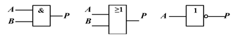
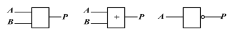
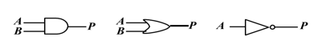
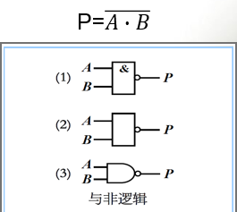
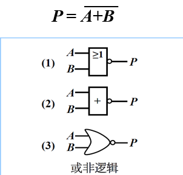
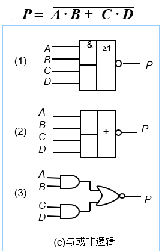
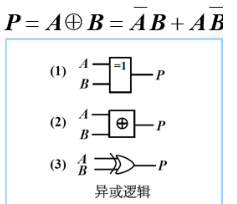
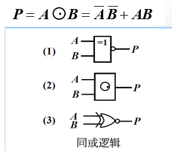

[TOC]

# 逻辑函数及其简化

1. 逻辑代数

   1. 基本逻辑：

      - 与：P = A **·**Ｂ    
      - 或：P = A +Ｂ   
      - 非：P = A ̅ 

   2. 复合逻辑运算：

      - **与非逻辑** ：

      

      - **或非逻辑**：

      

      - **与或非逻辑**：

        

      - **异或逻辑**：

        

      - **同或逻辑**：

