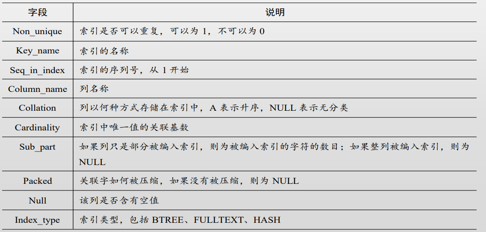

[TOC]

# 复习

基本概述，数据库存的是什么，数据和数据之间的关系（表结构、约束等）

字符类型种类（int、字符类型：char、varchar、text等），

​	一个比较特殊的数据类型decimal（m，n）固定浮点数，m是整个的位数，n是小数点后的位数。

​	blob，文字，图像，音视频等比较大的文件

## 索引

​	索引作用：提升查询和检索的性能，一个表只能建立一个主键索引（聚集索引），组合索引可以包含多个字段（最好不超过五个），

​	索引选择：需要频繁更新的、记录较少表、有很多null值的不适合（效率低），where子句出现比较高的适合。

​	索引可以加快表之间连接的速度

记住具体语句


## 视图

名称不能跟任何的表名称相同，视图可以基于基本表/视图产生

## InnoDB

主要参数：bufferpool的 size

三层结构

表文件

1. mysiam
   1. 表结构文件.frm
   2. 数据文件.myd
   3. 索引文件.myi
2. Inonodb
   1. .iba

事务的支持：innodb支持，mysiam不支持

## 事务

四大特性：原子性、一致性、持续性、隔离性（并发执行的各事务不能互相干扰）

Innodb支持行级锁，mysiam只支持表级锁

## 锁

分类

1. 粒度
   1. 表级锁
   2. 行级锁
   3. 列级锁
2. 类型
   1. 读锁
   2. 写锁
   3. 意向锁
   4. （间隙锁）

## 查询优化

步骤

常用命令，**explain查看执行计划（分析）**

### 基本答题：

执行计划考察

1. **分析**执行计划和可优化的点（基于分析进行优化）
2. 考察优化的深度（就是多写点）
3. 步骤：
   1. 分析
   2. 优化
      1. 加索引
      2. 子查询改成关联查询
      3. 基本优化手段（where子查询的字段加索引
      4. sql语句
   3. 课堂案例（查询和索引那两章）

问答题

1. 考对基本知识的记忆
   1. 事务的隔离级别，出现的并发读写异常，和锁的关系
2. mysql的结构：
   1. 主键、
   2. sql语句进入MySQL处理的环节
   3. 1.3.1客户端、连接池、查询缓存（基本不开）、解析器、优化器（生成执行计划）、执行器、存储引擎、读数据、
3. 存储引擎实现事务的原理
   1. redolog，undolog
   2. （上面两个的作用）
4. 事务执行期间对redo和undo的提交顺序，没有开启binlog和开启的（有三部，开了binlog有四步）

## 复制

分类

1. stamen直接复制（有null的时候……主从不一致）
2. 基于行的复制
   1. 复制变化
3. 复制的方式：异步（可能会丢数据）、同步（性能差）、半同步（一般）、jpid（一般）
4. format方式
5. 复制的特点（同步、半同步
6. 实验，asbeta的备份语句

### 综合题

高可用（

步骤

1. 选择存储引擎
2. 选择的架构、架构图
3. 主、从、备、集群
4. 集群挂备机
5. 综合设计
6. ……自圆其说
7. 不会就写主从

# 4.索引

前言：

索引的好处、作用，执行计划里面的常见字段、优化方式

第4章 索引是干嘛的 怎么跟执行计划分析 怎么看explain出来的分析计划常见字段 那些字段反映的信息提出一个优化来 在哪里加索引呢

案例，根据你的执行计划。去分析怎么添加索引

## 索引的原理

1. 索引以索引文件的形式存储在磁盘中，索引查找过程中会产生磁盘I/O消耗
2. 以BTree存储可以充分利用磁盘的预读功能，提高查询效率
3. B+Tree提高磁盘I/O性能的同时解决了元素遍历效率低下的问题
4. InnoDB存储引擎使用B+Tree实现其索引结构

## 聚集索引和辅助索引

1. 聚集索引
   - 索引键值的逻辑顺序决定了表数据行的物理存储顺序。
   - 叶节点存放整张 表的行记录数据。
   - 每张表只能有1个聚集索引。
2. 辅助索引
   - 叶子节点存键值及书签。
   - 每表能有多个辅助索引。

## 索引的分类

### 普通索引

1. 是最基本的索引类型

2. 作用：加快对数据的访问速度

3. 创建索引：

   ```sql
   #创建表时
   create table 表名(
       字段 数据类型,
       ……
       index [索引名](字段名[(长度)])
   );
   
   #创建完成的表
   create index 索引名 on 表名(字段名[(长度)]);
   ```

4. 查看表中的索引信息：

   - `show index from 表名`

   - 字段解读：

     

5. 删除索引：

   ```sql
   drop index 索引名 on 表名
   ```

### 唯一索引

1. **索引列的所有值都只能出现一次，即必须是唯一的。**

2. 作用：可以保证数据的唯一性，同时可以简化MySql对索引的管理工作，使索引变得简单高效

3. 创建唯一索引：

   ```sql
   #创建表时
   create table 表名(
       字段 数据类型,
       ……
       unique index [索引名](字段名[(长度)])
   );
   
   #创建完成的表
   create unique index 索引名 on 表名(字段名[(长度)]);
   ```

4. 删除表中的唯一索引：

   ```sql
   alter table drop index 索引名
   ```

### 主键索引

1. 在InnoDB 存储引擎中，主键是一个聚集索引。

2. 使用自增列做主键好处：

   - 避免了插入过程中聚集索引的排序问题
   - 避免了插入新数据时频繁的移动和分页操作造成的大量碎片

3. 删除主键：

   ```sql
   drop index 'primary' on 表名
   ```

### 全文索引

1. 全文索引是一种特殊类型的索引，他查找的是文本中的关键词，是基于相似度的查询

## 案例分析

### 索引使用的原则

1. 索引优点：

   - 加快数据的检索速度
   - 可以保证数据表中每一列数据的唯一性
   - 加速表与表之间的连接
   - 在使用分组或排序子句时，可以减少查询中分组和排序的时间

2. 过度使用索引的缺点：

   - 随着数据总量的增加，数据库建立的过程中需要花费更多的时间去建立和维护索引
   - 索引本身的存储也需要占用物理空间
   - 当对数据进行增删改时，也需要对索引进行相应的维护，降低了数据的维护速度

3. 索引的使用原则：

   - 一定要有**主键**，显式定义主键并且采用与业务无关的列以避免修改，建议使用自增列使数据顺序插入

   - **经常被查询、用于表连接、经常排序分组**的列需要建立索引，**不建议在频繁更新**的字段上建立索引。

   - 还要查看索引的**选择性**（不重复的索引值和表的记录总数的比值），选择性越接近1，越适合创建索引

   - **组合索引**，一般把选择性高的列放在前面

   - 合理利用**覆盖索引**，禁止使用select*语句

   - 使用**explain**判断sql语句是否使用了索引，进行避免extra出现using filesort或using temporary

   - 单张表的索引控制在五个内，太多会**浪费空间且降低修改数据的速度**，影响性能

   - where条件中的**索引列不能是表达式的一部分**（`select * from employees where emp_no + 1 = 10003;`），会导致索引不被使用而进行全表扫描

   - 如果使用join查询，那么**被join的字段必须类型相同且建立索引**，否则会导致全表扫描

   - 隐式类型转换会使索引失效，导致全表扫描

     ```sql
     explain 
     select * from dept_emp
     where dept_no = 3; #dept_no 为字符串
     ```

4. 案例1：

   1. 语句：

      ```sql
      SELECT * FROM tt1 WHERE DATE(log time)=‘2015-04-09’
      ```

   2. 分析：

      1. 通过explain查看的执行计发现，type列是ALL, 这条语句进行了一个全表扫描。
      2. 虽然 给字段log_time加了索引，但是没有用到索引。
      3. 因为违背避免在Where条件中在索引列上 进行计算或使用函数。
      4. 可以修改为SELECT * FROM tll WHERE log_time >= ‘2015-04- 09 00:00:00’ AND log_ time <= ‘2015-04-10 00:00:00’
      5. MySQL5.7 的虚拟列特性实现表达式索引

5. 案例2：

   1. 语句：

      ```sql
      select id,user_id,name from test_2 where 
      user_id=1
      ```

   2. 分析：

      1. 认真观察表结构，user_id的字段类型是字符串，而用户传入的是int这里会有隐式转换的问题。
      2. 隐式类型转换会使索引失效，导致全表扫描。
      3. 把输入改成字符串类型,查看执行 计划 “explain select id, user_id, name from test_2 where user_id=‘1’”,就会用到索引。

## ICP（Index Condition Pushdown）

1. 是一种**在存储引擎层使用索引过滤数据**的一种优化方式。
2. ICP的目标是减少从基表中读取操作的数量，从而降低I/O操作。
3. 支持InnoDB和MyISAM表
4. 只能用于二级索引，不能用于主索引
5. ICP的加速效果取决于在存储引擎内通过ICP筛选掉的数据的比例
6. 当sql使用覆盖索引时，不支持ICP优化方法
7. 需要全表访问时，可用于range, ref, eq_ref, ref_or_null类型

### 案例

1. 建立二级索引

   ```sql
   ALTER TABLE employees ADD INDEX first_name_last_name
   (first_name, last_name)
   ```

2. 启用profiling并关闭Query Cache