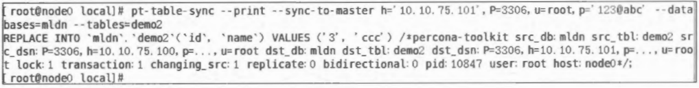
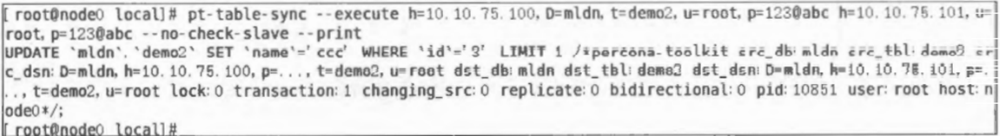

 [TOC]

   # 复习

   基本概述，数据库存的是什么，数据和数据之间的关系（表结构、约束等）

   字符类型种类（int、字符类型：char、varchar、text等），

   ​	一个比较特殊的数据类型decimal（m，n）固定浮点数，m是整个的位数，n是小数点后的位数。

   ​	blob，文字，图像，音视频等比较大的文件

   ## 索引

   ​	索引作用：提升查询和检索的性能，一个表只能建立一个主键索引（聚集索引），组合索引可以包含多个字段（最好不超过五个），

   ​	索引选择：需要频繁更新的、记录较少表、有很多null值的不适合（效率低），where子句出现比较高的适合。

   ​	索引可以加快表之间连接的速度

   记住具体语句

   

   ## 视图

   名称不能跟任何的表名称相同，视图可以基于基本表/视图产生

   ## InnoDB

   主要参数：bufferpool的 size

   三层结构

   表文件

   1. mysiam
      1. 表结构文件.frm
      2. 数据文件.myd
      3. 索引文件.myi
   2. Inonodb
      1. .iba

   事务的支持：innodb支持，mysiam不支持

   ## 事务

   四大特性：原子性、一致性、持续性、隔离性（并发执行的各事务不能互相干扰）

   Innodb支持行级锁，mysiam只支持表级锁

   ## 锁

   分类

   1. 粒度
      1. 表级锁
      2. 行级锁
      3. 列级锁
   2. 类型
      1. 读锁
      2. 写锁
      3. 意向锁
      4. （间隙锁）

   ## 查询优化

   步骤

   常用命令，**explain查看执行计划（分析）**

   ### 基本答题：

   执行计划考察

   1. **分析**执行计划和可优化的点（基于分析进行优化）
   2. 考察优化的深度（就是多写点）
   3. 步骤：
      1. 分析
      2. 优化
         1. 加索引
         2. 子查询改成关联查询
         3. 基本优化手段（where子查询的字段加索引
         4. sql语句
      3. 课堂案例（查询和索引那两章）

   问答题

   1. 考对基本知识的记忆
      1. 事务的隔离级别，出现的并发读写异常，和锁的关系
   2. mysql的结构：
      1. 主键、
      2. sql语句进入MySQL处理的环节
      3. 1.3.1客户端、连接池、查询缓存（基本不开）、解析器、优化器（生成执行计划）、执行器、存储引擎、读数据、
   3. 存储引擎实现事务的原理
      1. redolog，undolog
      2. （上面两个的作用）
   4. 事务执行期间对redo和undo的提交顺序，没有开启binlog和开启的（有三部，开了binlog有四步）

   ## 复制

   分类

   1. stamen直接复制（有null的时候……主从不一致）
   2. 基于行的复制
      1. 复制变化
   3. 复制的方式：异步（可能会丢数据）、同步（性能差）、半同步（一般）、jpid（一般）
   4. format方式
   5. 复制的特点（同步、半同步
   6. 实验，asbeta的备份语句

   ### 综合题

   高可用（

   步骤

   1. 选择存储引擎
   2. 选择的架构、架构图
   3. 主、从、备、集群
   4. 集群挂备机
   5. 综合设计
   6. ……自圆其说
   7. 不会就写主从

   # 4.索引

   前言：

   索引的好处、作用，执行计划里面的常见字段、优化方式

   第4章 索引是干嘛的 怎么跟执行计划分析 怎么看explain出来的分析计划常见字段 那些字段反映的信息提出一个优化来 在哪里加索引呢

   案例，根据你的执行计划。去分析怎么添加索引

   ## 索引的原理

   1. 索引以索引文件的形式存储在磁盘中，索引查找过程中会产生磁盘I/O消耗
   2. 以BTree存储可以充分利用磁盘的预读功能，提高查询效率
   3. B+Tree提高磁盘I/O性能的同时解决了元素遍历效率低下的问题
   4. InnoDB存储引擎使用B+Tree实现其索引结构

   ## 聚集索引和辅助索引

   1. 聚集索引
      - 索引键值的逻辑顺序决定了表数据行的物理存储顺序。
      - 叶节点存放整张 表的行记录数据。
      - 每张表只能有1个聚集索引。
   2. 辅助索引
      - 叶子节点存键值及书签。
      - 每表能有多个辅助索引。

   ## 索引的分类

   ### 普通索引

   1. 是最基本的索引类型

   2. 作用：加快对数据的访问速度

   3. 创建索引：

      ```sql
      #创建表时
      create table 表名(
          字段 数据类型,
          ……
          index [索引名](字段名[(长度)])
      );
      
      #创建完成的表
      create index 索引名 on 表名(字段名[(长度)]);
      ```

   4. 查看表中的索引信息：

      - `show index from 表名`

      - 字段解读：

        

   5. 删除索引：

      ```sql
      drop index 索引名 on 表名
      ```

   ### 唯一索引

   1. **索引列的所有值都只能出现一次，即必须是唯一的。**

   2. 作用：可以保证数据的唯一性，同时可以简化MySql对索引的管理工作，使索引变得简单高效

   3. 创建唯一索引：

      ```sql
      #创建表时
      create table 表名(
          字段 数据类型,
          ……
          unique index [索引名](字段名[(长度)])
      );
      
      #创建完成的表
      create unique index 索引名 on 表名(字段名[(长度)]);
      ```

   4. 删除表中的唯一索引：

      ```sql
      alter table drop index 索引名
      ```

   ### 主键索引

   1. 在InnoDB 存储引擎中，主键是一个聚集索引。

   2. 使用自增列做主键好处：

      - 避免了插入过程中聚集索引的排序问题
      - 避免了插入新数据时频繁的移动和分页操作造成的大量碎片

   3. 删除主键：

      ```sql
      drop index 'primary' on 表名
      ```

   ### 全文索引

   1. 全文索引是一种特殊类型的索引，他查找的是文本中的关键词，是基于相似度的查询

   ## 案例分析

   ### 索引使用的原则

   1. 索引优点：

      - 加快数据的检索速度
      - 可以保证数据表中每一列数据的唯一性
      - 加速表与表之间的连接
      - 在使用分组或排序子句时，可以减少查询中分组和排序的时间

   2. 过度使用索引的缺点：

      - 随着数据总量的增加，数据库建立的过程中需要花费更多的时间去建立和维护索引
      - 索引本身的存储也需要占用物理空间
      - 当对数据进行增删改时，也需要对索引进行相应的维护，降低了数据的维护速度

   3. 索引的使用原则：

      - 一定要有**主键**，显式定义主键并且采用与业务无关的列以避免修改，建议使用自增列使数据顺序插入

      - **经常被查询、用于表连接、经常排序分组**的列需要建立索引，**不建议在频繁更新**的字段上建立索引。

      - 还要查看索引的**选择性**（不重复的索引值和表的记录总数的比值），选择性越接近1，越适合创建索引

      - **组合索引**，一般把选择性高的列放在前面

      - 合理利用**覆盖索引**，禁止使用select*语句

      - 使用**explain**判断sql语句是否使用了索引，进行避免extra出现using filesort或using temporary

      - 单张表的索引控制在五个内，太多会**浪费空间且降低修改数据的速度**，影响性能

      - where条件中的**索引列不能是表达式的一部分**（`select * from employees where emp_no + 1 = 10003;`），会导致索引不被使用而进行全表扫描

      - 如果使用join查询，那么**被join的字段必须类型相同且建立索引**，否则会导致全表扫描

      - 隐式类型转换会使索引失效，导致全表扫描

        ```sql
        explain 
        select * from dept_emp
        where dept_no = 3; #dept_no 为字符串
        ```

   4. 案例1：

      1. 语句：

         ```sql
         SELECT * FROM tt1 WHERE DATE(log time)=‘2015-04-09’
         ```

      2. 分析：

         1. 通过explain查看的执行计发现，type列是ALL, 这条语句进行了一个全表扫描。
         2. 虽然 给字段log_time加了索引，但是没有用到索引。
         3. 因为违背避免在Where条件中在索引列上 进行计算或使用函数。
         4. 可以修改为SELECT * FROM tll WHERE log_time >= ‘2015-04- 09 00:00:00’ AND log_ time <= ‘2015-04-10 00:00:00’
         5. MySQL5.7 的虚拟列特性实现表达式索引

   5. 案例2：

      1. 语句：

         ```sql
         select id,user_id,name from test_2 where 
         user_id=1
         ```

      2. 分析：

         1. 认真观察表结构，user_id的字段类型是字符串，而用户传入的是int这里会有隐式转换的问题。
         2. 隐式类型转换会使索引失效，导致全表扫描。
         3. 把输入改成字符串类型,查看执行 计划 “explain select id, user_id, name from test_2 where user_id=‘1’”,就会用到索引。

   ## ICP（Index Condition Pushdown）

   1. 是一种**在存储引擎层使用索引过滤数据**的一种优化方式。
   2. ICP的目标是减少从基表中读取操作的数量，从而降低I/O操作。
   3. 支持InnoDB和MyISAM表
   4. 只能用于二级索引，不能用于主索引
   5. ICP的加速效果取决于在存储引擎内通过ICP筛选掉的数据的比例
   6. 当sql使用覆盖索引时，不支持ICP优化方法
   7. 需要全表访问时，可用于range, ref, eq_ref, ref_or_null类型

   ### 案例

   1. 建立二级索引

      ```sql
      ALTER TABLE employees ADD INDEX first_name_last_name
      (first_name, last_name)
      ```

   2. 启用profiling并关闭Query Cache

      ```sql
      set profiling=1;
      
      set query_cache_type=0;
      
      set global query_cache_size=0;
      ```

   3. 对比：关闭ICP

      ```sql
      set optimizer_ switch='index _ condition _pushdown=off'
      ```

   4. 分析发现

      1. 禁用ICP后，同样的查询，耗时是之前的两倍多
      2. 于Extra列：开启ICP时，用的是 Using index condition; 关闭ICP 时，Extra列是Using where

   ## MRR

   1. 原理：优化器将随机I/O转换为顺序I/O
   2. 目的：减少磁盘的随机访问，降低查询过程的I/O开销
   3. 使用：不用每次都通过辅助索引回表取数据，而是将rowid缓存起来并对其排序，然后再访问记录。
   4. 优点：
      1. 磁盘和磁头不用来回做机械运动
      2. 可以充分利用磁盘预读
      3. 在一次查询中，每一页数据只会从磁盘中读取

   ## BKA

   1. 是提高join性能的算法
   2. 作用：在读取连接表的记录使使用顺序I/O

   

# 5.数据表的设计与优化

## 约束

### 数据完整性

1. 数据库中数据的正确性、一致性和有效性。
2. 分类：
   1. 实体完整性（行完整性）：primary key 、 unique
   2. 数据完整性（列完整性）：check、unique、default、identity、not null/null
   3. 参考完整性（引用）：主键和外键
   3. 用户定义的完整性：check、not null
3. 主键需要遵循的规则：
   1. 当主键是复合主键时，只能定义为表的完整性约束
   2. 最小化规则：符合主键删掉一个后，如果剩下的依然满足唯一性原则，那么这个复合主键是不正确的
   3. 唯一性原则

## 视图

1. 数据库中只存放视图的定义，不存放视图的数据，数据存放在源表中。

2. 视图优点：

   1. 简化操作
   2. 提高数据安全性
   3. 数据实时更新
   4. 屏蔽了数据库的复杂性
   5. 便于数据共享

3. 格式：

   ```sql
   CREATE  VIEW 视图名 [(列名列表)] AS select语句    [WITH CHECK OPTION] 
   ```

## 分区表

1. 是一个独立的逻辑表，底层由多个物理字表组成。
2. 优点：
   1. 数据易维护
   2. 分区表的数据可以分在不同的物理设备上，高效利用硬件设备
   3. 可以备份和恢复独立的分区，适用于非常大的数据集场景
   4. 可以避免某些特殊瓶颈，比如单个索引的互斥访问
3. 缺点：
   1. 一个表最多只能由1024个分区
   2. 无法使用外键约束
   3. 如果分区字段中有主键或唯一索引的列，那所有主键列和唯一索引列都必须包含进来。
4. 分区类型
   1. range分区：基于一个给定连续区间的列，把多行分配给分区
   2. list分区：明确指定了根据某字段的某个具体值进行分区
   3. hash分区：通过某种策略（hash、range 等）将数据均匀插入到不同的块
   4. key分区：必须有一列或多列包含整数值
5. 使用场景：
   1. 大数据量时，可以用小代价定位数据的区域位置
   2. 当数据有明显热点，其他数据很少被访问时，可以将热点数据单独放在一个分区，让这个分区的数据有机会缓存到内存中，使其可以用索引也可以用缓存。
6. 分区表会出现的问题：
   1. Null值会使分区的过滤无效
   2. 选择分区的成本高，键分区和哈希分区没有这个问题。
   3. 维护分区表的成本高，当查询访问分区表使，要打开并锁住所有底层表。

# 9.复制

## 主从复制

1. 指数据可以从一个MySQL数据库服务器主节点复制到另一个MySQL数据库服务器从节点。

2. 分析：

   1. 主服务器master：二进制日志binlog，用来保存修改数据库表的所有动作
   2. 从服务器slave：中继日志relay-log

3. 用途：

   1. 从服务器作为主服务器的实时数据备份
      1. 加强数据库架构的健壮性
      2. 可以在从服务器备份，主的服务不受影响
   2. 主从服务器实时读写分离，从服务器实现负载均衡
   3. 把多个从服务器根据业务的重要性进行拆分访问

4. 原理（涉及三个线程）：

   1. 主服务器：任何修改都会通过**I/O线程**保存在二进制日志里
   2. 从服务器：
      1. **I/O线程**通过配置的用户名密码连接到主服务器
      2. 请求读取二进制日志，然后读取到本地的中继日志末端
      3. 将主服务器端的二进制日志的文件名和位置记录到master-info中（每次同步都会记录）
      4. **Sql线程**检查到中继日志有新增后，马上解析执行

5. 重点参数解析（my.cnf中）：

   | server-id                | 主从结构的唯一标识                                           |
   | :----------------------- | :----------------------------------------------------------- |
   | log-bin                  | 开启二进制日志                                               |
   | binlog_format            | 二进制日志的格式                                             |
   | read_only                | 设置从库只读模式                                             |
   | relay_log_recovery       | 设为1，宕机后放弃未执行的中继日志，重新获取                  |
   | gtid_mode                | 是否开启gtid模式                                             |
   | enforce-gtid-consistency | 默认off，标识限定事务安全的sql才允许被记录                   |
   | log_slave_updates        | 将master上获取数据变更的信息记录到slave二进制文件中，默认不记录 |

### 部署架构

1. 一主一从/一主多从
   1. 常见的 master-slaves 架构（大概 90% 的主从复制会使用这种架构）
   2. 因为在很多系统中读压力往往会大于写压力
2. 多级主从（级联同步）
   1. 将二进制日志只给某一个从服务器使用，并在该从服务器上开启二进制日志，将该从服务器二进制日志分发给其他的从服务器；
   2. 或者，这个从服务器不进行数据的复制，只负责将二进制日志转发给其他的从服务器
   3. 注意的是要复制的节点过多，会导致复制延迟
3. 双主
   1. 双master环境，互相将对方视为自己的master, 自己作为slave。
   2. 如果其中一个master停机维护，重启后也不会有任何数据问题。
   3. 都同时提供写服务的话，也会有一定的数据冲突问题
   4. 业务上同一时刻只允许对一个主进行写入
4. 多主一从（多源复制）
   1. 从机从各主机同步接收业务信息
   2. 一部服务器为多个主机服务器备份、合并数据表、联合数据。
   3. 应用场景：数据汇总
   4. 加入了Channel的概念，每一个Channel都是一个独立的Slave
   5. 使用这种架构时，需要将my.cnf中的 master-info-repository、relay-log-info-repository参数设置为TABLE
   6. 管理者可以直接在从数据库中进行数据备份，不会影响线上业务的正常运行

### 复制方式

1. 异步复制（默认）
   1. 主数据库执行完事务后立即将结果返回给客户端，不关心从数据是否已接收
   2. 复制效率很高，缺点也很明显
   3. 如果主数据库崩溃，主数据库上已经提交的事务可能并没有传到从数据库上（可能导致数据不完整
2. 半同步复制
   1. 为了保证在主库出现问题的时候至少有一个从库的数据是完整的
   2. 主库在执行完客户端提交的事务后，等待至少一个从库接收到并写到relay log中才返回给客户端
   3. 提高了数据的安全性，同时也造成了一定程度的延迟
   4. 至少是一个TCP/IP往返的时间，所以最好在低延时的网络中使用
   5. 在等待超时的情况下，半同步复制也会转换为异步复制，以保障主库业务的正常更新
3. GTID复制
   1. GTID：在binlog中唯标识一个事务
   2. 限制：
      1. 不支持非事务引擎
      2. 不支持 create table ... select 语句复制
      3. 不允许在 SQL 同时更新一个事务引擎和非事务引擎的表
      4. 在一个复制组中，必须统一开启或是关闭 GTID
      5. GTID需要重启
4. 多源复制
   1. 一个slave从实例指向多master主实例，相当于把多个MySQL实例的数据汇聚到一个实例上面
   2. 条件：在从库上设置`master-info-repository`和`relay-log-info-repository`这两个参数（用来存储同步信息），取值：
      1. file：存储在文件中，服务器如果意外关闭，主从间的同步信息文件没有来得及更新，就会造成数据的丢失。
      2. table：存储在表中，表都是InnoDB类型，支持事务，相对文件存储安全得多。
   3. 使用场景：
      1. 做数据分析
      2. 做数据汇总
      3. 在从服务器对所有主服务器的数据进行备份

### 故障处理

1. 主键冲突
   1. 原因：
      1. 从库上执行了写操作，比如插入记录
      2. 然后在主库上执行相同的SQL语句，主键冲突，主从复制状态就会报错。
      3. 在从库上执行`show slave status`, 会发现报错
   2. 解决方法：
      1. 利用percona-tookit工具中的pt-slave-restart命令在从库跳过错误
      2. 重启从库，重新配置复制
2. 主库更新数据，从库找不到
   1. 原因：
      1. 在从库执行delete删除操作，再在主库执行更新操作
      2. 由于从库已经没有该数据，导致主从数据不一致了
   2. 解决方法：
      1. 执行`show slave status`命令
      2. 根据错误提示的binlog文件和 position号，在主库上通过`mysqlbinlog`命令查找在主库执行的哪条SQL语句导致的报错
      3. 把从库上丢失的这条数据补上，然后执行跳过错误
      4. 从库缺失了很多条数据，就要考虑重新搭建主从环境
3. 在主库中设置binlog-do-db=xxx的库复制过滤规则，并且在statement binlog 格式下执行跨库操作，导致从库没有复制成功
   1. 原因：
      1. 主库参数文件有binlog-do-db设置，并且主库的binlog_format设置为statement
      2. 进行跨库操作的时候，数据不能复制到从库上，导致主从数据不一致。
   2. 解决方法：
      1. 主库的binlog格式要为row模式，另外在主库上尽量避免使用库复制过滤原则
      2. 可以在从库上使用replicate-do-db或者replicate-ignore-db参数

### 主从延迟解决方案

1. 主从复制的数据—致性检查

   1. 利用perconna-toolkit工具集中的pt-table-checksum工具来检查主从数据的一致性

      

      结果：

      

      分析：

      - TS: 完成检查的时间。
      - ERRORS: 检查时候发生错误和警告的数量。
      - DIFFS: 0表示一致，1表示不一致。本例中值为1, 代表出现了数据不一致的情况。
      - ROWS: 表的行数。
      - CHUNKS: 被划分到表中的块的数目。
      - SKIPPED: 由于错误或警告过大而跳过块的数目。
      - TIME: 执行的时间。
      - TABLE: 被检查的表名

   2. 然后通过pt-table-sync工具来修复不一致的数据

      1. 在主库用pt-table-sync打印出修复不一致数据的SQL语句，配合--print 参数：

         

      2. 在主库上执行`pt-table-sync`命令，打印出需要执行修复的SQL语句：

         

      3. 执行`pt-table-sync`命令，使用-execute参数将主库上的数据同步到从库:

         

         

      4. 最后校验主从数据是否一致

2. 主从延时排查方法

   1. 通过监控`show slave status`命令输出的`Seconds Behind_Master`参数的值判断:
      1. 该值为0, 表示主从复制良好
      2. 是正值，表示主从已经出现延时，数字越大，表示从库延迟越严重
   2. 使用percona-toolkit工具集的一个工具pt-heartbeat来监测主从延迟的情况

3. 延迟的优化解决方法

   1. 硬件配置要一样，尽量使用SSD硬盘，并且修改配置参数`innodb_flush_method`为`O_DIRECT`, 提升写入性能
   2. 适当增大从库参数`innodb_buffer_pool_size`的值，减少I/O压力
   3. 从库不需要特别高的数据安全，可以将`sync_binlog`设置为0或者500, `innodb_flushlog_at_trx_commit`设置为2来提高SQL的执行效率，以减少磁盘I/O压力。
   4. 表设计时定义主键，不然数据量大时更新会导致大量主从延时
   5. 拆分大事务语句到若干小事务中，减小主从复制延时
   6. 修改参数`master_info_repository`、`relay_log_info_repository`为TABLE,减少直接I/O
   7. 升级到MySQL 5.7版本