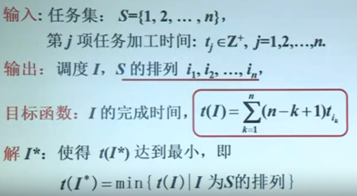
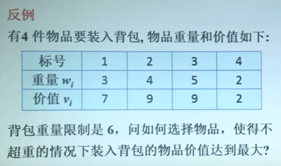
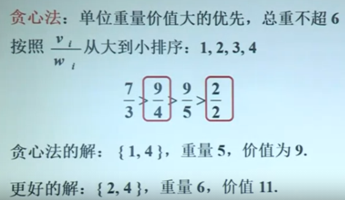
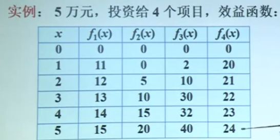
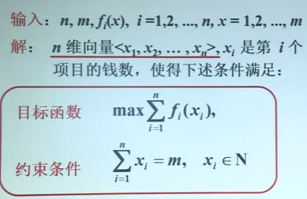
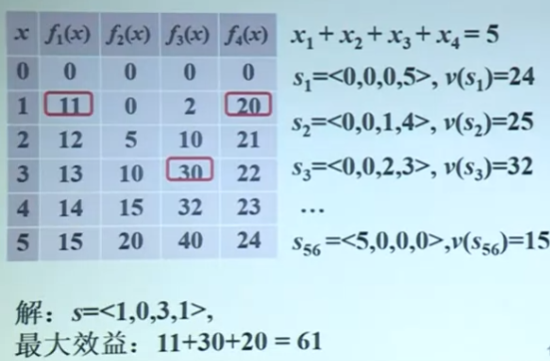
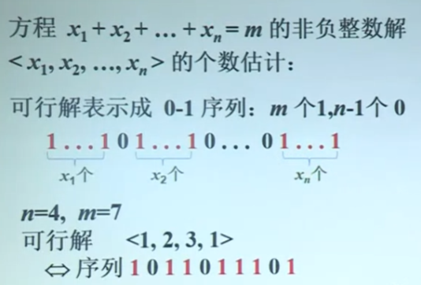
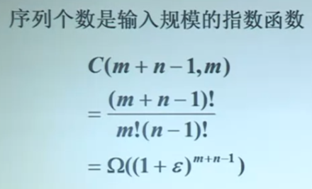

[TOC]

# 两个例子

## 1.调度问题

问题：

有n项任务，每项任务加工时间已知.从0时刻开始陆续安排到一台机器上加工.每个任务的完成时间是从0时刻到任务加工截止的时间.
求:总完成时间(所有任务完成时间之和)最短的安排方案.

**贪心法的解：**

算法：

问题建模：

### 背包问题

问题：

更优解（与贪心法相比）：

### 算法设计

1. 问题**建模**
2. **选择什么算法**?如何描述这个方法?
3. 这个方法是否对所有实例都得到**最优解、正确解**?如何证明?如果不是，能否找到反例?
4. 分析算法——**效率**

## 2.投资问题

问题：

m元钱，投资n个项目.效益函数fi(x),表示第i个项目投x元的效益，i=1,2,..., n.求如何分配每个项目的钱数使得总效益最大?

1. 建模：

   

2. 算法：

   1. **蛮力算法**：

      1. 思路：找出所有满足条件的向量，计算相应的效益，找到效益最大的向量。

      2. 实例：

      3. 效率：

         

         

