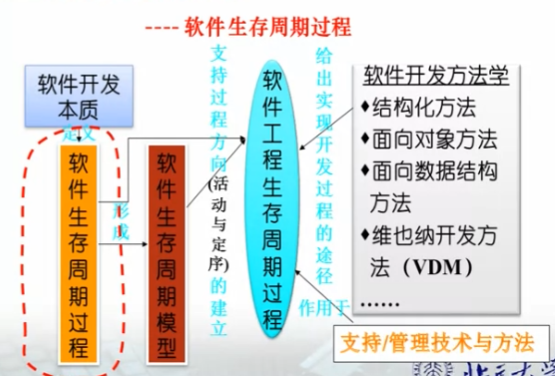

[TOC]

# 软件工程概述

## 软件的定义及特点

1. 定义：计算机系统中的程序及其文档

   ​	程序：计算机任务的处理对象和处理规则的描述

   ​	文档：为了便于了解程序所需的阐明性资料

2. 特点：

   1. 是无形的、不可见的逻辑实体
   2. 是设计开发的，不是生产制造的
   3. 在使用过程中没有磨损、老化的问题
   4. 是定制开发的
   5. 是复杂的（设计各行各业的专业知识）
   6. 开发成本高
   7. 易于复制
   8. 质量要求较高
   9. 开发与运行离不开相关计算机系统环境
   10. 涉及到许多社会因素（机构设置、体制等）

3. 种类：

   1. 系统软件：计算机系统中最靠近硬件的一层
   2. 支撑软件：支撑软件的开发、维护与运行的软件（中间件）
   3. 应用软件：特定应用领域专用的软件

## 软件的起源和概念

1. 软件开发的三个阶段：
   1. 个人程序时期（1947年-1950年代末）：使用机器语言、汇编语言，是一种私人化的软件环境
   2. 软件作坊时期（1960年代初-1960年代末）：“作坊式生产方式”
   3. 软件工程时期（1970年初至今）：软件的规模和复杂性也在增强，同时存在“**软件危机**”
2. 软件工程概念的提出（1968 年 NATO北大西洋公约组织首次提出）：
   - 为了倡导以工程的原理、原则和方法进行软件开发，以解决软件危机。
3. 软件工程的定义：
   1. 计算机百科全书：应用计算机科学、 数学及管理科学等原理，以工程化方法制作软件的工程。借鉴传统工程的原则、 方法，创建软件以达到提高软件质量，降低开发成本的目的 。
   2. 首次NATO会议：用来建立和使用合理的工程原则，以经济地获取可靠的、且在真实机器上可高效工作的软件。
   3. IEEE【IEE93】中：将系统化的、规范的、可量化的方法应用到软件的开发、运行及维护中，即将工程化方法应用于软件。

## 软件开发的本质和基本手段

1. 软件开发：实现**问题域中的概念**和**处理逻辑到运行平台的概念**和**处理逻辑**的映射。
2. 软件开发的本质：
   1. 不同抽象层术语之间的”映射“
   2. 不同抽象层处理逻辑之间的”映射“
3. 软化开发的基本手段：
   - 建模：运用所掌握的知识，通过抽象，给出该问题的一个结构
4. 软件模型：
   - 设计模型、实现模型、部署模型

## 软件工程框架

1. 软件工程的目标：生产具有**正确性**、**可用性**及**开销合宜**的产品
   - 正确性：软件达到预期功能的程度
   - 可用性：软件基本结构、实现及文档为用户可用
   - 开销合宜：软件开发、运行的整个开销满足用户要求
2. 软件工程的活动：
   1. 生产一个最终满足需求且达到工程目标的软件产品所需的步骤。
   2. 主要包括**需求**、**设计**、**实现**、**确认**和**支持**等活动：
      1. 需求：
         - 定义问题，即建立系统模型
         - 主要任务：
           - 需求获取
           - 需求定义（定义问题）：系统功能的一个正确描述
           - 需求规约：系统需求规格说明（主要包括系统模型：系统功能的描述）
           - 需求验证
      2. 设计：
         - 在需求分析的基础上给出**系统的软件设计方案**。
         - 包括**总体设计**（概要设计）和**详细设计**：
           - 总体设计：
             - 建立整个软件体系结构（层次模块体系结构、C/S体系结构等）
             - 包括子系统、模块（或构件）以及相关层次的说明、接口定义
           - 详细设计：
             - 针对总体设计结果，给出体系结构中每一模块或构件的详细描述
             - 即给出数据结构说明和实现算法
      3. 实现：
         1. 把设计结果转换为可执行的程序代码 
         2. 具体的做法：
            1. 选择可复用的模块或构件
            2. 以一种选定的语言，对每一模块或构件进行编码实现
      4. 确认：
         1. 贯穿于整个开发过程
         2. 通过实现完成后的确认，保证最终产品满足用户的需求 
         3. 包括：需求复审、设计复审以及程序测试等。主要任务：软件测试
      5. 支持：
         1. 包括修改和完善
         2. 为系统的运行提供**完善性**维护、**纠错性**维护和**适应性**维护
3. 软件工程的原则：
   1. 选取适宜的开发模型
      - 认识需求定义的易变性
      - 使用合适的设计方法
   2. 提供高质量的工程支持
   3. 重视开发过程的管理
4. 软件工程框架的作用：
   1. 给出了软件工程的工程要素<目标，原则，活动>
   2. 给出了各要素之间的关系
   3. 给出了软件工程学科所研究的主要内容：
      - 软件开发模型
      
      - 软件开发方法
      
      - 软件过程
      
      - 软件工具
      
      - 软件开发环境
      
      - 计算机辅助软件工程（CASE）
      
      - 软件经济法
      
        

# 软件过程

介绍软件开发中的处理逻辑 ->软件开发逻辑是获取正确软件的关键。

1. 软件开发有哪些活动，即要做哪些映射？
2. 应如何正确组织开发活动，形成求解软件的逻辑？

## 软件生存周期过程的概念

1. 软件生存周期：软件产品或系统的**一系列活动**的全周期。从形成概念开始，历经开发、交付使用、在使用中不断修订和演化，直到最后被淘汰。

2. 软件生存周期过程（软件过程）：

   软件生存周期中的**一系列相关过程**，即活动的集合。

   - 活动：任务的集合。
   - 任务：将输入转换为输出的操作。

## 软件生存周期过程的分类

1. 分类（按承担软件开发工作的主体）：
   1. **基本过程**：
      1. 指与软件**生产直接相关**的活动集。（软件开发、获取、维护等过程）
      2. 五个过程（按过程中活动的不同主体分）：
         1. 获取过程：获取过程是**获取者（需方)**所从事的活动和任务，其目的是获得满足客户所表达的那些要求的产品和/或服务。该过程以定义客户要求开始，以接受客户所要求的产品和/或服务结束。
         2. 供应过程：供应过程是**供方**为了向客户提供满足需求的软件产品或服务所从事的一系列活动和任务，其目的是向客户提供一个满足已达成需求的产品或服务。
         3. **开发过程**：开发过程是**软件开发者**所从事的一系列活动和任务，其目的是将一组需求转换为一个软件产品或系统。
         4. 运行过程：运作过程是**系统操作者**所从事的一系列活动和任务。其目标是在软件产品预期的环境中运行该产品，并为该软件产品的维护提供支持。
         5. 维护过程：维护过程是**维护者**所从事的一系列的活动和任务。其目的是:对交付后的系统或软件产品，或为了纠正其错误，改进其性能或其它属性，而对其进行修改;或因环境变更，而对其进行调整。
   2. **支持过程**：
      1. 指**有关各方按目标所从事的一系列支持活动集**。
      2. 八个过程（按过程中活动的不同主体分）：
         1. 文档过程：为记录生存周期过程所产生的信息而定义的活动。
         2. 配置管理过程：应用管理上的和技术上的规程来支持整个软件生存周期的过程。
         3. 质量保证过程：为客观地保证软件产品和过程符合规定的需求以及已建立的计划而定义的活动。
         4. 验证过程：根据软件项目需求，按不同深度（为需方、供方或某独立方）验证软件产品而定义的活动。
         5. 确认过程：确认过程是一个确定需求和最终的、已建成的系统或软件产品是否满足特定预期用途的过程。
         6. 联合评审过程：为评价一项活动的状态和产品而定义的活动。（联合评审）
         7. 审计过程：确定遵照需求、计划合同的程度。（审计部门单独进行）
         8. 问题解决过程：为分析和解决问题而定义的活动。
   3. **组织过程**：
      1. 指那些与软件生产组织有关的活动集。
      2. 七个过程：
         1. 管理过程：管理过程是管理人员从事的、对其它过程进行管理的活动和任务。
         2. 基础设施过程：为其他过程建立和维护所需基础设施的过程。
         3. 改进过程：改进过程是管理人员从事的一组活动和任务，其目的是:建立、评价、测量、控制和改进软件生存周期过程。
         4. 人力资源过程：是为组织和项目提供具有技能和知识人员的过程。
         5. 资产管理过程：为组织的资产管理者而定义的活动。
         6. 复用程序管理过程：为组织的软件复用而定义的活动。
         7. 领域软件工程过程：为领域模型、领域软件体系结构的确定及该领域资产的开发和维护而定义的活动。

## 软件生存周期模型的概念

1. 基本概念：
   - IEEE Standard 12207.0-1996：一个包括软件产品开发、运行和维护中有关过程、活动和任务的框架，覆盖了从该系统的需求定义到系统的使用终止。
   - 中国计算机科学与技术百科全书：称“**软件开发模型**”，并定义为：软件过程、活动、任务的结构框架。

## 常见的软件生存周期模型

1. ### **瀑布模型**：

   1. 瀑布模型将软件生存周期的各项活动规定为依固定顺序而连接的若干阶段工作;
   2. 瀑布模型规定了每一阶段的输入，以及本阶段的工作成果，作为输出传入下一阶段。
   3. 项目的开发依次经过：**需求、设计、编码和单元测试、集成以及维护**——这一基本路径。
   4. 通过每一阶段,提交以下产品:软件需求规约、设计文档、实际代码、测试用例、最终产品等。工作产品(又称可提交的产品，Deliverables)流经“正向”开发的基本步骤路径。
   5. “反向”步骤流表示对前一个可提交产品的重复变更(又称为“**返工**”(Rework)) 。
      - 由于所有开发活动的非确定性，因此是否需要重复变更，这仅在下一个阶段或更后的阶段才能认识到。
      - 返工不仅在以前阶段的某一地方需要，而且对当前正在进行的工作也是需要的。
   6. 优点：
      1. 在决定系统怎样做之前，存在一个需求阶段，鼓励对系统“做什么”进行规约(即设计之前的规约)。
      2. 在建造构件之前，存在一个设计阶段，鼓励规划系统结构(即编码之前的设计)。
      3. 在每一阶段结束时进行复审，允许获取方和用户的参与。前一步工作产品可作为下一步被认可的、文档化的基线。允许基线和配置早期接受控制。
   7. 不足：
      1. 客户必须能够完整、正确和清晰地表达他们的需求;开发人员一开始就必须理解需求。
      2. 缺乏灵活性。一旦软件需求存在偏差，就会导致开发出的软件产品不能满足用户的实际要求。
      3. 在一个项目的早期阶段，过分地强调了基线和里程碑处的文档,可能要花费更多的时间，用于建立一些用处不大的文档。
      4. 直到项目结束之前，都不能演示系统的能力,增加了项目的风险。

2. ### **增量模型**：

   1. 该模型有一个假设，即需求可以分段，成为一系列增量产品，每一增量可以分别地开发。

   2. 优点：

      1. 作为瀑布模型的第一个变体，具有瀑布模型的全部优点。

      2. 第一个可交付版本所需要的成本和时间是很少的;

      3. 开发由增量表示的小系统所承担的风险是不大的;

      4. 由于很快发布了第一个版本，因此可以减少用户需求的变更;

      5. 允许增量投资，即在项目开始时，可以仅对一个或两个增量投资。

         注：如果采用增量投资方式，那么客户就可以对一些增量进行招标。
         然后，开发人员按提出的截止期限进行增量开发，这样客户就可以用多个契约来管理组织的资源和成本。

   3. 缺点：

      1. 如果没有对用户的变更要求进行规划，那么产生的初始增量可能会造成后来增量的不稳定;
      2. 如果需求不像早期思考的那样稳定和完整，那么一些增量就可能需要重新开发，重新发布;
      3. 管理发生的成本、进度和配置的复杂性，可能会超出一些组织的能力。

3. ### **演化模型**：

   1. 是一种有弹性的过程模式，由一些小的开发步组成，每一步历经需求分析、设计、实现和验证，产生软件产品的一个增量。通过这些迭代，完成最终软件产品的开发。
   2. 特点：
      - 针对事先不能完整地定义需求的软件开发
      - 针对用户的核心需求,开发核心系统
      - 根据用户的反馈,实施活动的迭代

4. ### **喷泉模型**：

   1. 特征：
      - 迭代
      - 无缝
      - 与面向对象技术的关系

