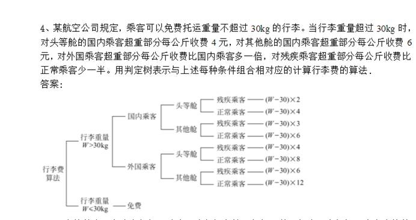
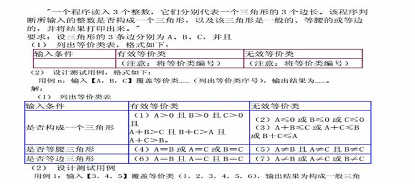
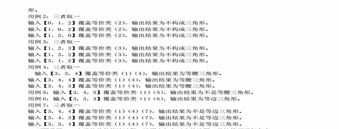
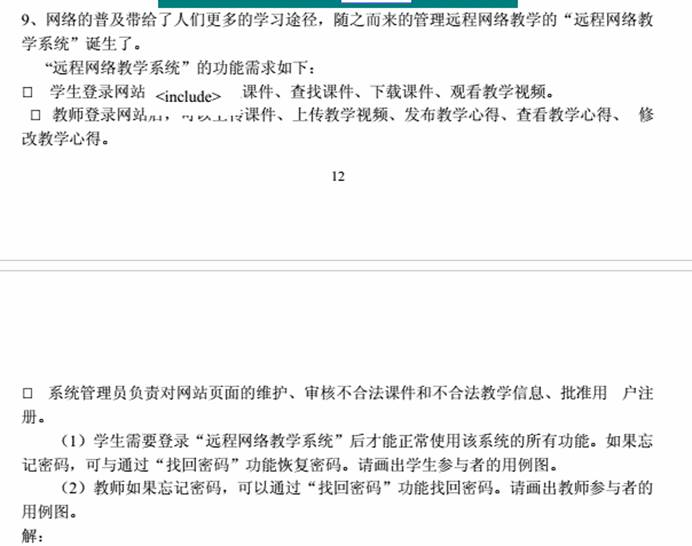
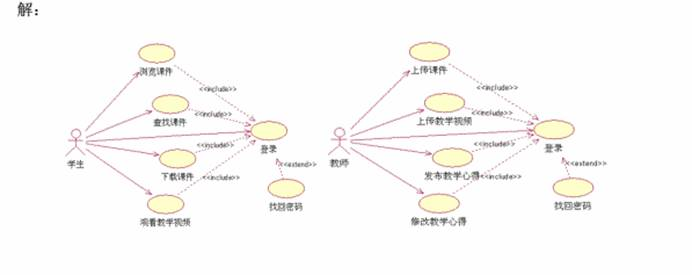
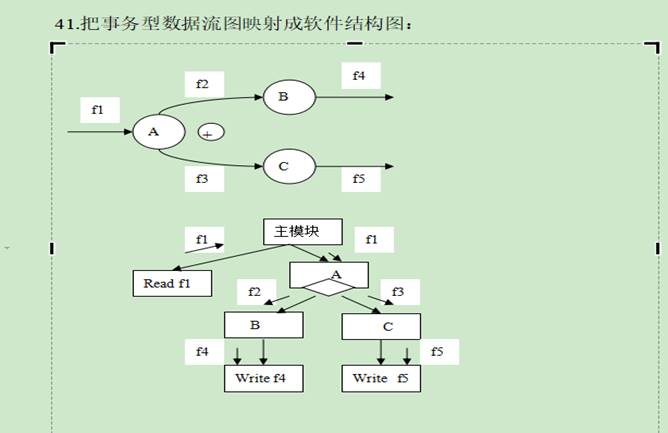
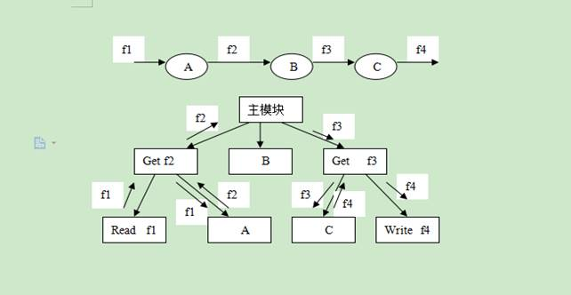

[TOC]

18周12月28日下午2：-4：00期末考
5个简答题 ，综合题

**软件工程，为什么提出软件工程，软件危机**

**软件工程如何解决这个危机**
**软工生命周期，每个阶段侧重点**
**瀑布模型等等模型，适用于那种场景**
**可行性分析**
**软件开发，需求分析 获取需求 面向对象用例建模 用例图 用例规约 面向过程SA数据流图 数据字典  OOA     设计 结构化方法SD DFD转SC图 需求和设计的区别 用例图转时序图（MVC三种类，映射为时序图 UML 六种关联* 一个时序图关联一个类图）**
**设计阶段强调技术选型 编码**
**测试 目的 作用 黑盒测试 白盒测试 路径覆盖** 
**测试用例**

## 综合题：

（1）各种UML图画（用例图，时序图）

（2）写测试用例

（3）DFD转SC图

（4）根据题写加工规格说明书P49（判断树，判断表）

## 第一章绪论

### 1、题*

（1）螺旋模型是结合**快速原型模型和瀑布模型**基础上演变而来的。

（2）原型化方法是用户和设计者之间执行的一种交互构成，适用于需求不确定性高。

（3）软件工程三要素：**工具，过程，方法**。

（4）**软件的复杂性**是产生软件危机的内在原因。

### 2、（重点）软件危机*

指在计算机软件的开发和维护过程中所遇到的一系列严重问题。

### 3、（重点）软件危机原因*

（1）软件维护费用急剧上升，直接威胁计算机应用的扩大。

（2）软件生产技术进步缓慢是加剧软件危机重要原因。

### 4、软件工程学*

（1）软件的发展经历**程序，软件，和软件产品**3个阶段。

（2）图概述P4

​		**软件工程学包括软件开发技术和软件工程管理**

​		软件开发技术包括：软件开发方法学，软件工具，软件工程环境

​		软件工程管理包括：软件管理学，软件经济学，软件度量学。

### 5、软件工程发展*

（1）3种编程规范：**过程式编程规范、面向对象编程规范，基于构件技术**的编程范型。

## 第二章软件生存周期与软件过程

### 1、题*

（1）瀑布模型的缺点是**缺乏灵活性**，特别是无法解决软件需求不明确或不准确的问题。

（2）软件可行性研究实质上是要进行一次 **简化、压缩的** 需求分析、设计过程。

（3） 在快速原型模型的开发过程中，用原型过程来代替全部开发阶段所用模型是 **演化型原型模型**。

（4）软件生命周期中所花费用最多的阶段是 **软件维护**

 

### 1、软件生存周期*

（1）一个软件从开始立项起，到废止不用止，统称为软件的生命周期。

（2）软件生存周期主要活动：**可行性分析，需求分析，软件分析，软件设计，软件测试，运行维护。**

### 2、传统的软件过程*

（1）瀑布模型：是一种基于软件生命周期的<u>线性</u>开发模型。阶段间的顺序性和依赖性

​	阶段：需求定义与分析 -> 总体设计 -> 详细设计- > 编码 -> 测试 -> 使用维护

（2）快速原型模型

### 3、软件演化模型*

（1）增量模型

（2）螺旋模型：在结合瀑布模型与快速模型基础上演变而来的。特点：P26

（3）软件集成模型

### 4、形式化方法模型*

（1）转换模型：将形式化软件开发和程序自动生成技术相结合的一种软件开放模型。

（2）净室模型：是一种形式化的增量开放模型。

### 5、统一过程和敏捷过程*

（1）统一过程（RUP）：<u>描述了软件开发中各个环节应该做什么，怎么做，什么时候做以及为什么要做，描述了一组以某种顺序完成的活动。</u>

​		分为四个阶段：**初始阶段，细化阶段，构造阶段，迁移阶段。**

（3）敏捷过程：以人为核心，以迭代方式循序渐进开发的方法，其软件开发的过程称为敏捷过程。包括极限编程（Xp）

### 6、（重点）软件可行性的研究P35 *

（1）研究的内容：

**经济可行性**：实现这个系统有没有经济效益？多长时间可以回收成本？

**技术可行性：**现在有的技术能否实现这一新系统？有哪些技术难点？

**运行可行性：**为新系统规定的运行方式是否可行？

**法律可行性：**新系统的开发会不会在社会上或政治上引起侵权，破坏或其他责任问题。

（2）研究的步骤

（3）软件风险分析包括：**风险识别，风险预测，风险驾驭。**

### 7、传统的瀑布模型把生存周期分为哪些阶段？瀑布模型软件开发有哪些特点？*

答：瀑布模型是一种基于软件生存周期的线性开发模型，瀑布模型在编码以前安排了分析阶段和设计阶段；阶段间具有顺序性和依赖性。

 

 

## 第三章结构化分析与设计

### 1、题

（1）结构化分析模型是以**数据字典**为中心，它是系统设计的各种数据对象的总和，从它出发可以构建三种图：**实体联系图、数据流图、状态变换图**。（P45）

（2）**数据流图（DFD）**是SA方法中用于表示系统的逻辑模型的一种图型。

（3）数据流图DFD组成：**加工，数据流，数据文件，数据的源点和终点**。

（4）数据流图和数据字典共同构成了系统的 **逻辑** 模型，是需求规格说明书的主要组成部分。

（5） 结构化设计是一种**面向( 数据流)**的设计方法。P55

（6）从心理学角度看，对数据流程图的数据处理泡进行分解，一次分解为**7±2**个泡为宜。

（7） 结构化程序设计采用的三种基本控制结构是（　 **顺序、选择、循环**　　） 。

（8）结构化程序设计主要强调的是（**程序易读性** ）

### 2、结构化分析与设计*

（1）SA任务：建立**系统分析模型**和编写**需求规格说明书**。

（2）结构化设计：

​		**软件设计=总体设计+详细设计**

### 3、（重点）SA模型*

（1）组成：**数据字典，E-R图，数据对象说明，STD状态变换图，控制规格说明书 CSPEC，DFD图，加工规格说明书PSPEC**  P45

（2）数据流图（DFD）：包括加工，数据流，数据文件，数据源点和终点。

​		  数据字典（DD）：数据流，数据文件，数据项。

（3）加工规格说明书：包括结构化语言（PDL伪代码），判定表，判定树。

### 4、SD模型*

（1）组成：数据设计DD，体系结构设计DFD，接口设计DFD，过程设计STD。

（2）SA模型与SD模型转换：P56

E-R图，数据字典-》数据设计，数据流图-》体系结构设计，数据流图-》接口设计，加工规格说明书，状态转换图，控制规格说明书-》过程设计。

### 5、结构化系统分析*

（1）结构化分析步骤：自顶向下对系统进行功能分解，画出分层DFD图；由后向前定义系统的数据和加工，编写DD和PSPEC；最终写出SRS。

### 6、结构化系统设计*

（1）软件设计分为**总体设计和详细设计（模块设计）**

（2）传统的软件设计又可细分为**面向数据流的设计和面向数据（数据结构）**的设计两大类，前者是SD方法主要代表，后者是Jackson方法为代表。

### 7、（重点）SD步骤：DFD-》SC图P58*

（1）分为变换型和事务型结构

（2）变换型结构包括：**传入路径，变换中心，传出路径。**

### 8、优化初始SC图指导原则*

（1）对模块划分原则：模块的总行数应控制在30—60行左右。

高扇入低扇出原则：翁形结构。

### 9、模块设计*

（1）详细设计目的：是为SC图中的每个模块确定采用的算法和块内数据结构，用选定的表达工具给出清晰的描述。

（2）任务：编写软件的模块设计说明书。

（3）模块设计的原则：

①  清晰第一的设计风格

②  结构化的控制结构

③  逐步细化的实现方法

（4）模块设计工具：N-S图，流程图，伪代码（PDL语言）

## 第四章面向对象与UML

### 1、题

（1）用例之间关系：**扩展，包含，泛化，没有关联**。

### 2、面向对象概述

（1）面向对象基本特征：**封装，抽象，多态，继承**。

（2）面向对象开发优点：（第六章OOA优点）

- 提高软件系统的可复用性
- 提高软件系统的可扩展性
- 提高软件系统的可维护性

### 3、UML

1. UML统一建模语言
2. UML模型元素：类，对象，构件，用例，结点，接口，包，注释。
3. 连接的关系：**关联，依赖，实现，聚集，组合，泛化**。P79
4. UML元模型结构：元元模型，元模型，模型，用户模型。
5. **（重点）**UML中的**图和视图**：P82

**图：**

静态图s：

1. 用例图：系统功能
2. 类图：静态结构
3. 对象图：某个时刻的静态结构
4. 构件图：实现系统元素的组织
5. 部署图：系统环境元素的配置

动态图：

1. 状态图：系统元素的状态条件和响应

2. 时序图：按时间顺序描述系统元素之间的交互

3. 协作图：连接关系描述系统元素之间的交互

4. 活动图：系统元素的活动流程

   

**视图：**用例视图，逻辑视图，进程视图，构件视图，部署视图

**UML特点：**

1. 统一标准
2. 面向对象
3. 表达能力强调，可视化

### 4、静态建模

（1）UML<u>静态建模机制</u>包括**用例图，类图，对象图**

（2）用例图与用例建模：

- ​		组成符号：系统边界，用例，参与者，关联

- ​		用例之间的关系：
  - **扩展**：可能执行，被调用者->调用者
  - **包含**：必须执行，调用者->被调用者
  - **泛化**：继承关系。

（3）类图

1. 类图可描述类与类之间静态关系：关联，聚集，泛化，依赖，组合，约束，派生
2. 聚集是一种特殊形式的关联
3. 组合是一种特殊的聚集关系

（4）包：UML把类集合一些模型元素组织成语义上相关的组的分组机制称为包

### 5、动态建模

（1）消息：分为简单消息，同步消息，异步消息。

（2）状态图，时序图，协作图，活动图

### 6、物理架构建模

（1）构件图：显示代码本身的结构

（2）部署图：显示系统运行时的结构

### 7、UML工具

（1）StartUML，rational Rose

## 第五章需求工程与需求分析

### 1、题

（1）软件需求分析一般包括四个步骤：**需求获取、需求建模、需求描述、需求验证。**

（2）对软件影响大的需求变更，应提交给**SCCB**（软件变更控制委员会）审批。

### 2、软件需求工程

（1）软件需求定义：指一个软件解决问题或达到目标所需的条件或能力，即系统的外部行为。

（2）软件需求包括三个层次：业务需求，用户需求，功能需求。

（3）软件需求特性：功能性，可用性，可靠性，性能，可支持性，设计约束。

### 3、（**面向对象**）需求分析与建模

（1）需求分析目的：**为待开发的软件系统进行需求定义与分析，并建立一个需求模型。** 

（2）软件需求分析步骤：需求获取，需求建模，需求描述，需求验证。

（3）需求获取方法：

1. 常见的需求获取方法：

   建立联合分析小组

   用户访谈

   问题分析与确认

2. 用快速原型法获取需求：采用第四代开放技术（4GT）

### 4、需求建模

（1）结构化需求模型：**（与SA模型组成比较）**

组成：

数据流图和加工规格说明书的功能模型，数据字典和E-R图的数据模型，状态转换图控制流图控制规格说明书的行为模型

（2）面向对象需求模型：

组成：

用例模型，补充规约，术语表，其中用例模型包括用例图和用例规约。

（3）（重点）面向对象需求建模：

**基于用例的面向对象需求建模步骤：**

**画用例图，写用例规约，描述补充规约，编写术语表**

用例规约包括：简要说明，事件流（基本流和备选流），特殊需求，前置条件和后置条件。

### 5、软件需求描述

（1）SRS包括：引言，信息描述，功能描述，行为描述，质量保证，接口描述等。P123

### 6、需求管理

需求管理是随着软件需求的发展而成长起来的管理技术

（1）需求管理内容：

需求管理的特点实践P124

需求管理的管理流程：**需求确认，需求跟踪，需求变更**

需求变更流程：SCCB（软件变更控制委员会）

变更申请-》审批-》更改-》重新确认

## 第六章面向对象分析

### 1、题

（1）面向对象分析模型**以用例模型为主体**的需求模型（P139）

### 2、（重点）软件分析概述

（1）OOA任务：P138

首先要理解用户的需求，包括全面理解和分析用户需求，明确所开发的软件系统的职责，形成文件并规范地加以表述。然后进行分析，提取类/对象，并结合分析进行建模。

（2）OOA模型：**以用例模型为主体的需求模型，类/对象模型，对象-关系模型，对象-行为模型，属性操作协作者。**

（3）OOA优点：P139

（4）分析模型

1. 分析模型系由一组子模型组成
2. 特点：

- 全面覆盖软件的功能需求

- 分析模型与软件的实现无关

- 分析模型的表述方法与所采用的分析技术有关。

（5）面向对象分析模型：

组成：典型的五层模型

- 建立类/对象层
- 建立属性层
- 建立服务层
- 建立结构层
- 建立主题层

### 3、（重点）面向对象分析建模P141

（1）识别确定分析类：

分析类包括：边界类，控制类，实体类

（2）建立对象-行为模型：画时序图，协作图，状态图

（3）建立对象-关系模型：画类图

参与类图（VOPC）：描述某个用例的分析类图

 

 

 

 

 

## 第七章面向对象设计（重点）

### 1、题

（1）模块间的内聚性，**最强内聚为：功能性内聚，最弱为：偶然性内聚**。

（2）每个模式都描述了一个在特定环境中不断出现的问题，然后描述该问题解决方案的核心，就其抽象级别的不同，软件模式可以分为**架构模式，设计模式，习惯用法。**（P175）

（3）**回归测试**是指重新执行已经做过的测试的某个 子集,以保证上述的这些变化没有带来非预期的副作用。

（4） 在面向对象的设计中，我们应遵循的设计准则除了模块化、抽象、低耦合、高内聚以外，还有( **信息隐蔽** )

（5）软件结构图的形态特征能反映程序重用率的是（ **扇入** ）。

（6）为了提高模块的独立性，模块内部最好是（ **功能内聚** ）。为了提高模块的独立性，模块之间的联系最好的是（ **数据耦合**）。

（7）模块内部的内聚弱到强：

 偶然性内聚-》逻辑性内聚-》时间性内聚-》过程性内聚-》通信性内聚-》顺序性内聚-》功能性内聚

模块之间的耦合性弱到强：

非直接耦合-》数据耦合-》特征耦合-》控制耦合-》外部耦合-》公共耦合-》内容耦合。

（8）信息隐蔽概念与(模块的独立性 )这一概念直接的相关。

### 2、软件设计概述

（1）面向对象设计的任务：将分析阶段建立的分析模型转变为软件设计模型

（2）设计的目标：细化解决方案的可视化设计模型，确保设计模型最终能平滑地过渡到程序代码。

（3）模块与构件

模块：是一个拥有明确定义的输入，输出和特性的程序实体。

软件构件：可重复使用的软件组件.

（4）抽象与细化

细化：由高级抽象到低级抽象转换过程中，要进行一连串的过程抽象和数据抽象，这就是细化。

过程抽象：P166

数据抽象：P166

（5）信息隐藏：系统分解为模块时应遵守的指导思想。

### 3、（重点）软件设计任务

任务：第一个阶段为概要设计，包括结构设计和接口设计，并编写概要设计文档。

第二阶段为：详细设计，确定各个软件部件的数据结构和操作，产生描述各软件部件的详细设计文档。

### 4、（重点）模块化设计

（1）分解：模块本身的复杂度和工作量虽然随着模块的变小而减小，模块的接口工作量却随着模块数的增加而增大。

（2）模块的独立性

模块本身的内聚和模块之间的耦合性来衡量模块的独立性

内聚：是从功能的角度对模块内部聚合能力的量度。

模块内部的内聚弱到强：P169

​             偶然性内聚-》逻辑性内聚-》时间性内聚-》过程性内聚-》通信性内聚-》顺序             性内聚-》功能性内聚

‚耦合：是对软件内部块之间联系的衡量。P171

模块之间的耦合性弱到强：

非直接耦合-》数据耦合-》特征耦合-》控制耦合-》外部耦合-》公共耦合-》内     容耦合。

### 5、（重点）面向对象设计建模P173

（1）OOD模型组成：系统架构层，类和对象层，消息层，责任层。

系统架构层：描述了整个系统的总体架构，使设计的软件能够满足客户定义的需求，并支持             客户需求的技术基础设施。

类和对象层：包含了类层次关系，使得系统能够以通用的方式创建并不断逼近特殊需求，该             层同时包含了每个对象的设计表示。

消息层：描述了对象间的消息模型，它建立了系统的外部和内部接口，包含使得每个对象能             够和其协作者通信的细节。

责任层：包含针对每个对象的所有属性和操作的数据结构和算法的设计。

（2）OOA与OOD模型转化对应关系：P174

用例模型，对象-行为模型-》系统架构设计，属性，操作和协作者，类/对象模型-》类和对象设计，对象-关系模型-》消息设计，类/对象模型，属性，操作和协作者-》责任设计。

 

 

（3）面向对象设两个层次：系统架构设计和系统元素设计。

系统架构设计包括：

系统高层架构设计

‚确定设计元素

ƒ确定任务管理策略

④实现分布式机制

⑤设计数据存储方案

系统元素设计包括：

类/对象设计

‚子系统及其接口设计

ƒ包设计

（4）模式的应用

定义：每个模式都描述了一个在某个特定环境中不断出现的问题，然后描述该问题解决方案的核心。

软件模式分类：架构模式，设计模式，习惯用法。

架构模式：表示软件系统的基本结构组织方案

设计模式：提供面向对象的具体设计问题解决方案，使设计的结果具有更良好的可扩展              性和重用性。

习惯用法：指针对具体程序设计语言的使用模式，主要涉及如何用特定方法来解决程序代码编写过程中所遇到的问题。

### 6、系统架构设计

系统架构设计是指确定系统主要组成元素的组织或结构，以及其他全局性决策，组成元素之间通过接口进行交互。

（1）设计系统高层架构时，可以选用架构模式作为模板来定义系统的高层框架，如层次架构。

层次架构包括：应用子系统层，业务专用层，中间件层，系统软件层。P176

各个层次含义功能P176

（2）确定设计元素：确定设计类，子系统以及子系统接口。

子系统是对一组承担职责的设计元素的统称。

定义子系统接口步骤：P178

（3）任务管理策略

采用两种技术：引进任务管理部件以及基于进程和线程的控制。

（4）分布式实现机制

分布式应用是指应用程序的不同部件被安装在多个通过网络连接的计算机上，系统运行     时不同计算机上的应用部件相互协作，提供应用服务。

（5）数据存储设计

### 7、系统元素设计

系统元素设计是对每一个设计元素进行详细的设计，系统元素包括组成系统的类，子系统与接口，分包等。

（1）子系统设计步骤：将子系统行为分配给子系统元素，描述子系统元素和说明子系统依赖关系。

（2）分包设计：

分包设计：将边界类打包，将功能相关的类打包。

（3）类/对象设计（设计工作的核心）

类/对象设计的步骤：创建初始类，定义操作，定义方法，定义状态，定义属性，定义     依赖关系，定义关联关系，定义泛化关系，解决用例冲突和处理非功能性需求等。

 

 

 

 

 

 

## 第八章编码与测试

### 1、题

（1）白盒测试仅与程序的内部结构有关，完全可以不考虑程序的功能要求。

（2）黑盒测试包括等价分类法，边界值分析法，因果图法，错误猜测法。

（3）(因果图 )能够有效地检测输入条件的各种组合可能会引起的错误。

（4） 单元测试是发现编码错误，集成测试是发现模块的接口错误，确认测试是为了发现功能错误，那么系统测试是为了发现（ 性能、质量不合要求 ）的错误。

（5） 针对软件需求分析所进行的软件测试是指（ 确认测试 　　　）。

（6）单元测试阶段主要涉及(详细设计 )的文档。 

### 2、编码概述

（1）编码的目的：是使用选的定程序设计语言，把设计模型翻译为用该语言书写的源程序。

（2）编码风格要求：

使用标准的控制结构

实现源程序的文档化：有意义的变量名称，适当的注释，标准的书写格式。

满足用户友好的输入输出风格。

### 3、编码语言与编码工具

（1）编码语言发展：面向机器语言（机器语言，汇编语言），高级语言（基础语言，结构化语言，面向对象语言），甚高级语言（第四代语言）

（2）基础语言：FORTRAN，COBOL，BASIC

结构化语言：Pascal，C语言，Ada语言

面向对象语言：C++语言，java语言，C#语言

### 4、（重点）测试的基本概念

（1）软件测试是动态查找程序代码中的各类错误和问题的过程。

测试的目的：发现程序的错误。

测试任务：通过在计算机上执行程序，暴露程序中潜在的错误。

（2）纠错

①  纠错目的：定位和纠正错误

②  任务：消除软件故障，保证程序的可靠运行。

（3）测试的特性：挑剔性，复杂性，不彻底性，经济性。

（4）测试的分类：静态分析（人工测试或代码评审），动态测试。

静态分析：通过对被测程序的静态审查，发现代码中潜在的错误。

动态测试：白盒测试（结构测试），黑盒测试（功能测试）。

白盒测试：根据被测程序的内部结构设计测试用例，测试者需事先了解被测试程序              的结构。

黑盒测试：把呗测程序看出一个黑盒，根据程序的功能来设计测试用例。

（5）测试文档：包括测试计划和测试报告两部分。

测试计划：测试计划的主体是测试内容说明。它包括测试项目的名称，各项测试的目的，步          骤和进度，以及测试用例的设计等。

测试报告：测试报告主体是测试结果，它包括测试项目名称，实测结果与期望结果的比较，           发现问题，以及测试达到的效果等。

测试用例=测试数据+期望结果

测试结果=测试数据+期望结果+实际结果

### 5、（重点）黑盒与白盒测试P237

（1）黑盒测试包括：等价分类法，边界值分析法，错误猜测法，因果图法。

白盒测试包括：逻辑覆盖测试法，路径测试法（流程图-》程序图）

（2）路径测试特征：满足结构测试的最低要求，有利于安排循环测试

（3）路径测试选择原则：P248

（4）语句覆盖加判定覆盖是对白盒测试的最低要求，同时满足这两种标准的覆盖为“完全覆盖”。

 

### 6、多模块程序阿的测试与策略

（1）测试的层次性：P254

单元测试，集成测试，高级测试（包括确认测试，系统测试）

编码阶段：单元测试

测试阶段：集成测试和确认测试（确认测试是对整个程序的测试，用于确认组装完毕的程序          能满足用户的全部需求）。

验收阶段：系统测试（也是对整个程序的测试）。

（2）单元测试（以白盒测试为主）

目的：通过对象模块的静态分析与动态测试，使其代码达到模块说明书的需求。

任务：P255

步骤：编译-》静态分析器检查-》代码评审-》动态测试

代码评审：

目的：在于发现程序存在结构，功能与编码风格方面存在的错误与问题。

两类组织形式：办公桌检查，以小组会二点方式进行

（3）集成测试

目的：将经过单元测试的模块逐步组装成具有良好一致性的完整的程序。

任务：P257

集成测试的策略：自顶向下，由底向上，从两头逼近的混合方式。

（5）确认测试

目的：确认组装完毕的程序是否满足软件规格说明书（SRS）的要求

包括：有效性测试（黑盒测试），配置复审（用于查明程序的文档是否配备齐，以及文           档内容的一致性）。

验收测试：主要由用户而不是开放者进行

a测试：是在一个受控的环境下，由用户在开放者的指导下进行的测试，由开放者负责           记录错误和使用出现的问题。

b测试：由最终用户在自己的场所进行，遇到的（真正的或是想象中的）问题均有用户             记录，并定期把它们报告给开发者，开发者在接到b测试的问题报告后，对系             统进行最后的修改，然后就开始向所有的用户发布最终的软件产品。

### 8、终止测试的标准

（1）规定测试策略和应达目标

进行白盒测试一般规定以完全覆盖为标准，即语句实现语句覆盖和分支覆盖。

（2）规定至少要查出的错误数量

## 第九章

### 1、为什么事务型软件的结构常常具有中间大，两头小的形状？ 

扇入高则上级模块多，能够增加模块的利用率，扇入低则表示下级控制的复杂度低。 

事务型软件常常具有中间大，两头小的形状，是有良好的软件设计结构，瓮型结构，表

明它在底层模式中使用了较多的高扇入共享模块。

 

 

### 2、 什么是软件需求，可以从哪些方面描述软件需求？ 

软件需求主要指一个软件系统必须遵循的条件或具备的能力。 

条件与能力：

①用户解决问题或达到目标所需的条件或能力，即系统的外部行为。 

②系统为了满足合同，规范其他规定文档所需具备的条件或能力，系统内部特性。 

软件需求一般包括3个不同层次：业务需求，用户需求和功能需求。 

软件需求的特性：①功能性，②可用性，③可靠性，④性能，⑤可支持性，⑥设计

约束 。

### 3、 面向对象设计模型包含哪几个层次？主要内容？ 

面向对象设计模型的四个层次 

①系统架构层：描述整个系统的总体结构，使所设计的软件能够满足客户定义的需求，是实

现支持客户需求的技术基础设施。 

②类和对象层：包含了类层次关系，使得系统能够以通用的方式创建并不断逼近特殊需求，该层同时包含了每个对象的设计表示。

③消息层：描述对象间的消息模型，它建立了系统的外部和内部接口，包含使得每个对象能

够和其协作者通信的细节。 

④责任层：包含针对每个对象的所有属性和操作的数据结构和算法的设计。

### 4、 多模块程序的测试有哪些层次？各层次主要解决什么问题？ 

多模块测试有4个层次 

①单元测试：通过对象模块的静态分析和动态测试，使其代码达到模块说明的需求。 

②集成测试：把经过单元测试的模块逐步组成具有良好一致性的完整程序。 

③确认测试：确认组装完毕的程序是否满足软件需求规格说明书中的要求。 

④系统测试：检查把确认测试合格的软件安装到系统中以后，能否与系统的其余部分协调运

行，并实现SRS的需求。

 

### 5、 瀑布开发模式有哪些主要特点？存在的主要问题？如何改进？ 

瀑布开发模型是一种基于软件生存周期的线性开发模型 

主要特点：  ①阶段间的顺序性和依赖性 

​               ②推迟实现的观点 

​             ③保证质量的观点 

每个阶段必须完成规定的文档；每个阶段要对完成的文档进行复审，以便尽发现问题，清楚隐患。 

存在的问题：按照瀑布模型来开发软件，只有当分析员能够做出准确的需求分析时，才

能得到预期的结果，不幸的是，由于多数用户不熟悉计算机，系统分析员对用户的专业也往

往了解不深，因很难在开发的初始阶段彻底弄清楚软件的需求。 

为了解决这一问题，人们提出了“快速原型模型”。 

瀑布模型包括以下几个阶段：用户要求，需求分析，概要设计，详细设计，编码，测试，维护。

 

### 7、衡量模块独立性的两个定性标准是什么？这两个标准的定义是什么？在我门的软件设计中，关于模块独立性我们追求的目标是什么？

答：衡量模块独立性的两个定性标准是耦合和内聚。

内聚是标志一个模块内部各个元素彼此结合的紧密程度。

耦合是指对一个软件结构不同模块彼此之间相互依赖（连接）的紧密程度。

追求高内聚低耦合。

 

### 8、简述软件测试的目的，任务以及动态测试类型？

答：软件测试是一个为了寻找软件错误而运行程序的过程。目的是为了发现软件中的错误。软件测试的任务是通过在计算机上执行的程序，暴露程序中潜在的错误。动态测试分为白盒测试和黑盒测试。

 

### 9、请指出UML类图中的类除聚合和组合之外的关系有哪些？聚合和组合关系有什么区别和联系？

答：还有的关系：关联，依赖，继承，实现。

聚合和组合区别：聚合：表示两个对象之间是整体和部分的弱关系，部分的生命周期可以超越整体。组合：表示两个对象之间是整体和部分的强关系，部分的生命周期不能超越整体，或者说不能脱离整体而存在。

聚合是一种特殊的关联，而组合又是一种特殊的聚合。

 

 

 

 

 

### 1、判断树

### 2、测试设计用例

### 3、用例图

### 4、DFD-》SC

 

### 5、2.解释下列名词：（1）模块；（2）模块化；（3）模块化设计。

答：模块是一个拥有明确定义的 、输出和特性的程序实体。

模块化是指解决一个复杂问题时自顶向下逐层把软件系统划分成若干模块的过程。每个模块完成一个特定的子功能，所有的模块按某种方法组装起来，成为一个整体，完成整个系统所要求的功能。

模块化设计是把大型软件按照规定的原则划分成一个个较小的、相对独立但又相互关联的模块。但又相互关联的模块。

### 6.什么是模块独立性？用什么度量？

答：模块独立性指每个模块只完成系统要求的独立的子功能,并且与其他模块的联系最少且接口简单。独立性可以从两个方面来度量：模块本身的内聚性(Cohesion)和模块之间的耦合(Coupling)。

 

模块独立性是指模块内部各部分及模块间的关系的一种衡量标准，由内聚和耦合来度量

 

 

 

 